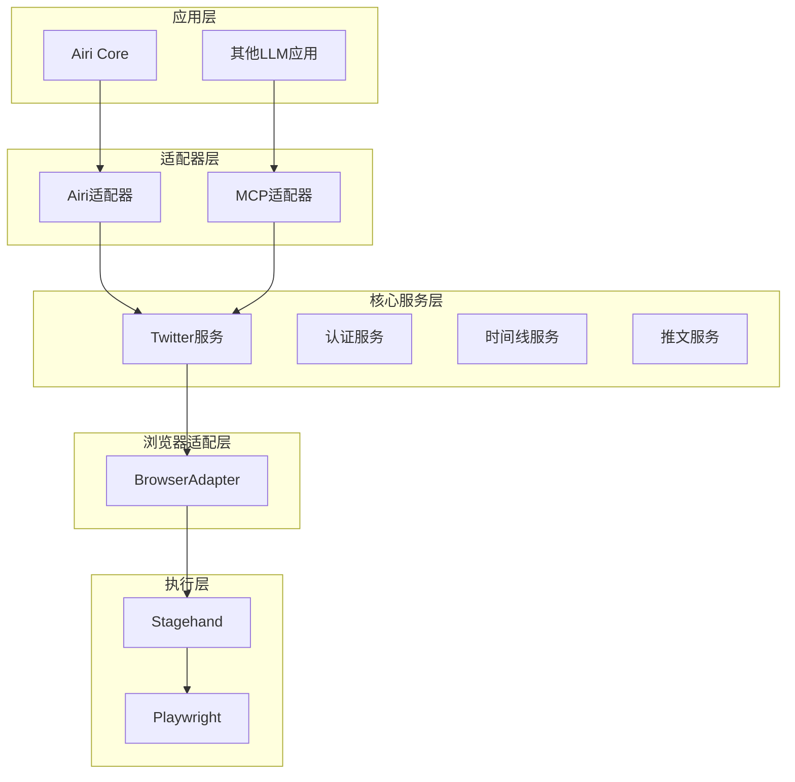
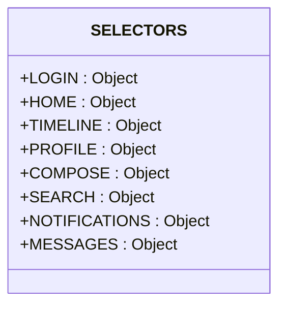
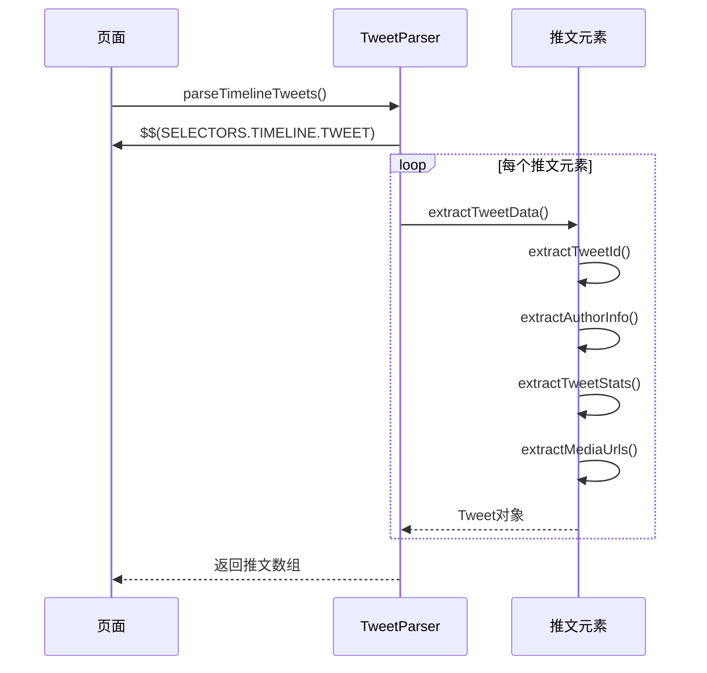
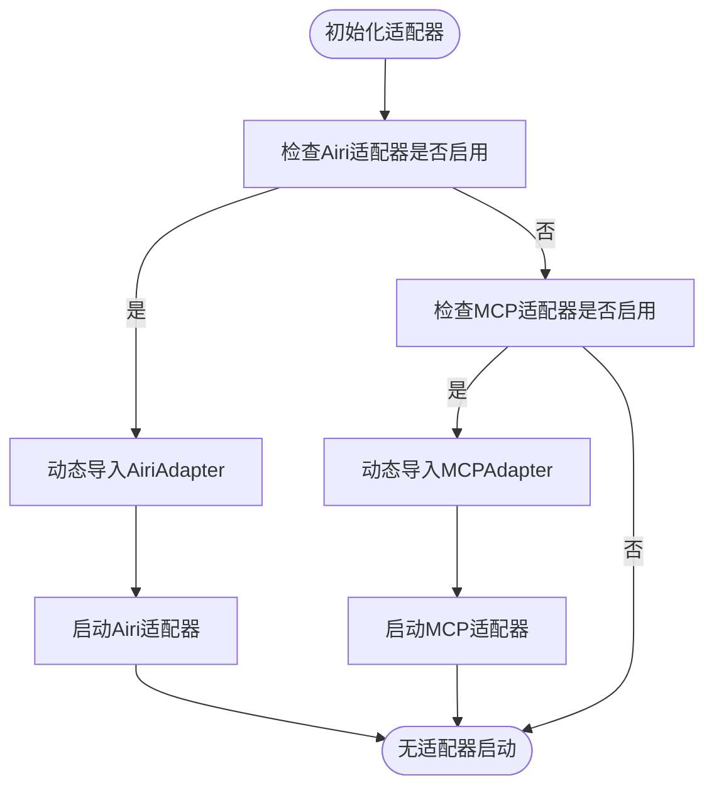
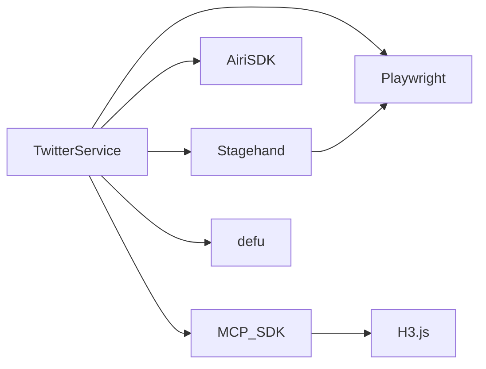

# Twitter自动化服务

<cite>
**本文档中引用的文件**  
- [architecture-20250304.md](file://services/twitter-services/docs/architecture-20250304.md)
- [adapter.ts](file://services/twitter-services/src/adapters/adapter.ts)
- [selectors.ts](file://services/twitter-services/src/parsers/selectors.ts)
- [tweet-parser.ts](file://services/twitter-services/src/parsers/tweet-parser.ts)
- [auth.ts](file://services/twitter-services/src/core/services/auth.ts)
- [timeline.ts](file://services/twitter-services/src/core/services/timeline.ts)
- [tweet.ts](file://services/twitter-services/src/core/services/tweet.ts)
</cite>

## 目录
1. [简介](#简介)
2. [项目结构](#项目结构)
3. [核心组件](#核心组件)
4. [架构概述](#架构概述)
5. [详细组件分析](#详细组件分析)
6. [依赖分析](#依赖分析)
7. [性能考虑](#性能考虑)
8. [故障排除指南](#故障排除指南)
9. [结论](#结论)

## 简介
本文档详细描述了基于BrowserBase构建的Twitter自动化服务，涵盖其浏览器上下文管理、动态内容抓取机制、推文解析逻辑，以及通过适配器模式集成xsAI和MCP协议的技术实现。重点说明自动发推、回复、时间线监控等功能模块的设计与协作方式，并结合架构图阐述整体数据流、部署配置、反爬虫策略应对及异常恢复机制。

## 项目结构
Twitter自动化服务位于`services/twitter-services`目录下，采用分层架构设计，包含适配器层、核心服务层、解析器与工具层。主要目录结构如下：

```
services/twitter-services/
├── docs/                    # 架构文档
├── src/
│   ├── adapters/            # 适配器实现（Airi、MCP）
│   ├── core/
│   │   ├── browser/         # 浏览器上下文管理
│   │   ├── services/        # 核心服务模块（auth、timeline、tweet）
│   │   └── utils/           # 工具函数（如滚动加载）
│   ├── parsers/             # 解析器（selectors、tweet-parser）
│   ├── types/               # 类型定义
│   ├── utils/               # 通用工具（日志、错误处理）
│   ├── constants.ts         # 常量定义
│   └── main.ts              # 入口文件
```

**Section sources**
- [architecture-20250304.md](file://services/twitter-services/docs/architecture-20250304.md)

## 核心组件
本服务的核心组件包括浏览器上下文管理、动态内容抓取（选择器）、推文解析机制、认证服务、时间线服务和推文服务。这些组件协同工作，实现对Twitter平台的自动化操作。

**Section sources**
- [auth.ts](file://services/twitter-services/src/core/services/auth.ts)
- [timeline.ts](file://services/twitter-services/src/core/services/timeline.ts)
- [tweet.ts](file://services/twitter-services/src/core/services/tweet.ts)

## 架构概述
Twitter自动化服务采用分层架构，从上至下分为应用层、适配器层、核心服务层、浏览器适配层和底层浏览器引擎。该架构支持多适配器集成，确保服务的可扩展性和灵活性。



**Diagram sources**
- [architecture-20250304.md](file://services/twitter-services/docs/architecture-20250304.md)

## 详细组件分析

### 浏览器上下文管理
服务通过`Context`对象管理Playwright浏览器实例和页面对象，确保所有操作在统一的浏览器会话中执行。上下文管理支持会话持久化，自动保存和加载认证状态，减少重复登录。

**Section sources**
- [auth.ts](file://services/twitter-services/src/core/services/auth.ts)

### 动态内容抓取（选择器）
服务使用`selectors.ts`文件集中管理所有CSS选择器，便于维护和应对前端变更。选择器覆盖登录、主页、时间线、个人资料、发布、搜索等主要功能区域。



**Diagram sources**
- [selectors.ts](file://services/twitter-services/src/parsers/selectors.ts)

### 推文解析机制
`TweetParser`类负责从DOM中提取推文数据，包括ID、文本、作者信息、时间戳、互动数据（点赞、转发、回复数）和媒体链接。解析过程采用异步批量处理，提高效率。



**Diagram sources**
- [tweet-parser.ts](file://services/twitter-services/src/parsers/tweet-parser.ts)

### 适配器模式集成
服务通过适配器模式集成xsAI和MCP协议。`useAdapter`函数根据配置动态加载Airi或MCP适配器，实现与不同平台的通信。适配器负责将核心服务功能暴露为外部可调用的接口。



**Diagram sources**
- [adapter.ts](file://services/twitter-services/src/adapters/adapter.ts)

### 核心服务模块职责划分
#### 认证服务（auth）
负责处理Twitter登录流程，支持会话恢复和自动登录。通过检查`auth_token` cookie判断登录状态，并自动保存会话到本地文件。

**Section sources**
- [auth.ts](file://services/twitter-services/src/core/services/auth.ts)

#### 时间线服务（timeline）
提供获取用户时间线的功能，支持过滤回复和转发，并可通过滚动加载更多推文。服务调用`TweetParser`进行数据提取。

**Section sources**
- [timeline.ts](file://services/twitter-services/src/core/services/timeline.ts)

#### 推文服务（tweet）
实现推文的搜索、点赞、转发、发布和详情获取功能。发布推文支持文本、媒体和回复场景。

**Section sources**
- [tweet.ts](file://services/twitter-services/src/core/services/tweet.ts)

## 依赖分析
服务依赖Playwright进行浏览器自动化，通过Stagehand框架增强AI驱动的页面交互能力。适配器层依赖AIRI Server SDK和MCP SDK实现外部集成。配置系统使用`defu`库进行深度合并。



**Diagram sources**
- [architecture-20250304.md](file://services/twitter-services/docs/architecture-20250304.md)

## 性能考虑
- **会话管理**：通过持久化会话减少重复登录，提升启动速度。
- **滚动加载**：`scrollToLoadMoreTweets`工具函数智能滚动页面，避免一次性加载过多内容。
- **选择器优化**：集中管理选择器，便于快速响应前端变更。
- **错误处理**：各服务模块具备完善的错误捕获和日志记录机制，确保服务稳定性。

## 故障排除指南
- **登录失败**：检查会话文件是否有效，或手动登录后保存新会话。
- **选择器失效**：更新`selectors.ts`中对应的选择器。
- **推文发布失败**：检查媒体文件路径是否正确，或网络连接是否稳定。
- **适配器未启动**：确认配置文件中适配器的`enabled`字段为`true`。

**Section sources**
- [auth.ts](file://services/twitter-services/src/core/services/auth.ts)
- [tweet.ts](file://services/twitter-services/src/core/services/tweet.ts)
- [timeline.ts](file://services/twitter-services/src/core/services/timeline.ts)

## 结论
Twitter自动化服务通过分层架构和适配器模式，实现了高内聚、低耦合的设计。核心服务模块职责清晰，协作高效，结合Stagehand和Playwright提供了强大的浏览器自动化能力。服务具备良好的可扩展性和维护性，适用于多种集成场景。