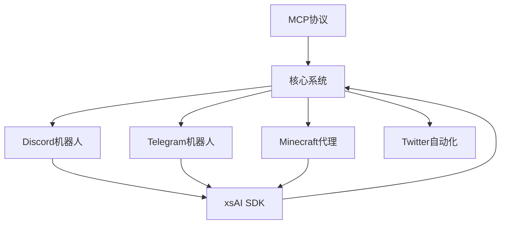
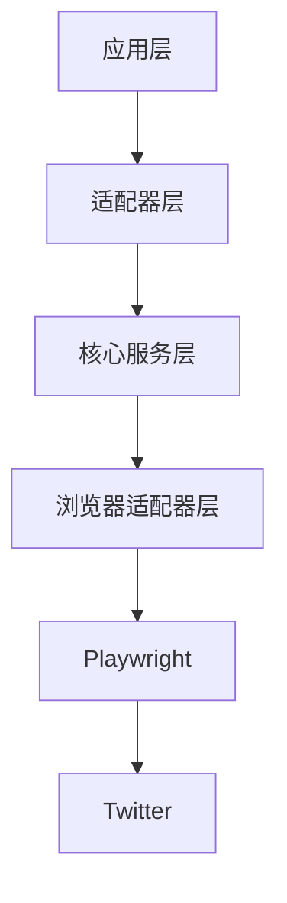
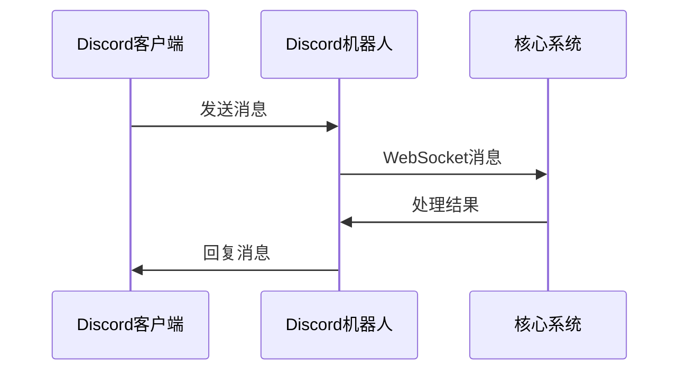
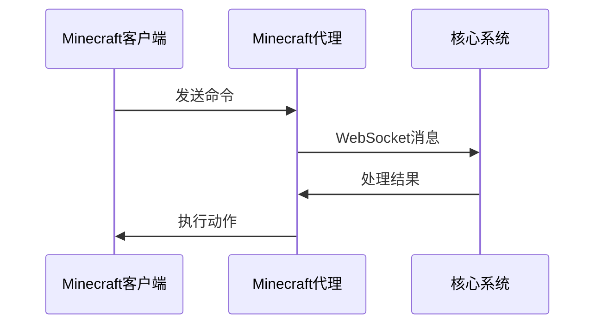
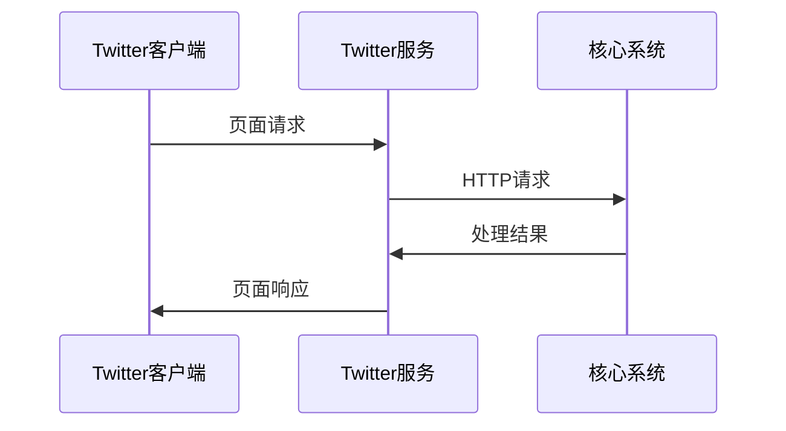
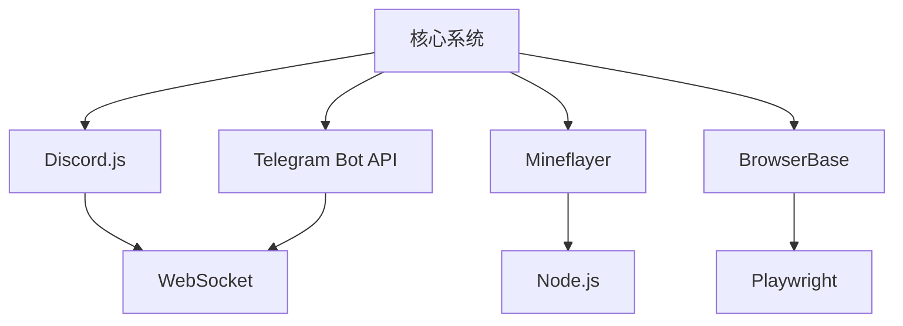

# 后端与服务

<cite>
**本文档中引用的文件**
- [airi-adapter.ts](file://services/discord-bot/src/adapters/airi-adapter.ts)
- [index.ts](file://services/discord-bot/src/index.ts)
- [index.ts](file://services/minecraft/src/main.ts)
- [index.ts](file://services/telegram-bot/src/index.ts)
- [main.ts](file://services/twitter-services/src/main.ts)
- [lib.rs](file://crates/tauri-plugin-mcp/src/lib.rs)
- [client.ts](file://packages/server-sdk/src/client.ts)
- [architecture-20250304.md](file://services/twitter-services/docs/architecture-20250304.md)
- [.env](file://services/discord-bot/.env)
- [.env](file://services/minecraft/.env)
- [.env](file://services/telegram-bot/.env)
</cite>

## 目录
1. [简介](#简介)
2. [项目结构](#项目结构)
3. [核心组件](#核心组件)
4. [架构概述](#架构概述)
5. [详细组件分析](#详细组件分析)
6. [依赖分析](#依赖分析)
7. [性能考虑](#性能考虑)
8. [故障排除指南](#故障排除指南)
9. [结论](#结论)

## 简介
本文档详细介绍了アイリ（AIRI）项目中后端与外部服务的集成机制。重点阐述了Discord机器人、Telegram机器人、Minecraft代理和Twitter自动化服务的实现原理、配置方法和运行方式。文档解释了这些服务如何通过xsAI SDK或MCP协议与核心角色系统通信，并提供了每个服务的部署指南、环境变量配置和故障排查方法。同时，文档还阐述了服务间的数据同步和事件处理机制。

## 项目结构
项目结构清晰地分为多个服务目录，每个服务都有独立的配置和实现。主要服务包括Discord机器人、Telegram机器人、Minecraft代理和Twitter自动化服务。这些服务通过统一的SDK和协议与核心系统通信，确保了系统的可扩展性和维护性。

**Diagram sources**
- [index.ts](file://services/discord-bot/src/index.ts)
- [index.ts](file://services/minecraft/src/main.ts)
- [index.ts](file://services/telegram-bot/src/index.ts)
- [main.ts](file://services/twitter-services/src/main.ts)

**Section sources**
- [index.ts](file://services/discord-bot/src/index.ts)
- [index.ts](file://services/minecraft/src/main.ts)
- [index.ts](file://services/telegram-bot/src/index.ts)
- [main.ts](file://services/twitter-services/src/main.ts)

## 核心组件
核心组件包括xsAI SDK和MCP协议，它们是外部服务与核心角色系统通信的基础。xsAI SDK提供了WebSocket客户端，用于实时通信和事件处理。MCP协议则通过HTTP/JSON接口提供了一种灵活的集成方式。

**Section sources**
- [client.ts](file://packages/server-sdk/src/client.ts)
- [lib.rs](file://crates/tauri-plugin-mcp/src/lib.rs)

## 架构概述
系统采用分层架构设计，包括应用层、适配器层、核心服务层和浏览器适配器层。这种设计确保了系统的可靠性和可扩展性。适配器层负责与不同应用集成，核心服务层处理业务逻辑，浏览器适配器层则负责与Twitter等外部服务交互。

**Diagram sources**
- [architecture-20250304.md](file://services/twitter-services/docs/architecture-20250304.md)

## 详细组件分析

### Discord机器人分析
Discord机器人通过xsAI SDK与核心系统通信，实现了语音频道中的实时交互。机器人使用Discord.js库处理语音和消息事件，并通过WebSocket与核心系统同步数据。

**Diagram sources**
- [airi-adapter.ts](file://services/discord-bot/src/adapters/airi-adapter.ts)
- [index.ts](file://services/discord-bot/src/index.ts)

**Section sources**
- [airi-adapter.ts](file://services/discord-bot/src/adapters/airi-adapter.ts)
- [index.ts](file://services/discord-bot/src/index.ts)

### Telegram机器人分析
Telegram机器人通过xsAI SDK与核心系统通信，支持文本、图片和贴纸等多种消息类型。机器人使用Telegram Bot API处理消息，并通过WebSocket与核心系统同步数据。

**Diagram sources**
- [index.ts](file://services/telegram-bot/src/index.ts)

**Section sources**
- [index.ts](file://services/telegram-bot/src/index.ts)

### Minecraft代理分析
Minecraft代理通过xsAI SDK与核心系统通信，实现了自然语言理解和自动化任务。代理使用Mineflayer库与Minecraft服务器交互，并通过WebSocket与核心系统同步数据。

**Diagram sources**
- [main.ts](file://services/minecraft/src/main.ts)

**Section sources**
- [main.ts](file://services/minecraft/src/main.ts)

### Twitter自动化分析
Twitter自动化服务通过MCP协议与核心系统通信，实现了对Twitter数据的结构化访问和交互。服务使用BrowserBase和Playwright库自动化浏览器操作，并通过HTTP/JSON接口与核心系统同步数据。

**Diagram sources**
- [main.ts](file://services/twitter-services/src/main.ts)

**Section sources**
- [main.ts](file://services/twitter-services/src/main.ts)

## 依赖分析
系统依赖于多个外部库和工具，包括Discord.js、Telegram Bot API、Mineflayer和BrowserBase。这些依赖通过pnpm工作区管理，确保了版本一致性和依赖隔离。

**Diagram sources**
- [package.json](file://services/discord-bot/package.json)
- [package.json](file://services/telegram-bot/package.json)
- [package.json](file://services/minecraft/package.json)
- [package.json](file://services/twitter-services/package.json)

**Section sources**
- [package.json](file://services/discord-bot/package.json)
- [package.json](file://services/telegram-bot/package.json)
- [package.json](file://services/minecraft/package.json)
- [package.json](file://services/twitter-services/package.json)

## 性能考虑
系统在设计时充分考虑了性能优化，包括请求频率控制、会话管理和数据缓存。通过使用Rate Limiter和Session Manager，系统能够有效避免触发外部服务的限制，并提高响应速度。

## 故障排除指南
常见问题包括连接失败、认证错误和数据同步问题。建议检查环境变量配置、网络连接和日志输出。对于认证问题，确保使用正确的API密钥和会话文件。

**Section sources**
- [.env](file://services/discord-bot/.env)
- [.env](file://services/minecraft/.env)
- [.env](file://services/telegram-bot/.env)

## 结论
本文档详细介绍了アイリ项目中后端与外部服务的集成机制。通过统一的SDK和协议，系统实现了与多个外部服务的无缝集成，确保了系统的可扩展性和维护性。未来的工作将集中在性能优化和新功能的添加上。