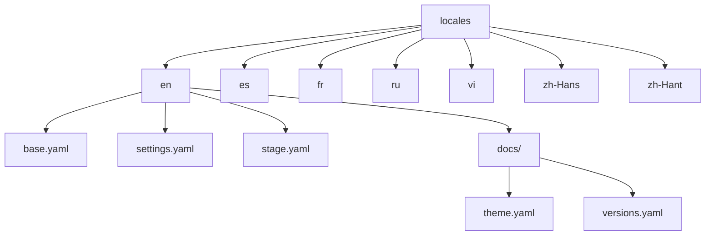
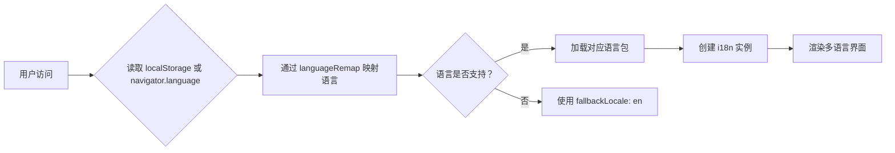
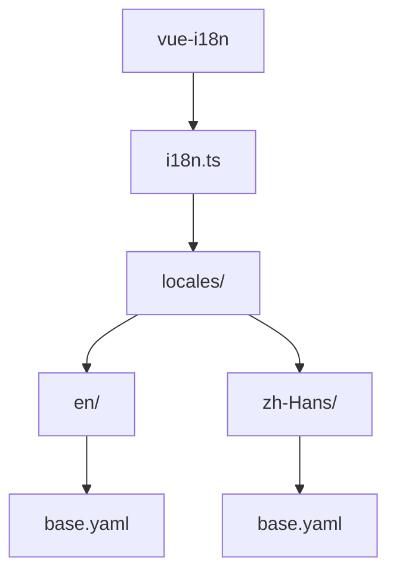

# 国际化系统

<cite>
**本文档引用的文件**  
- [i18n.ts](file://apps/stage-web/src/modules/i18n.ts)
- [index.ts](file://packages/i18n/src/index.ts)
- [locales/index.ts](file://packages/i18n/src/locales/index.ts)
- [base.yaml](file://packages/i18n/src/locales/en/base.yaml)
- [stage.yaml](file://packages/i18n/src/locales/en/tamagotchi/stage.yaml)
- [theme.yaml](file://packages/i18n/src/locales/en/docs/theme.yaml)
- [crowdin.yml](file://crowdin.yml)
</cite>

## 目录

1. [简介](#简介)
2. [项目结构](#项目结构)
3. [核心组件](#核心组件)
4. [架构概述](#架构概述)
5. [详细组件分析](#详细组件分析)
6. [依赖分析](#依赖分析)
7. [性能考虑](#性能考虑)
8. [故障排除指南](#故障排除指南)
9. [结论](#结论)

## 简介

本项目通过 `vue-i18n` 实现完整的多语言支持系统，旨在为用户提供本地化的界面体验。系统支持多种语言，包括英语（en）、西班牙语（es）、法语（fr）、俄语（ru）、越南语（vi）、简体中文（zh-Hans）和繁体中文（zh-Hant）。翻译内容按模块组织，涵盖基础界面、特定应用（如 tamagotchi）以及文档内容。系统还集成了 Crowdin 平台以支持协作翻译。

## 项目结构

国际化系统的翻译文件集中存放在 `packages/i18n/src/locales` 目录下，每个语言拥有独立的子目录，目录结构清晰，便于维护和扩展。



**Diagram sources**
- [base.yaml](file://packages/i18n/src/locales/en/base.yaml)
- [stage.yaml](file://packages/i18n/src/locales/en/tamagotchi/stage.yaml)
- [theme.yaml](file://packages/i18n/src/locales/en/docs/theme.yaml)

**Section sources**
- [locales/index.ts](file://packages/i18n/src/locales/index.ts)

## 核心组件

国际化系统的核心是 `vue-i18n` 的配置与初始化，通过读取预定义的翻译文件并根据用户语言偏好动态加载对应语言包。系统支持语言映射，可将浏览器或系统语言代码（如 `zh-CN`）自动映射到项目支持的语言（如 `zh-Hans`）。

**Section sources**
- [i18n.ts](file://apps/stage-web/src/modules/i18n.ts)
- [index.ts](file://packages/i18n/src/index.ts)

## 架构概述

系统采用模块化翻译结构，将翻译内容分为基础（base）、应用特定（tamagotchi）和文档（docs）三类，确保不同功能区域的翻译独立管理。`vue-i18n` 实例在应用启动时创建，自动检测用户语言并加载对应消息。



**Diagram sources**
- [i18n.ts](file://apps/stage-web/src/modules/i18n.ts)

## 详细组件分析

### 语言加载机制分析

系统通过 `getLocale()` 函数确定当前语言，优先读取 `localStorage` 中的设置，若无则回退至浏览器语言。语言代码通过 `languageRemap` 对象进行标准化映射，确保兼容性。

#### 语言映射表
```typescript
const languageRemap: Record<string, string> = {
  'zh-CN': 'zh-Hans',
  'zh-TW': 'zh-Hant',
  'en-US': 'en',
  'es-ES': 'es',
  // 更多映射...
}
```

**Section sources**
- [i18n.ts](file://apps/stage-web/src/modules/i18n.ts#L10-L40)

### 翻译文件结构分析

翻译文件采用 YAML 格式，便于阅读和编辑。每个语言目录包含：
- `base.yaml`: 基础界面文本
- `settings.yaml`: 设置相关文本
- `stage.yaml`: 应用功能文本
- `docs/`: 文档专用翻译

#### 基础翻译示例
```yaml
prompt:
  prefix: >
    (from Neko Ayaka) Good morning! You are finally awake.
  suffix: |
    The available actions:
    - <{|}DELAY:1{|}> (Delay for 1 second)
```

**Diagram sources**
- [base.yaml](file://packages/i18n/src/locales/en/base.yaml)

#### 应用特定翻译示例
```yaml
operations:
  load-models: Load Models
  load-models-status:
    loading: Loading
    ready: Ready
```

**Diagram sources**
- [stage.yaml](file://packages/i18n/src/locales/en/tamagotchi/stage.yaml)

#### 文档翻译示例
```yaml
doc:
  outline:
    title: On this page
  community:
    title: Community
```

**Diagram sources**
- [theme.yaml](file://packages/i18n/src/locales/en/docs/theme.yaml)

### 在代码中使用翻译

在 Vue 组件中，可通过 `$t` 函数调用翻译：
```vue
<template>
  <button>{{ $t('operations.load-models') }}</button>
</template>
```

对于动态内容，支持参数插值：
```yaml
greeting: Hello, {name}!
```
```js
this.$t('greeting', { name: 'Airi' })
```

**Section sources**
- [i18n.ts](file://apps/stage-web/src/modules/i18n.ts)

## 依赖分析

系统依赖 `vue-i18n` 作为核心国际化库，翻译文件通过模块导入方式集成。语言列表在 `packages/i18n/src/index.ts` 中定义，供 UI 选择器使用。



**Diagram sources**
- [index.ts](file://packages/i18n/src/index.ts)
- [i18n.ts](file://apps/stage-web/src/modules/i18n.ts)

## 性能考虑

- 翻译文件按需加载，避免初始包体积过大
- 使用静态 YAML 文件，解析效率高
- 语言切换无需重新加载页面，通过 `i18n.locale` 动态更新

## 故障排除指南

### 常见问题
- **新语言未生效**：检查 `locales/index.ts` 是否正确导入新语言目录
- **翻译键缺失**：确认 YAML 文件中存在对应键，或检查 `$t` 调用路径是否正确
- **语言映射失败**：验证 `languageRemap` 表是否包含对应映射规则

**Section sources**
- [i18n.ts](file://apps/stage-web/src/modules/i18n.ts)
- [locales/index.ts](file://packages/i18n/src/locales/index.ts)

## 结论

本国际化系统设计清晰、结构合理，支持多语言无缝切换。通过模块化组织翻译文件，便于团队协作和持续维护。结合 Crowdin 平台可实现高效的社区翻译协作，确保项目在全球范围内的可访问性。