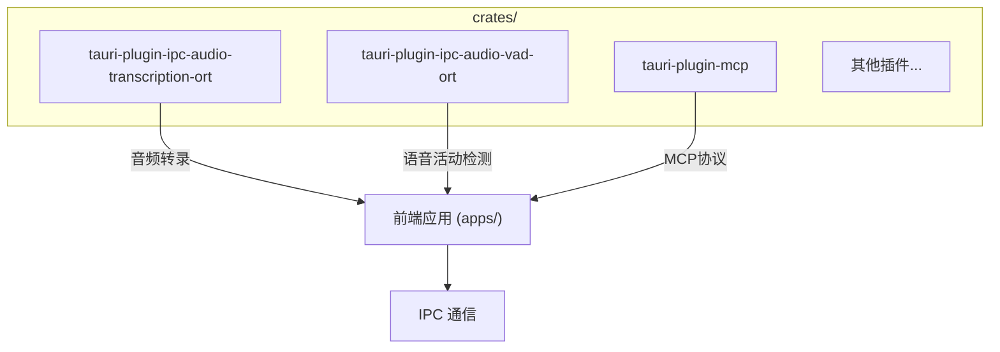
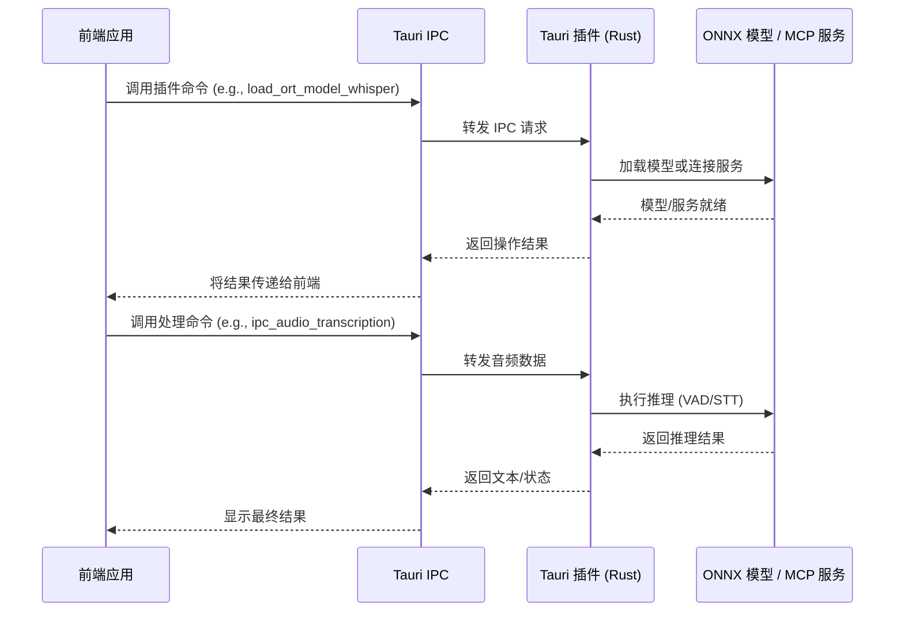
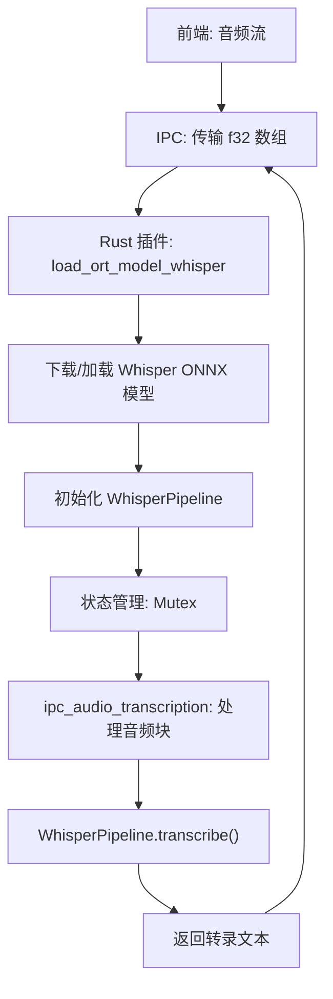
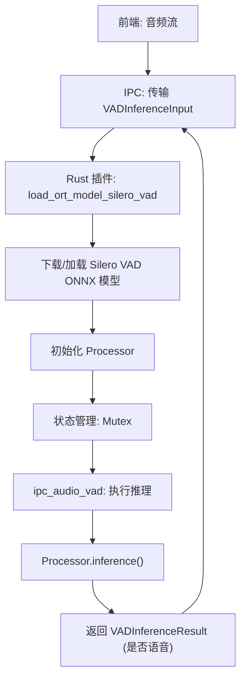
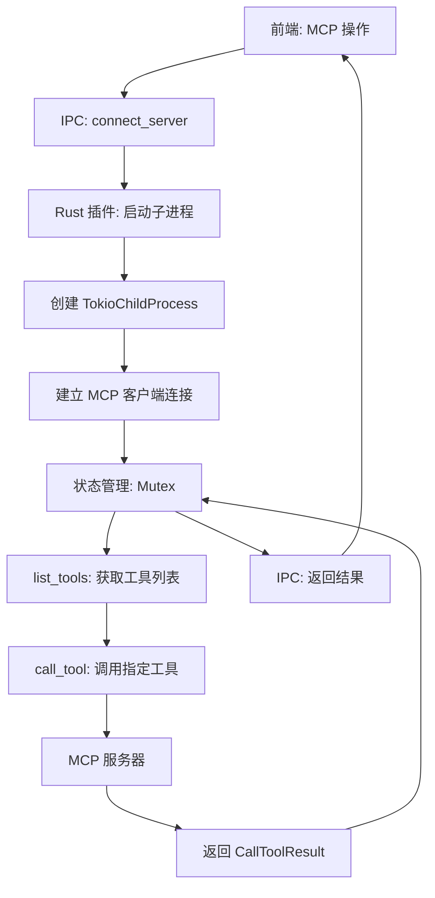
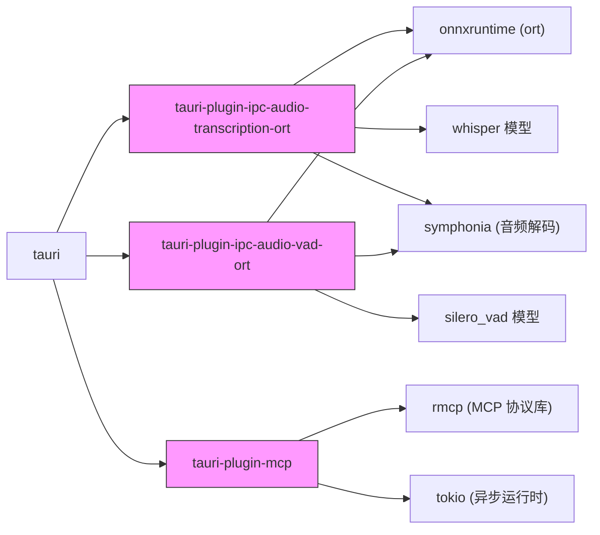

# Tauri 原生插件

<cite>
**本文档引用文件**  
- [tauri-plugin-ipc-audio-transcription-ort/Cargo.toml](file://crates/tauri-plugin-ipc-audio-transcription-ort/Cargo.toml)
- [tauri-plugin-ipc-audio-vad-ort/Cargo.toml](file://crates/tauri-plugin-ipc-audio-vad-ort/Cargo.toml)
- [tauri-plugin-mcp/Cargo.toml](file://crates/tauri-plugin-mcp/Cargo.toml)
- [tauri-plugin-ipc-audio-transcription-ort/permissions/default.toml](file://crates/tauri-plugin-ipc-audio-transcription-ort/permissions/default.toml)
- [tauri-plugin-ipc-audio-vad-ort/permissions/default.toml](file://crates/tauri-plugin-ipc-audio-vad-ort/permissions/default.toml)
- [tauri-plugin-mcp/permissions/default.toml](file://crates/tauri-plugin-mcp/permissions/default.toml)
- [tauri-plugin-ipc-audio-transcription-ort/src/lib.rs](file://crates/tauri-plugin-ipc-audio-transcription-ort/src/lib.rs)
- [tauri-plugin-ipc-audio-vad-ort/src/lib.rs](file://crates/tauri-plugin-ipc-audio-vad-ort/src/lib.rs)
- [tauri-plugin-mcp/src/lib.rs](file://crates/tauri-plugin-mcp/src/lib.rs)
</cite>

## 目录
1. [简介](#简介)
2. [项目结构](#项目结构)
3. [核心组件](#核心组件)
4. [架构概述](#架构概述)
5. [详细组件分析](#详细组件分析)
6. [依赖分析](#依赖分析)
7. [性能考虑](#性能考虑)
8. [故障排除指南](#故障排除指南)
9. [结论](#结论)

## 简介
本文档旨在为 `crates/` 目录下的 Tauri 原生 Rust 插件提供权威的技术说明。重点涵盖 `tauri-plugin-ipc-audio-*` 系列插件如何实现高性能音频处理（语音活动检测 VAD 和语音转文本 STT），以及 `tauri-plugin-mcp` 如何支持模型上下文协议（MCP）。文档详细阐述了插件的架构设计、与前端通过 IPC 的通信机制、在 `Cargo.toml` 中的依赖声明、权限系统（`permissions` 目录下的 `autogenerated` 和 `default.toml` 文件）的配置方法，并提供从零创建新 Tauri 插件的分步教程。

## 项目结构
Tauri 原生插件位于 `crates/` 目录下，每个插件都是一个独立的 Rust crate。这种结构遵循了 Tauri 的模块化设计理念，允许将特定功能（如音频处理、MCP 通信）封装为可复用的原生扩展。



**图示来源**
- [tauri-plugin-ipc-audio-transcription-ort](file://crates/tauri-plugin-ipc-audio-transcription-ort)
- [tauri-plugin-ipc-audio-vad-ort](file://crates/tauri-plugin-ipc-audio-vad-ort)
- [tauri-plugin-mcp](file://crates/tauri-plugin-mcp)

**本节来源**
- [crates/](file://crates/)

## 核心组件
本项目的核心组件是三个位于 `crates/` 目录下的 Tauri 插件：`tauri-plugin-ipc-audio-transcription-ort`、`tauri-plugin-ipc-audio-vad-ort` 和 `tauri-plugin-mcp`。这些插件通过 Rust 语言直接调用系统级 API 和高性能计算库（如 ONNX Runtime），为前端应用提供超越 Web 标准的原生能力。

**本节来源**
- [tauri-plugin-ipc-audio-transcription-ort/src/lib.rs](file://crates/tauri-plugin-ipc-audio-transcription-ort/src/lib.rs)
- [tauri-plugin-ipc-audio-vad-ort/src/lib.rs](file://crates/tauri-plugin-ipc-audio-vad-ort/src/lib.rs)
- [tauri-plugin-mcp/src/lib.rs](file://crates/tauri-plugin-mcp/src/lib.rs)

## 架构概述
Tauri 插件的架构基于客户端-服务器模型。前端（客户端）通过 Tauri 提供的 IPC 机制调用插件（服务器）暴露的命令。插件在 Rust 环境中执行高负载任务（如模型推理），并将结果返回给前端。



**图示来源**
- [tauri-plugin-ipc-audio-transcription-ort/src/lib.rs](file://crates/tauri-plugin-ipc-audio-transcription-ort/src/lib.rs#L60-L110)
- [tauri-plugin-ipc-audio-vad-ort/src/lib.rs](file://crates/tauri-plugin-ipc-audio-vad-ort/src/lib.rs#L40-L80)
- [tauri-plugin-mcp/src/lib.rs](file://crates/tauri-plugin-mcp/src/lib.rs#L50-L150)

## 详细组件分析

### tauri-plugin-ipc-audio-transcription-ort 分析
该插件利用 ONNX Runtime (ORT) 在本地执行 Whisper 模型，实现离线语音转文本（STT）功能。

#### 架构与数据流


**图示来源**
- [tauri-plugin-ipc-audio-transcription-ort/src/lib.rs](file://crates/tauri-plugin-ipc-audio-transcription-ort/src/lib.rs)
- [tauri-plugin-ipc-audio-transcription-ort/Cargo.toml](file://crates/tauri-plugin-ipc-audio-transcription-ort/Cargo.toml)

**本节来源**
- [tauri-plugin-ipc-audio-transcription-ort/src/lib.rs](file://crates/tauri-plugin-ipc-audio-transcription-ort/src/lib.rs)
- [tauri-plugin-ipc-audio-transcription-ort/Cargo.toml](file://crates/tauri-plugin-ipc-audio-transcription-ort/Cargo.toml)

### tauri-plugin-ipc-audio-vad-ort 分析
该插件使用 Silero VAD 模型进行语音活动检测（VAD），判断音频流中是否存在人声。

#### 架构与数据流


**图示来源**
- [tauri-plugin-ipc-audio-vad-ort/src/lib.rs](file://crates/tauri-plugin-ipc-audio-vad-ort/src/lib.rs)
- [tauri-plugin-ipc-audio-vad-ort/Cargo.toml](file://crates/tauri-plugin-ipc-audio-vad-ort/Cargo.toml)

**本节来源**
- [tauri-plugin-ipc-audio-vad-ort/src/lib.rs](file://crates/tauri-plugin-ipc-audio-vad-ort/src/lib.rs)
- [tauri-plugin-ipc-audio-vad-ort/Cargo.toml](file://crates/tauri-plugin-ipc-audio-vad-ort/Cargo.toml)

### tauri-plugin-mcp 分析
该插件实现了模型上下文协议（MCP）客户端，允许前端应用与外部 MCP 服务器进行交互。

#### 架构与数据流


**图示来源**
- [tauri-plugin-mcp/src/lib.rs](file://crates/tauri-plugin-mcp/src/lib.rs)
- [tauri-plugin-mcp/Cargo.toml](file://crates/tauri-plugin-mcp/Cargo.toml)

**本节来源**
- [tauri-plugin-mcp/src/lib.rs](file://crates/tauri-plugin-mcp/src/lib.rs)
- [tauri-plugin-mcp/Cargo.toml](file://crates/tauri-plugin-mcp/Cargo.toml)

### 权限系统分析
Tauri 插件通过 `permissions` 目录下的 TOML 文件实现细粒度的权限控制。

#### 权限配置文件结构
```toml
"$schema" = "schemas/schema.json"

[default]
description = """
此权限集配置了插件可用的操作。

#### 授予权限

默认情况下启用所有操作。
"""
permissions = [
  "allow-load-ort-model-whisper",
  "allow-ipc-audio-transcription",
]
```

**本节来源**
- [tauri-plugin-ipc-audio-transcription-ort/permissions/default.toml](file://crates/tauri-plugin-ipc-audio-transcription-ort/permissions/default.toml)
- [tauri-plugin-ipc-audio-vad-ort/permissions/default.toml](file://crates/tauri-plugin-ipc-audio-vad-ort/permissions/default.toml)
- [tauri-plugin-mcp/permissions/default.toml](file://crates/tauri-plugin-mcp/permissions/default.toml)

## 依赖分析
Tauri 插件的依赖关系清晰地划分了功能边界。



**图示来源**
- [tauri-plugin-ipc-audio-transcription-ort/Cargo.toml](file://crates/tauri-plugin-ipc-audio-transcription-ort/Cargo.toml)
- [tauri-plugin-ipc-audio-vad-ort/Cargo.toml](file://crates/tauri-plugin-ipc-audio-vad-ort/Cargo.toml)
- [tauri-plugin-mcp/Cargo.toml](file://crates/tauri-plugin-mcp/Cargo.toml)

**本节来源**
- [crates/*/Cargo.toml](file://crates/)

## 性能考虑
这些插件的设计充分考虑了性能：
1.  **本地推理**：使用 ONNX Runtime 在用户设备上执行 VAD 和 STT，避免了网络延迟和隐私问题。
2.  **高效数据传输**：音频数据以 `Vec<f32>` 的形式通过 IPC 传输，格式紧凑。
3.  **状态持久化**：模型在加载后保留在内存中（通过 `Mutex` 管理），避免了重复加载的开销。
4.  **异步处理**：所有命令均为 `async`，确保不会阻塞主线程。

## 故障排除指南
常见问题及解决方案：
- **模型加载失败**：检查网络连接，确保能访问 Hugging Face Hub；确认 ONNX Runtime 的后端（CUDA/DirectML/CoreML）已正确安装。
- **IPC 调用无响应**：确保插件已在 `main.rs` 中正确注册；检查前端调用的命令名称是否与 `lib.rs` 中 `#[tauri::command]` 宏定义的函数名完全一致。
- **权限错误**：确认 `tauri.conf.json` 中已正确声明所需的权限。

**本节来源**
- [tauri-plugin-ipc-audio-transcription-ort/src/lib.rs](file://crates/tauri-plugin-ipc-audio-transcription-ort/src/lib.rs#L20-L30)
- [tauri-plugin-ipc-audio-vad-ort/src/lib.rs](file://crates/tauri-plugin-ipc-audio-vad-ort/src/lib.rs#L20-L30)
- [tauri-plugin-mcp/src/lib.rs](file://crates/tauri-plugin-mcp/src/lib.rs#L20-L30)

## 结论
`crates/` 目录下的 Tauri 原生插件是扩展应用能力的关键。通过 Rust 的高性能和 Tauri 的 IPC 机制，这些插件成功地将复杂的音频处理和协议交互功能集成到桌面应用中。其模块化的设计、清晰的权限系统和高效的架构为构建功能丰富、响应迅速的跨平台应用提供了坚实的基础。