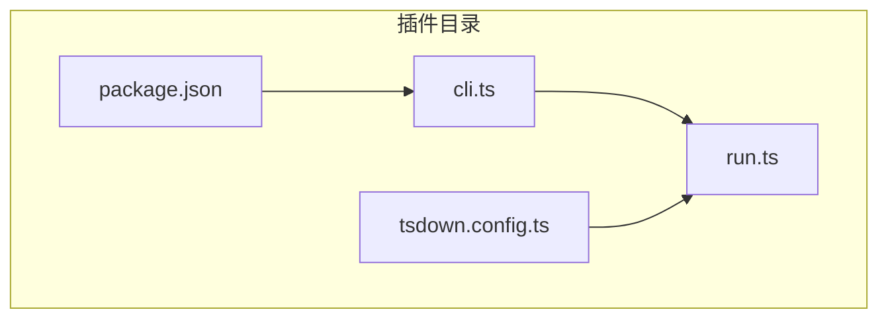
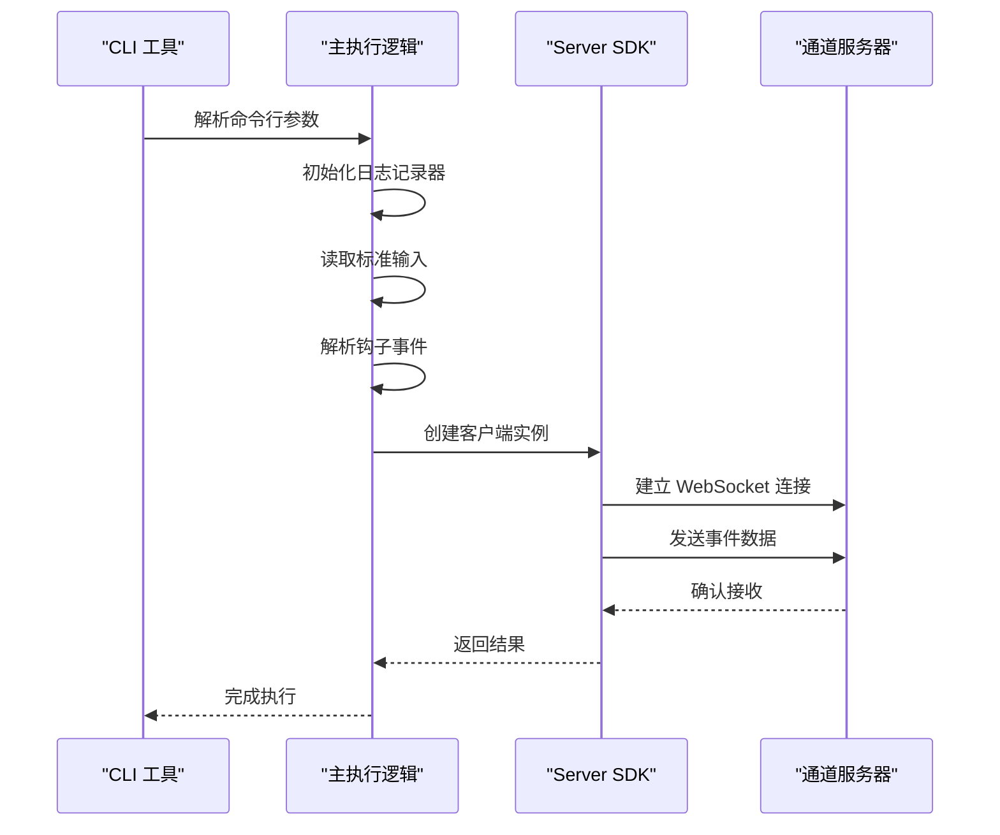
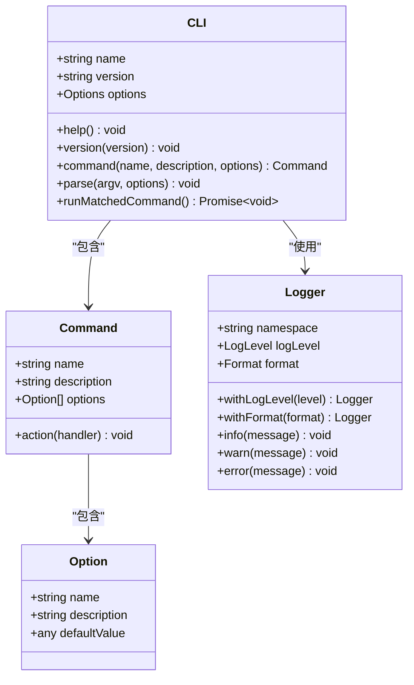
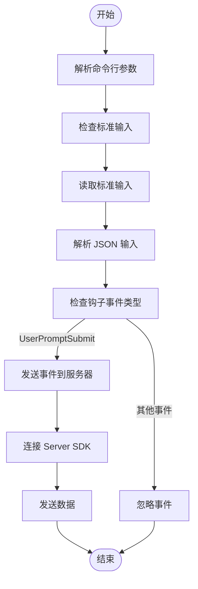
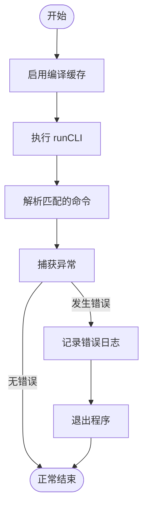

# 内部 TypeScript 插件

<cite>
**本文档中引用的文件**  
- [cli.ts](file://plugins/airi-plugin-claude-code/src/cli.ts)
- [run.ts](file://plugins/airi-plugin-claude-code/src/run.ts)
- [package.json](file://plugins/airi-plugin-claude-code/package.json)
- [tsdown.config.ts](file://plugins/airi-plugin-claude-code/tsdown.config.ts)
- [core-character\src\index.ts](file://packages/core-character/src/index.ts)
- [server-sdk\src\index.ts](file://packages/server-sdk/src/index.ts)
- [server-sdk\src\client.ts](file://packages/server-sdk/src/client.ts)
- [pnpm-workspace.yaml](file://pnpm-workspace.yaml)
</cite>

## 目录
1. [简介](#简介)
2. [项目结构](#项目结构)
3. [核心组件](#核心组件)
4. [架构概述](#架构概述)
5. [详细组件分析](#详细组件分析)
6. [依赖分析](#依赖分析)
7. [性能考虑](#性能考虑)
8. [故障排除指南](#故障排除指南)
9. [结论](#结论)

## 简介
本文档深入探讨了 `airi-plugin-claude-code` 作为内部 TypeScript 插件的架构和工作原理。该插件是 Project AIRI 生态系统中的一个独立 npm 包，通过 CLI 工具和核心逻辑实现与主项目的集成。文档详细说明了插件的加载机制、生命周期钩子以及与 `core-character` 和 `server-sdk` 等核心模块的交互方式。此外，还提供了创建新内部插件的完整流程，包括构建配置、入口点定义和本地链接测试，并强调了与 Tauri 原生插件在通信方式、性能特性和使用场景上的关键区别。

## 项目结构
`airi-plugin-claude-code` 插件位于 `plugins` 目录下，遵循典型的 TypeScript 项目结构。其核心文件包括 `src/cli.ts` 和 `src/run.ts`，分别负责命令行接口和主执行逻辑。插件通过 `package.json` 定义元数据和依赖关系，并使用 `tsdown.config.ts` 进行构建配置。整个项目采用 pnpm 工作区管理，确保插件与主项目及其他包的无缝集成。



**图示来源**  
- [cli.ts](file://plugins/airi-plugin-claude-code/src/cli.ts)
- [run.ts](file://plugins/airi-plugin-claude-code/src/run.ts)
- [package.json](file://plugins/airi-plugin-claude-code/package.json)
- [tsdown.config.ts](file://plugins/airi-plugin-claude-code/tsdown.config.ts)

**本节来源**  
- [plugins/airi-plugin-claude-code](file://plugins/airi-plugin-claude-code)

## 核心组件
`airi-plugin-claude-code` 的核心组件包括 CLI 工具和主执行逻辑。CLI 工具通过 `cac` 库实现命令行参数解析，支持配置文件加载、日志级别设置和环境变量定义。主执行逻辑则负责初始化日志记录器、读取标准输入并解析 Claude Code 钩子事件，最终通过 `server-sdk` 将事件发送到通道服务器。

**本节来源**  
- [cli.ts](file://plugins/airi-plugin-claude-code/src/cli.ts#L1-L108)
- [run.ts](file://plugins/airi-plugin-claude-code/src/run.ts#L1-L11)

## 架构概述
该插件的架构设计体现了模块化和可扩展性。通过 `server-sdk` 提供的客户端类，插件能够与主项目进行双向通信。客户端类支持自动连接、重连机制和事件监听，确保了通信的可靠性和稳定性。插件的生命周期由 CLI 命令触发，通过标准输入接收事件数据，处理完成后发送到指定的 WebSocket 服务器。



**图示来源**  
- [cli.ts](file://plugins/airi-plugin-claude-code/src/cli.ts#L50-L100)
- [run.ts](file://plugins/airi-plugin-claude-code/src/run.ts#L5-L10)
- [server-sdk\src\client.ts](file://packages/server-sdk/src/client.ts#L1-L245)

## 详细组件分析

### CLI 工具分析
CLI 工具是插件的入口点，负责处理用户输入和配置。它使用 `cac` 库定义命令和选项，支持多种配置加载方式（自动、原生、unconfig）。日志记录通过 `@guiiai/logg` 实现，支持不同级别的日志输出和调试模式。

#### CLI 工具类图


**图示来源**  
- [cli.ts](file://plugins/airi-plugin-claude-code/src/cli.ts#L10-L50)

#### CLI 执行流程


**图示来源**  
- [cli.ts](file://plugins/airi-plugin-claude-code/src/cli.ts#L60-L100)

**本节来源**  
- [cli.ts](file://plugins/airi-plugin-claude-code/src/cli.ts#L1-L108)

### 核心逻辑分析
核心逻辑由 `run.ts` 文件实现，主要负责启动 CLI 工具并处理执行过程中的异常。它通过 `module.enableCompileCache` 启用编译缓存以提高性能，并调用 `runCLI` 函数启动命令行解析和执行流程。

#### 核心逻辑流程图


**图示来源**  
- [run.ts](file://plugins/airi-plugin-claude-code/src/run.ts#L1-L11)

**本节来源**  
- [run.ts](file://plugins/airi-plugin-claude-code/src/run.ts#L1-L11)

## 依赖分析
插件的依赖关系清晰地反映了其功能需求。生产依赖包括 `@guiiai/logg` 用于日志记录，`@proj-airi/server-sdk` 用于与主项目通信，`cac` 用于命令行解析，以及 `debug` 用于调试。开发依赖则包括 `@anthropic-ai/claude-code` 类型定义和 `tsx` 执行器。

```mermaid
graph LR
A[airi-plugin-claude-code] --> B[@guiiai/logg]
A --> C[@proj-airi/server-sdk]
A --> D[cac]
A --> E[debug]
A --> F[destr]
A --> G[vue]
H[@anthropic-ai/claude-code] --> A
I[tsx] --> A
J[vue-tsc] --> A
```

**图示来源**  
- [package.json](file://plugins/airi-plugin-claude-code/package.json#L10-L25)

**本节来源**  
- [package.json](file://plugins/airi-plugin-claude-code/package.json#L1-L29)

## 性能考虑
插件在设计时充分考虑了性能因素。通过启用编译缓存和使用高效的 WebSocket 客户端，减少了启动时间和通信延迟。日志记录和错误处理机制也经过优化，确保在高负载情况下仍能稳定运行。此外，异步操作的合理使用避免了阻塞主线程，提高了整体响应速度。

## 故障排除指南
当插件无法正常工作时，首先检查标准输入是否为空或格式错误。确保 `server-sdk` 能够成功连接到通道服务器，并验证配置文件和环境变量的正确性。如果遇到连接问题，检查网络设置和防火墙规则。对于日志输出问题，确认日志级别设置是否合适，并检查调试命名空间是否正确启用。

**本节来源**  
- [cli.ts](file://plugins/airi-plugin-claude-code/src/cli.ts#L80-L100)
- [run.ts](file://plugins/airi-plugin-claude-code/src/run.ts#L5-L10)

## 结论
`airi-plugin-claude-code` 作为一个内部 TypeScript 插件，展示了如何通过 CLI 工具和核心逻辑实现与主项目的高效集成。其模块化设计和清晰的依赖关系使得插件易于维护和扩展。通过 `server-sdk` 提供的可靠通信机制，插件能够无缝地与 `core-character` 等核心模块交互。与 Tauri 原生插件相比，这种基于 TypeScript 的内部插件在开发灵活性和跨平台兼容性方面具有明显优势，适用于需要快速迭代和复杂业务逻辑的场景。