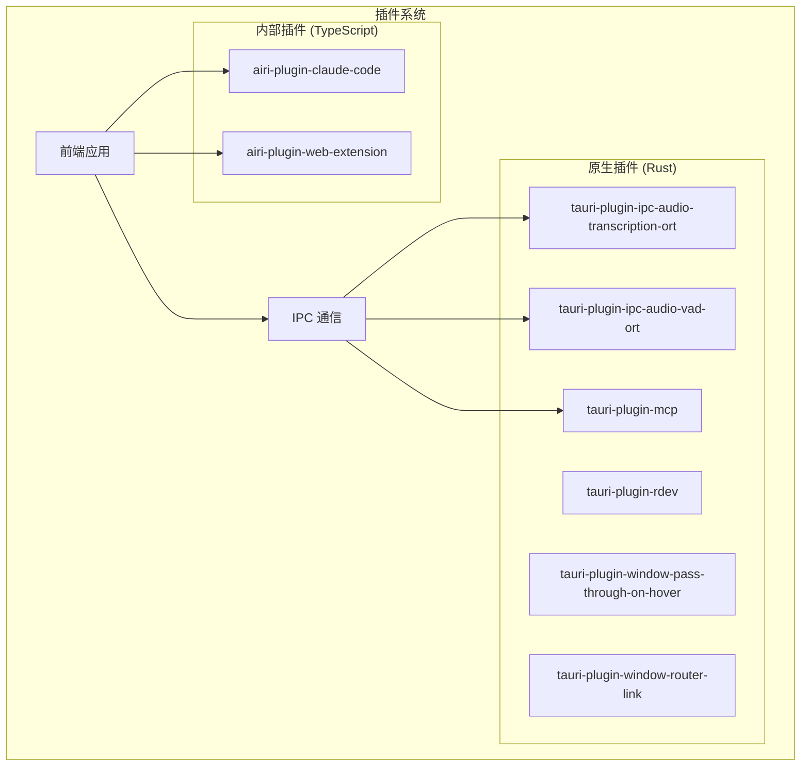
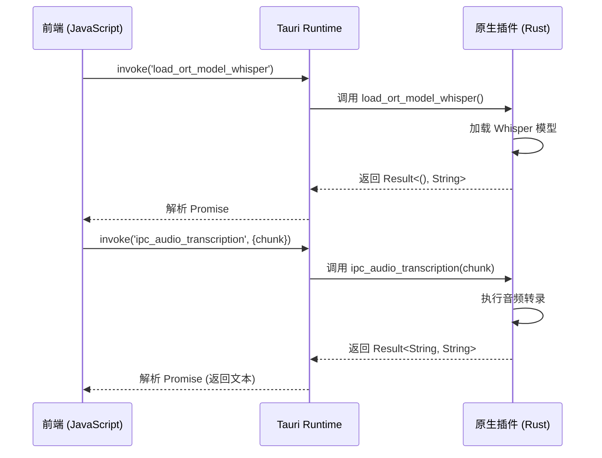
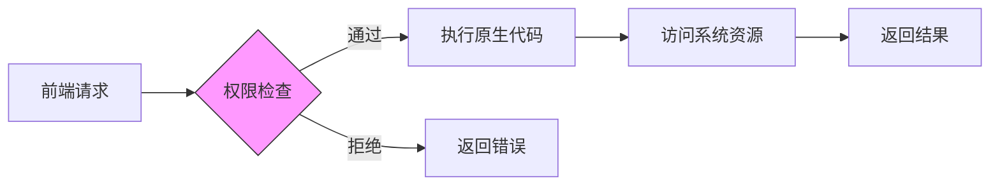

# 插件系统

<cite>
**本文档中引用的文件**  
- [tauri-plugin-ipc-audio-transcription-ort/Cargo.toml](file://crates/tauri-plugin-ipc-audio-transcription-ort/Cargo.toml)
- [tauri-plugin-ipc-audio-vad-ort/Cargo.toml](file://crates/tauri-plugin-ipc-audio-vad-ort/Cargo.toml)
- [tauri-plugin-mcp/Cargo.toml](file://crates/tauri-plugin-mcp/Cargo.toml)
- [airi-plugin-claude-code/package.json](file://plugins/airi-plugin-claude-code/package.json)
- [airi-plugin-web-extension/package.json](file://plugins/airi-plugin-web-extension/package.json)
- [tauri-plugin-ipc-audio-transcription-ort/src/lib.rs](file://crates/tauri-plugin-ipc-audio-transcription-ort/src/lib.rs)
- [tauri-plugin-ipc-audio-vad-ort/src/lib.rs](file://crates/tauri-plugin-ipc-audio-vad-ort/src/lib.rs)
- [tauri-plugin-mcp/src/lib.rs](file://crates/tauri-plugin-mcp/src/lib.rs)
- [airi-plugin-claude-code/src/run.ts](file://plugins/airi-plugin-claude-code/src/run.ts)
- [airi-plugin-web-extension/wxt.config.ts](file://plugins/airi-plugin-web-extension/wxt.config.ts)
</cite>

## 目录
1. [简介](#简介)
2. [项目结构概览](#项目结构概览)
3. [Tauri 原生插件详解](#tauri-原生插件详解)
4. [内部插件详解](#内部插件详解)
5. [插件通信机制](#插件通信机制)
6. [权限声明与安全模型](#权限声明与安全模型)
7. [从零创建插件教程](#从零创建插件教程)
8. [调试与测试技巧](#调试与测试技巧)
9. [最佳实践与注意事项](#最佳实践与注意事项)

## 简介
本权威文档全面解析 `airi_learning` 项目中的插件系统架构，重点区分并详细说明两种核心插件类型：使用 Rust 编写的 Tauri 原生插件（位于 `crates` 目录下）和使用 TypeScript 编写的内部插件（位于 `plugins` 目录下）。文档将深入探讨其设计原理、实现机制、集成方式，并提供完整的开发指南。

## 项目结构概览
项目采用多包工作区（monorepo）结构，通过 `pnpm-workspace.yaml` 管理多个子包。核心插件系统分为两个主要部分：
- **`crates/`**: 存放使用 Rust 编写的 Tauri 原生插件，直接与操作系统和底层硬件交互。
- **`plugins/`**: 存放使用 TypeScript 编写的内部插件，主要扩展前端功能和业务逻辑。



**图示来源**
- [tauri-plugin-ipc-audio-transcription-ort](file://crates/tauri-plugin-ipc-audio-transcription-ort)
- [airi-plugin-claude-code](file://plugins/airi-plugin-claude-code)

**本节来源**
- [crates](file://crates)
- [plugins](file://plugins)

## Tauri 原生插件详解
Tauri 原生插件是使用 Rust 语言开发的，编译为本地库（`.dll`, `.so`, `.dylib`），通过 Tauri 的插件系统与前端 JavaScript/TypeScript 代码进行安全通信。这些插件位于 `crates/` 目录下，每个插件都是一个独立的 Cargo 包。

### 核心特性
- **高性能**: 利用 Rust 的零成本抽象和内存安全特性处理计算密集型任务（如音频转录、语音活动检测）。
- **系统级访问**: 可以安全地调用操作系统 API，例如 `tauri-plugin-window-pass-through-on-hover` 通过 `native_windows.rs` 和 `native_macos.rs` 实现跨平台窗口穿透功能。
- **异步支持**: 基于 `tokio` 运行时，支持非阻塞 I/O 操作。

### 代码结构分析
以 `tauri-plugin-ipc-audio-transcription-ort` 为例，其核心结构如下：
- `src/lib.rs`: 插件入口，定义 `init` 函数和 `#[tauri::command]` 标记的异步函数。
- `src/models/whisper/`: 封装 Whisper 模型的加载、推理逻辑。
- `src/helpers/`: 提供辅助功能，如从 Hugging Face Hub 下载模型。

**本节来源**
- [tauri-plugin-ipc-audio-transcription-ort/src/lib.rs](file://crates/tauri-plugin-ipc-audio-transcription-ort/src/lib.rs)
- [tauri-plugin-ipc-audio-vad-ort/src/lib.rs](file://crates/tauri-plugin-ipc-audio-vad-ort/src/lib.rs)
- [tauri-plugin-mcp/src/lib.rs](file://crates/tauri-plugin-mcp/src/lib.rs)

## 内部插件详解
内部插件是使用 TypeScript 开发的，作为独立的 npm 包存在于 `plugins/` 目录下。它们更像是前端应用的扩展模块，用于添加特定功能或集成第三方服务。

### 加载机制
内部插件的加载依赖于其构建工具和宿主应用的集成方式：
- **`airi-plugin-claude-code`**: 使用 `tsdown` 构建，通过 `package.json` 的 `bin` 字段提供 CLI 工具，可能以命令行工具或服务形式运行。
- **`airi-plugin-web-extension`**: 使用 `wxt` 框架构建，这是一个专为开发 Web 扩展而设计的现代化工具。其 `wxt.config.ts` 配置了 `entrypoints`（如 `popup`, `background`, `content` 脚本），定义了扩展的加载入口。

### 生命周期
内部插件的生命周期由其运行环境决定：
- **CLI 插件**（如 `airi-plugin-claude-code`）: 生命周期始于命令执行，终于进程退出。
- **Web 扩展插件**（如 `airi-plugin-web-extension`）: 生命周期与浏览器标签页或扩展后台页面绑定，由浏览器事件（如安装、更新、页面导航）触发。

### 与核心系统的集成
内部插件通过标准的 npm 依赖管理集成到核心系统中。宿主应用在 `package.json` 中声明对这些插件的依赖，然后通过 ES 模块导入 (`import`) 使用其提供的功能。

**本节来源**
- [airi-plugin-claude-code/package.json](file://plugins/airi-plugin-claude-code/package.json)
- [airi-plugin-web-extension/package.json](file://plugins/airi-plugin-web-extension/package.json)
- [airi-plugin-web-extension/wxt.config.ts](file://plugins/airi-plugin-web-extension/wxt.config.ts)

## 插件通信机制
插件系统的核心是通信机制，它决定了前端如何与插件交互。

### Tauri 原生插件：IPC 通信
Tauri 原生插件通过 **进程间通信 (IPC)** 与前端通信。其流程如下：
1.  **前端调用**: 前端 JavaScript 使用 `invoke` 函数调用一个预定义的命令，例如 `invoke('ipc_audio_transcription', { chunk: audioData })`。
2.  **命令路由**: Tauri 运行时接收到 `invoke` 请求，根据命令名称（如 `ipc_audio_transcription`）将其路由到对应的 Rust 函数。
3.  **Rust 执行**: 在 `src/lib.rs` 中用 `#[tauri::command]` 标记的异步函数被执行。该函数可以访问系统资源、执行计算，并返回结果。
4.  **结果返回**: Rust 函数的结果（`Result<T, E>`）被序列化并通过 IPC 通道返回给前端，前端的 `invoke` 调用通过 Promise 解析。



**图示来源**
- [tauri-plugin-ipc-audio-transcription-ort/src/lib.rs](file://crates/tauri-plugin-ipc-audio-transcription-ort/src/lib.rs#L50-L114)

**本节来源**
- [tauri-plugin-ipc-audio-transcription-ort/src/lib.rs](file://crates/tauri-plugin-ipc-audio-transcription-ort/src/lib.rs)

## 权限声明与安全模型
为了确保应用安全，Tauri 对原生插件的权限进行了严格的声明和管理。

### 权限声明文件
每个 Tauri 原生插件都包含一个 `permissions/` 目录，其中：
- `default.toml`: 定义插件的默认权限集。
- `autogenerated/commands/`: 为每个 `#[tauri::command]` 自动生成一个 `.toml` 文件，精确声明该命令所需的权限。例如，`ipc_audio_transcription.toml` 可能声明了访问音频数据的权限。

### Cargo.toml 中的依赖
权限的实现依赖于特定的 Rust 库。例如：
- `tauri-plugin-ipc-audio-transcription-ort` 依赖 `symphonia` (音频解码) 和 `ort` (ONNX Runtime 推理)。
- `tauri-plugin-mcp` 依赖 `rmcp` (MCP 客户端) 和 `tokio` (异步运行时)。

这些依赖在 `Cargo.toml` 中按目标平台（macOS, Windows, Linux）分别声明，以确保使用正确的后端（如 CUDA, DirectML, Core ML）。



**图示来源**
- [tauri-plugin-ipc-audio-transcription-ort/Cargo.toml](file://crates/tauri-plugin-ipc-audio-transcription-ort/Cargo.toml)
- [tauri-plugin-ipc-audio-transcription-ort/permissions](file://crates/tauri-plugin-ipc-audio-transcription-ort/permissions)

**本节来源**
- [tauri-plugin-ipc-audio-transcription-ort/Cargo.toml](file://crates/tauri-plugin-ipc-audio-transcription-ort/Cargo.toml)
- [tauri-plugin-ipc-audio-vad-ort/Cargo.toml](file://crates/tauri-plugin-ipc-audio-vad-ort/Cargo.toml)
- [tauri-plugin-mcp/Cargo.toml](file://crates/tauri-plugin-mcp/Cargo.toml)

## 从零创建插件教程
本教程将指导您创建一个新的 Tauri 原生插件。

### 步骤 1: 创建插件骨架
在 `crates/` 目录下使用 Tauri CLI 创建新插件：
```bash
cd crates
tauri plugin new tauri-plugin-my-feature
```

### 步骤 2: 定义功能与命令
编辑 `src/lib.rs`，定义您的功能和 IPC 命令：
```rust
#[tauri::command]
async fn my_command(param: String) -> Result<String, String> {
    // 实现您的业务逻辑
    Ok(format!("Processed: {}", param))
}

pub fn init<R: Runtime>() -> TauriPlugin<R> {
    PluginBuilder::new("my-feature")
        .invoke_handler(tauri::generate_handler![my_command])
        .build()
}
```

### 步骤 3: 管理状态
如果需要在多次调用间保持状态，使用 `app.manage()`：
```rust
struct PluginState {
    data: Mutex<String>,
}

#[tauri::command]
async fn set_data<R: Runtime>(app: AppHandle<R>, value: String) -> Result<(), String> {
    let state = app.state::<PluginState>();
    *state.data.lock().unwrap() = value;
    Ok(())
}
```

### 步骤 4: 添加依赖
在 `Cargo.toml` 中添加必要的依赖，例如：
```toml
[dependencies]
serde = { version = "1.0", features = ["derive"] }
reqwest = { version = "0.11", features = ["json"] }
```

### 步骤 5: 声明权限
在 `permissions/` 目录下为 `my_command` 创建权限文件 `my_command.toml`，明确声明其所需权限。

**本节来源**
- [tauri-plugin-ipc-audio-transcription-ort/src/lib.rs](file://crates/tauri-plugin-ipc-audio-transcription-ort/src/lib.rs)
- [tauri-plugin-ipc-audio-transcription-ort/Cargo.toml](file://crates/tauri-plugin-ipc-audio-transcription-ort/Cargo.toml)

## 调试与测试技巧
### 调试原生插件
1.  **日志**: 在 Rust 代码中使用 `log::info!()` 或 `println!()` 输出调试信息。确保 Tauri 应用的日志级别已设置。
2.  **断点调试**: 使用支持 Rust 的 IDE（如 VS Code + CodeLLDB）附加到 Tauri 主进程进行调试。
3.  **单元测试**: 在 `src/` 目录下编写 `#[cfg(test)]` 测试，使用 `cargo test` 运行。

### 调试内部插件
1.  **`console.log`**: 在 TypeScript 代码中使用 `console.log`。
2.  **源码映射 (Source Maps)**: 确保构建工具（如 `wxt` 或 `tsdown`）生成了源码映射，以便在浏览器开发者工具中调试原始 TypeScript 代码。
3.  **集成测试**: 在宿主应用中集成插件，并编写端到端测试来验证其行为。

**本节来源**
- [tauri-plugin-ipc-audio-transcription-ort/src/lib.rs](file://crates/tauri-plugin-ipc-audio-transcription-ort/src/lib.rs#L5-L10)
- [airi-plugin-web-extension/wxt.config.ts](file://plugins/airi-plugin-web-extension/wxt.config.ts)

## 最佳实践与注意事项
- **最小权限原则**: 为每个 IPC 命令声明最严格的权限，避免过度授权。
- **错误处理**: Rust 函数应返回 `Result<T, E>`，并将错误信息清晰地传递给前端。
- **异步设计**: 所有可能阻塞的操作（如 I/O、网络请求）都必须是异步的，以避免冻结 UI。
- **依赖管理**: 合理使用 `target.'cfg(...)'` 来管理平台特定的依赖，减小最终二进制文件的体积。
- **文档化**: 为您的插件编写清晰的 `README.md`，说明其功能、API 和使用方法。

**本节来源**
- [tauri-plugin-ipc-audio-transcription-ort/README.md](file://crates/tauri-plugin-mcp/README.md)
- [airi-plugin-web-extension/README.md](file://plugins/airi-plugin-web-extension/README.md)