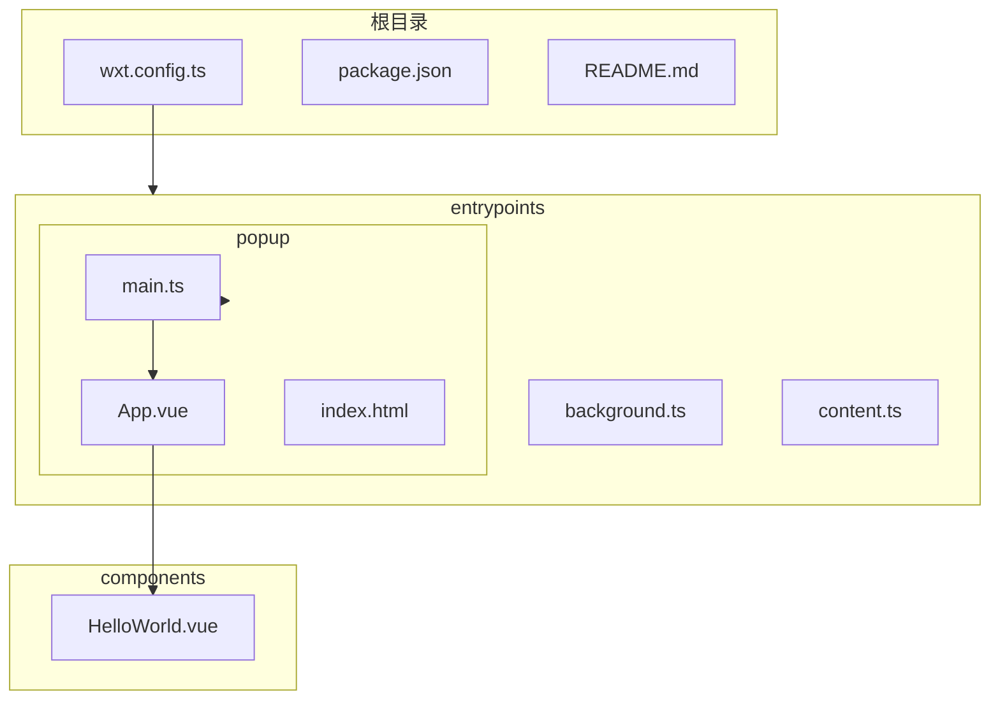
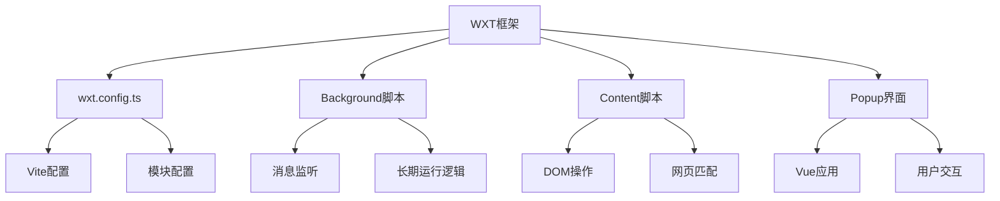
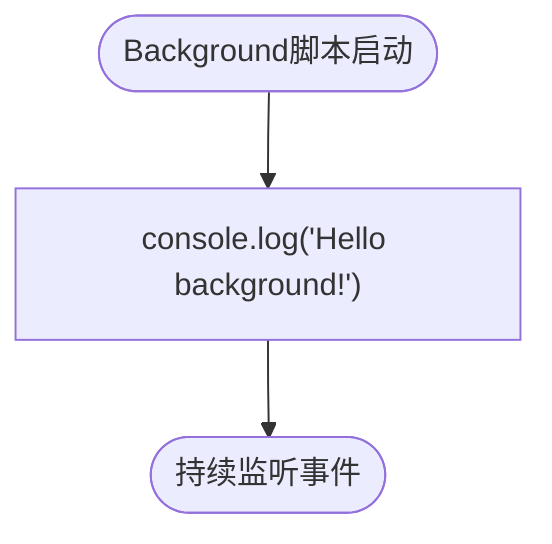
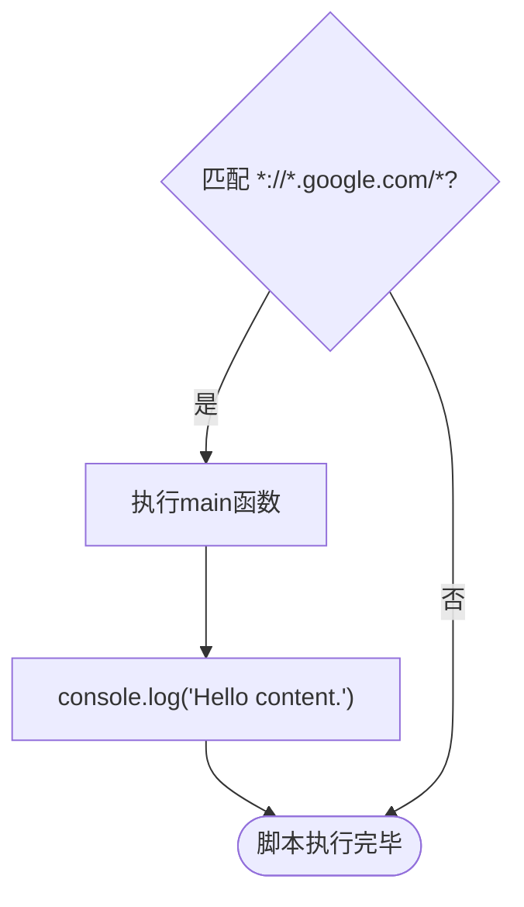
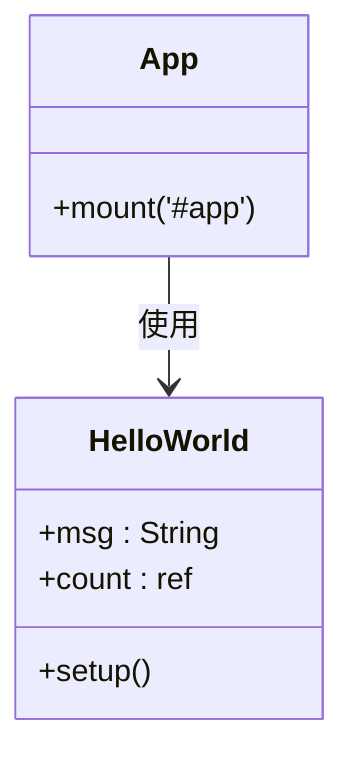
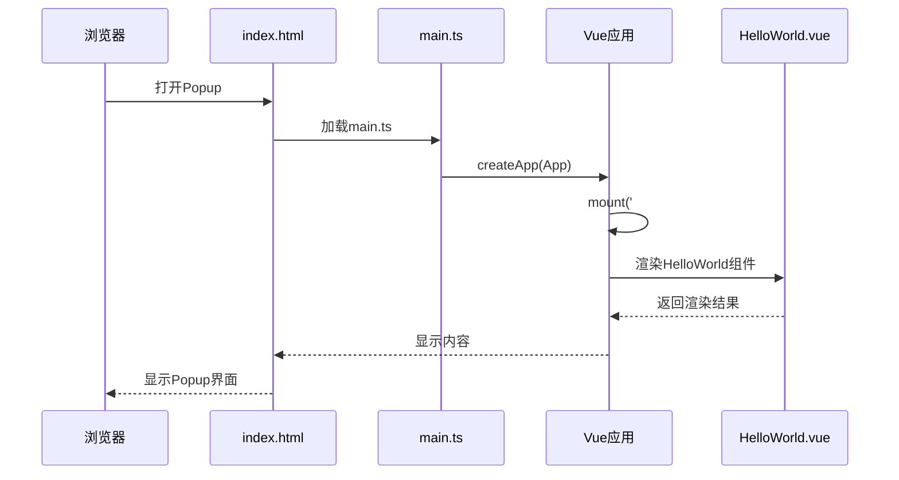
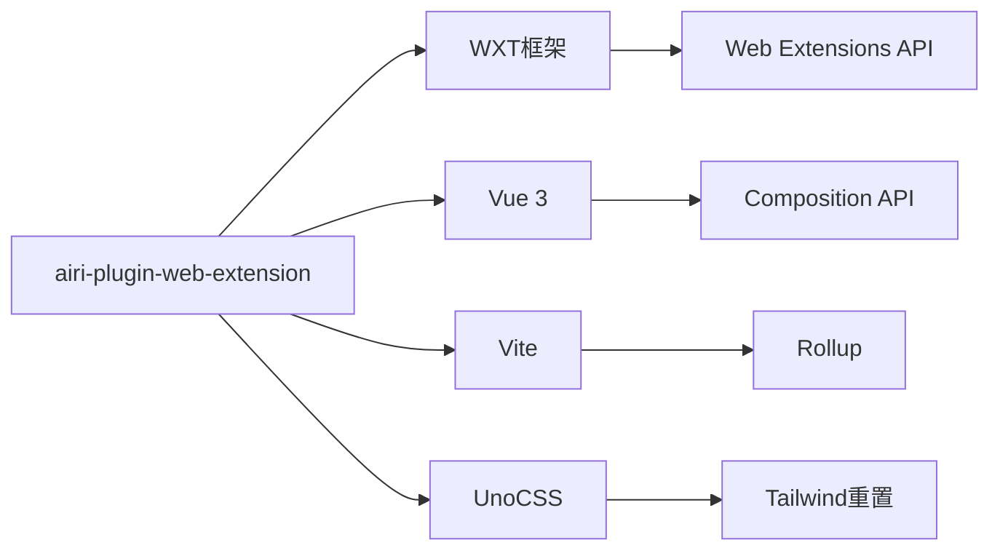

# 浏览器扩展插件

<cite>
**本文档引用的文件**
- [wxt.config.ts](file://plugins/airi-plugin-web-extension/wxt.config.ts)
- [background.ts](file://plugins/airi-plugin-web-extension/entrypoints/background.ts)
- [content.ts](file://plugins/airi-plugin-web-extension/entrypoints/content.ts)
- [popup/main.ts](file://plugins/airi-plugin-web-extension/entrypoints/popup/main.ts)
- [popup/App.vue](file://plugins/airi-plugin-web-extension/entrypoints/popup/App.vue)
- [popup/index.html](file://plugins/airi-plugin-web-extension/entrypoints/popup/index.html)
- [components/HelloWorld.vue](file://plugins/airi-plugin-web-extension/components/HelloWorld.vue)
- [README.md](file://plugins/airi-plugin-web-extension/README.md)
</cite>

## 目录
1. [简介](#简介)
2. [项目结构](#项目结构)
3. [核心组件](#核心组件)
4. [架构概述](#架构概述)
5. [详细组件分析](#详细组件分析)
6. [依赖分析](#依赖分析)
7. [性能考虑](#性能考虑)
8. [故障排除指南](#故障排除指南)
9. [结论](#结论)

## 简介
本文档全面介绍了如何使用WXT框架（基于Vite和Web Extensions API）构建一个功能完整的浏览器插件，以`airi-plugin-web-extension`为例。文档涵盖了`wxt.config.ts`的配置细节、background脚本、content脚本的职责划分，以及popup界面的实现。同时，解释了该插件如何与主Airi应用通信，以及其独特的构建和打包流程。

## 项目结构
`airi-plugin-web-extension`插件的项目结构清晰，遵循了WXT框架的标准布局。主要包含配置文件、入口点和组件。

**Diagram sources**
- [wxt.config.ts](file://plugins/airi-plugin-web-extension/wxt.config.ts)
- [entrypoints/background.ts](file://plugins/airi-plugin-web-extension/entrypoints/background.ts)
- [entrypoints/content.ts](file://plugins/airi-plugin-web-extension/entrypoints/content.ts)
- [entrypoints/popup/main.ts](file://plugins/airi-plugin-web-extension/entrypoints/popup/main.ts)
- [entrypoints/popup/App.vue](file://plugins/airi-plugin-web-extension/entrypoints/popup/App.vue)
- [components/HelloWorld.vue](file://plugins/airi-plugin-web-extension/components/HelloWorld.vue)

**Section sources**
- [wxt.config.ts](file://plugins/airi-plugin-web-extension/wxt.config.ts)
- [entrypoints/background.ts](file://plugins/airi-plugin-web-extension/entrypoints/background.ts)
- [entrypoints/content.ts](file://plugins/airi-plugin-web-extension/entrypoints/content.ts)
- [entrypoints/popup/main.ts](file://plugins/airi-plugin-web-extension/entrypoints/popup/main.ts)

## 核心组件
该浏览器插件的核心组件包括background脚本、content脚本和popup界面。这些组件通过WXT框架的API进行定义和管理，实现了插件的长期运行逻辑、网页DOM操作和用户交互功能。

**Section sources**
- [entrypoints/background.ts](file://plugins/airi-plugin-web-extension/entrypoints/background.ts)
- [entrypoints/content.ts](file://plugins/airi-plugin-web-extension/entrypoints/content.ts)
- [entrypoints/popup/main.ts](file://plugins/airi-plugin-web-extension/entrypoints/popup/main.ts)

## 架构概述
`airi-plugin-web-extension`的架构基于WXT框架，该框架简化了使用Vite构建Web扩展的过程。插件由三个主要部分组成：background脚本处理长期运行的逻辑和消息监听，content脚本注入并操作特定网页的DOM，popup界面提供用户交互的入口。

**Diagram sources**
- [wxt.config.ts](file://plugins/airi-plugin-web-extension/wxt.config.ts)
- [entrypoints/background.ts](file://plugins/airi-plugin-web-extension/entrypoints/background.ts)
- [entrypoints/content.ts](file://plugins/airi-plugin-web-extension/entrypoints/content.ts)
- [entrypoints/popup/main.ts](file://plugins/airi-plugin-web-extension/entrypoints/popup/main.ts)

## 详细组件分析

### Background脚本分析
Background脚本是浏览器插件的长期运行部分，负责处理事件监听、消息传递和后台任务。在`airi-plugin-web-extension`中，background脚本通过`defineBackground`函数定义。

**Diagram sources**
- [entrypoints/background.ts](file://plugins/airi-plugin-web-extension/entrypoints/background.ts)

**Section sources**
- [entrypoints/background.ts](file://plugins/airi-plugin-web-extension/entrypoints/background.ts)

### Content脚本分析
Content脚本负责注入到匹配的网页中，直接操作网页的DOM。在`airi-plugin-web-extension`中，content脚本通过`defineContentScript`函数定义，并配置了匹配模式。

**Diagram sources**
- [entrypoints/content.ts](file://plugins/airi-plugin-web-extension/entrypoints/content.ts)

**Section sources**
- [entrypoints/content.ts](file://plugins/airi-plugin-web-extension/entrypoints/content.ts)

### Popup界面分析
Popup界面是用户点击浏览器工具栏图标时显示的界面，提供用户交互功能。在`airi-plugin-web-extension`中，popup界面是一个基于Vue的单页应用。

#### 对于面向对象的组件

**Diagram sources**
- [entrypoints/popup/App.vue](file://plugins/airi-plugin-web-extension/entrypoints/popup/App.vue)
- [components/HelloWorld.vue](file://plugins/airi-plugin-web-extension/components/HelloWorld.vue)

#### 对于API/服务组件

**Diagram sources**
- [entrypoints/popup/index.html](file://plugins/airi-plugin-web-extension/entrypoints/popup/index.html)
- [entrypoints/popup/main.ts](file://plugins/airi-plugin-web-extension/entrypoints/popup/main.ts)
- [entrypoints/popup/App.vue](file://plugins/airi-plugin-web-extension/entrypoints/popup/App.vue)
- [components/HelloWorld.vue](file://plugins/airi-plugin-web-extension/components/HelloWorld.vue)

**Section sources**
- [entrypoints/popup/index.html](file://plugins/airi-plugin-web-extension/entrypoints/popup/index.html)
- [entrypoints/popup/main.ts](file://plugins/airi-plugin-web-extension/entrypoints/popup/main.ts)
- [entrypoints/popup/App.vue](file://plugins/airi-plugin-web-extension/entrypoints/popup/App.vue)
- [components/HelloWorld.vue](file://plugins/airi-plugin-web-extension/components/HelloWorld.vue)

## 依赖分析
`airi-plugin-web-extension`的依赖关系清晰，主要依赖WXT框架和Vue框架。构建工具使用Vite，样式处理使用UnoCSS。

**Diagram sources**
- [wxt.config.ts](file://plugins/airi-plugin-web-extension/wxt.config.ts)
- [package.json](file://plugins/airi-plugin-web-extension/package.json)

**Section sources**
- [wxt.config.ts](file://plugins/airi-plugin-web-extension/wxt.config.ts)
- [package.json](file://plugins/airi-plugin-web-extension/package.json)

## 性能考虑
由于该插件规模较小，性能考虑主要集中在以下几个方面：content脚本的匹配模式应尽可能精确以减少不必要的注入；popup界面的Vue应用应保持轻量以确保快速加载；background脚本应避免长时间运行的同步操作以防止阻塞事件循环。

## 故障排除指南
当开发和调试`airi-plugin-web-extension`时，可能会遇到以下常见问题：

**Section sources**
- [wxt.config.ts](file://plugins/airi-plugin-web-extension/wxt.config.ts)
- [entrypoints/background.ts](file://plugins/airi-plugin-web-extension/entrypoints/background.ts)
- [entrypoints/content.ts](file://plugins/airi-plugin-web-extension/entrypoints/content.ts)
- [entrypoints/popup/main.ts](file://plugins/airi-plugin-web-extension/entrypoints/popup/main.ts)

## 结论
`airi-plugin-web-extension`是一个使用WXT框架构建的典型浏览器插件示例。它展示了如何利用现代前端工具链（Vite、Vue、UnoCSS）来创建功能完整且易于维护的浏览器扩展。通过清晰的职责划分和现代化的开发工具，开发者可以高效地构建和迭代浏览器插件功能。