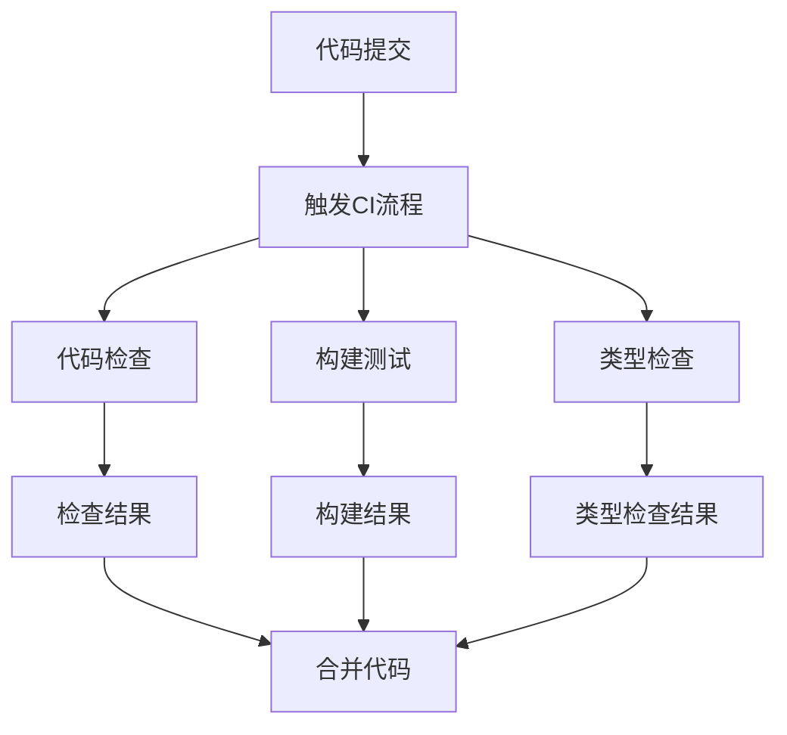
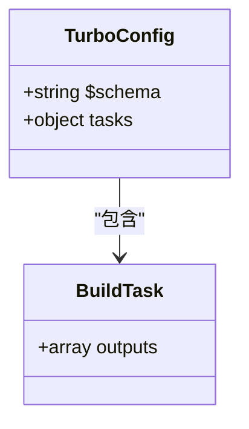
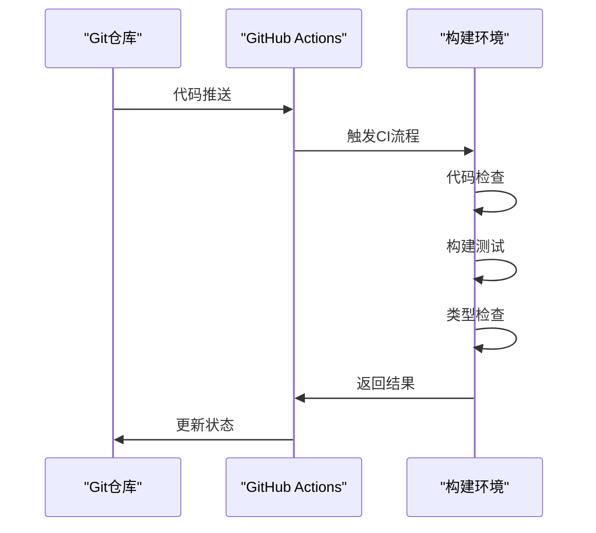
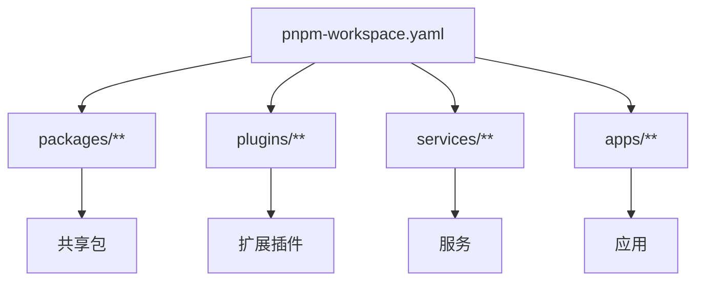

# CI/CD流水线配置

<cite>
**本文档引用的文件**  
- [turbo.json](file://turbo.json)
- [pnpm-workspace.yaml](file://pnpm-workspace.yaml)
- [package.json](file://package.json)
- [.github/workflows/ci.yml](file://.github/workflows/ci.yml)
- [apps/stage-web/Dockerfile](file://apps/stage-web/Dockerfile)
</cite>

## 目录
1. [简介](#简介)
2. [项目结构](#项目结构)
3. [核心组件](#核心组件)
4. [架构概述](#架构概述)
5. [详细组件分析](#详细组件分析)
6. [依赖分析](#依赖分析)
7. [性能考虑](#性能考虑)
8. [故障排除指南](#故障排除指南)
9. [结论](#结论)

## 简介
本文档旨在为基于turbo.json配置的CI/CD流水线提供权威指南，重点介绍如何实现高效的增量构建和任务编排，最大化利用缓存以减少构建时间。文档将详细阐述GitHub Actions工作流的最佳实践，包括多阶段构建、并行测试执行和条件部署策略。同时，将解释pnpm-workspace.yaml在monorepo中的依赖管理作用及其对CI/CD流程的影响。此外，文档还将涵盖针对不同环境（开发、预发布、生产）的部署策略，包括版本控制、回滚机制和监控集成，并提供安全最佳实践，如密钥管理、依赖扫描和构建环境隔离。

## 项目结构
本项目采用monorepo架构，通过pnpm-workspace.yaml定义了多个包和应用的组织方式。项目根目录下包含apps、crates、packages、plugins、services等主要目录，分别存放不同的应用、Rust插件、共享包、扩展插件和服务。这种结构有利于代码复用和统一管理，同时也为CI/CD流水线的配置带来了挑战和机遇。

**Section sources**
- [pnpm-workspace.yaml](file://pnpm-workspace.yaml#L1-L32)

## 核心组件
项目的核心构建和任务编排由turbo.json文件驱动，该文件定义了构建任务及其输出。通过与pnpm和GitHub Actions的集成，实现了高效的增量构建和缓存利用。GitHub Actions工作流文件.ci.yml定义了CI流程，包括代码检查、构建测试、类型检查等任务，确保代码质量和构建稳定性。

**Section sources**
- [turbo.json](file://turbo.json#L1-L8)
- [.github/workflows/ci.yml](file://.github/workflows/ci.yml#L1-L99)

## 架构概述
项目的CI/CD架构基于GitHub Actions，利用turbo的缓存机制和增量构建能力，实现了高效的构建流程。构建过程分为多个阶段，包括代码检查、构建测试、类型检查等，每个阶段都在独立的GitHub Actions作业中执行，确保了流程的清晰和可维护性。

**Diagram sources**
- [.github/workflows/ci.yml](file://.github/workflows/ci.yml#L1-L99)

## 详细组件分析
### turbo.json配置分析
turbo.json文件是项目构建的核心配置，定义了构建任务及其输出。通过指定输出目录，turbo能够智能地判断哪些任务需要重新执行，从而实现增量构建。

#### 配置示例

**Diagram sources**
- [turbo.json](file://turbo.json#L1-L8)

### GitHub Actions工作流分析
GitHub Actions工作流文件.ci.yml定义了CI流程的各个阶段，包括代码检查、构建测试、类型检查等。通过矩阵策略，实现了多应用的并行构建测试，提高了构建效率。

#### 工作流流程

**Diagram sources**
- [.github/workflows/ci.yml](file://.github/workflows/ci.yml#L1-L99)

## 依赖分析
项目依赖管理通过pnpm-workspace.yaml文件实现，该文件定义了所有包和应用的路径，确保了依赖的一致性和可管理性。通过pnpm的依赖解析机制，实现了高效的依赖安装和管理。

**Diagram sources**
- [pnpm-workspace.yaml](file://pnpm-workspace.yaml#L1-L32)

## 性能考虑
通过turbo的增量构建和缓存机制，项目构建时间得到了显著优化。GitHub Actions的并行执行策略进一步提高了构建效率。此外，Dockerfile中的多阶段构建策略减少了最终镜像的大小，提高了部署效率。

## 故障排除指南
在CI/CD流程中，常见的问题包括依赖安装失败、构建失败、类型检查失败等。通过查看GitHub Actions的日志，可以快速定位问题。对于依赖问题，可以尝试清除缓存后重新安装；对于构建问题，需要检查代码和配置文件；对于类型检查问题，需要修正类型错误。

**Section sources**
- [.github/workflows/ci.yml](file://.github/workflows/ci.yml#L1-L99)
- [package.json](file://package.json#L1-L125)

## 结论
本文档详细介绍了基于turbo.json配置的CI/CD流水线，通过高效的增量构建和任务编排，最大化利用缓存减少构建时间。GitHub Actions工作流配置的最佳实践，包括多阶段构建、并行测试执行和条件部署，确保了代码质量和构建稳定性。pnpm-workspace.yaml在monorepo中的依赖管理作用及其对CI/CD的影响，为项目提供了统一的依赖管理方案。针对不同环境的部署策略，包括版本控制、回滚机制和监控集成，确保了应用的稳定运行。安全最佳实践，如密钥管理、依赖扫描和构建环境隔离，为项目提供了安全保障。