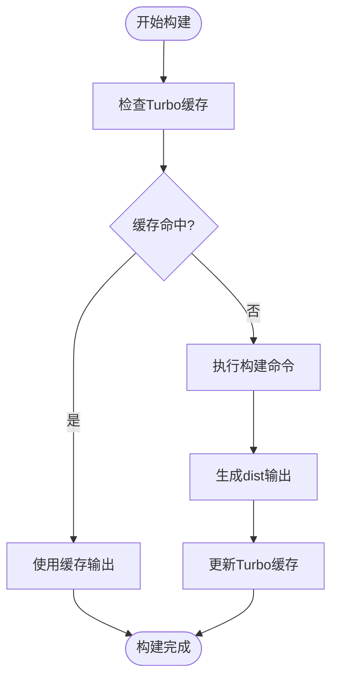
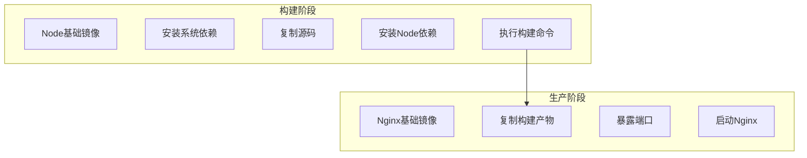
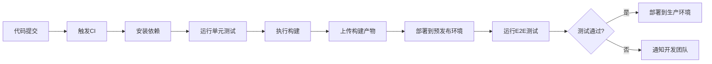

# Web应用构建与部署

<cite>
**本文档引用的文件**  
- [vite.config.ts](file://apps/stage-web/vite.config.ts)
- [vite.config.ts](file://apps/component-calling/vite.config.ts)
- [Dockerfile](file://apps/stage-web/Dockerfile)
- [netlify.toml](file://apps/stage-web/netlify.toml)
- [netlify.toml](file://apps/component-calling/netlify.toml)
- [turbo.json](file://turbo.json)
</cite>

## 目录
1. [简介](#简介)
2. [项目结构](#项目结构)
3. [Vite配置详解](#vite配置详解)
4. [Turbo增量构建与缓存优化](#turbo增量构建与缓存优化)
5. [Docker多阶段构建与镜像优化](#docker多阶段构建与镜像优化)
6. [Netlify部署配置](#netlify部署配置)
7. [CI/CD流水线建议](#cicd流水线建议)
8. [结论](#结论)

## 简介
本文档旨在为基于Vite的Web应用提供从构建到部署的完整技术指南。重点涵盖Vite构建配置、Turbo增量构建、Docker多阶段构建、Netlify部署配置以及CI/CD流水线的最佳实践。文档基于实际项目结构和配置文件，提供可直接应用的配置方案和优化建议。

## 项目结构
项目采用多包（monorepo）架构，通过pnpm工作区管理多个子应用和共享包。核心Web应用位于`apps/stage-web`目录，使用Vite作为构建工具，Vue 3作为前端框架，并集成UnoCSS进行原子化CSS开发。

**项目结构来源**
- [apps/stage-web](file://apps/stage-web)
- [turbo.json](file://turbo.json)

## Vite配置详解

### 构建输出配置
Vite配置通过`defineConfig`定义构建行为。在`apps/stage-web/vite.config.ts`中，配置了插件链、路径别名和依赖优化排除项。`optimizeDeps.exclude`明确排除了内部包和静态资源，避免不必要的预构建。

### 环境变量处理
环境变量通过Node.js的`process.env`直接访问。配置中使用`env.TARGET_HUGGINGFACE_SPACE`条件判断来决定是否启用PWA插件，实现了不同环境下的功能开关。

### 插件集成
Vite集成了多个关键插件：
- `VueRouter`：基于文件系统的路由生成
- `Unocss`：原子化CSS引擎
- `VitePWA`：PWA支持（条件启用）
- `VueI18n`：国际化支持
- 自定义插件`Download`和`DownloadLive2DSDK`：用于下载外部资源

**Section sources**
- [vite.config.ts](file://apps/stage-web/vite.config.ts#L0-L179)
- [vite.config.ts](file://apps/component-calling/vite.config.ts#L0-L21)

## Turbo增量构建与缓存优化

### 增量构建配置
Turbo通过`turbo.json`配置文件定义任务。`build`任务的`outputs`字段指定输出目录为`dist/**`，Turbo会基于此配置智能判断哪些包需要重新构建，实现增量构建。

### 缓存机制
Turbo利用本地和远程缓存机制，避免重复构建。当执行`pnpm run build`时，Turbo会检查输入文件的哈希值，若未改变则直接使用缓存的输出，显著提升构建速度。

**Diagram sources**
- [turbo.json](file://turbo.json#L0-L7)

**Section sources**
- [turbo.json](file://turbo.json#L0-L7)

## Docker多阶段构建与镜像优化

### 多阶段构建策略
Dockerfile采用两阶段构建：
1. **构建阶段**：基于`node:24-trixie`镜像，安装依赖并执行构建命令
2. **生产阶段**：基于轻量级`nginx:stable-alpine`镜像，仅复制构建产物

### 镜像优化
通过多阶段构建，最终镜像仅包含Nginx服务器和静态文件，不包含Node.js运行时和源代码，大幅减小镜像体积。构建阶段使用`--mount=type=cache`挂载pnpm缓存，避免重复下载依赖。

**Diagram sources**
- [Dockerfile](file://apps/stage-web/Dockerfile#L0-L26)

**Section sources**
- [Dockerfile](file://apps/stage-web/Dockerfile#L0-L26)

## Netlify部署配置

### 路由规则与重定向
`netlify.toml`配置了SPA应用的路由规则，将所有未匹配的路径重定向到`index.html`。同时配置了静态资源和API请求的代理规则，实现Plausible.io分析服务的透明代理。

### 环境设置
通过`[build.environment]`部分设置Node版本和内存限制，确保构建过程有足够的资源。`NODE_OPTIONS = "--max-old-space-size=4096"`将Node堆内存限制提升至4GB，避免大型项目构建时的内存溢出。

### 构建命令
构建命令集成了多个子项目的构建流程，包括主应用、文档站点和UI组件库的构建，并通过`mv`和`cp`命令将产物合并到最终输出目录。

**Section sources**
- [netlify.toml](file://apps/stage-web/netlify.toml#L0-L37)
- [netlify.toml](file://apps/component-calling/netlify.toml#L0-L14)

## CI/CD流水线建议

### 自动化测试
建议在CI流程中集成Vitest进行单元测试。可在`turbo.json`中添加`test`任务，并配置`dependsOn`确保测试在构建前执行。

### 构建缓存
利用Turbo的远程缓存功能，在CI环境中配置缓存上传和下载，避免每次构建都从零开始。可结合GitHub Actions或Netlify Build Cache实现。

### 部署验证
部署后应执行自动化验证，包括：
- 检查关键页面的HTTP状态码
- 验证静态资源的可访问性
- 运行端到端测试确保核心功能正常

**Diagram sources**
- [turbo.json](file://turbo.json#L0-L7)
- [netlify.toml](file://apps/stage-web/netlify.toml#L0-L37)

## 结论
本文档详细介绍了Web应用从构建到部署的完整流程。通过合理配置Vite、Turbo、Docker和Netlify，可以构建高效、可靠的CI/CD流水线。建议在实际项目中根据具体需求调整配置，并持续优化构建和部署性能。