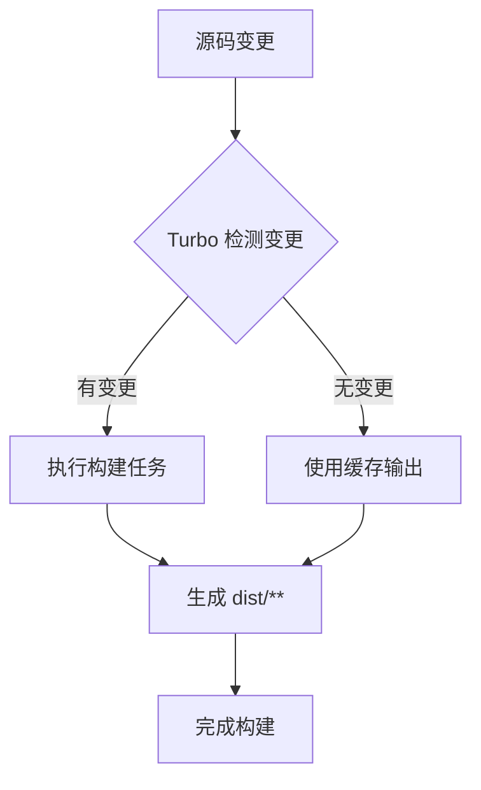
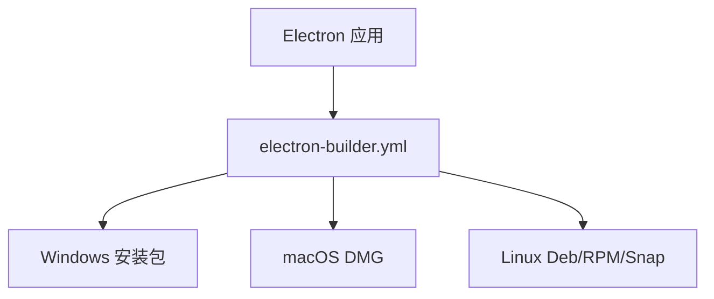

# 构建与部署

<cite>
**本文档中引用的文件**  
- [turbo.json](file://turbo.json)
- [apps/component-calling/vite.config.ts](file://apps/component-calling/vite.config.ts)
- [apps/component-calling/netlify.toml](file://apps/component-calling/netlify.toml)
- [apps/stage-tamagotchi/electron-builder.yml](file://apps/stage-tamagotchi/electron-builder.yml)
- [apps/stage-web/Dockerfile](file://apps/stage-web/Dockerfile)
</cite>

## 目录
1. [简介](#简介)
2. [构建流程](#构建流程)
3. [Turbo 增量构建与缓存机制](#turbo-增量构建与缓存机制)
4. [Vite 配置详解](#vite-配置详解)
5. [Web 应用部署（Netlify）](#web-应用部署netlify)
6. [Electron 桌面应用打包配置](#electron-桌面应用打包配置)
7. [Docker 化部署](#docker-化部署)
8. [CI/CD 流水线配置建议](#cicd-流水线配置建议)

## 简介
本指南详细说明了项目在开发、测试和生产环境中的构建与部署流程。涵盖 Turbo 的增量构建机制、Vite 的关键配置、Web 应用部署方案（Netlify）、Electron 桌面应用打包（electron-builder.yml）以及 Docker 部署流程（Dockerfile），并提供 CI/CD 流水线的配置建议。

## 构建流程
项目采用多包架构（monorepo），通过 `turbo.json` 定义统一的构建任务。每个子应用（如 `component-calling`、`stage-web`、`stage-tamagotchi`）拥有独立的构建配置，通过 `pnpm` 命令触发构建任务。构建输出统一指向 `dist/**` 目录，确保输出结构一致性。

**Section sources**
- [turbo.json](file://turbo.json#L1-L9)

## Turbo 增量构建与缓存机制
Turbo 通过 `turbo.json` 中定义的 `tasks.build.outputs` 字段（`dist/**`）实现增量构建。Turbo 会缓存每次构建的输出和依赖哈希，当下次构建时，若输入未发生变化，则直接复用缓存结果，显著提升构建速度。该机制支持跨机器缓存共享，适用于 CI/CD 环境。

**Diagram sources**
- [turbo.json](file://turbo.json#L1-L9)

**Section sources**
- [turbo.json](file://turbo.json#L1-L9)

## Vite 配置详解
以 `component-calling` 应用为例，`vite.config.ts` 配置了核心插件：
- `VueRouter`：支持 `.vue` 和 `.md` 文件的自动路由生成，并生成类型声明文件。
- `Vue`：Vue 3 的官方 Vite 插件，支持单文件组件。
- `Unocss`：原子化 CSS 引擎，提升样式开发效率。

这些插件协同工作，实现高效的开发构建流程。

**Section sources**
- [apps/component-calling/vite.config.ts](file://apps/component-calling/vite.config.ts#L1-L22)

## Web 应用部署（Netlify）
`component-calling` 应用通过 `netlify.toml` 配置 Netlify 部署：
- `base`：项目根目录。
- `command`：构建命令，使用 `pnpm -F` 过滤并运行指定包的构建任务。
- `publish`：部署目录，指向构建输出的 `dist` 文件夹。
- 环境变量设置 Node.js 版本和内存限制，确保构建稳定性。
- 配置重定向规则，支持单页应用（SPA）的路由。

**Section sources**
- [apps/component-calling/netlify.toml](file://apps/component-calling/netlify.toml#L1-L15)

## Electron 桌面应用打包配置
`stage-tamagotchi` 应用使用 `electron-builder.yml` 进行打包配置，支持 Windows、macOS 和 Linux 平台：
- `appId` 和 `productName`：定义应用标识和名称。
- `directories`：指定输出和资源目录。
- `files`：定义打包包含的文件，排除源码和配置文件。
- `asar`：启用 ASAR 归档以保护源码。
- `win`、`mac`、`linux`：各平台特定配置，如安装包名称、图标、权限描述等。
- `snap` 和 `appImage`：支持 Linux 的 Snap 和 AppImage 打包格式。

**Diagram sources**
- [apps/stage-tamagotchi/electron-builder.yml](file://apps/stage-tamagotchi/electron-builder.yml#L1-L70)

**Section sources**
- [apps/stage-tamagotchi/electron-builder.yml](file://apps/stage-tamagotchi/electron-builder.yml#L1-L70)

## Docker 化部署
`stage-web` 应用通过 `Dockerfile` 实现容器化部署，采用多阶段构建：
- **构建阶段**：
  - 基于 `node:24-trixie` 镜像。
  - 安装依赖并使用 `pnpm` 安装包。
  - 并行执行多个构建任务（`stage-web`、`docs`、`stage-ui`），并将输出合并到 `dist` 目录。
- **生产阶段**：
  - 基于 `nginx:stable-alpine` 镜像。
  - 将构建产物复制到 Nginx 默认路径。
  - 暴露 80 端口，启动 Nginx 服务。

此配置确保了构建环境的纯净和生产镜像的轻量化。

**Section sources**
- [apps/stage-web/Dockerfile](file://apps/stage-web/Dockerfile#L1-L27)

## CI/CD 流水线配置建议
建议在 CI/CD 流水线中：
1. 使用 `turbo` 的远程缓存功能，加速构建。
2. 在构建阶段使用 `--frozen-lockfile` 确保依赖一致性。
3. 对不同环境（开发、测试、生产）使用不同的构建命令和发布目标。
4. 在部署前添加自动化测试步骤。
5. 利用 `Dockerfile` 的多阶段构建优势，在 CI 中直接生成生产镜像。
6. 对 Electron 打包任务，确保 CI 环境支持跨平台构建工具（如 wine、macOS 构建机）。