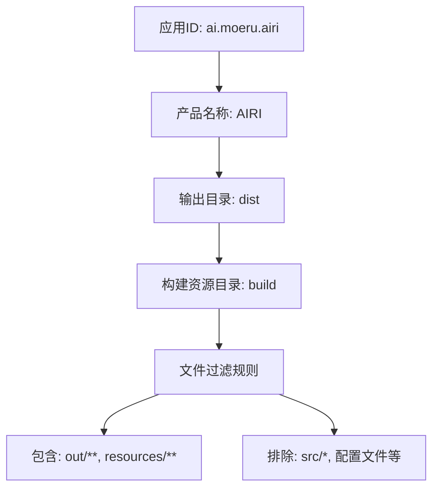
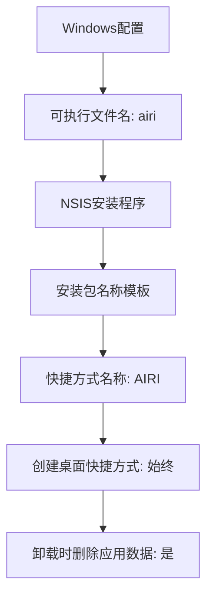
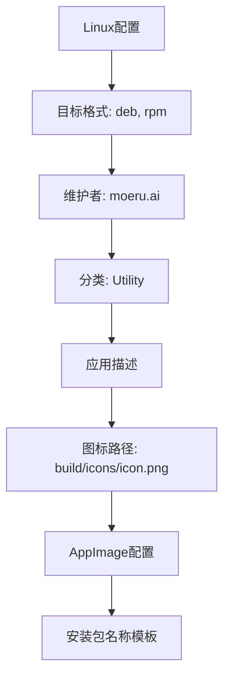
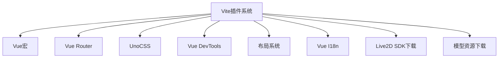
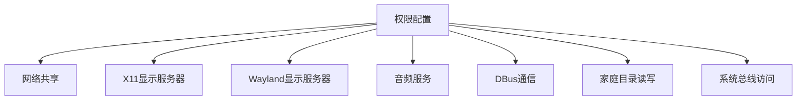
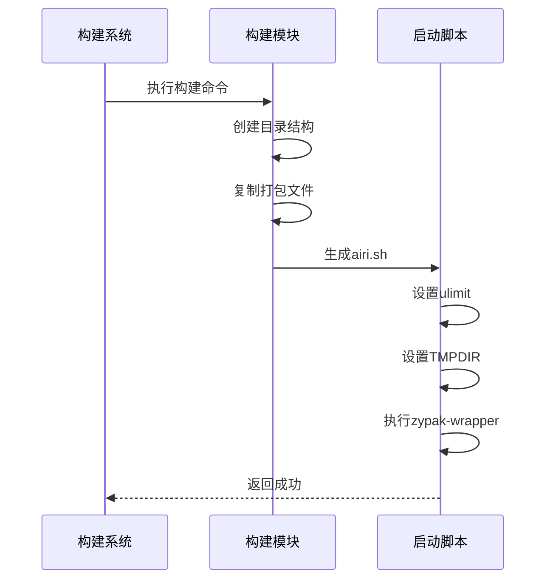
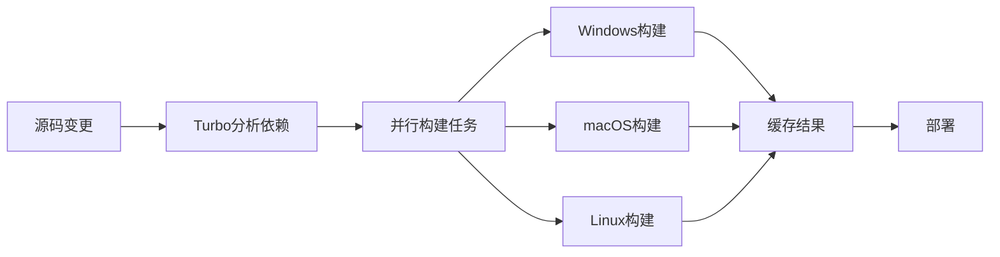
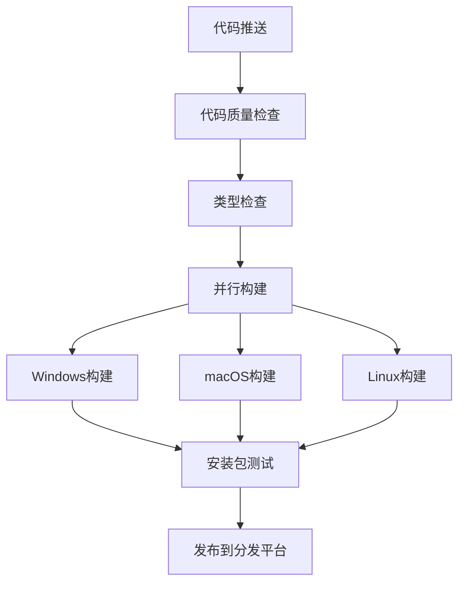

# 桌面应用构建与打包

<cite>
**本文档引用文件**  
- [electron-builder.yml](file://apps/stage-tamagotchi/electron-builder.yml)
- [electron.vite.config.ts](file://apps/stage-tamagotchi/electron.vite.config.ts)
- [ai.moeru.airi.flatpak.yml](file://apps/stage-tamagotchi/ai.moeru.airi.flatpak.yml)
- [package.json](file://apps/stage-tamagotchi/package.json)
- [turbo.json](file://turbo.json)
</cite>

## 目录
1. [简介](#简介)
2. [项目结构](#项目结构)
3. [Electron打包配置详解](#electron打包配置详解)
4. [Vite构建配置解析](#vite构建配置解析)
5. [Flatpak打包流程](#flatpak打包流程)
6. [Turbo构建优化](#turbo构建优化)
7. [跨平台构建脚本](#跨平台构建脚本)
8. [CI/CD集成建议](#cicd集成建议)

## 简介
本文档深入解析基于Electron的桌面应用构建与打包全流程，涵盖Windows、macOS和Linux三大平台的配置细节。重点分析`electron-builder.yml`打包配置、`electron.vite.config.ts`构建设置、Flatpak分发方案以及Turbo构建优化策略，为开发者提供完整的跨平台桌面应用发布指南。

## 项目结构
项目采用Monorepo架构，核心桌面应用位于`apps/stage-tamagotchi`目录，包含主进程、预加载脚本和渲染进程代码。构建配置文件集中存放于该目录下，包括Electron打包配置、Vite构建配置和Flatpak打包清单。

**Section sources**
- [electron-builder.yml](file://apps/stage-tamagotchi/electron-builder.yml#L1-L70)
- [electron.vite.config.ts](file://apps/stage-tamagotchi/electron.vite.config.ts#L1-L140)
- [ai.moeru.airi.flatpak.yml](file://apps/stage-tamagotchi/ai.moeru.airi.flatpak.yml#L1-L79)

## Electron打包配置详解

### 基础配置
`electron-builder.yml`文件定义了应用的基本信息，包括应用ID、产品名称和输出目录。配置中指定了资源文件的包含与排除规则，确保打包时只包含必要的文件。



**Diagram sources**
- [electron-builder.yml](file://apps/stage-tamagotchi/electron-builder.yml#L1-L20)

### Windows平台配置
Windows平台使用NSIS安装程序，配置了自定义的安装包名称、快捷方式名称和卸载选项。特别设置了始终创建桌面快捷方式，并在卸载时删除应用数据。



**Diagram sources**
- [electron-builder.yml](file://apps/stage-tamagotchi/electron-builder.yml#L40-L50)

### macOS平台配置
macOS平台配置了应用沙盒权限和描述信息，包括对用户文档和下载文件夹的访问权限说明。禁用了公证功能，可执行文件名为`airi`。

**Section sources**
- [electron-builder.yml](file://apps/stage-tamagotchi/electron-builder.yml#L51-L60)

### Linux平台配置
Linux平台支持多种打包格式，包括deb、rpm和AppImage。配置了维护者信息、应用分类和详细描述，图标文件指向`build/icons/icon.png`。



**Diagram sources**
- [electron-builder.yml](file://apps/stage-tamagotchi/electron-builder.yml#L61-L70)

## Vite构建配置解析

### 多进程构建配置
`electron.vite.config.ts`采用Electron-Vite的多进程构建模式，分别配置主进程、预加载脚本和渲染进程的构建选项。主进程和预加载脚本使用`externalizeDepsPlugin`插件处理依赖。

```mermaid
classDiagram
class ElectronViteConfig {
+main : Plugin[]
+preload : Plugin[]
+renderer : ConfigOptions
}
ElectronViteConfig --> MainConfig : "has"
ElectronViteConfig --> PreloadConfig : "has"
ElectronViteConfig --> RendererConfig : "has"
class MainConfig {
+plugins : [externalizeDepsPlugin()]
}
class PreloadConfig {
+plugins : [externalizeDepsPlugin()]
}
class RendererConfig {
+base : './'
+optimizeDeps : exclude[]
+resolve : alias{}
+plugins : [Vue, VueRouter, UnoCSS...]
}
```

**Diagram sources**
- [electron.vite.config.ts](file://apps/stage-tamagotchi/electron.vite.config.ts#L1-L30)

### 渲染进程优化
渲染进程配置中排除了大量不需要优化的依赖，包括内部包、静态资源和Live2D SDK相关模块。通过别名配置将包路径映射到本地开发目录，实现Monorepo下的无缝开发。

**Section sources**
- [electron.vite.config.ts](file://apps/stage-tamagotchi/electron.vite.config.ts#L31-L60)

### 插件系统
构建配置集成了丰富的Vite插件，包括Vue宏、Vue Router、UnoCSS、Vue DevTools等。特别配置了Live2D模型和VRM模型的自动下载插件，确保资源文件的及时更新。



**Diagram sources**
- [electron.vite.config.ts](file://apps/stage-tamagotchi/electron.vite.config.ts#L100-L139)

## Flatpak打包流程

### Flatpak配置结构
`ai.moeru.airi.flatpak.yml`定义了Flatpak应用的基本信息，包括应用ID、运行时版本和命令入口。基于Electron BaseApp构建，确保与Electron应用的兼容性。

**Section sources**
- [ai.moeru.airi.flatpak.yml](file://apps/stage-tamagotchi/ai.moeru.airi.flatpak.yml#L1-L10)

### 权限配置
配置了完整的GUI环境权限，包括网络共享、X11和Wayland显示服务器、音频服务、DBus通信等。特别设置了家庭目录的读写权限，确保应用数据存储的正常访问。



**Diagram sources**
- [ai.moeru.airi.flatpak.yml](file://apps/stage-tamagotchi/ai.moeru.airi.flatpak.yml#L11-L30)

### 构建模块
构建模块定义了应用的安装命令和资源来源。针对不同架构（x86_64和aarch64）分别指定打包输出目录，并通过shell脚本包装器启动应用，解决沙盒环境下的启动问题。



**Diagram sources**
- [ai.moeru.airi.flatpak.yml](file://apps/stage-tamagotchi/ai.moeru.airi.flatpak.yml#L31-L79)

## Turbo构建优化

### 缓存配置
`turbo.json`配置了构建任务的输出目录，启用Turbo的增量构建和远程缓存功能。通过精确指定输出模式，实现跨平台构建结果的有效缓存。

```json
{
  "tasks": {
    "build": {
      "outputs": ["dist/**"]
    }
  }
}
```

**Section sources**
- [turbo.json](file://turbo.json#L1-L8)

### 并行构建
Turbo支持多任务并行执行，可同时构建不同平台的安装包。结合CI/CD系统，实现Windows、macOS和Linux构建任务的并行处理，显著缩短整体构建时间。



**Diagram sources**
- [turbo.json](file://turbo.json#L1-L8)

## 跨平台构建脚本

### 构建命令
`package.json`中定义了完整的构建脚本体系，包括类型检查、开发启动和各平台构建命令。构建流程先进行类型检查，再执行Electron-Vite构建。

```json
"scripts": {
  "build": "pnpm run typecheck && electron-vite build",
  "build:win": "pnpm run build && electron-builder --win",
  "build:mac": "pnpm run build && electron-builder --mac",
  "build:linux": "pnpm run build && electron-builder --linux"
}
```

**Section sources**
- [package.json](file://apps/stage-tamagotchi/package.json#L10-L20)

### 后处理脚本
构建完成后执行重命名和元数据生成脚本，对输出的安装包进行规范化处理，便于版本管理和分发。

**Section sources**
- [package.json](file://apps/stage-tamagotchi/package.json#L15-L18)

## CI/CD集成建议

### 构建流程设计
建议在CI/CD系统中采用分阶段构建策略：首先执行类型检查和代码质量分析，然后并行执行各平台构建任务，最后进行安装包测试和发布。



### 缓存策略
充分利用Turbo的远程缓存功能，在CI/CD环境中配置缓存存储，避免重复构建已缓存的模块。同时为Flatpak构建配置独立的缓存策略。

**Section sources**
- [turbo.json](file://turbo.json#L1-L8)
- [ai.moeru.airi.flatpak.yml](file://apps/stage-tamagotchi/ai.moeru.airi.flatpak.yml#L1-L79)