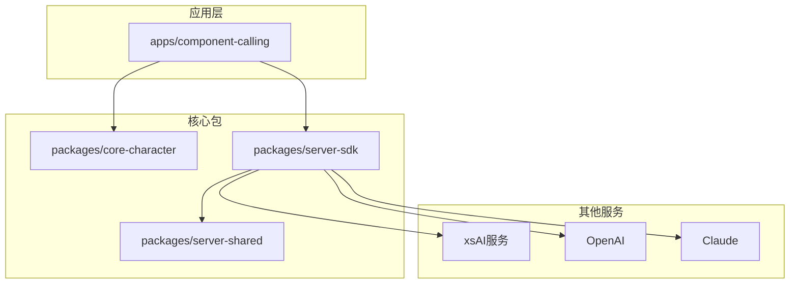
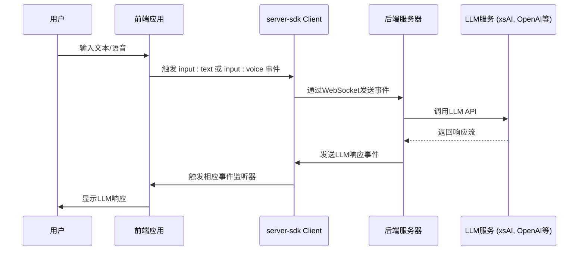
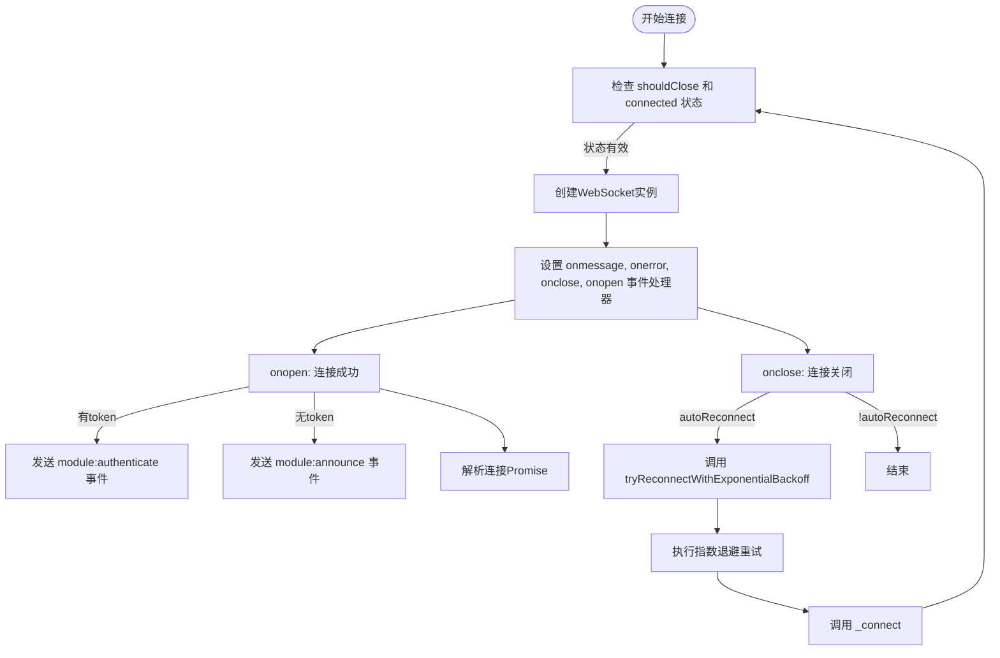
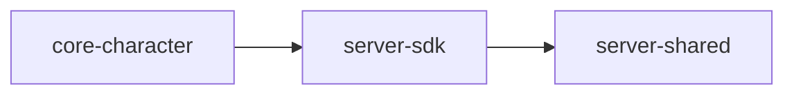

# LLM集成架构

<cite>
**本文档中引用的文件**  
- [index.ts](file://packages/core-character/src/index.ts)
- [client.ts](file://packages/server-sdk/src/client.ts)
- [events.ts](file://packages/server-shared/src/types/websocket/events.ts)
- [xsai-testing.ts](file://apps/component-calling/src/utils/xsai-testing.ts)
</cite>

## 目录
1. [引言](#引言)
2. [项目结构](#项目结构)
3. [核心组件](#核心组件)
4. [架构概述](#架构概述)
5. [详细组件分析](#详细组件分析)
6. [依赖分析](#依赖分析)
7. [性能考虑](#性能考虑)
8. [故障排除指南](#故障排除指南)
9. [结论](#结论)

## 引言
本文档详细阐述了基于WebSocket的LLM集成架构，重点分析`core-character`包作为角色行为逻辑中枢的设计，`server-sdk`中客户端通信机制的实现，以及`server-shared`中定义的跨服务通信类型。文档涵盖从用户输入到LLM响应的完整数据流、多提供商支持的抽象设计，并提供性能优化建议。

## 项目结构
项目采用模块化单体架构，核心LLM集成逻辑分布在`packages`目录下的多个包中。`core-character`负责核心角色逻辑，`server-sdk`提供WebSocket客户端功能，`server-shared`定义共享类型，`apps`目录下的应用（如`component-calling`）使用这些包实现具体功能。



**Diagram sources**
- [index.ts](file://packages/core-character/src/index.ts)
- [client.ts](file://packages/server-sdk/src/client.ts)
- [events.ts](file://packages/server-shared/src/types/websocket/events.ts)

**Section sources**
- [index.ts](file://packages/core-character/src/index.ts)
- [client.ts](file://packages/server-sdk/src/client.ts)
- [events.ts](file://packages/server-shared/src/types/websocket/events.ts)

## 核心组件
`core-character`包是角色行为逻辑的中枢，它依赖`server-sdk`与后端LLM服务进行通信。`server-sdk`通过WebSocket协议与`server-shared`中定义的标准化事件进行交互，实现跨服务通信。

**Section sources**
- [index.ts](file://packages/core-character/src/index.ts)
- [client.ts](file://packages/server-sdk/src/client.ts)
- [events.ts](file://packages/server-shared/src/types/websocket/events.ts)

## 架构概述
系统采用基于WebSocket的事件驱动架构。前端应用通过`server-sdk`的`Client`类建立与后端的持久连接。`server-shared`中的`WebSocketEvents`接口定义了所有可能的通信事件，确保了类型安全。`core-character`利用此架构接收用户输入并发送LLM响应。



**Diagram sources**
- [client.ts](file://packages/server-sdk/src/client.ts)
- [events.ts](file://packages/server-shared/src/types/websocket/events.ts)

## 详细组件分析

### core-character包分析
`core-character`包目前仅包含一个空的`index.ts`文件，表明其作为核心逻辑的入口点，具体的实现可能依赖于其他包（如`server-sdk`）来完成与LLM的交互。其设计意图是作为业务逻辑的聚合层。

**Section sources**
- [index.ts](file://packages/core-character/src/index.ts)

### server-sdk客户端分析
`server-sdk`中的`Client`类是与后端通信的核心。

#### 连接管理
`Client`类实现了健壮的连接管理，包括自动连接、自动重连和指数退避重试机制。`_connect`方法负责建立WebSocket连接，并在`onopen`回调中根据配置进行认证或宣告。



**Diagram sources**
- [client.ts](file://packages/server-sdk/src/client.ts#L100-L243)

#### 请求/响应序列化
客户端通过`send`方法发送消息，该方法将`WebSocketEvent`对象序列化为JSON字符串并通过WebSocket发送。`handleMessage`方法接收原始消息，将其反序列化为`WebSocketEvent`，并根据`type`字段分发给相应的事件监听器。

#### 错误处理
错误处理机制贯穿整个客户端。`onerror`回调捕获连接错误，`handleMessage`捕获消息解析错误。`retryWithExponentialBackoff`方法在发生错误时进行重试，通过指数退避避免对服务器造成过大压力。

**Section sources**
- [client.ts](file://packages/server-sdk/src/client.ts#L25-L243)

### server-shared事件类型分析
`server-shared`包定义了跨服务通信的基石——`WebSocketEvents`接口。

#### WebSocket事件类型
`WebSocketEvents<C>`是一个泛型接口，定义了所有可能的WebSocket事件及其数据结构。关键事件包括：
- `input:text`: 文本输入事件，携带用户输入的文本。
- `input:text:voice`: 语音转文本输入事件。
- `module:announce`: 模块宣告事件，用于客户端向服务器声明其身份和可处理的事件类型。
- `module:authenticated`: 认证结果事件。

```mermaid
classDiagram
class WebSocketBaseEvent {
+type T
+data D
}
class WebSocketEvents {
+'error' : { message : string }
+'module : authenticate' : { token : string }
+'module : authenticated' : { authenticated : boolean }
+'module : announce' : { name : string, possibleEvents : Array<keyof WebSocketEvents> }
+'input : text' : { text : string } & Partial<WithInputSource<'browser' | 'discord'>>
}
class WebSocketEvent {
<<type union>>
Union of all WebSocketBaseEvent types from WebSocketEvents
}
WebSocketEvent --> WebSocketBaseEvent : "extends"
```

**Diagram sources**
- [events.ts](file://packages/server-shared/src/types/websocket/events.ts#L30-L61)

#### 通用类型
`WebSocketBaseEvent<T, D>`是所有事件的基础接口，确保每个事件都有`type`和`data`字段。`WithInputSource`类型用于为输入事件添加来源信息（如浏览器、Discord）。

**Section sources**
- [events.ts](file://packages/server-shared/src/types/websocket/events.ts#L17-L66)

## 依赖分析
各核心包之间存在明确的依赖关系。`core-character`依赖`server-sdk`进行通信，`server-sdk`又依赖`server-shared`来获取事件类型定义。这种分层设计保证了类型安全和代码解耦。



**Diagram sources**
- [index.ts](file://packages/core-character/src/index.ts)
- [client.ts](file://packages/server-sdk/src/client.ts)
- [events.ts](file://packages/server-shared/src/types/websocket/events.ts)

**Section sources**
- [index.ts](file://packages/core-character/src/index.ts)
- [client.ts](file://packages/server-sdk/src/client.ts)
- [events.ts](file://packages/server-shared/src/types/websocket/events.ts)

## 性能考虑
虽然当前代码未直接体现，但基于此架构可提出以下性能优化建议：
- **连接池**: 对于高并发场景，可以实现WebSocket连接池，复用连接以减少握手开销。
- **消息批处理**: 对于非实时性要求极高的消息，可以进行批处理，减少网络往返次数。
- **流式响应**: 利用LLM的流式API（如`xsai-testing.ts`中的`ReadableStream`），实现逐字输出，提升用户体验。

## 故障排除指南
- **连接失败**: 检查`Client`的`url`配置是否正确，确认后端服务是否运行。
- **认证失败**: 确保`token`正确，并检查`module:authenticated`事件的处理逻辑。
- **消息未响应**: 确认`possibleEvents`列表包含应用需要监听的事件类型，并已正确注册`onEvent`监听器。
- **类型错误**: 确保`server-sdk`和`server-shared`的版本兼容，避免因类型定义不一致导致的运行时错误。

**Section sources**
- [client.ts](file://packages/server-sdk/src/client.ts)
- [events.ts](file://packages/server-shared/src/types/websocket/events.ts)

## 结论
该LLM集成架构通过`core-character`、`server-sdk`和`server-shared`三个核心包，构建了一个类型安全、可扩展的通信框架。`server-sdk`的`Client`类提供了可靠的连接管理和事件分发，`server-shared`的`WebSocketEvents`定义了清晰的通信契约。此设计为支持多LLM提供商（如xsAI、OpenAI、Claude）奠定了坚实基础，未来可通过适配器模式轻松集成新的服务。