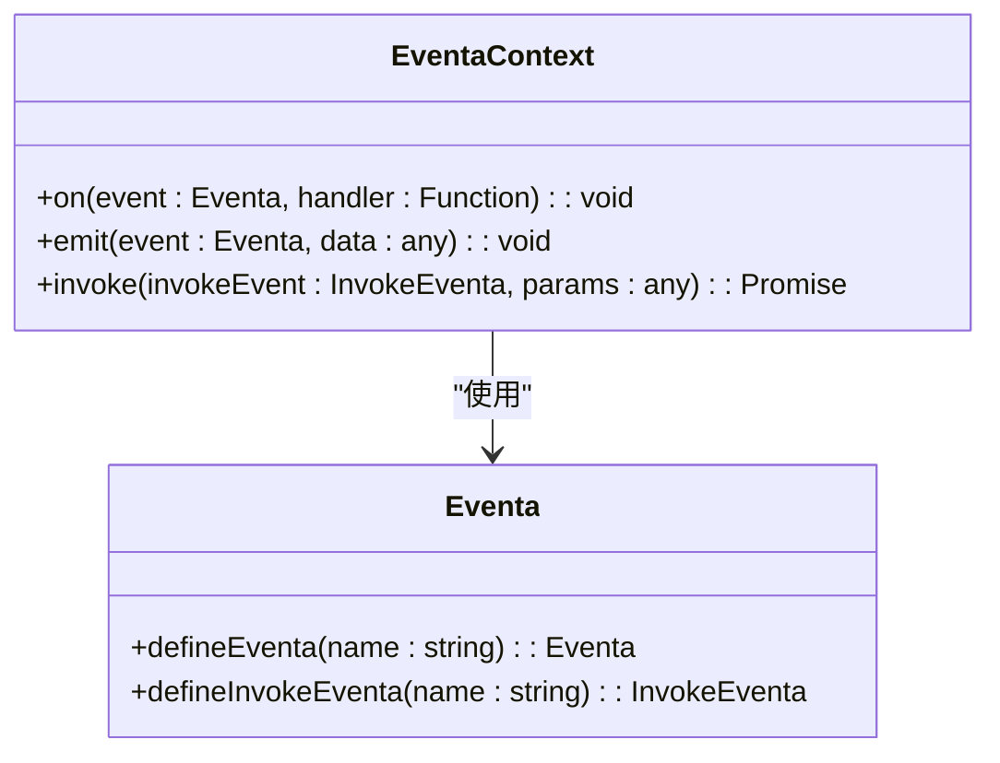
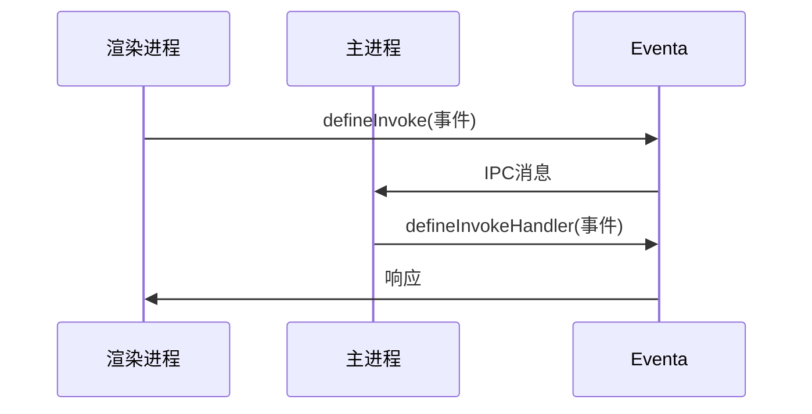
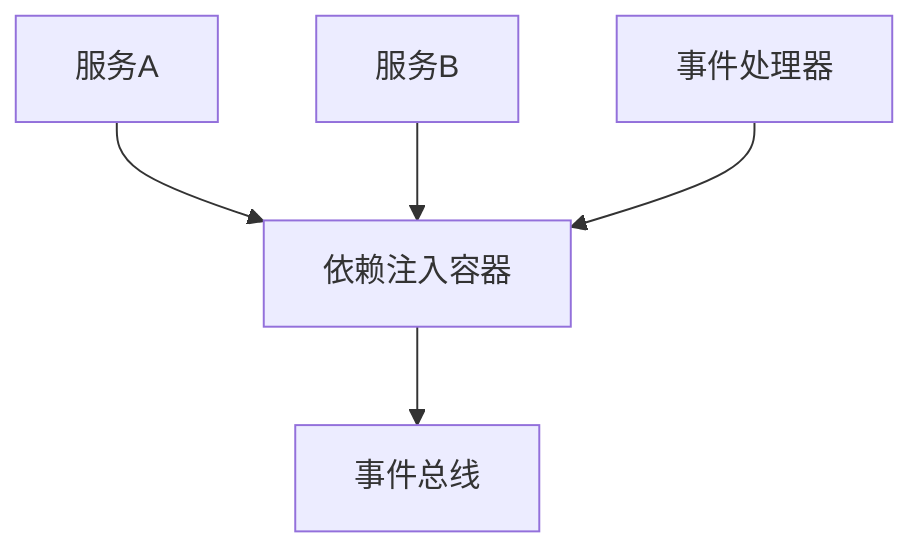

# 事件总线（Eventa）

<cite>
**Referenced Files in This Document**   
- [eventa.ts](file://apps/stage-tamagotchi/src/shared/eventa.ts)
- [index.ts](file://packages/injecta/src/index.ts)
- [index.electron.ts](file://apps/stage-tamagotchi/src/main/windows/main/rpc/index.electron.ts)
- [use-electron-eventa-context/index.ts](file://apps/stage-tamagotchi/src/renderer/composables/electron-vueuse/use-electron-eventa-context/index.ts)
</cite>

## 目录
1. [简介](#简介)
2. [项目结构](#项目结构)
3. [核心组件](#核心组件)
4. [架构概述](#架构概述)
5. [详细组件分析](#详细组件分析)
6. [依赖分析](#依赖分析)
7. [性能考虑](#性能考虑)
8. [故障排除指南](#故障排除指南)
9. [结论](#结论)

## 简介
本文档详细介绍了事件总线（Eventa）的设计与实现，这是一种轻量级的事件发布/订阅模式，旨在解耦应用程序的各个组件。特别地，它在Electron应用中扮演着关键角色，实现了主进程与渲染进程之间的安全通信。文档将深入探讨事件的定义、发布（emit）和订阅（on）机制，并结合代码示例展示其在跨进程通信中的应用。此外，还将阐述injecta包提供的依赖注入机制如何与事件总线协同工作，以实现服务的动态注册和解析，从而构建可扩展的插件系统。

## 项目结构
事件总线（Eventa）的核心实现位于 `apps/stage-tamagotchi/src/shared/eventa.ts` 文件中，该文件定义了应用内使用的各种事件。依赖注入机制由 `packages/injecta` 包提供，其入口文件为 `packages/injecta/src/index.ts`。事件总线的具体使用场景分布在主进程和渲染进程中，例如在 `src/main/windows/main/rpc/index.electron.ts` 中处理主进程的事件，在 `src/renderer/composables/electron-vueuse/use-electron-eventa-context/index.ts` 中处理渲染进程的事件。

**Section sources**
- [eventa.ts](file://apps/stage-tamagotchi/src/shared/eventa.ts)
- [index.ts](file://packages/injecta/src/index.ts)

## 核心组件
事件总线（Eventa）的核心功能是通过定义和使用事件来实现组件间的解耦。在 `eventa.ts` 文件中，通过 `defineEventa` 和 `defineInvokeEventa` 函数定义了多种事件，如 `electronOpenMainDevtools` 和 `captionIsFollowingWindowChanged`。这些事件可以在不同的进程中被触发和监听，从而实现跨进程通信。依赖注入机制则通过 `injecta` 包提供的 `provide` 和 `invoke` 函数实现，允许服务的动态注册和解析。

**Section sources**
- [eventa.ts](file://apps/stage-tamagotchi/src/shared/eventa.ts#L1-L12)
- [index.ts](file://packages/injecta/src/index.ts#L1-L52)

## 架构概述
事件总线（Eventa）的架构设计旨在提供一个灵活且可扩展的通信机制。通过定义事件，不同的组件可以独立地发布和订阅消息，而无需直接引用彼此。这种模式不仅提高了代码的模块化程度，还增强了系统的可维护性和可测试性。依赖注入机制进一步增强了这一架构，使得服务的创建和管理更加灵活，支持复杂的依赖关系和生命周期管理。

```mermaid
graph TB
subgraph "主进程"
A[事件处理器] --> B[IPC主通道]
end
subgraph "渲染进程"
C[Vue组件] --> D[IPC渲染通道]
end
B < --> |事件消息| D
A --> |调用| E[服务]
C --> |调用| F[服务]
G[依赖注入容器] --> A
G --> C
```

**Diagram sources**
- [eventa.ts](file://apps/stage-tamagotchi/src/shared/eventa.ts)
- [index.electron.ts](file://apps/stage-tamagotchi/src/main/windows/main/rpc/index.electron.ts)
- [use-electron-eventa-context/index.ts](file://apps/stage-tamagotchi/src/renderer/composables/electron-vueuse/use-electron-eventa-context/index.ts)

## 详细组件分析

### 事件定义与使用
事件总线（Eventa）通过 `defineEventa` 和 `defineInvokeEventa` 函数定义事件。前者用于定义普通的事件，后者用于定义可被调用的事件。这些事件在 `eventa.ts` 文件中被导出，供其他模块使用。



**Diagram sources**
- [eventa.ts](file://apps/stage-tamagotchi/src/shared/eventa.ts#L1-L12)

**Section sources**
- [eventa.ts](file://apps/stage-tamagotchi/src/shared/eventa.ts#L1-L12)

### 跨进程通信
在Electron应用中，事件总线（Eventa）通过IPC（进程间通信）机制实现主进程与渲染进程之间的通信。主进程中通过 `createContext` 创建上下文，并使用 `defineInvokeHandler` 注册事件处理器。渲染进程中通过 `useElectronEventaContext` 获取上下文，并使用 `defineInvoke` 发起调用。



**Diagram sources**
- [index.electron.ts](file://apps/stage-tamagotchi/src/main/windows/main/rpc/index.electron.ts#L1-L23)
- [use-electron-eventa-context/index.ts](file://apps/stage-tamagotchi/src/renderer/composables/electron-vueuse/use-electron-eventa-context/index.ts#L1-L14)

**Section sources**
- [index.electron.ts](file://apps/stage-tamagotchi/src/main/windows/main/rpc/index.electron.ts#L1-L23)
- [use-electron-eventa-context/index.ts](file://apps/stage-tamagotchi/src/renderer/composables/electron-vueuse/use-electron-eventa-context/index.ts#L1-L14)

## 依赖分析
事件总线（Eventa）与依赖注入机制（injecta）紧密协作，共同构建了一个灵活的系统架构。`injecta` 包提供了全局和作用域内的依赖注入功能，允许服务的动态注册和解析。这种组合模式使得服务的创建和管理更加灵活，支持复杂的依赖关系和生命周期管理。



**Diagram sources**
- [index.ts](file://packages/injecta/src/index.ts#L1-L52)

**Section sources**
- [index.ts](file://packages/injecta/src/index.ts#L1-L52)

## 性能考虑
事件总线（Eventa）的设计考虑了性能因素，通过异步调用和事件队列机制确保了系统的响应性和稳定性。依赖注入机制通过拓扑排序解决了服务间的依赖关系，避免了循环依赖问题，保证了服务的正确初始化顺序。

## 故障排除指南
在使用事件总线（Eventa）时，常见的问题包括事件未正确触发或监听、跨进程通信失败等。建议检查事件名称是否一致、上下文是否正确创建以及依赖注入配置是否正确。

**Section sources**
- [eventa.ts](file://apps/stage-tamagotchi/src/shared/eventa.ts)
- [index.ts](file://packages/injecta/src/index.ts)

## 结论
事件总线（Eventa）与依赖注入机制（injecta）的结合为构建可扩展的插件系统提供了一个强大的基础。通过解耦组件间的直接依赖，提高了代码的模块化程度和可维护性。未来的工作可以进一步优化事件处理的性能，增加更多的调试工具和支持更多的通信模式。