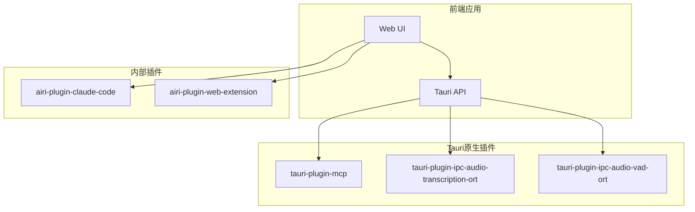
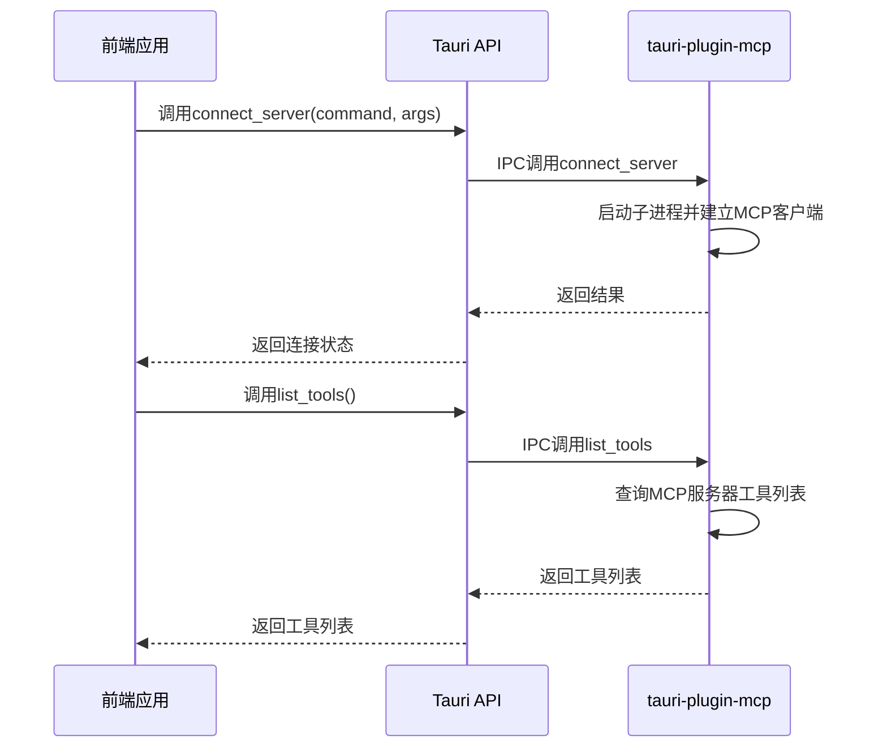
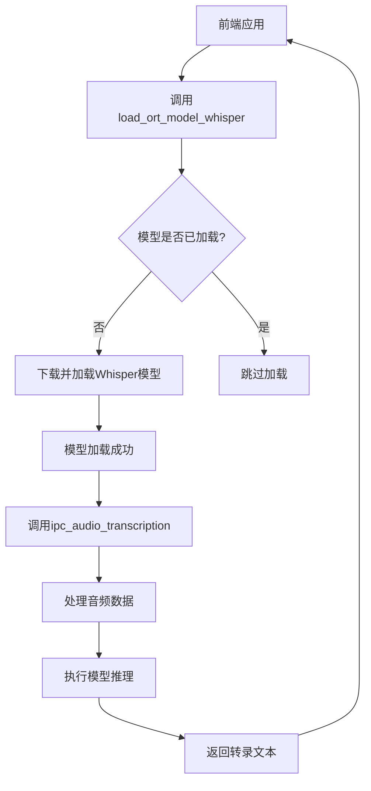
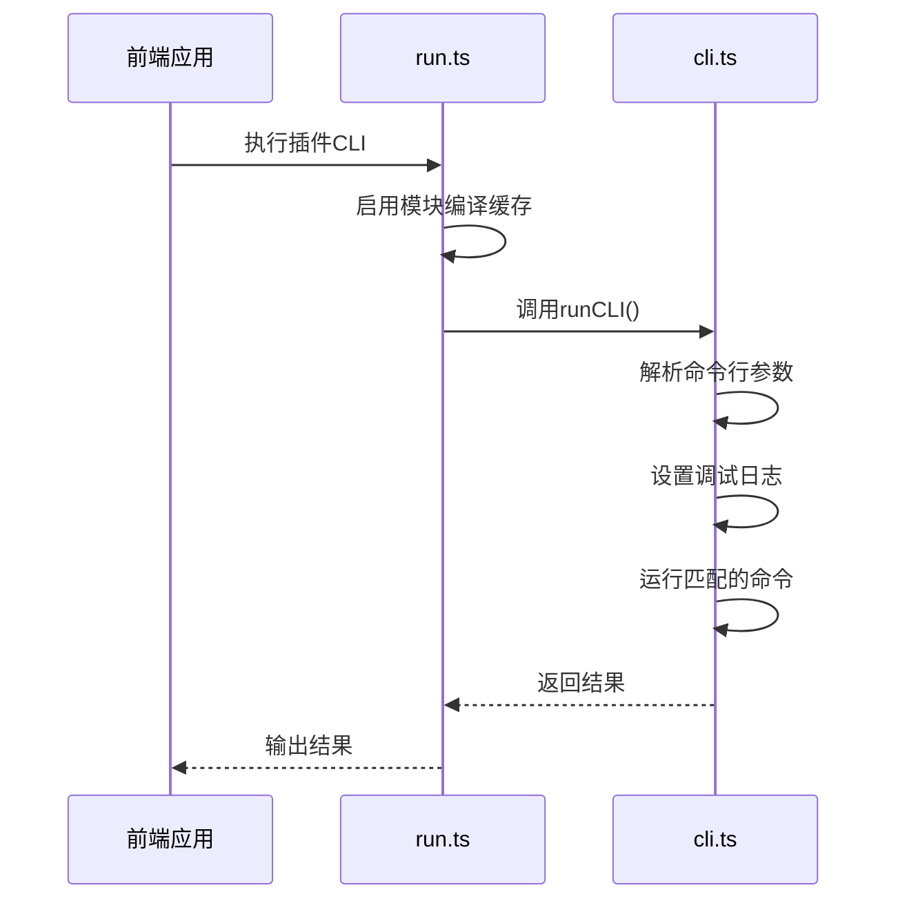

# 插件化设计

<cite>
**本文档中引用的文件**
- [tauri-plugin-mcp/Cargo.toml](file://crates/tauri-plugin-mcp/Cargo.toml)
- [tauri-plugin-mcp/src/lib.rs](file://crates/tauri-plugin-mcp/src/lib.rs)
- [tauri-plugin-ipc-audio-transcription-ort/Cargo.toml](file://crates/tauri-plugin-ipc-audio-transcription-ort/Cargo.toml)
- [tauri-plugin-ipc-audio-transcription-ort/src/lib.rs](file://crates/tauri-plugin-ipc-audio-transcription-ort/src/lib.rs)
- [tauri-plugin-ipc-audio-vad-ort/Cargo.toml](file://crates/tauri-plugin-ipc-audio-vad-ort/Cargo.toml)
- [tauri-plugin-ipc-audio-vad-ort/src/lib.rs](file://crates/tauri-plugin-ipc-audio-vad-ort/src/lib.rs)
- [airi-plugin-claude-code/package.json](file://plugins/airi-plugin-claude-code/package.json)
- [airi-plugin-claude-code/src/run.ts](file://plugins/airi-plugin-claude-code/src/run.ts)
- [airi-plugin-claude-code/src/cli.ts](file://plugins/airi-plugin-claude-code/src/cli.ts)
- [tauri-plugin-mcp/src/index.ts](file://packages/tauri-plugin-mcp/src/index.ts)
</cite>

## 目录
1. [引言](#引言)
2. [项目结构](#项目结构)
3. [核心组件](#核心组件)
4. [架构概述](#架构概述)
5. [详细组件分析](#详细组件分析)
6. [依赖分析](#依赖分析)
7. [性能考虑](#性能考虑)
8. [故障排除指南](#故障排除指南)
9. [结论](#结论)

## 引言
本文档详细阐述了Airi项目中采用的分层插件架构设计。该架构通过结合基于Rust的Tauri原生插件和基于TypeScript的内部插件，实现了原生性能与开发便捷性的平衡。文档将深入分析两种插件机制的实现原理、通信方式和开发流程。

## 项目结构
项目采用多包仓库（monorepo）结构，主要分为`crates`（Rust原生插件）、`plugins`（TypeScript插件）和`packages`（共享库）三个核心目录。`crates`目录包含使用Rust编写的Tauri原生插件，提供高性能的系统级功能；`plugins`目录包含使用TypeScript编写的内部插件，通过CLI脚本注入功能；`packages`目录则包含跨插件共享的工具和SDK。

**Section sources**
- [crates](file://crates)
- [plugins](file://plugins)
- [packages](file://packages)

## 核心组件
系统的核心组件包括Tauri原生插件（如`tauri-plugin-mcp`、`tauri-plugin-ipc-audio-transcription-ort`）和内部插件（如`airi-plugin-claude-code`）。原生插件通过IPC与前端通信，提供安全的系统级访问；内部插件则通过CLI机制扩展应用功能，具有更高的开发灵活性。

**Section sources**
- [crates/tauri-plugin-mcp](file://crates/tauri-plugin-mcp)
- [plugins/airi-plugin-claude-code](file://plugins/airi-plugin-claude-code)

## 架构概述
系统采用分层插件架构，前端应用通过Tauri框架与Rust原生插件进行IPC通信，同时通过CLI机制调用TypeScript内部插件。这种设计使得计算密集型任务（如音频转录）可以在原生层高效执行，而业务逻辑扩展则可以在应用层灵活实现。



**Diagram sources**
- [crates/tauri-plugin-mcp](file://crates/tauri-plugin-mcp)
- [crates/tauri-plugin-ipc-audio-transcription-ort](file://crates/tauri-plugin-ipc-audio-transcription-ort)
- [plugins/airi-plugin-claude-code](file://plugins/airi-plugin-claude-code)

## 详细组件分析

### Tauri原生插件机制分析
Tauri原生插件通过Rust实现，提供高性能的系统级功能。以`tauri-plugin-mcp`为例，其工作流程如下：在`Cargo.toml`中定义插件元数据和依赖；在`lib.rs`中使用`#[tauri::command]`宏定义可被前端调用的命令；通过Tauri的IPC机制暴露这些命令给前端应用。



**Diagram sources**
- [crates/tauri-plugin-mcp/Cargo.toml](file://crates/tauri-plugin-mcp/Cargo.toml)
- [crates/tauri-plugin-mcp/src/lib.rs](file://crates/tauri-plugin-mcp/src/lib.rs)

#### 音频处理原生插件分析
音频相关的原生插件（如`tauri-plugin-ipc-audio-transcription-ort`）展示了更复杂的原生功能集成。这些插件利用ONNX Runtime在本地执行机器学习模型推理，实现音频转录和语音活动检测（VAD）功能。



**Diagram sources**
- [crates/tauri-plugin-ipc-audio-transcription-ort/Cargo.toml](file://crates/tauri-plugin-ipc-audio-transcription-ort/Cargo.toml)
- [crates/tauri-plugin-ipc-audio-transcription-ort/src/lib.rs](file://crates/tauri-plugin-ipc-audio-transcription-ort/src/lib.rs)

### 内部插件机制分析
内部插件（如`airi-plugin-claude-code`）采用TypeScript编写，通过CLI脚本机制注入功能。这种设计提供了更高的开发灵活性和更快的迭代速度。



**Diagram sources**
- [plugins/airi-plugin-claude-code/src/run.ts](file://plugins/airi-plugin-claude-code/src/run.ts)
- [plugins/airi-plugin-claude-code/src/cli.ts](file://plugins/airi-plugin-claude-code/src/cli.ts)

## 依赖分析
项目依赖关系清晰地分为三个层次：Rust原生插件依赖Tauri框架和系统库；TypeScript插件依赖Node.js运行时和项目共享包；前端应用同时依赖Tauri API和内部插件提供的功能。

```mermaid
graph TD
A[Tauri框架] --> B[tauri-plugin-mcp]
A --> C[tauri-plugin-ipc-audio-transcription-ort]
A --> D[tauri-plugin-ipc-audio-vad-ort]
E[Node.js] --> F[airi-plugin-claude-code]
E --> G[airi-plugin-web-extension]
H[@proj-airi/server-sdk] --> F
I[@guiiai/logg] --> F
B --> J[rmcp]
B --> K[tokio]
C --> L[ort]
C --> M[symphonia]
D --> L
D --> M
```

**Diagram sources**
- [crates/tauri-plugin-mcp/Cargo.toml](file://crates/tauri-plugin-mcp/Cargo.toml)
- [crates/tauri-plugin-ipc-audio-transcription-ort/Cargo.toml](file://crates/tauri-plugin-ipc-audio-transcription-ort/Cargo.toml)
- [crates/tauri-plugin-ipc-audio-vad-ort/Cargo.toml](file://crates/tauri-plugin-ipc-audio-vad-ort/Cargo.toml)
- [plugins/airi-plugin-claude-code/package.json](file://plugins/airi-plugin-claude-code/package.json)

## 性能考虑
分层插件架构在性能方面具有显著优势。原生插件在Rust中执行，能够充分利用系统资源，特别适合计算密集型任务如音频处理和机器学习推理。内部插件虽然运行在Node.js环境中，但通过CLI机制调用，避免了持续的进程间通信开销，适合处理业务逻辑和I/O密集型任务。

## 故障排除指南
当插件功能异常时，应首先检查插件的依赖是否正确安装，然后查看日志输出。对于原生插件，可通过Tauri的日志系统查看Rust端的调试信息；对于内部插件，可通过`--debug`参数启用详细的日志输出，帮助定位问题。

**Section sources**
- [crates/tauri-plugin-mcp/src/lib.rs](file://crates/tauri-plugin-mcp/src/lib.rs)
- [plugins/airi-plugin-claude-code/src/cli.ts](file://plugins/airi-plugin-claude-code/src/cli.ts)

## 结论
Airi项目的分层插件架构成功地平衡了性能与开发效率。通过Tauri原生插件处理高性能需求，通过TypeScript内部插件实现灵活的功能扩展，为项目提供了强大的可扩展性和维护性。这种设计模式为类似的桌面应用开发提供了有价值的参考。