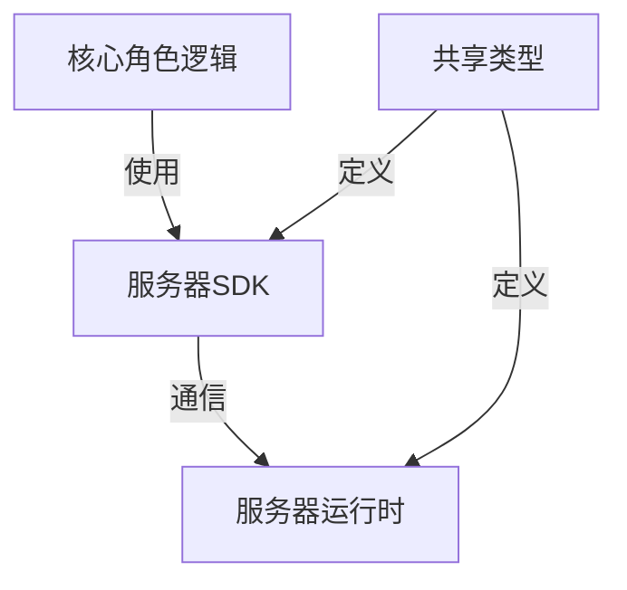
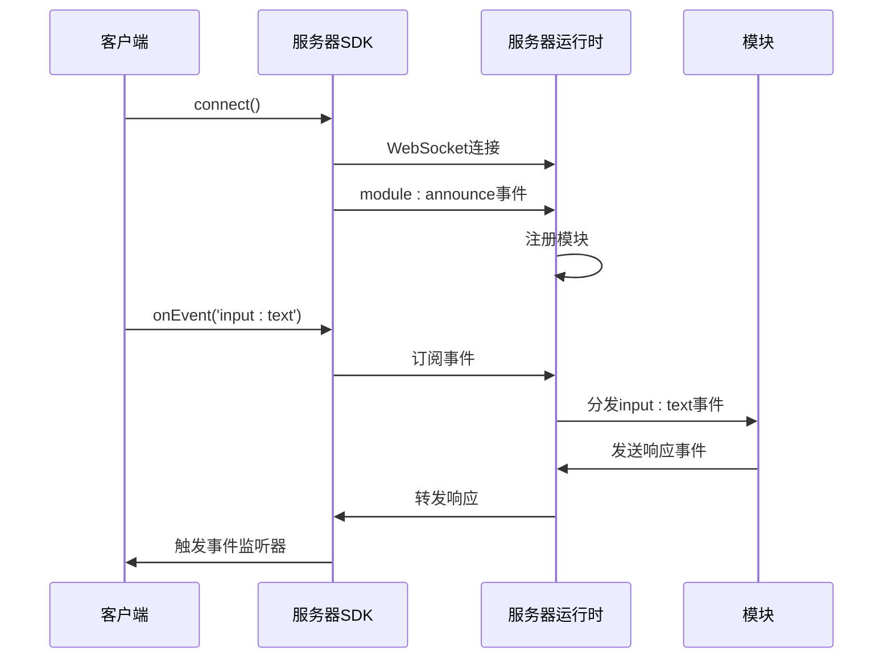
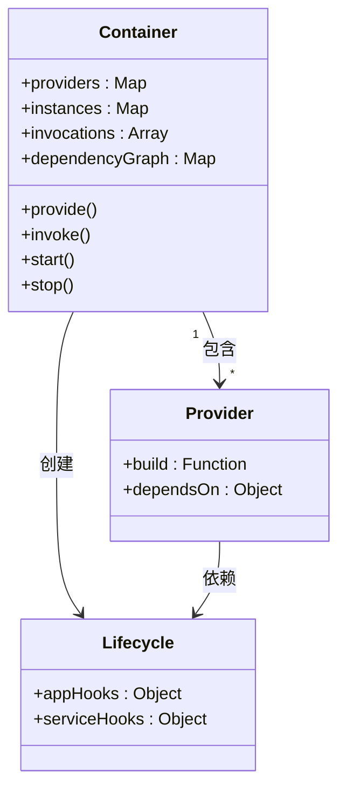
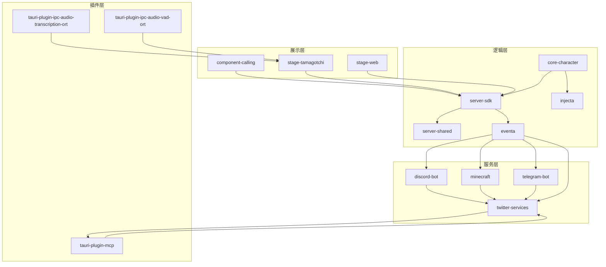

# 核心系统架构

<cite>
**本文档中引用的文件**
- [core-character](file://packages/core-character/src/index.ts)
- [server-sdk](file://packages/server-sdk/src/client.ts)
- [server-shared](file://packages/server-shared/src/types/websocket/index.ts)
- [injecta](file://packages/injecta/src/index.ts)
- [eventa.ts](file://apps/stage-tamagotchi/src/shared/eventa.ts)
- [client.ts](file://packages/server-sdk/src/client.ts)
- [index.ts](file://packages/server-runtime/src/index.ts)
- [websocket/events.ts](file://packages/server-shared/src/types/websocket/events.ts)
</cite>

## 目录
1. [项目结构](#项目结构)
2. [核心角色逻辑与服务器SDK协同](#核心角色逻辑与服务器sdk协同)
3. [事件总线（eventa）设计模式](#事件总线eventa设计模式)
4. [依赖注入（injecta）设计模式](#依赖注入injecta设计模式)
5. [LLM集成与状态管理](#llm集成与状态管理)
6. [微前端与插件化设计](#微前端与插件化设计)
7. [架构图：组件间数据流与调用关系](#架构图组件间数据流与调用关系)

## 项目结构

本项目采用分层架构设计，包含展示层（apps）、逻辑层（packages）、服务层（services）和插件层（crates）。展示层包含多个前端应用，如component-calling、stage-tamagotchi和stage-web。逻辑层包含核心业务逻辑和共享功能，如core-character、server-sdk和server-shared。服务层包含后端服务，如discord-bot、minecraft和telegram-bot。插件层包含Rust编写的Tauri插件，如tauri-plugin-ipc-audio-transcription-ort和tauri-plugin-mcp。

**Section sources**
- [apps](file://apps)
- [packages](file://packages)
- [services](file://services)
- [crates](file://crates)

## 核心角色逻辑与服务器SDK协同

核心角色逻辑（core-character）负责Airi角色的管道编排，包括分段、情感分析、延迟处理和可选的TTS。它通过服务器SDK（server-sdk）与服务器运行时（server-runtime）进行通信。服务器SDK提供客户端类，用于建立WebSocket连接、发送和接收事件。核心角色逻辑通过订阅输入事件（如input:text和input:voice）来接收用户输入，并通过发送输出事件来响应。

服务器SDK和服务器运行时使用共享类型（server-shared）定义WebSocket事件和消息格式。这确保了客户端和服务端之间的类型安全通信。核心角色逻辑通过服务器SDK连接到服务器运行时，并注册其支持的事件类型。

**Diagram sources**
- [core-character](file://packages/core-character/src/index.ts)
- [server-sdk](file://packages/server-sdk/src/client.ts)
- [server-shared](file://packages/server-shared/src/types/websocket/index.ts)
- [index.ts](file://packages/server-runtime/src/index.ts)

**Section sources**
- [core-character](file://packages/core-character/src/index.ts)
- [server-sdk](file://packages/server-sdk/src/client.ts)
- [server-shared](file://packages/server-shared/src/types/websocket/index.ts)

## 事件总线（eventa）设计模式

事件总线（eventa）是系统中组件间通信的核心机制。它基于WebSocket实现，允许不同模块通过发布-订阅模式交换消息。服务器运行时维护一个WebSocket连接池，并将收到的消息路由到相应的事件处理器。客户端通过服务器SDK连接到事件总线，并可以监听特定类型的事件。

事件总线支持多种事件类型，包括：
- `module:authenticate`：模块认证
- `module:announce`：模块宣告
- `input:text`：文本输入
- `input:voice`：语音输入
- `error`：错误消息

这种设计模式实现了组件间的松耦合，使得新模块可以轻松地集成到系统中，而无需修改现有代码。

**Diagram sources**
- [client.ts](file://packages/server-sdk/src/client.ts)
- [index.ts](file://packages/server-runtime/src/index.ts)
- [websocket/events.ts](file://packages/server-shared/src/types/websocket/events.ts)

**Section sources**
- [client.ts](file://packages/server-sdk/src/client.ts)
- [index.ts](file://packages/server-runtime/src/index.ts)
- [eventa.ts](file://apps/stage-tamagotchi/src/shared/eventa.ts)

## 依赖注入（injecta）设计模式

依赖注入（injecta）是系统中管理服务依赖关系的机制。它允许组件声明其依赖项，由容器负责实例化和注入这些依赖。这种设计模式提高了代码的可测试性和可维护性，因为组件不再需要知道如何创建其依赖项。

injecta支持全局和作用域两种注入模式。全局模式适用于整个应用程序共享的服务，而作用域模式适用于特定上下文中的服务。它还支持生命周期管理，允许在应用程序启动和停止时执行特定操作。

**Diagram sources**
- [injecta](file://packages/injecta/src/index.ts)
- [scoped.ts](file://packages/injecta/src/scoped.ts)
- [global.ts](file://packages/injecta/src/global.ts)

**Section sources**
- [injecta](file://packages/injecta/src/index.ts)
- [scoped.ts](file://packages/injecta/src/scoped.ts)

## LLM集成与状态管理

LLM集成通过MCP（Model Context Protocol）适配器实现，允许系统与不同的LLM服务进行交互。twitter-services中的MCP适配器展示了如何使用MCP SDK与Twitter服务集成。状态管理通过Vuex-like存储实现，如stage-ui中的stores模块。这些存储管理应用程序的状态，如用户界面配置、角色卡片和语音设置。

LLM集成和状态管理通过事件总线进行通信。例如，当用户输入文本时，输入模块发送input:text事件，LLM模块监听该事件，处理输入并生成响应，然后通过事件总线发送响应事件。

**Section sources**
- [mcp-adapter.ts](file://services/twitter-services/src/adapters/mcp-adapter.ts)
- [airi-card.ts](file://packages/stage-ui/src/stores/modules/airi-card.ts)
- [llm.ts](file://packages/stage-ui/src/stores/llm.ts)

## 微前端与插件化设计

微前端设计通过将应用程序拆分为独立的模块实现，每个模块可以独立开发、测试和部署。stage-ui和stage-pages等包提供了可重用的UI组件和页面。插件化设计通过crates目录中的Rust插件实现，这些插件扩展了Tauri应用程序的功能，如音频转录、语音活动检测和窗口路由。

这种设计模式的优势包括：
- **可维护性**：每个模块或插件可以独立更新，不影响其他部分
- **可扩展性**：新功能可以通过添加新模块或插件轻松集成
- **技术多样性**：不同的模块可以使用不同的技术栈
- **团队协作**：不同的团队可以并行开发不同的模块

**Section sources**
- [stage-ui](file://packages/stage-ui)
- [stage-pages](file://packages/stage-pages)
- [crates](file://crates)

## 架构图：组件间数据流与调用关系

**Diagram sources**
- [apps](file://apps)
- [packages](file://packages)
- [services](file://services)
- [crates](file://crates)

**Section sources**
- [apps](file://apps)
- [packages](file://packages)
- [services](file://services)
- [crates](file://crates)