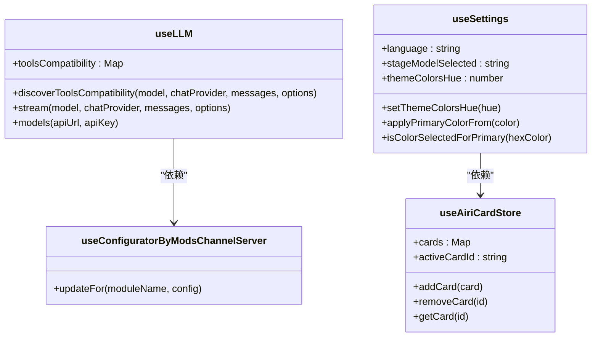

# 状态管理

<cite>
**本文档引用的文件**  
- [llm.ts](file://packages/stage-ui/src/stores/llm.ts)
- [configurator.ts](file://packages/stage-ui/src/stores/configurator.ts)
- [settings.ts](file://packages/stage-ui/src/stores/settings.ts)
- [airi-card.ts](file://packages/stage-ui/src/stores/modules/airi-card.ts)
- [use-versioned-local-storage/index.ts](file://apps/stage-tamagotchi/src/renderer/composables/vueuse/use-versioned-local-storage/index.ts)
</cite>

## 目录
1. [引言](#引言)
2. [核心状态管理方案](#核心状态管理方案)
3. [核心Store分析](#核心store分析)
4. [Store设计模式](#store设计模式)
5. [响应式数据绑定](#响应式数据绑定)
6. [新Store创建指南](#新store创建指南)
7. [复杂状态变更处理](#复杂状态变更处理)
8. [状态持久化实现](#状态持久化实现)
9. [结论](#结论)

## 引言
本文档全面介绍基于Pinia的全局状态管理方案，重点分析stage-ui中定义的各类store（如llm、configurator、settings）。这些store在Web和桌面应用间共享状态，并与核心角色逻辑同步，为应用程序提供统一的状态管理机制。

## 核心状态管理方案
系统采用Pinia作为状态管理库，通过定义多个store来管理不同类型的状态。store分布在packages/stage-ui/src/stores目录下，包括核心功能store和模块化store。这种设计实现了状态的模块化组织和类型安全，支持在不同应用间共享状态。

## 核心Store分析

### LLM Store
llm store负责管理语言模型相关的状态和操作，包括模型发现、流式处理和工具兼容性检测。store通过ref定义响应式状态，并提供models、stream和discoverToolsCompatibility等方法来处理LLM相关操作。

**Store来源**
- [llm.ts](file://packages/stage-ui/src/stores/llm.ts#L126-L168)

### Configurator Store
configurator store用于配置模块，通过WebSocket与服务器通信。store定义了updateFor方法，用于发送配置更新消息，实现UI与后端服务的配置同步。

**Store来源**
- [configurator.ts](file://packages/stage-ui/src/stores/configurator.ts#L4-L20)

### Settings Store
settings store管理应用程序的各种设置，包括语言、模型选择、主题颜色等。store使用useLocalStorage实现状态持久化，并提供多种方法来更新和获取设置值。

**Store来源**
- [settings.ts](file://packages/stage-ui/src/stores/settings.ts#L37-L183)

## Store设计模式
Store采用标准的Pinia设计模式，将状态分为state、getters和actions三部分。state使用ref或useLocalStorage定义响应式状态；getters使用computed定义派生状态；actions定义修改状态的方法。这种划分使得状态管理更加清晰和可维护。

## 响应式数据绑定
通过Pinia的storeToRefs方法，可以将store中的响应式状态绑定到组件中。当store中的状态发生变化时，绑定的组件会自动更新。这种机制实现了高效的响应式数据绑定，确保UI与状态保持同步。

## 新Store创建指南
创建新store时，应遵循模块化组织原则，将相关功能的状态集中管理。使用defineStore定义store，确保类型安全。对于需要持久化的状态，使用useLocalStorage；对于临时状态，使用ref。store应提供清晰的API，包括获取、更新和删除状态的方法。

## 复杂状态变更处理
对于复杂的状态变更，store提供了异步操作支持。通过在actions中使用async/await，可以处理异步操作并更新状态。store还支持错误处理和状态回滚，确保状态变更的可靠性和一致性。

## 状态持久化实现
系统使用use-versioned-local-storage实现状态持久化，支持版本控制和数据迁移。当存储数据的版本不匹配时，可以执行相应的处理策略，如重置为默认值或保持现有值。这种机制确保了状态持久化的可靠性和兼容性。

**图表来源**
- [llm.ts](file://packages/stage-ui/src/stores/llm.ts)
- [configurator.ts](file://packages/stage-ui/src/stores/configurator.ts)
- [settings.ts](file://packages/stage-ui/src/stores/settings.ts)
- [airi-card.ts](file://packages/stage-ui/src/stores/modules/airi-card.ts)

## 结论
基于Pinia的全局状态管理方案为应用程序提供了强大而灵活的状态管理能力。通过合理的store设计和状态持久化机制，实现了状态的高效管理和可靠存储，为应用程序的稳定运行提供了有力支持。