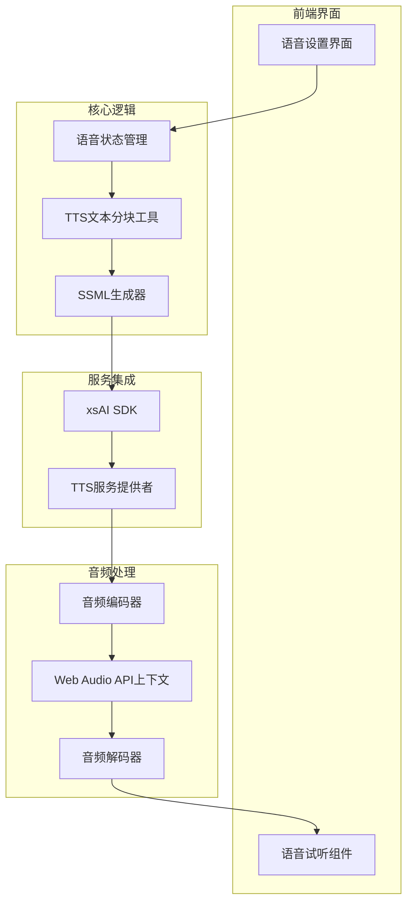
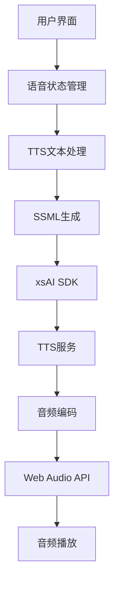
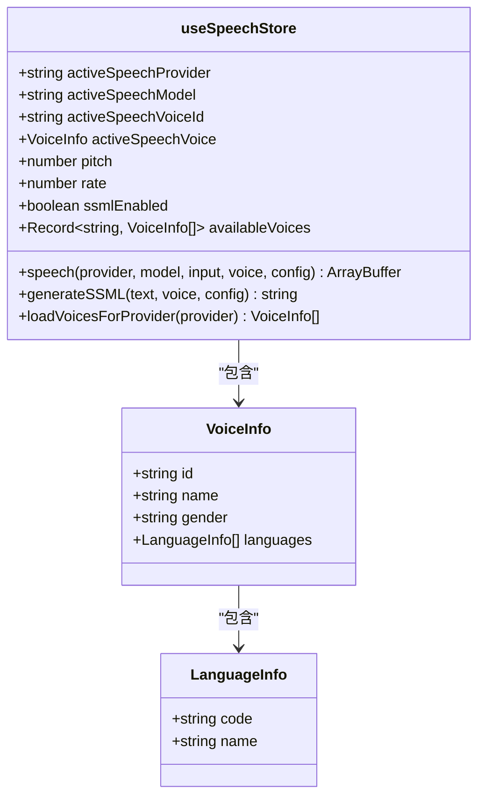
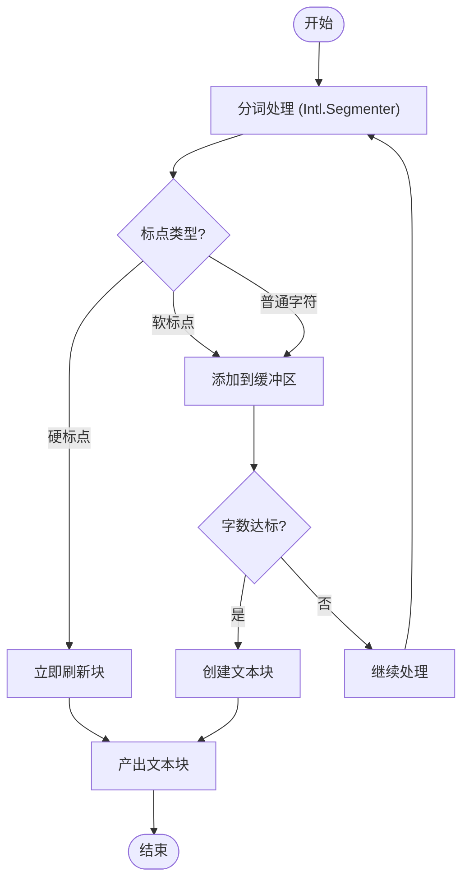
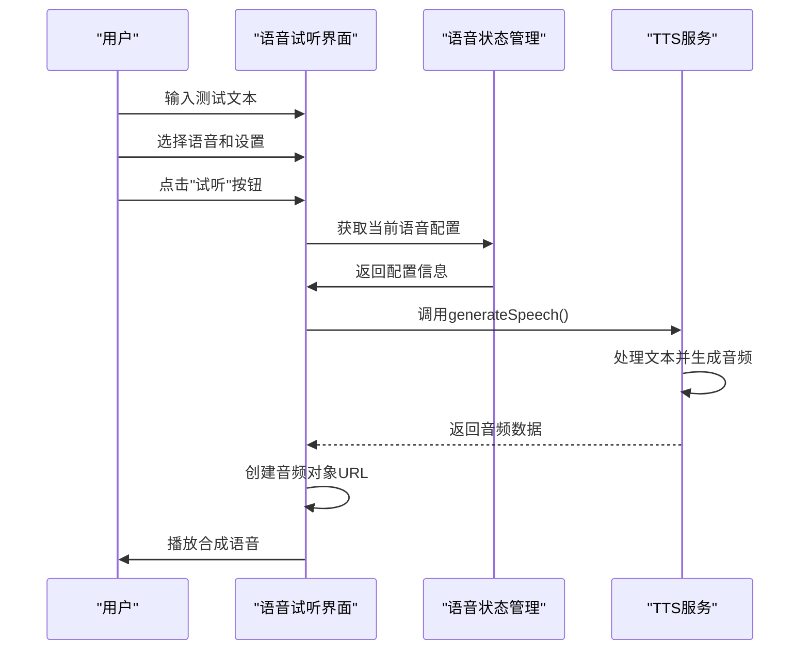
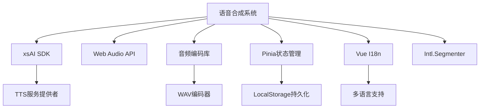

# 语音合成（TTS）流程

<cite>
**本文档引用的文件**  
- [speech.ts](file://packages/stage-ui/src/stores/modules/speech.ts)
- [tts.ts](file://packages/stage-ui/src/utils/tts.ts)
- [SpeechPlayground.vue](file://packages/stage-ui/src/components/scenarios/providers/SpeechPlayground.vue)
- [SpeechStreamingPlayground.vue](file://packages/stage-ui/src/components/scenarios/providers/SpeechStreamingPlayground.vue)
- [tts.ts](file://services/discord-bot/src/pipelines/tts.ts)
- [index.ts](file://packages/audio/src/index.ts)
- [wav.ts](file://packages/audio/src/encoding/wav.ts)
</cite>

## 目录
1. [简介](#简介)
2. [项目结构](#项目结构)
3. [核心组件](#核心组件)
4. [架构概述](#架构概述)
5. [详细组件分析](#详细组件分析)
6. [依赖分析](#依赖分析)
7. [性能考虑](#性能考虑)
8. [故障排除指南](#故障排除指南)
9. [结论](#结论)

## 简介
本文档系统性地阐述了语音合成（TTS）的处理流程，涵盖从LLM生成文本到通过xsAI SDK调用TTS服务、音频流的接收与播放、高级语音控制功能以及性能优化策略。文档详细说明了系统如何集成多种语音模型（如ElevenLabs、Microsoft Speech等），并描述了Web Audio API在实时音频播放中的缓冲管理机制。

## 项目结构
语音合成功能主要分布在多个模块中，包括核心TTS逻辑、音频编码处理、用户界面组件和后端服务管道。系统采用模块化设计，将语音生成、音频处理和播放控制分离，确保高内聚低耦合。

**图表来源**  
- [speech.ts](file://packages/stage-ui/src/stores/modules/speech.ts#L13-L241)
- [tts.ts](file://packages/stage-ui/src/utils/tts.ts#L0-L214)

**章节来源**  
- [speech.ts](file://packages/stage-ui/src/stores/modules/speech.ts#L1-L243)
- [tts.ts](file://packages/stage-ui/src/utils/tts.ts#L0-L215)

## 核心组件
系统的核心组件包括语音状态管理(store)、TTS文本分块处理器、SSML生成器和音频播放控制器。这些组件协同工作，实现从文本到语音的完整转换流程。

**章节来源**  
- [speech.ts](file://packages/stage-ui/src/stores/modules/speech.ts#L13-L241)
- [tts.ts](file://packages/stage-ui/src/utils/tts.ts#L0-L214)

## 架构概述
系统采用分层架构，从上至下分为用户界面层、业务逻辑层、服务集成层和音频处理层。各层之间通过明确定义的接口进行通信，确保系统的可维护性和可扩展性。

**图表来源**  
- [speech.ts](file://packages/stage-ui/src/stores/modules/speech.ts#L13-L241)
- [tts.ts](file://packages/stage-ui/src/utils/tts.ts#L0-L214)

## 详细组件分析

### 语音状态管理分析
语音状态管理组件负责维护所有与TTS相关的状态，包括当前选中的语音提供者、模型、音色、语速、音调等参数。

**图表来源**  
- [speech.ts](file://packages/stage-ui/src/stores/modules/speech.ts#L13-L241)

**章节来源**  
- [speech.ts](file://packages/stage-ui/src/stores/modules/speech.ts#L13-L241)

### TTS文本处理分析
TTS文本处理组件负责将输入文本分割成适合语音合成的块，支持基于标点符号、字数限制和特殊指令的分块策略。

**图表来源**  
- [tts.ts](file://packages/stage-ui/src/utils/tts.ts#L0-L214)

**章节来源**  
- [tts.ts](file://packages/stage-ui/src/utils/tts.ts#L0-L214)

### 语音试听功能分析
语音试听组件提供了一个交互式界面，允许用户测试不同语音设置下的合成效果，包括SSML标记的预览和实时播放控制。

**图表来源**  
- [SpeechPlayground.vue](file://packages/stage-ui/src/components/scenarios/providers/SpeechPlayground.vue#L0-L219)
- [speech.ts](file://packages/stage-ui/src/stores/modules/speech.ts#L13-L241)

**章节来源**  
- [SpeechPlayground.vue](file://packages/stage-ui/src/components/scenarios/providers/SpeechPlayground.vue#L0-L219)

## 依赖分析
系统依赖于多个外部库和内部模块，形成了复杂的依赖网络。主要依赖包括xsAI SDK、Web Audio API、音频编码库和国际化支持。

**图表来源**  
- [package.json](file://apps/stage-tamagotchi/package.json#L29-L63)
- [package.json](file://packages/stage-ui/package.json#L71-L108)

**章节来源**  
- [speech.ts](file://packages/stage-ui/src/stores/modules/speech.ts#L1-L243)

## 性能考虑
系统在设计时充分考虑了性能优化，包括音频缓存策略、流式处理、内存管理和延迟优化。通过分块处理和队列机制，实现了低延迟的实时语音合成。

**章节来源**  
- [tts.ts](file://packages/stage-ui/src/utils/tts.ts#L0-L214)
- [SpeechStreamingPlayground.vue](file://packages/stage-ui/src/components/scenarios/providers/SpeechStreamingPlayground.vue#L0-L173)

## 故障排除指南
当遇到TTS功能异常时，可按照以下步骤进行排查：检查API密钥配置、验证语音提供者状态、确认音频上下文初始化、检查网络连接和查看控制台错误日志。

**章节来源**  
- [speech.ts](file://packages/stage-ui/src/stores/modules/speech.ts#L13-L241)
- [tts.ts](file://packages/stage-ui/src/utils/tts.ts#L0-L214)

## 结论
本文档全面阐述了语音合成系统的架构和实现细节。系统通过模块化设计和分层架构，实现了灵活、可扩展的TTS功能。未来可进一步优化音频流处理性能，增加更多语音情感控制选项，并完善错误处理机制。