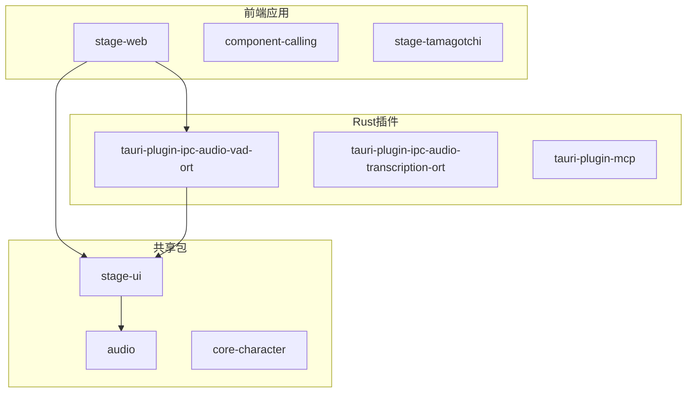
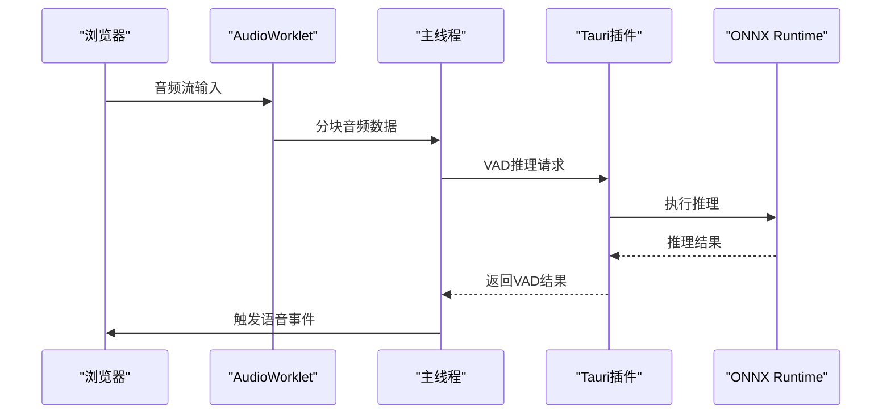
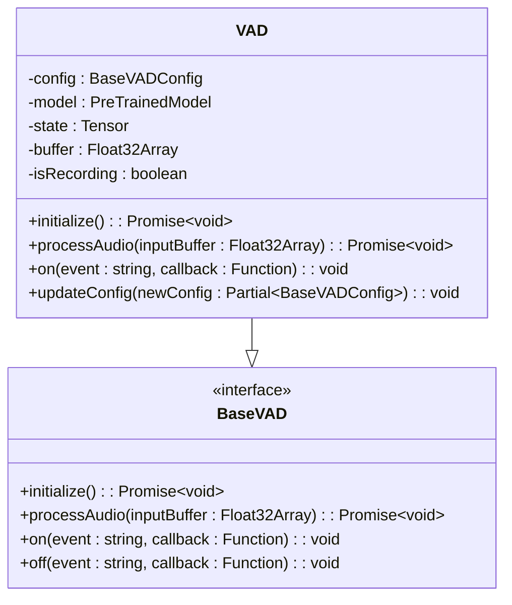
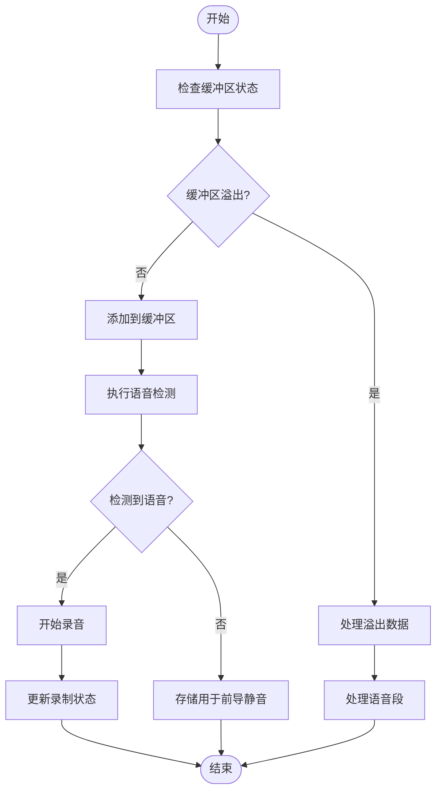
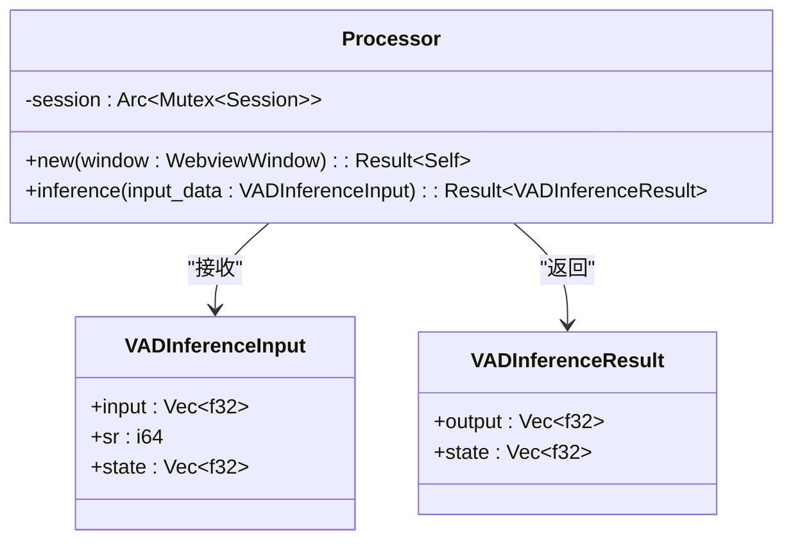
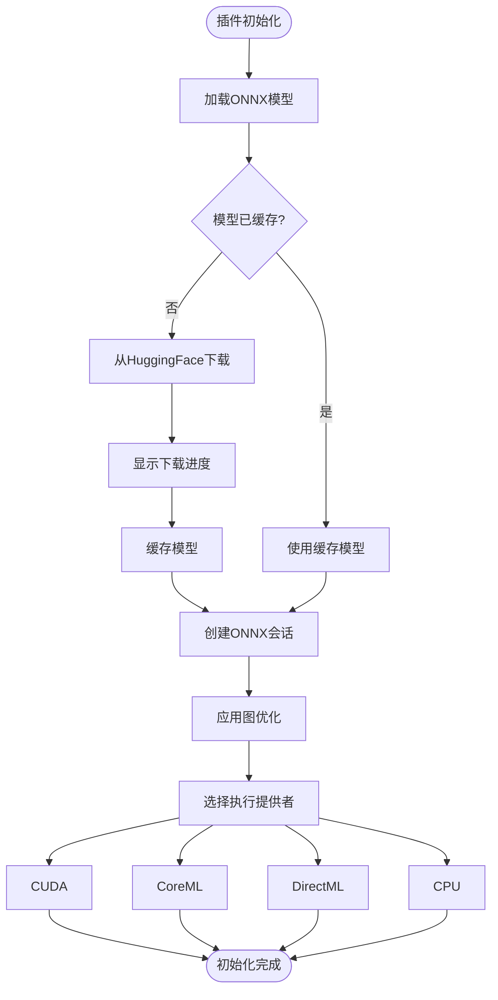

# 语音活动检测（VAD）实现

<cite>
**本文档引用的文件**
- [vad.ts](file://apps/stage-web/src/workers/vad/vad.ts)
- [process.worklet.ts](file://apps/stage-web/src/workers/vad/process.worklet.ts)
- [lib.rs](file://crates/tauri-plugin-ipc-audio-vad-ort/src/lib.rs)
- [mod.rs](file://crates/tauri-plugin-ipc-audio-vad-ort/src/models/silero_vad/mod.rs)
- [huggingface.rs](file://crates/tauri-plugin-ipc-audio-vad-ort/src/helpers/huggingface.rs)
- [manager.ts](file://apps/stage-web/src/workers/vad/manager.ts)
- [micvad.ts](file://packages/stage-ui/src/composables/micvad.ts)
- [Cargo.toml](file://crates/tauri-plugin-ipc-audio-vad-ort/Cargo.toml)
- [audio-context/processor.worklet.ts](file://packages/audio/src/audio-context/processor.worklet.ts)
- [vad.ts](file://packages/stage-ui/src/libs/audio/vad.ts)
</cite>

## 目录
1. [简介](#简介)
2. [项目结构](#项目结构)
3. [核心组件](#核心组件)
4. [架构概述](#架构概述)
5. [详细组件分析](#详细组件分析)
6. [依赖分析](#依赖分析)
7. [性能考量](#性能考量)
8. [故障排除指南](#故障排除指南)
9. [结论](#结论)

## 简介
本文档深入解析语音活动检测（VAD）的实现机制，涵盖基于Web Audio API的前端实时音频处理与基于Rust和ONNX Runtime的高性能本地推理。文档详细说明了@ricky0123/vad-web库的集成方式、Tauri插件tauri-plugin-ipc-audio-vad-ort的实现原理，并提供VAD灵敏度调节、误触发处理和性能监控的最佳实践。

## 项目结构
本项目采用多包单体仓库结构，主要分为前端应用、Rust插件和共享包三大部分。前端应用`stage-web`通过Web Workers和AudioWorklet实现浏览器端VAD，而`tauri-plugin-ipc-audio-vad-ort`插件则在本地利用ONNX Runtime执行高性能推理。



**图示来源**
- [stage-web](file://apps/stage-web)
- [crates](file://crates)
- [packages](file://packages)

**本节来源**
- [apps](file://apps)
- [crates](file://crates)
- [packages](file://packages)

## 核心组件
系统核心由两个主要组件构成：基于JavaScript的Web Audio VAD处理器和基于Rust的ONNX Runtime VAD插件。前者在浏览器主线程外实时处理音频流，后者利用本地硬件加速进行高性能推理。

**本节来源**
- [vad.ts](file://apps/stage-web/src/workers/vad/vad.ts#L8-L267)
- [lib.rs](file://crates/tauri-plugin-ipc-audio-vad-ort/src/lib.rs#L1-L86)

## 架构概述
系统采用前后端协同的混合架构，前端负责实时音频采集和初步处理，后端执行高精度VAD推理。架构设计充分利用了Web Audio API的低延迟特性和ONNX Runtime的跨平台高性能推理能力。



**图示来源**
- [process.worklet.ts](file://apps/stage-web/src/workers/vad/process.worklet.ts#L1-L52)
- [lib.rs](file://crates/tauri-plugin-ipc-audio-vad-ort/src/lib.rs#L1-L86)

## 详细组件分析

### Web Audio VAD处理器分析
Web Audio VAD处理器利用AudioWorklet在浏览器音频渲染线程中实时处理音频流，避免阻塞主线程。

#### 类图


**图示来源**
- [vad.ts](file://apps/stage-web/src/workers/vad/vad.ts#L8-L267)
- [vad.ts](file://packages/stage-ui/src/libs/audio/vad.ts#L0-L17)

#### 处理流程


**图示来源**
- [vad.ts](file://apps/stage-web/src/workers/vad/vad.ts#L150-L250)

**本节来源**
- [vad.ts](file://apps/stage-web/src/workers/vad/vad.ts#L8-L267)
- [process.worklet.ts](file://apps/stage-web/src/workers/vad/process.worklet.ts#L1-L52)

### Tauri VAD插件分析
Tauri插件利用Rust和ONNX Runtime实现高性能本地VAD推理，支持GPU加速和模型缓存。

#### 类图


**图示来源**
- [mod.rs](file://crates/tauri-plugin-ipc-audio-vad-ort/src/models/silero_vad/mod.rs#L1-L149)

#### 初始化流程


**图示来源**
- [lib.rs](file://crates/tauri-plugin-ipc-audio-vad-ort/src/lib.rs#L1-L86)
- [mod.rs](file://crates/tauri-plugin-ipc-audio-vad-ort/src/models/silero_vad/mod.rs#L1-L149)

**本节来源**
- [lib.rs](file://crates/tauri-plugin-ipc-audio-vad-ort/src/lib.rs#L1-L86)
- [mod.rs](file://crates/tauri-plugin-ipc-audio-vad-ort/src/models/silero_vad/mod.rs#L1-L149)
- [huggingface.rs](file://crates/tauri-plugin-ipc-audio-vad-ort/src/helpers/huggingface.rs#L1-L133)

## 依赖分析
系统依赖关系复杂但层次分明，前端依赖@huggingface/transformers进行JavaScript推理，后端依赖onnxruntime进行本地推理，两者共享相同的Silero VAD模型。

```mermaid
graph TD
A[@proj-airi/stage-ui] --> B[@huggingface/transformers]
A --> C[tauri-plugin-ipc-audio-vad-ort]
C --> D[onnxruntime]
C --> E[hf-hub]
C --> F[rubato]
D --> G[CUDA]
D --> H[CoreML]
D --> I[DirectML]
B --> J[WebGL]
J --> K[GPU]
```

**图示来源**
- [Cargo.toml](file://crates/tauri-plugin-ipc-audio-vad-ort/Cargo.toml#L1-L50)
- [package.json](file://apps/stage-web/package.json)

**本节来源**
- [Cargo.toml](file://crates/tauri-plugin-ipc-audio-vad-ort/Cargo.toml#L1-L50)
- [package.json](file://apps/stage-web/package.json)

## 性能考量
系统在性能优化方面采取了多项策略，包括Web Worker多线程处理、AudioWorklet低延迟音频处理、ONNX Runtime图优化和硬件加速执行提供者。

- **前端优化**：使用AudioWorklet在音频渲染线程处理，避免主线程阻塞
- **后端优化**：ONNX Runtime应用Level3图优化，启用CUDA/DirectML/CoreML硬件加速
- **内存管理**：循环缓冲区设计减少内存分配，状态保持避免重复计算
- **网络优化**：HuggingFace模型缓存，支持断点续传和进度报告

## 故障排除指南
常见问题及解决方案：

1. **模型加载失败**：检查网络连接，确认HuggingFace访问正常
2. **音频延迟过高**：调整AudioContext采样率和缓冲区大小
3. **GPU加速未启用**：确认系统安装相应驱动（CUDA/DirectML）
4. **误触发频繁**：调整`speechThreshold`和`exitThreshold`参数
5. **内存泄漏**：确保正确调用`dispose()`方法释放资源

**本节来源**
- [vad.ts](file://apps/stage-web/src/workers/vad/vad.ts#L50-L100)
- [lib.rs](file://crates/tauri-plugin-ipc-audio-vad-ort/src/lib.rs#L40-L60)

## 结论
本文档详细解析了语音活动检测系统的实现机制，展示了前后端协同工作的完整流程。系统通过Web Audio API实现低延迟前端处理，利用ONNX Runtime提供高性能本地推理，形成了一个高效、可靠的VAD解决方案。建议在实际部署中根据具体硬件环境调整执行提供者和优化参数，以获得最佳性能表现。