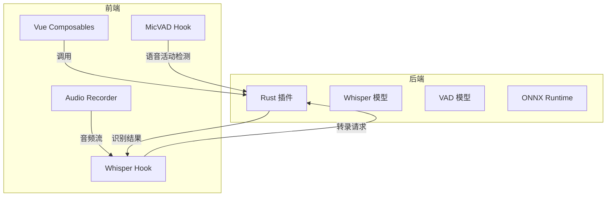
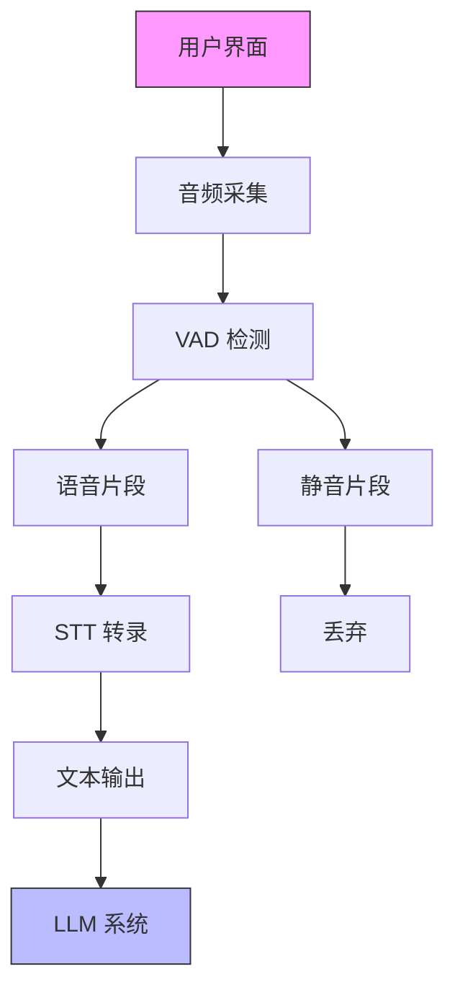
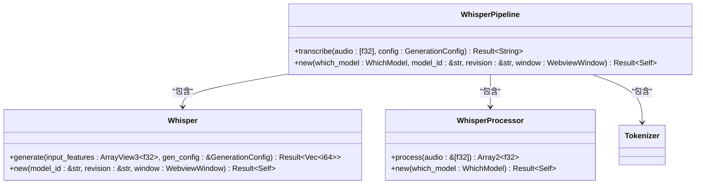
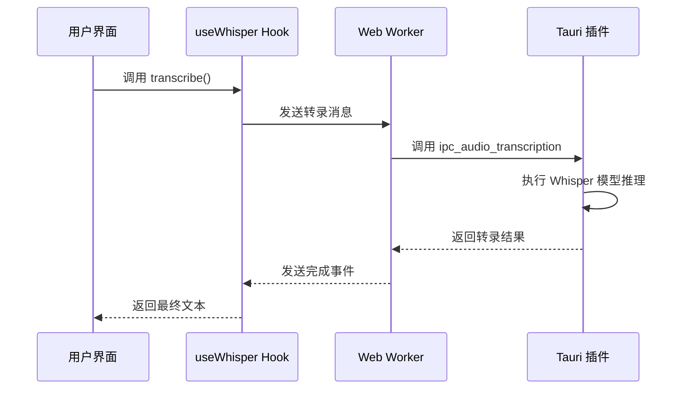
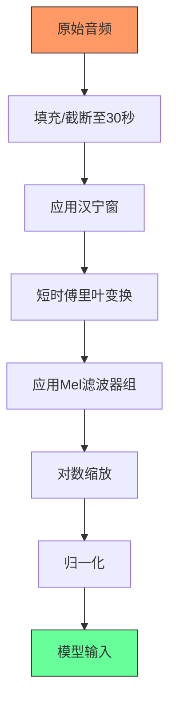
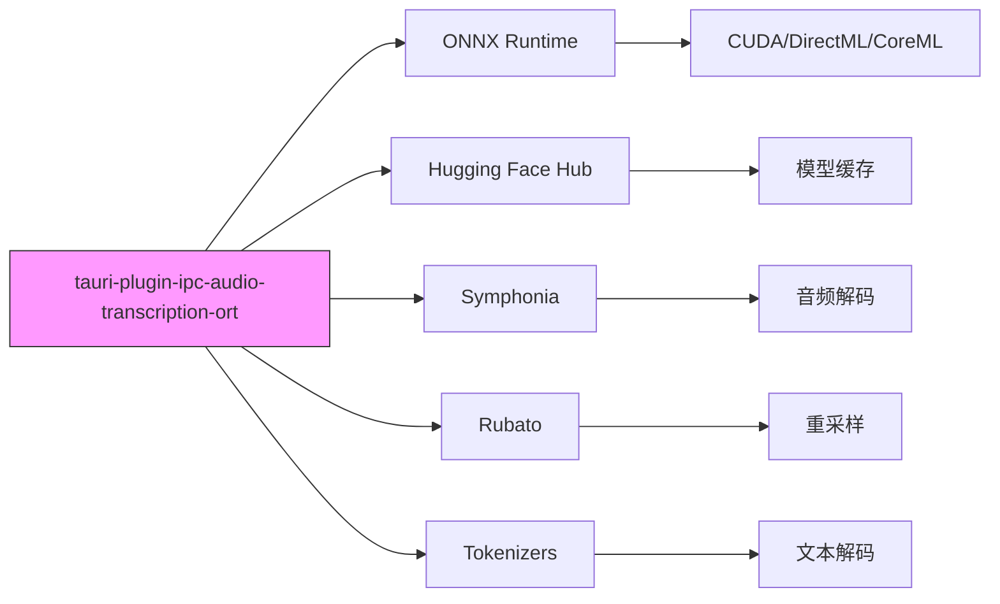

# 语音识别（STT）集成

<cite>
**本文档引用的文件**
- [lib.rs](file://crates/tauri-plugin-ipc-audio-transcription-ort/src/lib.rs)
- [whisper.rs](file://crates/tauri-plugin-ipc-audio-transcription-ort/src/models/whisper/whisper.rs)
- [whisper_processor.rs](file://crates/tauri-plugin-ipc-audio-transcription-ort/src/models/whisper/whisper_processor.rs)
- [huggingface.rs](file://crates/tauri-plugin-ipc-audio-transcription-ort/src/helpers/huggingface.rs)
- [whisper.ts](file://packages/stage-ui/src/composables/whisper.ts)
- [micvad.ts](file://packages/stage-ui/src/composables/micvad.ts)
- [audio-record.ts](file://apps/stage-web/src/composables/audio-record.ts)
- [Cargo.toml](file://crates/tauri-plugin-ipc-audio-transcription-ort/Cargo.toml)
</cite>

## 目录
1. [简介](#简介)
2. [项目结构](#项目结构)
3. [核心组件](#核心组件)
4. [架构概述](#架构概述)
5. [详细组件分析](#详细组件分析)
6. [依赖分析](#依赖分析)
7. [性能考虑](#性能考虑)
8. [故障排除指南](#故障排除指南)
9. [结论](#结论)

## 简介
本文档全面描述了语音识别（STT）系统的集成方案，重点介绍 `tauri-plugin-ipc-audio-transcription-ort` 插件如何在 Rust 层调用 Hugging Face 的 Whisper 模型进行语音转录。文档涵盖模型加载、音频预处理、流式识别的实现细节，以及前端如何通过 xsAI SDK 与 STT 服务交互。同时包括多语言支持、识别准确率优化、错误重试机制以及与 VAD 模块的协同工作模式。

## 项目结构
语音识别系统由 Rust 后端插件和前端 Vue 组件共同构成，通过 Tauri IPC 机制进行通信。后端插件负责模型加载和音频处理，前端组件负责音频采集和结果展示。

**Diagram sources**
- [lib.rs](file://crates/tauri-plugin-ipc-audio-transcription-ort/src/lib.rs)
- [whisper.ts](file://packages/stage-ui/src/composables/whisper.ts)

**Section sources**
- [lib.rs](file://crates/tauri-plugin-ipc-audio-transcription-ort/src/lib.rs)
- [whisper.ts](file://packages/stage-ui/src/composables/whisper.ts)

## 核心组件
系统核心组件包括 Rust 层的 Whisper 模型处理器和前端的语音识别 Hook。Rust 插件使用 ONNX Runtime 加载和执行 Whisper 模型，前端通过 Tauri IPC 调用后端服务。

**Section sources**
- [lib.rs](file://crates/tauri-plugin-ipc-audio-transcription-ort/src/lib.rs)
- [whisper.ts](file://packages/stage-ui/src/composables/whisper.ts)

## 架构概述
系统采用分层架构，前端负责用户交互和音频采集，后端负责模型推理和音频处理。通过 Tauri IPC 机制实现前后端通信，确保高性能和安全性。

**Diagram sources**
- [lib.rs](file://crates/tauri-plugin-ipc-audio-transcription-ort/src/lib.rs)
- [micvad.ts](file://packages/stage-ui/src/composables/micvad.ts)

## 详细组件分析

### Whisper 模型处理器分析
Whisper 模型处理器负责加载 Hugging Face 的 Whisper 模型并执行语音转录任务。处理器支持多种模型尺寸，包括 tiny、base、small、medium 和 large-v3。

**Diagram sources**
- [whisper.rs](file://crates/tauri-plugin-ipc-audio-transcription-ort/src/models/whisper/whisper.rs)
- [whisper_processor.rs](file://crates/tauri-plugin-ipc-audio-transcription-ort/src/models/whisper/whisper_processor.rs)

**Section sources**
- [whisper.rs](file://crates/tauri-plugin-ipc-audio-transcription-ort/src/models/whisper/whisper.rs)
- [whisper_processor.rs](file://crates/tauri-plugin-ipc-audio-transcription-ort/src/models/whisper/whisper_processor.rs)

### 前端语音识别分析
前端使用 Vue Composition API 实现语音识别功能，通过 Web Worker 处理模型加载和转录任务，避免阻塞主线程。

**Diagram sources**
- [whisper.ts](file://packages/stage-ui/src/composables/whisper.ts)
- [lib.rs](file://crates/tauri-plugin-ipc-audio-transcription-ort/src/lib.rs)

**Section sources**
- [whisper.ts](file://packages/stage-ui/src/composables/whisper.ts)
- [lib.rs](file://crates/tauri-plugin-ipc-audio-transcription-ort/src/lib.rs)

### 音频预处理流程分析
音频预处理流程包括音频采样、STFT 变换、Mel 滤波和对数缩放等步骤，确保输入符合 Whisper 模型的要求。

**Diagram sources**
- [whisper_processor.rs](file://crates/tauri-plugin-ipc-audio-transcription-ort/src/models/whisper/whisper_processor.rs)

**Section sources**
- [whisper_processor.rs](file://crates/tauri-plugin-ipc-audio-transcription-ort/src/models/whisper/whisper_processor.rs)

## 依赖分析
系统依赖多个关键库和框架，包括 ONNX Runtime 用于模型推理，Hugging Face Hub 用于模型下载，Symphonia 用于音频解码。

**Diagram sources**
- [Cargo.toml](file://crates/tauri-plugin-ipc-audio-transcription-ort/Cargo.toml)

**Section sources**
- [Cargo.toml](file://crates/tauri-plugin-ipc-audio-transcription-ort/Cargo.toml)

## 性能考虑
系统在设计时充分考虑了性能优化，包括使用 ONNX Runtime 的图优化、并行执行和硬件加速。模型加载时启用 Level3 优化级别，并根据平台选择合适的执行提供程序。

- **GPU 加速**: 在 Windows 上使用 DirectML，在 macOS 上使用 CoreML，在 Linux 上使用 CUDA
- **内存优化**: 使用 ndarray 库进行高效的数值计算
- **流式处理**: 支持流式语音识别，减少延迟
- **缓存机制**: 模型文件下载后缓存，避免重复下载

## 故障排除指南
常见问题及解决方案：

1. **模型加载失败**: 检查网络连接，确保可以访问 Hugging Face Hub
2. **识别准确率低**: 尝试使用更大的模型（如 medium 或 large-v3）
3. **音频输入问题**: 确认麦克风权限已授予，音频设备正常工作
4. **性能问题**: 检查是否启用了硬件加速，GPU 驱动是否最新

**Section sources**
- [huggingface.rs](file://crates/tauri-plugin-ipc-audio-transcription-ort/src/helpers/huggingface.rs)
- [lib.rs](file://crates/tauri-plugin-ipc-audio-transcription-ort/src/lib.rs)

## 结论
本文档详细描述了语音识别系统的集成方案，涵盖了从模型加载到结果输出的完整链路。系统通过 Rust 后端插件和前端 Vue 组件的协同工作，实现了高性能、低延迟的语音转录功能。未来可进一步优化模型量化和剪枝，提升推理速度。