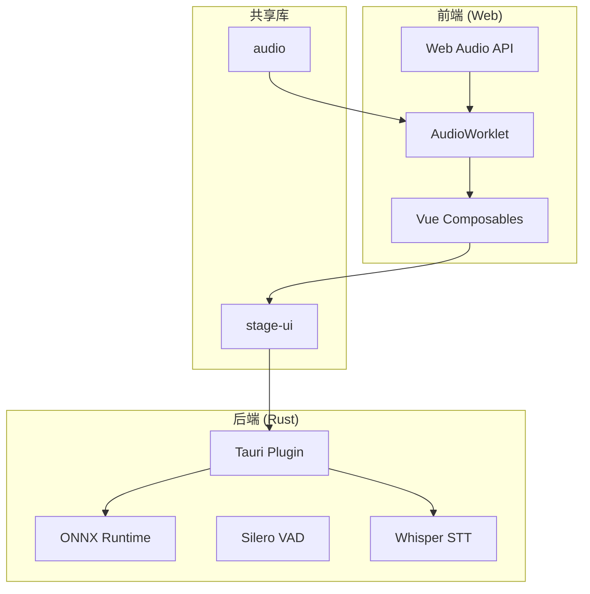
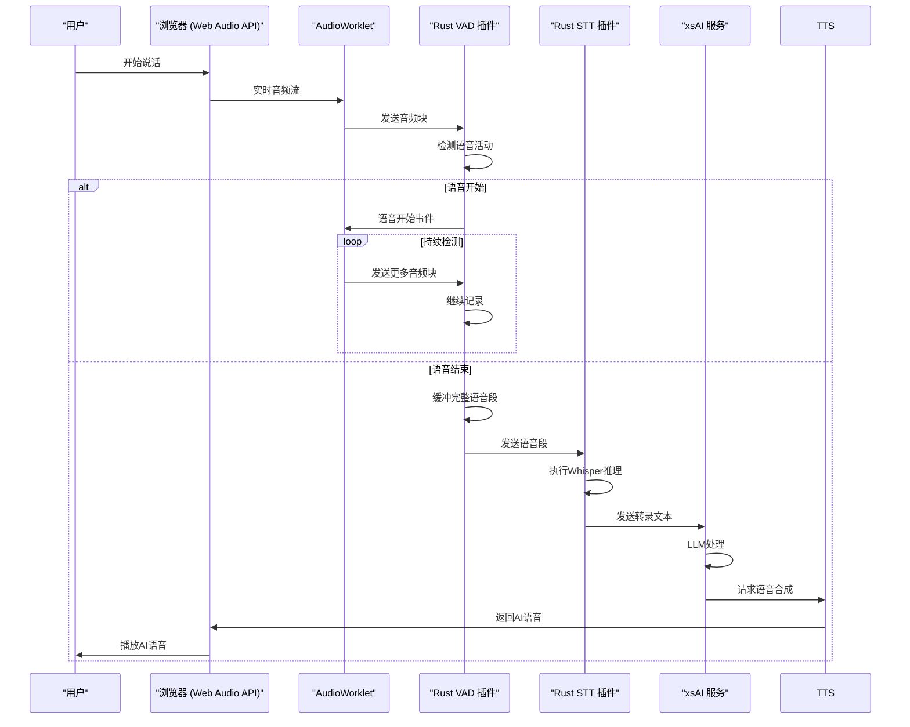
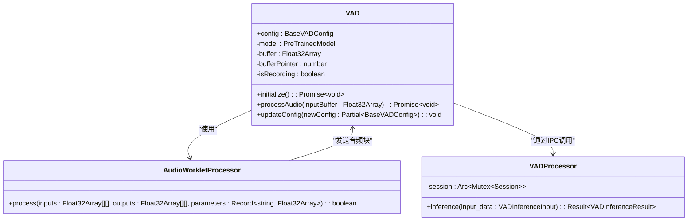
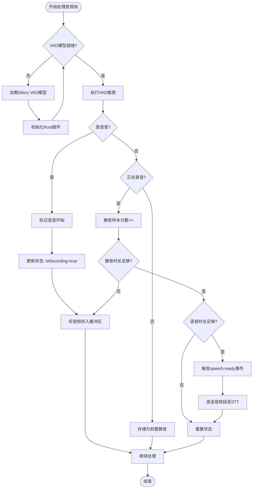
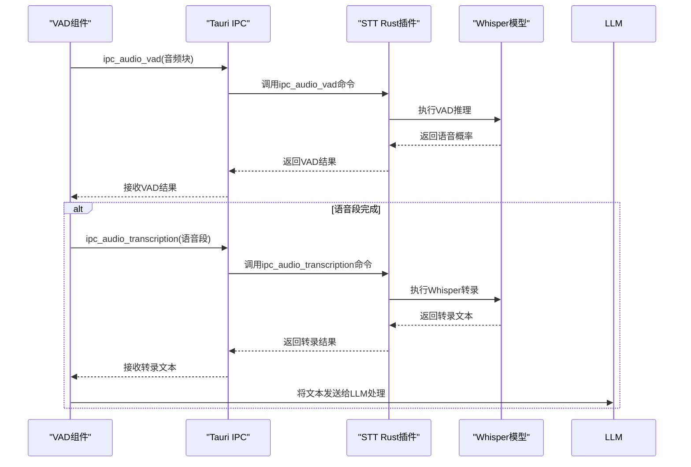

# 音频处理管道

<cite>
**本文档引用的文件**
- [vad.ts](file://apps/stage-web/src/workers/vad/vad.ts)
- [process.worklet.ts](file://apps/stage-web/src/workers/vad/process.worklet.ts)
- [lib.rs](file://crates/tauri-plugin-ipc-audio-vad-ort/src/lib.rs)
- [silero_vad/mod.rs](file://crates/tauri-plugin-ipc-audio-vad-ort/src/models/silero_vad/mod.rs)
- [lib.rs](file://crates/tauri-plugin-ipc-audio-transcription-ort/src/lib.rs)
- [whisper.rs](file://crates/tauri-plugin-ipc-audio-transcription-ort/src/models/whisper/whisper.rs)
- [audio-input.ts](file://apps/stage-web/src/composables/audio-input.ts)
- [processor.worklet.ts](file://packages/audio/src/audio-context/processor.worklet.ts)
- [whisper.ts](file://packages/stage-ui/src/composables/whisper.ts)
</cite>

## 目录
1. [简介](#简介)
2. [项目结构](#项目结构)
3. [核心组件](#核心组件)
4. [架构概述](#架构概述)
5. [详细组件分析](#详细组件分析)
6. [依赖分析](#依赖分析)
7. [性能考虑](#性能考虑)
8. [故障排除指南](#故障排除指南)
9. [结论](#结论)

## 简介
本文档深入探讨了从用户语音输入到AI语音输出的完整音频处理管道。该系统采用现代化的Web Audio API与Rust后端结合的技术栈，实现了高效的语音活动检测（VAD）、语音识别（STT）、大语言模型（LLM）处理和语音合成（TTS）流程。文档详细阐述了每个环节的技术实现，特别是Web Audio API的AudioWorklet在浏览器端的高效音频流处理，以及onnxruntime-web在Rust层进行ONNX模型推理的机制。此外，文档还解释了VAD插件如何在Rust层高效处理音频流，以及STT/TTS如何与xsAI服务交互，并提供了性能优化建议和常见音频问题的解决方案。

## 项目结构
音频处理管道的实现分布在多个模块中，主要分为前端（Web）和后端（Rust）两大部分。前端位于`apps/stage-web`目录，负责用户界面和音频输入的初步处理。后端Rust插件位于`crates`目录，负责高性能的模型推理任务。`packages`目录包含可复用的共享库，如音频处理和UI组件。



**图源**
- [process.worklet.ts](file://apps/stage-web/src/workers/vad/process.worklet.ts)
- [vad.ts](file://apps/stage-web/src/workers/vad/vad.ts)
- [lib.rs](file://crates/tauri-plugin-ipc-audio-vad-ort/src/lib.rs)

**节源**
- [apps/stage-web](file://apps/stage-web)
- [crates](file://crates)
- [packages](file://packages)

## 核心组件
系统的核心组件包括语音活动检测（VAD）、语音识别（STT）和与xsAI服务的交互。VAD组件使用Silero VAD模型在浏览器和Rust层进行语音活动检测，确保只在用户说话时才激活后续的STT流程，从而节省计算资源。STT组件基于Whisper模型，通过ONNX Runtime在Rust中执行高效的推理。前端通过Tauri框架与这些Rust插件进行安全的IPC通信。

**节源**
- [vad.ts](file://apps/stage-web/src/workers/vad/vad.ts)
- [lib.rs](file://crates/tauri-plugin-ipc-audio-vad-ort/src/lib.rs)
- [lib.rs](file://crates/tauri-plugin-ipc-audio-transcription-ort/src/lib.rs)

## 架构概述
整个音频处理管道遵循一个清晰的事件驱动架构。用户的音频输入首先通过Web Audio API捕获，并由AudioWorklet进行预处理和采样率转换。经过预处理的音频流被发送到VAD处理器，该处理器在Rust层使用Silero VAD模型进行语音活动检测。一旦检测到有效语音，音频片段就会被传递给Whisper STT模型进行转录。转录后的文本被发送到LLM进行处理，最终的响应通过TTS服务转换回语音。



**图源**
- [process.worklet.ts](file://apps/stage-web/src/workers/vad/process.worklet.ts)
- [vad.ts](file://apps/stage-web/src/workers/vad/vad.ts)
- [lib.rs](file://crates/tauri-plugin-ipc-audio-vad-ort/src/lib.rs)
- [lib.rs](file://crates/tauri-plugin-ipc-audio-transcription-ort/src/lib.rs)

## 详细组件分析

### 语音活动检测 (VAD) 分析
VAD组件是整个管道的入口，负责区分语音和静音。它采用分层设计，前端JavaScript负责音频流的收集和预处理，而后端Rust负责高性能的模型推理。

#### VAD 组件类图


**图源**
- [vad.ts](file://apps/stage-web/src/workers/vad/vad.ts)
- [process.worklet.ts](file://apps/stage-web/src/workers/vad/process.worklet.ts)
- [silero_vad/mod.rs](file://crates/tauri-plugin-ipc-audio-vad-ort/src/models/silero_vad/mod.rs)

#### VAD 处理流程


**图源**
- [vad.ts](file://apps/stage-web/src/workers/vad/vad.ts)
- [lib.rs](file://crates/tauri-plugin-ipc-audio-vad-ort/src/lib.rs)

**节源**
- [vad.ts](file://apps/stage-web/src/workers/vad/vad.ts)
- [lib.rs](file://crates/tauri-plugin-ipc-audio-vad-ort/src/lib.rs)

### 语音识别 (STT) 分析
STT组件负责将VAD检测到的语音段转换为文本。它基于Whisper模型，并通过ONNX Runtime在Rust环境中执行。

#### STT 处理序列图


**图源**
- [lib.rs](file://crates/tauri-plugin-ipc-audio-transcription-ort/src/lib.rs)
- [whisper.rs](file://crates/tauri-plugin-ipc-audio-transcription-ort/src/models/whisper/whisper.rs)

**节源**
- [lib.rs](file://crates/tauri-plugin-ipc-audio-transcription-ort/src/lib.rs)
- [whisper.rs](file://crates/tauri-plugin-ipc-audio-transcription-ort/src/models/whisper/whisper.rs)

## 依赖分析
系统依赖关系清晰，前端与后端通过Tauri的IPC机制进行通信。前端依赖于`@huggingface/transformers`进行JavaScript端的VAD模型加载，而后端则依赖`onnxruntime`和`hf-hub`来加载和执行ONNX模型。

```mermaid
graph LR
A[Web App] --> B[Tauri]
B --> C[Rust Plugin]
C --> D[ONNX Runtime]
D --> E[Silero VAD Model]
D --> F[Whisper Model]
A --> G[@huggingface/transformers]
G --> H[Silero VAD ONNX]
C --> I[hf-hub]
I --> J[模型下载]
```

**图源**
- [Cargo.toml](file://crates/tauri-plugin-ipc-audio-vad-ort/Cargo.toml)
- [Cargo.toml](file://crates/tauri-plugin-ipc-audio-transcription-ort/Cargo.toml)
- [package.json](file://apps/stage-web/package.json)

**节源**
- [Cargo.toml](file://crates/tauri-plugin-ipc-audio-vad-ort/Cargo.toml)
- [Cargo.toml](file://crates/tauri-plugin-ipc-audio-transcription-ort/Cargo.toml)

## 性能考虑
为了优化性能，系统采用了多项技术。首先，使用AudioWorklet在独立的线程中处理音频，避免阻塞主线程。其次，VAD模型在Rust中运行，利用其高性能和内存安全特性。此外，系统实现了模型的懒加载和缓存，避免重复下载。建议在生产环境中使用GPU执行提供者（如CUDA）来进一步加速ONNX推理。

## 故障排除指南
常见问题包括音频权限被拒绝、模型加载失败和语音识别不准确。对于权限问题，请确保在`useAudioInput`中正确请求了媒体权限。对于模型加载失败，检查网络连接和Hugging Face Hub的访问权限。对于识别不准确，可以尝试调整VAD的`speechThreshold`和`exitThreshold`配置，或使用更大型的Whisper模型。

**节源**
- [audio-input.ts](file://apps/stage-web/src/composables/audio-input.ts)
- [vad.ts](file://apps/stage-web/src/workers/vad/vad.ts)

## 结论
该音频处理管道通过结合Web技术与Rust后端，实现了高效、低延迟的语音交互体验。其模块化设计使得各个组件可以独立开发和优化。未来的工作可以包括支持更多语言、集成更先进的TTS模型以及优化移动端的性能。