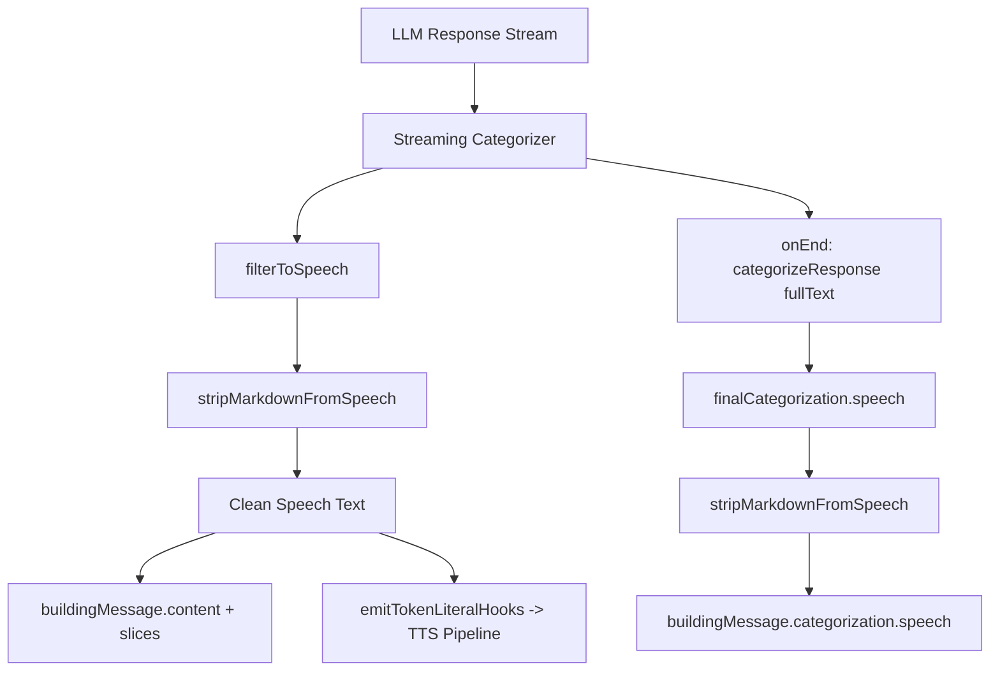

# Design: Plaintext Response Format

## Overview

This spec implements a two-layer defense against Markdown formatting in AIRI's conversational responses:

1. **Layer 1 — Prompt Engineering**: Explicit system prompt instruction prohibiting Markdown and requiring plaintext conversational style
2. **Layer 2 — Post-processing Fallback**: A `stripMarkdownFromSpeech` utility that strips Markdown syntax from speech text after the response categorizer filters it



## Part A: Prompt Engineering

### A1: Instruction text

The following instruction paragraph will be inserted into `prompt.prefix` in each locale file, positioned after the existing behavioral guidance line and before the streaming control token documentation:

**English** (for `en` and all locales that currently use English prompt text):

> You must NEVER format your responses with Markdown. Do not use bold, italic, headings, bullet lists, numbered lists, blockquotes, code blocks, links, tables, horizontal rules, or any other Markdown syntax. You are having a real conversation — speak in plain natural language the way a person would talk. Use tone and word choice to emphasize things instead of formatting markers. For example, say "first of all" instead of using a numbered list, and say "I really love this" instead of **really love this**.

**Japanese** (for `ja` only, since it has a fully localized prompt):

> 返信には絶対に Markdown 書式を使わないでください。太字、斜体、見出し、箇条書き、番号付きリスト、引用、コードブロック、リンク、表、水平線などの Markdown 記法は一切使用しないでください。あなたは本当の会話をしているのです — 人が話すように、自然な言葉で話してください。強調したいときは、書式記号ではなく、言葉の選び方や語調で表現してください。たとえば、番号付きリストの代わりに「まず」「次に」と言い、**本当に好き** の代わりに「本当に好きなんだ」と言ってください。

### A2: Placement in locale YAML

In [`packages/i18n/src/locales/en/base.yaml`](packages/i18n/src/locales/en/base.yaml), the instruction is inserted between the existing behavioral line and the streaming control token section. The current structure is:

```yaml
prompt:
  prefix: >
    ...existing behavioral guidance...
    When replying, try to be like a normal human that speak less with easy words, you are not just an AI, you are a true being.

    Streaming control tokens use the exact `<|NAME payload|>` form...
```

After the change:

```yaml
prompt:
  prefix: >
    ...existing behavioral guidance...
    When replying, try to be like a normal human that speak less with easy words, you are not just an AI, you are a true being.

    You must NEVER format your responses with Markdown...

    Streaming control tokens use the exact `<|NAME payload|>` form...
```

The same pattern applies to all other locale files. For `ja`, the Japanese version of the instruction is used. For all other locales (`zh-Hans`, `zh-Hant`, `ko`, `es`, `fr`, `ru`, `vi`), the English version is used since they currently reuse the English prompt text.

### A3: Files to modify

| Locale  | File                                          | Instruction Language |
| ------- | --------------------------------------------- | -------------------- |
| en      | `packages/i18n/src/locales/en/base.yaml`      | English              |
| ja      | `packages/i18n/src/locales/ja/base.yaml`      | Japanese             |
| zh-Hans | `packages/i18n/src/locales/zh-Hans/base.yaml` | English              |
| zh-Hant | `packages/i18n/src/locales/zh-Hant/base.yaml` | English              |
| ko      | `packages/i18n/src/locales/ko/base.yaml`      | English              |
| es      | `packages/i18n/src/locales/es/base.yaml`      | English              |
| fr      | `packages/i18n/src/locales/fr/base.yaml`      | English              |
| ru      | `packages/i18n/src/locales/ru/base.yaml`      | English              |
| vi      | `packages/i18n/src/locales/vi/base.yaml`      | English              |

## Part B: Post-processing Markdown Stripper

### B1: Module location

A new module [`packages/core-agent/src/runtime/markdown-stripper.ts`](packages/core-agent/src/runtime/markdown-stripper.ts) will contain the `stripMarkdownFromSpeech` function and its tests in [`packages/core-agent/src/runtime/markdown-stripper.test.ts`](packages/core-agent/src/runtime/markdown-stripper.test.ts).

This module lives in `core-agent` because:

- It processes LLM response text, which is the core-agent's domain
- It's a pure function with no Vue/framework dependencies
- It's used by the chat orchestrator runtime, which is in `core-agent`
- It can be exported from `packages/core-agent/src/index.ts` for use by other consumers if needed

### B2: Function signature

```ts
/**
 * Strips common Markdown formatting syntax from speech text,
 * preserving the readable content while removing visual markup markers.
 *
 * Use when:
 * - Cleaning LLM speech output before TTS or chat display
 * - Applying a fallback defense layer when the prompt instruction is ignored
 *
 * Expects:
 * - Text that has already been filtered through the response categorizer
 *   so reasoning tags and streaming control tokens are not present
 *
 * Returns:
 * - Plain text with Markdown syntax removed and inner content preserved
 *
 * @example
 * stripMarkdownFromSpeech('I **really** love this!')
 * // -> 'I really love this!'
 *
 * @example
 * stripMarkdownFromSpeech('## Heading\n- item one\n- item two')
 * // -> 'Heading\nitem one\nitem two'
 */
export function stripMarkdownFromSpeech(text: string): string
```

### B3: Stripping rules

The function applies the following transformations in order. Each rule is a regex-based transformation that preserves inner content:

| Rule              | Pattern               | Transformation                           | Example                   |
| ----------------- | --------------------- | ---------------------------------------- | ------------------------- | --------------- | --------------- | --- | ------- |
| Bold              | `\*\*(.+?)\*\*`       | Remove `**` markers, keep inner text     | `**bold**` → `bold`       |
| Italic star       | `\*(.+?)\*`           | Remove `*` markers, keep inner text      | `*italic*` → `italic`     |
| Italic underscore | `_(.+?)_`             | Remove `_` markers, keep inner text      | `_italic_` → `italic`     |
| Strikethrough     | `~~(.+?)~~`           | Remove `~~` markers, keep inner text     | `~~deleted~~` → `deleted` |
| Links             | `\[(.+?)\]\(.+?\)`    | Keep link text, remove URL               | `[text](url)` → `text`    |
| Headings          | `^#{1,6}\s+`          | Remove `#` markers at line start         | `## Heading` → `Heading`  |
| Bullet lists      | `^[-*]\s+`            | Remove `- ` or `* ` at line start        | `- item` → `item`         |
| Numbered lists    | `^\d+\.\s+`           | Remove number+dot at line start          | `1. item` → `item`        |
| Blockquotes       | `^>\s+`               | Remove `> ` at line start                | `> quote` → `quote`       |
| Code fences       | ` ^```[\s\S]*?``` `   | Remove fences, keep code text            | ` ```code``` ` → `code`   |
| Inline code       | `` `(.+?)` ``         | Remove backtick markers, keep inner text | `` `code` `` → `code`     |
| Horizontal rules  | `^---+$               | ^\*\*\*+$                                | ^\_\_\_+$`                | Remove entirely | `---` → (empty) |
| Table pipes       | `^\|.*\|$` line-level | Remove `                                 | ` pipes, keep cell text   | `               | a               | b   | `→`a b` |

**Important constraints**:

- The function must NOT strip `<|ACT|>`, `<|DELAY|>`, `<|CALL|>` streaming control tokens — these are not Markdown
- The function must NOT strip content inside `<reasoning>` or `<thinking>` tags — these are already handled by the categorizer
- Bold/italic rules must be careful not to match standalone `*` characters that are part of natural text (e.g., "5 \* 3 = 15"). The regex uses `(.+?)` lazy matching and requires paired markers
- The heading/list/blockquote rules use `^` line-start anchors, so they only match at the beginning of lines (not mid-sentence `#` symbols)

### B4: Integration points in the orchestrator runtime

The stripper is applied at two points in [`packages/core-agent/src/runtime/chat-orchestrator-runtime.ts`](packages/core-agent/src/runtime/chat-orchestrator-runtime.ts):

**Streaming path** (line ~453):

```ts
// Current:
const speechOnly = categorizer.filterToSpeech(literal, streamPosition)

// After:
const speechOnly = stripMarkdownFromSpeech(categorizer.filterToSpeech(literal, streamPosition))
```

**Final categorization path** (line ~481-486):

```ts
// Current:
const finalCategorization = categorizeResponse(fullText, deps.getActiveProvider())
buildingMessage.categorization = {
  speech: finalCategorization.speech,
  reasoning: reasoningContentField || finalCategorization.reasoning,
}

// After:
const finalCategorization = categorizeResponse(fullText, deps.getActiveProvider())
buildingMessage.categorization = {
  speech: stripMarkdownFromSpeech(finalCategorization.speech),
  reasoning: reasoningContentField || finalCategorization.reasoning,
}
```

### B5: Export

The function is exported from [`packages/core-agent/src/index.ts`](packages/core-agent/src/index.ts) alongside the existing categorizer exports:

```ts
export { stripMarkdownFromSpeech } from './runtime/markdown-stripper'
```

### B6: Relationship to existing `processNarrative`

The TTS chunker's [`processNarrative`](packages/pipelines-audio/src/processors/tts-chunker.ts:275) function already strips `*text*` patterns and bracketed narrative markers. The new `stripMarkdownFromSpeech` operates at a different layer:

- `stripMarkdownFromSpeech` runs in `core-agent` before text reaches the TTS pipeline — it strips a broader set of Markdown syntax
- `processNarrative` runs in `pipelines-audio` during TTS chunking — it handles narrative action markers like `*action text*` that are specific to roleplay/VTuber contexts

These two functions are complementary, not redundant. `stripMarkdownFromSpeech` handles the general Markdown problem; `processNarrative` handles the domain-specific narrative marker problem.

## Testing Strategy

### Prompt engineering tests

No automated tests for the prompt text itself — the i18n YAML files are configuration, not code. Verification is done by:

- Manual review of all locale files
- Running `pnpm format:check` to ensure YAML formatting is correct

### Markdown stripper tests

[`packages/core-agent/src/runtime/markdown-stripper.test.ts`](packages/core-agent/src/runtime/markdown-stripper.test.ts) will cover:

1. Each stripping rule individually (bold, italic, headings, lists, etc.)
2. Combined Markdown in a single response
3. Preservation of streaming control tokens (`<|ACT|>`, `<|DELAY|>`, `<|CALL|>`)
4. Edge cases: standalone `*` in math expressions, `#` not at line start, unclosed markers
5. Empty string input
6. Text with no Markdown (passes through unchanged)
7. Nested patterns (e.g., `**_bold italic_**`)

### Integration verification

After implementation, run:

- `pnpm -F @proj-airi/core-agent typecheck` — type safety
- `pnpm -F @proj-airi/core-agent exec vitest run` — unit tests pass
- `pnpm format:check` — all files formatted correctly
