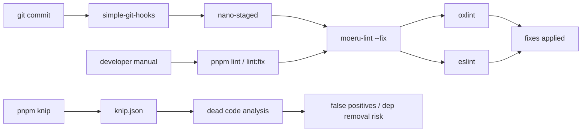
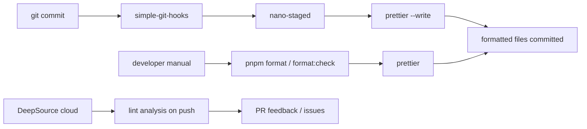

# Design: Remove ESLint & Knip, Add Prettier on Pre-Commit

## Before vs After

### Before — Current Linting Pipeline



Problems: `moeru-lint` pipes oxlint → eslint (heavy, conflicting rules); `knip` has already caused dependency deletion damage; ~39 `eslint-disable` comments clutter source; DeepSource already handles real lint issues in the cloud.

### After — Prettier-Only Pre-Commit Pipeline



Simplified: only formatting locally, all linting delegated to DeepSource.

## Key Design Decisions

### D1: Prettier config format — `.prettierrc.json`

Use `.prettierrc.json` (not `.js` or `.ts`) because:

- JSON is the simplest format — no runtime, no dependencies
- Prettier loads it natively
- Easy for DeepSource and other tools to parse
- Consistent with the project's preference for declarative config (`knip.json`, `cspell.config.yaml`)

### D2: Prettier options — match current `@antfu/eslint-config` defaults

The current `@antfu/eslint-config` (used via `@moeru/eslint-config`) enforces:

- Single quotes
- No semicolons
- 2-space indent for most files
- Trailing commas

**Prettier config:**

```json
{
  "semi": false,
  "singleQuote": true,
  "trailingComma": "all",
  "printWidth": 120,
  "tabWidth": 2,
  "endOfLine": "lf",
  "arrowParens": "always",
  "htmlWhitespaceSensitivity": "ignore",
  "vueIndentScriptAndStyle": false
}
```

This matches the `@antfu/eslint-config` style that has been formatting this codebase, so switching to Prettier with these same options means **no reformatting churn** — the output will be nearly identical.

### D3: `.prettierignore` — exclude generated and lock files

```
node_modules
dist
pnpm-lock.yaml
*.min.js
*.min.cjs
package-lock.json
```

No need to ignore `package.json` files — Prettier formats them consistently and that is desirable.

### D4: nano-staged pattern — targeted file extensions

```json
{
  "*.{js,ts,mjs,cjs,vue,json,css,scss,html,md,yml,yaml,mts,cts}": "prettier --write"
}
```

Using explicit extensions rather than `"*"` avoids running Prettier on images, binaries, or other non-text files that `nano-staged` might match with a glob.

### D5: Leave eslint-disable comments intact

Do NOT remove or modify `eslint-disable` comments in source files. DeepSource cloud linter may read and respect these directives, so they should remain in place even after local ESLint tooling is removed. The ~39 `eslint-disable` comments across the monorepo are harmless and may continue to serve a purpose for DeepSource analysis.

No source file changes are needed for this aspect — only config and dependency removal.

### D6: No oxlint standalone retention

`oxlint` is currently run as part of `moeru-lint`. Since DeepSource handles linting, we remove `oxlint` from devDependencies too. The `oxlint` and `eslint-plugin-oxlint` packages go away. If someone wants fast local linting in the future, they can install oxlint ad-hoc or DeepSource can be configured to use it.

### D7: `packages/ccc` local eslint scripts

`packages/ccc/package.json` has `"lint": "eslint ."` and `"lint:fix": "eslint --fix ."`. These should be replaced with `"format": "prettier --write ."` and `"format:check": "prettier --check ."` to stay consistent with the root convention.

### D8: `apps/stage-tamagotchi/electron-builder.config.ts` cleanup

The files ignore list references `.eslintcache` and `eslint.config.ts`. Remove these entries from the ignore array since they no longer exist.

## File Change Map

| File                                               | Action                                                                                                                                                                  |
| -------------------------------------------------- | ----------------------------------------------------------------------------------------------------------------------------------------------------------------------- |
| `package.json`                                     | Remove 7 eslint deps + `knip` + `oxlint`; remove `lint`/`lint:fix`/`knip` scripts; add `prettier` dep; add `format`/`format:check` scripts; update `nano-staged` config |
| `pnpm-workspace.yaml`                              | Remove `@moeru/eslint-config` and `knip` from catalog; add `prettier` to catalog                                                                                        |
| `knip.json`                                        | Delete                                                                                                                                                                  |
| `.prettierrc.json`                                 | Create                                                                                                                                                                  |
| `.prettierignore`                                  | Create                                                                                                                                                                  |
| `cspell.config.yaml`                               | Remove `knip` from words list                                                                                                                                           |
| `AGENTS.md`                                        | Remove eslint/knip/moeru-lint references; add prettier/format docs                                                                                                      |
| `apps/stage-tamagotchi/electron-builder.config.ts` | Remove `.eslintcache` and `eslint.config.ts` from ignore list                                                                                                           |
| `packages/ccc/package.json`                        | Replace `lint`/`lint:fix` with `format`/`format:check`                                                                                                                  |

## Risk Assessment

- **Formatting churn**: Minimal — Prettier config matches current `@antfu/eslint-config` output style. Running `prettier --write .` once should produce near-zero diffs.
- **Lost lint coverage**: Mitigated by DeepSource already running on the repo. Any real bugs ESLint caught will still be caught by DeepSource or TypeScript compiler.
- **Pre-commit speed**: Prettier is significantly faster than `moeru-lint` (which ran both oxlint AND eslint). Pre-commit hook will be faster.
- **Knip false positives**: Eliminated entirely — no more risk of dependency deletion.
