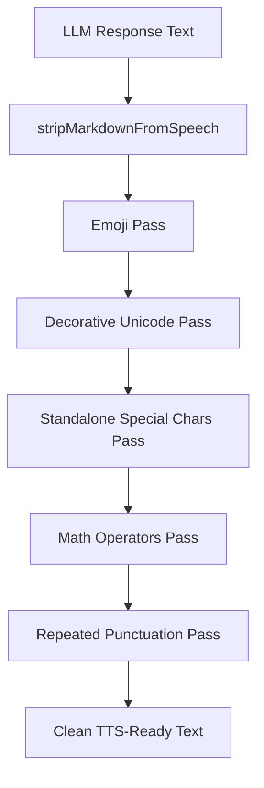

# Design: Unreadable Symbols Stripper

## Overview

This spec extends the `plaintext-response-format` work by generalizing the Markdown-only stripper into a comprehensive TTS text sanitizer. The new `stripUnreadableSymbols` function wraps `stripMarkdownFromSpeech` as its first pass, then applies additional passes to remove emoji, decorative Unicode, standalone special characters, math operators, and excessive repeated punctuation.



Each pass is conditionally applied based on the options object, all defaulting to `true`.

## Module Location

A new module [`packages/core-agent/src/runtime/unreadable-symbols-stripper.ts`](packages/core-agent/src/runtime/unreadable-symbols-stripper.ts) will contain:

- The `stripUnreadableSymbols` function
- The `StripUnreadableSymbolsOptions` interface

Tests live in [`packages/core-agent/src/runtime/unreadable-symbols-stripper.test.ts`](packages/core-agent/src/runtime/unreadable-symbols-stripper.test.ts).

This module lives in `core-agent` for the same reasons as the Markdown stripper: it processes LLM response text, is a pure function with no framework dependencies, and is used by the chat orchestrator runtime.

## Function Signature

```ts
export interface StripUnreadableSymbolsOptions {
  /** Remove emoji and Unicode pictographic symbols. Default: true */
  stripEmoji?: boolean
  /** Remove standalone math/operator symbols. Default: true */
  stripMathOperators?: boolean
  /** Remove decorative Unicode (arrows, box-drawing, shapes, dingbats). Default: true */
  stripDecorativeUnicode?: boolean
  /** Remove standalone special chars that survived Markdown stripping. Default: true */
  stripStandaloneSpecialChars?: boolean
  /** Collapse repeated punctuation (!!! → !, ??? → ?, etc.). Default: true */
  collapseRepeatedPunctuation?: boolean
}

/**
 * Strips unreadable symbols from TTS input text.
 *
 * Runs stripMarkdownFromSpeech first, then applies additional passes
 * for emoji, decorative Unicode, standalone special chars, math operators,
 * and repeated punctuation. Each pass is configurable via options.
 *
 * Use when:
 * - Cleaning LLM speech output before TTS input
 * - You need more aggressive symbol removal than Markdown stripping alone
 *
 * Expects:
 * - Text that has already been filtered through the response categorizer
 *   so reasoning tags and streaming control tokens are not present
 *
 * Returns:
 * - Plain text with all configured symbol categories removed
 *
 * @example
 * stripUnreadableSymbols('I ❤️ this! 🎉🎉🎉')
 * // -> 'I this!'
 *
 * @example
 * stripUnreadableSymbols('Price is $5!!! Really???', { collapseRepeatedPunctuation: false })
 * // -> 'Price is $5!!! Really???'
 */
export function stripUnreadableSymbols(
  text: string,
  options?: StripUnreadableSymbolsOptions,
): string
```

## Default Options

When no options are provided, all stripping is enabled:

```ts
const DEFAULT_OPTIONS: Required<StripUnreadableSymbolsOptions> = {
  stripEmoji: true,
  stripMathOperators: true,
  stripDecorativeUnicode: true,
  stripStandaloneSpecialChars: true,
  collapseRepeatedPunctuation: true,
}
```

## Stripping Passes (in order)

### Pass 1: Markdown (existing)

Delegates to `stripMarkdownFromSpeech(text)` — handles all Markdown syntax. This is always run and not configurable since Markdown is always undesirable in TTS output.

### Pass 2: Emoji

When `stripEmoji` is `true`, removes emoji using Unicode range matching:

| Pattern | Description |
| --- | --- |
| `[\u{1F300}-\u{1F9FF}]` | Misc symbols, emoticons, transport, supplemental |
| `[\u{2600}-\u{26FF}]` | Misc symbols |
| `[\u{2700}-\u{27BF}]` | Dingbats |
| `[\u{1F3FB}-\u{1F3FF}]` | Skin tone modifiers |
| `[\u{1F1E0}-\u{1F1FF}]` | Regional indicator symbols (flags) |
| `\u200D` | Zero-width joiner |
| `\uFE0F` | Variation selector-16 (emoji style) |
| `\u20E3` | Combining enclosing keycap |

The regex uses the `u` flag and is applied globally. Multi-codepoint emoji sequences (ZWJ sequences, skin tone variants) are handled by stripping the component codepoints individually.

### Pass 3: Decorative Unicode

When `stripDecorativeUnicode` is `true`, removes decorative symbol ranges:

| Pattern | Description |
| --- | --- |
| `[\u{2190}-\u{21FF}]` | Arrows |
| `[\u{2500}-\u{257F}]` | Box drawing |
| `[\u{2580}-\u{259F}]` | Block elements |
| `[\u{25A0}-\u{25FF}]` | Geometric shapes |
| `[\u{2600}-\u{26FF}]` | Misc symbols (if not already removed as emoji) |
| `[\u{2700}-\u{27BF}]` | Dingbats (if not already removed as emoji) |
| `[\u{2000}-\u{206F}]` | General punctuation (selective: dashes, spaces, etc.) |
| Specific chars | `©`, `®`, `™`, `§`, `¶`, `†`, `‡`, `•`, `‣`, `⁃` |

### Pass 4: Standalone Special Characters

When `stripStandaloneSpecialChars` is `true`, removes standalone special characters that survived Markdown stripping:

```ts
// Matches standalone special chars surrounded by whitespace or at boundaries
// Uses word boundary-like matching: (^|\s) char+ (\s|$)
result = result.replace(/(?:^|\s)[*#@|\\/~^`]+(?=\s|$)/g, ' ')
```

This targets characters like unpaired `*`, stray `#`, `@` mentions, pipe characters, etc. The replacement is a single space to avoid word concatenation.

### Pass 5: Math/Operator Symbols

When `stripMathOperators` is `true`, removes standalone math/operator symbols:

```ts
// Matches standalone operator sequences surrounded by whitespace or boundaries
// Does NOT match when adjacent to alphanumeric characters (e.g., C++, A&B)
result = result.replace(/(?:^|(?<=\s))[+\-=<>&^~|\\/%]+(?=\s|$)/g, ' ')
```

**Important constraints**:
- Must NOT strip `<|ACT|>`, `<|DELAY|>`, `<|CALL|>` — these contain `<` and `>` but are protected by the `|` and content between the angle brackets. The streaming control token pattern `<|...>` is checked before this pass runs.
- Must NOT strip operators that are part of words (e.g., `C++`, `A&B`, `x<y` in natural text). The lookbehind/lookahead for whitespace ensures this.

### Pass 6: Repeated Punctuation Collapsing

When `collapseRepeatedPunctuation` is `true`, collapses excessive repeated punctuation:

| Pattern | Replacement | Example |
| --- | --- | --- |
| `!{3,}` | `!` | `!!!` → `!` |
| `\?{3,}` | `?` | `???` → `?` |
| `\.{4,}` | `…` | `.....` → `…` |
| `-{3,}` | `—` | `----` → `—` |
| `~{2,}` | `~` | `~~~` → `~` |

Double punctuation (`!!`, `??`, `..`, `--`) is left as-is since it can be natural in conversational text.

## Streaming Control Token Protection

Streaming control tokens (`<|ACT ...|>`, `<|DELAY ...|>`, `<|CALL ...|>`) must pass through untouched. The protection strategy:

1. **Before stripping**: Extract all streaming control tokens from the text, replacing them with unique placeholders
2. **Apply all stripping passes** on the placeholder-containing text
3. **After stripping**: Restore the original tokens from placeholders

```ts
const TOKEN_PLACEHOLDER_PREFIX = '\x00TTS_PRESERVE_'
const TOKEN_PLACEHOLDER_SUFFIX = '\x00'

function extractStreamingTokens(text: string): { text: string, tokens: string[] } {
  const tokens: string[] = []
  const placeholderText = text.replace(/<\|[^|]+\|>/g, (match) => {
    const index = tokens.length
    tokens.push(match)
    return `${TOKEN_PLACEHOLDER_PREFIX}${index}${TOKEN_PLACEHOLDER_SUFFIX}`
  })
  return { text: placeholderText, tokens }
}

function restoreStreamingTokens(text: string, tokens: string[]): string {
  return text.replace(
    new RegExp(`${TOKEN_PLACEHOLDER_PREFIX}(\\d+)${TOKEN_PLACEHOLDER_SUFFIX}`, 'g'),
    (_, index) => tokens[Number(index)],
  )
}
```

The null byte (`\x00`) delimiters ensure the placeholders won't collide with natural text content.

## Integration Points

### Chat Orchestrator Runtime

In [`packages/core-agent/src/runtime/chat-orchestrator-runtime.ts`](packages/core-agent/src/runtime/chat-orchestrator-runtime.ts), the existing `stripMarkdownFromSpeech` calls are replaced:

**Streaming path** (line ~454):

```ts
// Before:
const speechOnly = stripMarkdownFromSpeech(categorizer.filterToSpeech(literal, streamPosition))

// After:
const speechOnly = stripUnreadableSymbols(categorizer.filterToSpeech(literal, streamPosition))
```

**Final categorization path** (line ~486):

```ts
// Before:
speech: stripMarkdownFromSpeech(finalCategorization.speech),

// After:
speech: stripUnreadableSymbols(finalCategorization.speech),
```

### Import update

```ts
// Before:
import { stripMarkdownFromSpeech } from './markdown-stripper'

// After:
import { stripMarkdownFromSpeech } from './markdown-stripper'
import { stripUnreadableSymbols } from './unreadable-symbols-stripper'
```

### Export from core-agent

In [`packages/core-agent/src/index.ts`](packages/core-agent/src/index.ts), add after the existing markdown-stripper export:

```ts
export { stripMarkdownFromSpeech } from './runtime/markdown-stripper'
export { stripUnreadableSymbols } from './runtime/unreadable-symbols-stripper'
export type { StripUnreadableSymbolsOptions } from './runtime/unreadable-symbols-stripper'
```

## Relationship to Existing Functions

```
stripUnreadableSymbols (new)
  ├── stripMarkdownFromSpeech (existing, always called first)
  ├── Emoji stripping (new)
  ├── Decorative Unicode stripping (new)
  ├── Standalone special chars stripping (new)
  ├── Math operator stripping (new)
  └── Repeated punctuation collapsing (new)

processNarrative (in tts-chunker.ts, unchanged)
  └── Handles narrative action markers like *action text*
      and [bracketed text] — domain-specific to VTuber/roleplay

stripMarkdownFromSpeech (unchanged, still exported)
  └── Available for consumers that only need Markdown removal
```

The two-layer architecture:
- `stripUnreadableSymbols` in `core-agent` — general-purpose TTS text sanitization, runs before text reaches the TTS pipeline
- `processNarrative` in `pipelines-audio` — domain-specific narrative marker handling during TTS chunking

## Testing Strategy

[`packages/core-agent/src/runtime/unreadable-symbols-stripper.test.ts`](packages/core-agent/src/runtime/unreadable-symbols-stripper.test.ts) will cover:

1. **Emoji stripping**: single emoji, emoji with skin tones, ZWJ sequences, flags, keycap sequences, mixed text+emoji
2. **Decorative Unicode**: arrows, box-drawing, geometric shapes, dingbats, copyright/trademark symbols
3. **Standalone special chars**: unpaired `*`, stray `#`, `@` mentions, `|`, `\`, `/`
4. **Math operators**: standalone `+`, `=`, `<`, `>`, etc. — but NOT when part of words
5. **Repeated punctuation**: `!!!` → `!`, `???` → `?`, `....` → `…`, `----` → `—`
6. **Streaming control token preservation**: `<|ACT|>`, `<|DELAY|>`, `<|CALL|>` pass through all passes
7. **Options behavior**: each option set to `false` disables its pass, default options strip everything
8. **Combined input**: text with Markdown + emoji + decorative chars + math operators + repeated punctuation
9. **Edge cases**: empty string, text with no symbols, text that's all symbols, very long symbol sequences
10. **Backward compatibility**: `stripMarkdownFromSpeech` still works identically when called directly

## Verification Commands

- `pnpm -F @proj-airi/core-agent typecheck` — type safety
- `pnpm -F @proj-airi/core-agent exec vitest run` — unit tests pass
- `pnpm format:check` — all files formatted correctly
