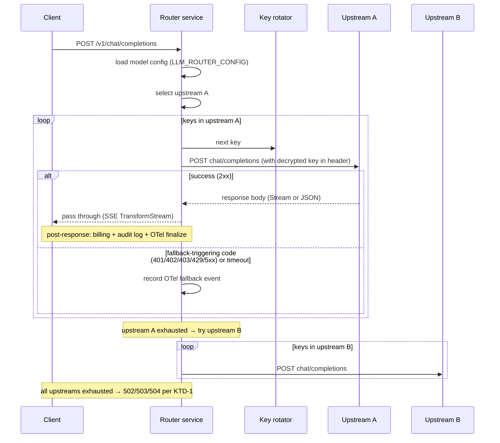

# feat: Internal LLM/TTS router replacing knoway

## Summary

在 `apps/server` 内新建一个 in-process 路由模块替换 knoway sidecar：LLM `/v1/chat/completions` 走 SSE passthrough + 请求内多 key fallback + 跨 upstream fallback；TTS `/v1/audio/speech` 走 adapter interface（v1 三家：Azure / DashScope cosyvoice / Volcengine，非流式 REST 实现）；`/v1/audio/voices` 由仓库内静态 JSON 提供；configKV 增 `LLM_ROUTER_CONFIG` composite 条目承载整棵路由器配置；新 envelope encryption 工具加密存储 provider key；OTel 用 `airi.gen_ai.gateway.*` 自定义属性，新增 fallback / key 健康相关 metrics；新增 `/healthz/live` + `/healthz/ready`；一次性切流 + 数据驱动决定何时删 knoway compose。

---

## Problem Frame

详见 `apps/server/docs/brainstorms/2026-05-15-llm-router-replacement-requirements.md` 的 Problem Frame。简述：当前 `/api/v1/openai/*` 是薄代理转发到 knoway，knoway 每 cluster 单 upstream 不支持多 key fallback，生产上的 key 余额耗尽 / 吊销直接打穿到用户层；同时 knoway 是独立 Go 服务，多一跳延迟 + 多一个语言运行时维护成本。

---

## Requirements

R-IDs 沿用 origin 文档（详见 origin 中 R1-R19 描述）：

**LLM 路由**
- R1, R2, R3, R4, R5（含 v1 实装跨 upstream fallback 的 D31 决定）

**TTS 路由**
- R6, R7, R8, R9

**Observability**
- R10, R11, R12（告警阈值由 planning 用占位、上线后基于真实流量调）

**Health 端点**
- R13, R14

**配置与运维**
- R15（含 R15a envelope encryption 强制）、R16（含 R16a 角色模型）

**迁移**
- R17, R18, R19

详见 origin 文档（apps/server/docs/brainstorms/2026-05-15-llm-router-replacement-requirements.md）。

---

## Key Technical Decisions

| # | 决策 | 出处 / 理由 |
|---|---|---|
| KTD-1 | 上游错误 → HTTP 状态码具体映射：**401/402/403 → 502 Bad Gateway**, **429 → 503 Service Unavailable**, **5xx → 502**, **超时 → 504 Gateway Timeout**。**混合-cause 用尽时（多 key 失败原因不同）规则**：**最后一次尝试的状态码胜出**；若最后一次是 timeout 优先返 504（最能向客户端传达 retryability）。这避免客户端 retry 策略因 key 顺序变化而非确定 | origin D1 + reviewer 共识；plan-time 具体化 |
| KTD-2 | Fallback 超时阈值：**单次上游调用 30s**, **整链路最长 60s**（configKV 可调） | plan-time 决定；超过即归类 504 |
| KTD-3 | OTel 自定义属性折进 **`airi.gen_ai.gateway.*`** 命名空间（不用 `airi.gateway.*`） | 与现有 `airi.gen_ai.stream.interrupted` 命名一致，learnings 报告建议 |
| KTD-4 | 配置热生效用 **Pub/Sub invalidation + Redis TTL 自愈** | learnings 报告引 `redis-boundaries-and-pubsub.md` 契约：Pub/Sub 为 notification-only，丢失消息靠 TTL 重读自愈 |
| KTD-5 | Envelope encryption：**AES-256-GCM via `node:crypto`**。Master key 来自新 env var **`LLM_ROUTER_MASTER_KEY`**（32 字节 base64，**boot-time Valibot 校验长度**）+ 可选 **`LLM_ROUTER_MASTER_KEY_PREVIOUS`** 支持双密钥滚动窗口。**AES 密钥派生**：`hkdfSync('sha256', masterKey, salt='llm-router-v1', info='provider-key-encryption', 32)`，**不**直接用 master key（单一用途密钥反模式）。**Ciphertext 格式**：`v1.<keyId8>.<iv_base64>.<ct_base64>.<tag_base64>`，前缀含版本 + 密钥 id 前 8 字符，未来轮换时可区分新旧密文。**AAD**（authenticated additional data）绑定 `{modelName, keyEntryId}` 防 blob-swap 攻击。**密钥旋转 runbook**（写入 U8 transport-and-routes.md）：(1) 用 prev key 解 + new key 重加密所有 blob → (2) 写回 configKV → (3) 切 master key env var → (4) 取消 prev key。 | repo 零先例；reviewer (security + adversarial + feasibility) 共识：单用途密钥 + HKDF + 版本前缀 + AAD 是 envelope crypto 工业标准 |
| KTD-6 | TTS adapter 接口签名：`(input: TtsInput, ctx: TtsContext) => Promise<{contentType: string, body: ArrayBuffer \| ReadableStream}>` + `getVoiceCatalog(): Voice[]` | plan-time 决定；self-contained，可未来抽 package |
| KTD-7 | DashScope cosyvoice + Volcengine **v1 只发非流式**；Azure 维持现状（既有 REST 一次性返回） | 流式 TTS 各家协议差异大（cosyvoice HTTP/WS 双形态，Volcengine WS 主），v1.5 再处理 |
| KTD-8 | 新增错误工厂 **`createBadGatewayError`**（502, `BAD_GATEWAY`）到 `apps/server/src/utils/error.ts` | 现有 helper 没 502 映射；走全局 `app.onError` 自动渲染 |
| KTD-9 | Voice catalog 用 **静态 JSON 提交仓库**（`apps/server/src/services/tts-adapters/voices/*.json`），不在运行时跨服务聚合 | origin D12 |
| KTD-10 | LLM/TTS 路由 logic **全部下沉到 `src/services/llm-router/`**，路由层只做 param validation + auth guard + 调 service + 处理响应；现有 `routes/openai/v1/index.ts` 的 TODO `:97-98` 同期解决 | apps/server/CLAUDE.md "Routes: thin — no business logic" |
| KTD-11 | 路由器**不持久化** key 死活状态（origin D33 risk-accepted），但 OTel 上报支持 SLO 触发器（fallback.depth > 0.5 / 24h, 单 key > 80% 错误 / 30min）以便后续手动促 v2 | origin Success Criteria + D29 |
| KTD-12 | `/healthz/live` 和 `/healthz/ready` 是**新路径**（不替换现有 `/health` —— 后者保留兼容），按现有 `httpInstrumentationMiddleware` 的 `/health` 排除规则同样跳过 | apps/server/src/app.ts:126-128 模式 |
| KTD-13 | 跨 upstream fallback 在**同一请求内**触发：upstream A 全 key 失败后切 upstream B 全 key 试，全 upstream 都失败才返 5xx | origin R5 |

---

## High-Level Technical Design

> *This section illustrates the intended approach and is directional guidance for review, not implementation specification. The implementing agent should treat it as context, not code to reproduce.*

### Router config tree (shape)

```
LLM_ROUTER_CONFIG (Valibot composite in ConfigEntrySchemas):
{
  llm: {
    models: {
      [logicalModelName]: {
        upstreams: [
          {
            baseURL: string
            overrideModel?: string
            keys: [{ id: string, ciphertext: base64 }, ...]     // envelope-encrypted
            headerTemplate: string                              // e.g. "Bearer {KEY}"
            timeoutMs?: number
          }, ...
        ]
        fallbackTriggers: { httpCodes: number[], onTimeout: true }
      }
    }
  }
  tts: {
    models: {
      [logicalModelName]: {
        provider: "azure" | "dashscope-cosyvoice" | "volcengine"
        upstreams: [
          { region/baseURL, keys: [...], adapterParams: {...} }, ...
        ]
        fallbackTriggers: { httpCodes: number[], onTimeout: true }
      }
    }
  }
  defaults: {
    perAttemptTimeoutMs: 30000
    fullChainTimeoutMs: 60000
    fallbackHttpCodes: [401, 402, 403, 429, 500, 502, 503, 504]
  }
}
```

### Fallback decision sequence (LLM, pre-first-byte only)



### Adapter dispatch (TTS)

```
TtsAdapter interface:
  send(input, ctx) => Promise<{contentType, body}>     // protocol translation + REST call
  getVoiceCatalog() => Voice[]                          // static JSON loaded at module init

Adapters:
  AzureAdapter         (uses SSML XML, region-aware base URL)
  DashScopeCosyvoice   (uses DashScope multimodal-generation JSON)
  VolcengineAdapter    (uses Volcengine openspeech JSON)

Router for TTS:
  resolve(modelName) → (adapter, upstreamConfig)
  iterate keys + (if available) iterate upstreams via same fallback logic as LLM
  adapter.send() with selected key+config
  return adapter result to client unchanged
```

### Pub/Sub config invalidation contract

```
Channel: "configkv:invalidate"
Payload: { key: "LLM_ROUTER_CONFIG", version: nanoid(), publishedAt: ms }
Each instance:
  on receive → invalidate local in-memory cache for that key
  next request lazy-reloads from configKV (Postgres+Redis truth chain)
Fallback for missed pub/sub:
  in-memory cache has TTL = 5s → forced reload regardless of publish

Per-instance OTel counter:
  airi.gen_ai.gateway.config.reload{service_instance_id, source: "pubsub" | "ttl"}
```

---

## Output Structure

```
apps/server/
├── src/
│   ├── routes/openai/v1/
│   │   ├── index.ts                           # MODIFY: split into thin route handlers
│   │   └── route.test.ts                      # MODIFY: rewire tests to mock router service
│   ├── services/
│   │   ├── llm-router/                        # NEW
│   │   │   ├── index.ts                       # public factory + types
│   │   │   ├── router.ts                      # core orchestration (key/upstream selection + fallback loop)
│   │   │   ├── key-rotator.ts                 # per-request key iterator + envelope decryption hook
│   │   │   ├── config-loader.ts               # configKV read + cache + Pub/Sub invalidation
│   │   │   ├── error-mapping.ts               # upstream status → ApiError mapping (KTD-1)
│   │   │   ├── types.ts                       # RouterConfig / Upstream / KeyEntry / RouterContext
│   │   │   ├── router.test.ts
│   │   │   ├── key-rotator.test.ts
│   │   │   ├── config-loader.test.ts
│   │   │   └── error-mapping.test.ts
│   │   └── tts-adapters/                      # NEW
│   │       ├── index.ts                       # adapter registry + dispatch by provider id
│   │       ├── types.ts                       # TtsAdapter / TtsInput / TtsResult / Voice
│   │       ├── azure.ts
│   │       ├── azure.test.ts
│   │       ├── dashscope-cosyvoice.ts
│   │       ├── dashscope-cosyvoice.test.ts
│   │       ├── volcengine.ts
│   │       ├── volcengine.test.ts
│   │       └── voices/
│   │           ├── azure.json                 # static voice catalog
│   │           ├── dashscope-cosyvoice.json
│   │           └── volcengine.json
│   ├── utils/
│   │   ├── envelope-crypto.ts                 # NEW: AES-256-GCM helpers
│   │   ├── envelope-crypto.test.ts            # NEW
│   │   ├── error.ts                           # MODIFY: add createBadGatewayError
│   │   ├── observability.ts                   # MODIFY: new AIRI_ATTR_GATEWAY_* + METRIC_* constants
│   │   └── redis-keys.ts                      # MODIFY: add llm-router config invalidate channel
│   ├── otel/
│   │   └── index.ts                           # MODIFY: prime new gateway metrics; new GatewayMetrics bundle
│   ├── services/
│   │   └── config-kv.ts                       # MODIFY: add LLM_ROUTER_CONFIG to ConfigEntrySchemas
│   ├── app.ts                                 # MODIFY: DI wiring, /healthz routes, remove GATEWAY_BASE_URL
│   ├── libs/env.ts                            # MODIFY: add LLM_ROUTER_MASTER_KEY env var; remove GATEWAY_BASE_URL
│   └── libs/env.test.ts                       # MODIFY
├── otel/
│   └── grafana/
│       └── dashboards/                        # MODIFY: panels + alert rules for gateway metrics
│           ├── build.ts
│           └── airi-server-overview-cloud.json
├── docs/
│   └── ai-context/
│       ├── observability-metrics.md           # MODIFY: register new metrics
│       ├── observability-conventions.md       # MODIFY: gen_ai.system values + airi.gen_ai.gateway.* namespace
│       ├── transport-and-routes.md            # MODIFY: new /healthz routes; route → service mapping
│       ├── redis-boundaries-and-pubsub.md     # MODIFY: configkv:invalidate channel contract
│       └── verifications/
│           └── llm-router.md                  # NEW: verification doc per AGENTS.md template
```

**Tree is a scope declaration**, not a constraint. Implementer may adjust if implementation reveals a better layout; per-unit `**Files:**` sections are authoritative.

---

## Implementation Units

### U1. Foundation utilities: envelope encryption + router config schema + 502 error helper

**Goal**: Land three independent foundation pieces so subsequent units can depend on them: AES-256-GCM envelope encryption utilities for at-rest key storage; `LLM_ROUTER_CONFIG` composite Valibot schema entry in `ConfigEntrySchemas`; `createBadGatewayError` helper.

**Requirements**: R15, R15a (envelope encryption), R15 (composite config entry), KTD-1 (502 mapping), KTD-5, KTD-8.

**Dependencies**: none.

**Files**:
- `apps/server/src/utils/envelope-crypto.ts` (NEW)
- `apps/server/src/utils/envelope-crypto.test.ts` (NEW)
- `apps/server/src/utils/error.ts` (MODIFY)
- `apps/server/src/services/config-kv.ts` (MODIFY — add `LLM_ROUTER_CONFIG` to `ConfigEntrySchemas`)
- `apps/server/src/libs/env.ts` (MODIFY — add `LLM_ROUTER_MASTER_KEY` env var)
- `apps/server/src/libs/env.test.ts` (MODIFY)

**Approach**:
- `envelope-crypto.ts` exports `encrypt(plaintext: string): string` and `decrypt(ciphertext: string): string`. AES-256-GCM via `node:crypto`. Master key read from `env.LLM_ROUTER_MASTER_KEY` (base64-decoded to 32 bytes). Per-message random IV (96-bit) prepended to ciphertext; auth tag appended. Encoded as base64. Throws `Error` with explicit message on auth-tag verification failure (no fallback path).
- `ConfigEntrySchemas` gets one new entry: `LLM_ROUTER_CONFIG: object({ llm: object({...}), tts: object({...}), defaults: object({...}) })`. Use `valibot` composition. **No `?? default` at call sites** — Valibot defaults live in the schema (apps/server/CLAUDE.md / config-and-naming-conventions).
- `createBadGatewayError(message, details?)` mirrors existing factories in `apps/server/src/utils/error.ts:18-69` — returns `ApiError(502, 'BAD_GATEWAY', message, details)`. Verify global `app.onError` (`apps/server/src/app.ts:160-182`) renders this with no further changes (it already pattern-matches `ApiError.statusCode`).
- `env.LLM_ROUTER_MASTER_KEY`: required when `LLM_ROUTER_CONFIG` is set (graceful boot detection — if env var missing, decryption attempts throw `createServiceUnavailableError('LLM_ROUTER_MASTER_KEY not set', 'CONFIG_NOT_SET')`).
- Old `GATEWAY_BASE_URL` env var: keep for now (U8 removes it once new router is hot path).

**Execution note**: Start with envelope-crypto.test.ts including a known-answer test vector (encrypt → decrypt round-trip + tamper-detect failure). Test-first for crypto primitives is non-negotiable.

**Patterns to follow**:
- Error helpers: `apps/server/src/utils/error.ts:18-69` (existing factories)
- Valibot composite: `apps/server/src/services/config-kv.ts` `STRIPE_PAYMENT_METHOD_OPTIONS` precedent
- Env vars: `apps/server/src/libs/env.ts` existing schema definition pattern

**Test scenarios**:
- **envelope-crypto**: (1) encrypt → decrypt round-trip returns original plaintext; (2) encrypt twice with same plaintext returns *different* ciphertext (IV randomness); (3) decrypt with tampered ciphertext (flip one byte mid-string) throws auth-tag verification error; (4) decrypt with tampered auth tag throws; (5) encrypt with empty string works; (6) decrypt with truncated ciphertext throws explicit "invalid ciphertext length" rather than silent failure.
- **LLM_ROUTER_CONFIG schema**: (1) valid full config parses; (2) missing required field → Valibot ValidationError; (3) defaults section absent → schema-level default applies (no `?? fallback` at call site).
- **createBadGatewayError**: (1) returns ApiError with statusCode 502 and errorCode `BAD_GATEWAY`; (2) global `app.onError` mapping renders correctly in an integration request mock (one Hono route that throws this error, assert response status 502 + body shape).
- **env.LLM_ROUTER_MASTER_KEY**: (1) valid 32-byte base64 parses; (2) missing var is allowed in env schema (router decides at use-site whether it's required).

**Verification**:
- `pnpm -F @proj-airi/server typecheck` passes
- `pnpm exec vitest run apps/server/src/utils/envelope-crypto.test.ts` green
- `pnpm exec vitest run apps/server/src/libs/env.test.ts` green
- New `ApiError(502)` thrown from a test route renders as `{error: "BAD_GATEWAY", message, details}` per `app.ts:160-182`

---

### U2. OTel attribute / metric surface + priming registration

**Goal**: Introduce all new OTel attribute constants and metric handles for the gateway. Register them in the priming list so they show up in Grafana before first hit. Update observability docs in the same unit (repo convention).

**Requirements**: R10, R11 (metrics), KTD-3 (namespace), KTD-11 (SLO support).

**Dependencies**: U1 (uses `createBadGatewayError` indirectly via error-mapping in later units, but compile-only).

**Files**:
- `apps/server/src/utils/observability.ts` (MODIFY — new `AIRI_ATTR_GEN_AI_GATEWAY_*` constants and `METRIC_AIRI_GEN_AI_GATEWAY_*` constants)
- `apps/server/src/otel/index.ts` (MODIFY — new `GatewayMetrics` bundle interface, factory `createGatewayMetrics`, prime list update)
- `apps/server/docs/ai-context/observability-metrics.md` (MODIFY)
- `apps/server/docs/ai-context/observability-conventions.md` (MODIFY — declare canonical `gen_ai.system` values: `openrouter`, `azure.speech`, `dashscope.cosyvoice`, `volcengine.tts`)
- `packages/server-shared/src/observability.ts` (MODIFY — if shared constants live here per learnings report)
- `apps/server/src/otel/index.test.ts` (MODIFY/NEW — prime list assertion)

**Approach**:
- New attribute constants (TS string literals):
  - `AIRI_ATTR_GEN_AI_GATEWAY_UPSTREAM_URL = 'airi.gen_ai.gateway.upstream.url'`
  - `AIRI_ATTR_GEN_AI_GATEWAY_KEY_ID = 'airi.gen_ai.gateway.key.id'` (SHA-256 prefix 8)
  - `AIRI_ATTR_GEN_AI_GATEWAY_FALLBACK_DEPTH = 'airi.gen_ai.gateway.fallback.depth'`
  - `AIRI_ATTR_GEN_AI_GATEWAY_FALLBACK_REASON = 'airi.gen_ai.gateway.fallback.reason'`
  - `AIRI_ATTR_GEN_AI_GATEWAY_UPSTREAM_INDEX = 'airi.gen_ai.gateway.upstream.index'` (which upstream in array)
- New metric constants:
  - `METRIC_AIRI_GEN_AI_GATEWAY_FALLBACK_COUNT`
  - `METRIC_AIRI_GEN_AI_GATEWAY_UPSTREAM_ERRORS`
  - `METRIC_AIRI_GEN_AI_GATEWAY_KEY_EXHAUSTED_COUNT` (alert source)
  - `METRIC_AIRI_GEN_AI_GATEWAY_CONFIG_RELOAD` (per-instance, KTD-4)
  - `METRIC_AIRI_GEN_AI_GATEWAY_DECRYPT_FAILURES` (envelope crypto failure counter)
- `createGatewayMetrics(meter)` returns `{ fallbackCount, upstreamErrors, keyExhaustedCount, configReload, decryptFailures }` Counters. Each is `meter.createCounter(NAME, {description, unit})` and primed via `primeCounter` calls in `OtelInstance.start` flow.
- `OtelInstance` interface gains `gateway: GatewayMetrics | null` field; `null` when OTel is disabled (mirrors `genAi: GenAiMetrics | null` pattern at `apps/server/src/otel/index.ts:146-154`).
- `observability-conventions.md`: declare the `airi.gen_ai.gateway.*` sub-namespace; document the canonical `gen_ai.system` values for the 4 providers.
- `observability-metrics.md`: register the 5 new metrics with descriptions + when they fire + alert advice.

**Patterns to follow**:
- Attribute / metric constant convention: `apps/server/src/utils/observability.ts:6-90`
- Metric bundle factory: `apps/server/src/otel/index.ts:146-211+` (`createGenAiMetrics` precedent)
- Priming: same file's `primeCounter` calls
- Doc update format: existing entries in `observability-metrics.md`

**Test scenarios**:
- (1) `createGatewayMetrics(meter)` returns expected fields with `meter.createCounter` called for each — assert via `vi.fn` meter spy with call args matching new metric names.
- (2) `OtelInstance.start` primes each gateway counter (test asserts `add(0, {...})` was called once per metric during prime phase).
- (3) Metric names match `airi.gen_ai.gateway.*` prefix — string assertion on constants.
- (4) When OTel is disabled (`null` bundle), router code calling `gateway?.fallbackCount.add(...)` must be no-op (covered indirectly in U3/U4 tests, mentioned here for completeness).

**Verification**:
- `pnpm -F @proj-airi/server typecheck` passes
- `pnpm exec vitest run apps/server/src/otel/index.test.ts` green
- `observability-metrics.md` lists 5 new gateway metrics; manual review

---

### U3. LLM router service

**Goal**: Core in-process router that selects upstream + key, fetches upstream, handles fallback per-request, maps upstream errors to `ApiError` per KTD-1. Pure service — no Hono / route coupling, takes `(request, fetch)` and returns response (or throws).

**Requirements**: R1, R2, R3, R4, R5 (multi-upstream fallback), KTD-1, KTD-2, KTD-13.

**Dependencies**: U1, U2.

**Files**:
- `apps/server/src/services/llm-router/index.ts` (NEW)
- `apps/server/src/services/llm-router/router.ts` (NEW)
- `apps/server/src/services/llm-router/key-rotator.ts` (NEW)
- `apps/server/src/services/llm-router/config-loader.ts` (NEW)
- `apps/server/src/services/llm-router/error-mapping.ts` (NEW)
- `apps/server/src/services/llm-router/types.ts` (NEW)
- `apps/server/src/services/llm-router/router.test.ts` (NEW)
- `apps/server/src/services/llm-router/key-rotator.test.ts` (NEW)
- `apps/server/src/services/llm-router/config-loader.test.ts` (NEW)
- `apps/server/src/services/llm-router/error-mapping.test.ts` (NEW)

**Approach**:
- `createLlmRouterService({ configKV, redis, gateway: GatewayMetrics | null, fetchImpl?: typeof fetch })` returns a factory with method `route({ modelName, body, headers, abortSignal }) → Promise<Response>`. `fetchImpl` defaults to `globalThis.fetch` but is **injectable** for tests (no `vi.mock('node:net')`-style hacks).
- **Fallback loop** (router.ts):
  1. Load model config via config-loader (returns ordered upstreams + per-upstream keys).
  2. For each upstream in order:
     - For each key in order:
       - Build request: clone body, inject decrypted key into header per `headerTemplate`, set timeout (KTD-2 single-attempt 30s default).
       - `await fetchImpl(...)` with `AbortSignal.timeout(perAttemptTimeoutMs)`.
       - If response.ok and **first byte not yet returned to client**: return Response. **First successful response wins; no more fallback after this point** (pre-first-byte gate per learnings #1).
       - Else: record OTel fallback event (`gateway.fallbackCount.add(1, {reason, fromKey: keyId, upstream: idx})`); decrement key iterator's "active"; continue inner loop.
     - Inner loop exhausted → upstream's `keyExhaustedCount` increments; break to next upstream.
  3. All upstreams exhausted → throw `createBadGatewayError('upstream_unavailable', {triedKeys: N, triedUpstreams: M})` or `createServiceUnavailableError` per KTD-1 mapping.
- **error-mapping.ts**: `mapUpstreamError(status: number | 'timeout', context) → ApiError` returning `BAD_GATEWAY` / `SERVICE_UNAVAILABLE` / `GATEWAY_TIMEOUT` per KTD-1.
- **key-rotator.ts**: stateless iterator over decrypted keys for a given upstream. Decrypts via `utils/envelope-crypto` lazily (only when key is selected). Yields `{id, plaintext}` pairs; caller never holds plaintext beyond the request-attempt window.
- **config-loader.ts**: reads `LLM_ROUTER_CONFIG` from `configKV`. In-memory cache with TTL = 5s (KTD-4 fallback). Public `invalidate()` for Pub/Sub trigger (wired in U7). Public `getModelConfig(modelName)` returns parsed config slice.
- **types.ts**: `RouterConfig`, `Upstream`, `KeyEntry`, `LlmRouteRequest`, `LlmRouteContext` (carries OTel span / metrics handle / userId for billing-attribution downstream).

**Execution note**: Test-first. Each of the 4 sub-modules has a focused test before integration test in router.test.ts. Integration test scenarios assemble the full fallback flow.

**Patterns to follow**:
- DI via factory pattern: `apps/server/src/services/billing/billing-service.ts` and other `create*Service` factories
- Fetch injection for tests: `apps/server/src/routes/openai/v1/route.test.ts:78-91` `globalThis.fetch = vi.fn(...)` pattern adapted to DI prop
- Error throwing: only `ApiError` factories, never bare `throw new Error`
- Logging: `useLogger('llm-router').useGlobalConfig()` per existing pattern

**Test scenarios**:

*key-rotator.test.ts*:
- (1) Iterator yields keys in config order; each yielded key has `.plaintext` from envelope-decrypt.
- (2) Iterator stops after final key.
- (3) Decrypt failure on one key surfaces as `createServiceUnavailableError('DECRYPT_FAILED')` and increments `decryptFailures` counter — does NOT silently skip (security: silent skip would hide config-poisoning).

*config-loader.test.ts*:
- (1) First call reads from configKV; subsequent within TTL serve from cache (mock configKV, assert single read call).
- (2) `invalidate()` clears cache; next call re-reads.
- (3) TTL expiry triggers fresh read.
- (4) Missing `LLM_ROUTER_CONFIG` → throws `createServiceUnavailableError('CONFIG_NOT_SET')`.
- (5) Unknown model name → throws `createBadRequestError('unknown_model', {requested, available: [...]})` (client-side error per KTD-1 / origin R4 pre-upstream validation).

*error-mapping.test.ts*:
- (1) `mapUpstreamError(401)` → 502 BAD_GATEWAY; (2) `mapUpstreamError(402)` → 502; (3) `mapUpstreamError(403)` → 502; (4) `mapUpstreamError(429)` → 503 SERVICE_UNAVAILABLE; (5) `mapUpstreamError(500)` → 502; (6) `mapUpstreamError(503)` → 502; (7) `mapUpstreamError('timeout')` → 504 GATEWAY_TIMEOUT; (8) `mapUpstreamError(200)` → throws (programmer error — 2xx shouldn't reach mapper).

*router.test.ts*:
- (1) Happy path: single upstream, single key, 200 response → returns Response, fallback.depth = 0, no fallback metric.
- (2) `Covers AE7 (origin).` Multi-key fallback: upstream A has keys [k1, k2]; k1 returns 401, k2 returns 200. Router tries k1 → records fallback event {reason: 401, fromKey: k1.id} → tries k2 → returns 200. fallback.depth on returned span = 1.
- (3) Cross-upstream fallback: upstream A keys all 401; upstream B key 1 returns 200. Router tries A keys until exhausted, then B[0] → 200. `keyExhaustedCount{upstream: A}` increments by 1.
- (4) Full exhaustion: all upstreams' keys 401 → router throws `createBadGatewayError('upstream_unavailable')` mapped to 502 by `app.onError`. All `keyExhaustedCount` incremented for each upstream.
- (5) Mixed-cause exhaustion: some keys 429, some 500, last one timeout. Router exhausts → throws `createGatewayTimeoutError` (last cause wins for status mapping) or `createBadGatewayError` (per implementer's chosen policy; document it). **Resolve in implementation.**
- (6) `Covers KTD-2.` Single-attempt timeout: upstream hangs 35s, abort fires at 30s; router moves to next key. Total elapsed within full-chain limit.
- (7) `Covers KTD-2.` Full-chain timeout: upstream slow + many keys cause chain > 60s. Router aborts whole flow → throws `createGatewayTimeoutError`.
- (8) Pre-upstream validation: unknown model name → throws `createBadRequestError('unknown_model')` with no fallback attempted, no upstream fetch issued. OTel doesn't record fallback event.
- (9) **Pre-first-byte guarantee**: streaming response (upstream returns 200 + `ReadableStream`). First chunk arrives → router pipes it through. Mid-stream, upstream stream throws. Router does NOT attempt fallback (response already streaming to client). Logs + OTel mid-stream interruption event per existing pattern. Same shape as `apps/server/src/routes/openai/v1/index.ts:194-232`.
- (10) `AbortSignal` from caller (client disconnected) propagates: upstream fetch is aborted; router records cancellation but does not try fallback.

**Verification**:
- `pnpm -F @proj-airi/server typecheck` passes
- `pnpm exec vitest run apps/server/src/services/llm-router/` green
- Coverage on router.ts ≥ 95% lines/branches (vitest config requires 100% globally; deviations need explicit override or full coverage)

---

### U4. Rewire `/v1/chat/completions` to use LLM router service

**Goal**: Replace the inline upstream fetch logic in `apps/server/src/routes/openai/v1/index.ts` `handleCompletion` with a call to the new `LlmRouterService`. Preserve all existing billing / OTel / SSE streaming / first-token latency behavior. Address the TODO at `:97-98` (split mixed concerns).

**Requirements**: R1, R2, R3, R4. Functional equivalence with current `routes/openai/v1/index.ts` for non-failure paths.

**Dependencies**: U3.

**Files**:
- `apps/server/src/routes/openai/v1/index.ts` (MODIFY)
- `apps/server/src/routes/openai/v1/route.test.ts` (MODIFY)
- `apps/server/src/app.ts` (MODIFY — DI: inject `LlmRouterService` into `createV1CompletionsRoutes` factory)

**Approach**:
- `createV1CompletionsRoutes` signature extends to accept `llmRouter: LlmRouterService` (or replace `env.GATEWAY_BASE_URL`-dependent code path).
- `handleCompletion`:
  - Keep pre-upstream gates (auth, flux balance via `createPaymentRequiredError`, model alias resolution via `requestModel || env.DEFAULT_CHAT_MODEL`).
  - Replace inline `fetch(${baseUrl}chat/completions)` with `await llmRouter.route({ modelName: requestModel, body, headers })`.
  - On Router throwing `ApiError` (e.g., `BAD_GATEWAY`): re-throw — global `app.onError` handles client response.
  - On router returning Response: keep existing streaming `TransformStream` + tailBuffer + usage extraction + post-response billing path unchanged (lines `:194-330` in current code).
  - All existing OTel attributes still set on `tracer.startSpan('llm.gateway.chat', ...)` — additionally span has the new `airi.gen_ai.gateway.*` attrs set by the router (router writes to the active span via `trace.getActiveSpan()`).
- Remove `normalizeBaseUrl`, `getServerConnectionAttributes` calls if they become dead (verify and clean up).
- `env.GATEWAY_BASE_URL`: keep usable for backward compat one cycle (U8 removes), or remove if no longer referenced.

**Execution note**: Run existing `route.test.ts` after rewire and confirm zero behavior regression on happy path; new fallback scenarios are tested in U3 (router level).

**Patterns to follow**:
- Existing SSE streaming pipe pattern in `apps/server/src/routes/openai/v1/index.ts:194-330` — preserve exactly
- DI wiring: `apps/server/src/app.ts` `injeca.provide(...)` for `llmRouter` service + add to `AppDeps`
- Best-effort post-response writes (billing debit, request log): unchanged

**Test scenarios**:
- (1) Existing happy-path test in `route.test.ts`: mock `LlmRouterService.route` to return a non-streaming Response → assert client gets same response shape as before, billing debited, request log written.
- (2) Streaming test: mock router to return SSE Response → assert tailBuffer-driven usage extraction still fires, billing post-stream still works, first-token histogram still recorded.
- (3) Router throws `BAD_GATEWAY` (502): assert client response is 502 with `{error: "BAD_GATEWAY", message, details}` body shape per global onError.
- (4) Router throws `BAD_REQUEST` (unknown model): assert 400 response (pre-upstream rejection — no fallback recorded).
- (5) Pre-flight flux check failure still returns 402 — unchanged.

**Verification**:
- `pnpm -F @proj-airi/server typecheck` passes
- `pnpm exec vitest run apps/server/src/routes/openai/v1/route.test.ts` green
- Manual: spin up dev server with `LLM_ROUTER_CONFIG` set to one OpenRouter upstream + 2 fake keys (one bad, one good). Send curl request to `/api/v1/openai/chat/completions`. Assert 200 + body content. Force k1 invalid → confirm OTel span shows `fallback.depth=1` and 200 still returned.

---

### U5. TTS adapter interface + three REST adapters (Azure / DashScope cosyvoice / Volcengine)

**Goal**: Define the adapter abstraction and implement the three v1 adapters as pure protocol translators. Non-streaming for cosyvoice + Volcengine; Azure remains REST-one-shot (matches current knoway shape).

**Requirements**: R6, R7, KTD-6, KTD-7.

**Dependencies**: U1 (envelope crypto consumed at the router layer, not adapter — adapters receive plaintext key as input).

**Files**:
- `apps/server/src/services/tts-adapters/types.ts` (NEW)
- `apps/server/src/services/tts-adapters/index.ts` (NEW — adapter registry by provider id)
- `apps/server/src/services/tts-adapters/azure.ts` (NEW)
- `apps/server/src/services/tts-adapters/azure.test.ts` (NEW)
- `apps/server/src/services/tts-adapters/dashscope-cosyvoice.ts` (NEW)
- `apps/server/src/services/tts-adapters/dashscope-cosyvoice.test.ts` (NEW)
- `apps/server/src/services/tts-adapters/volcengine.ts` (NEW)
- `apps/server/src/services/tts-adapters/volcengine.test.ts` (NEW)
- `apps/server/package.json` (MODIFY — add `unspeech` to `devDependencies` for type-only import of `Voice` / `VoiceFormat` / `VoiceLanguage`)

**Approach**:
- `TtsAdapter` interface:
  - `id: 'azure' | 'dashscope-cosyvoice' | 'volcengine'`
  - `send(input: TtsInput, ctx: TtsAdapterContext): Promise<TtsResult>` where `TtsInput = { text, voice?, speed?, responseFormat?, extraOptions? }`, `TtsAdapterContext = { keyPlaintext, baseURL, adapterParams, fetchImpl, abortSignal }`, `TtsResult = { contentType, body: ArrayBuffer | ReadableStream }`.
  - `getVoiceCatalog(): Voice[]` — static, loaded at module init (U6 supplies JSON files).
- `azure.ts`: OpenAI `/v1/audio/speech` → Azure `https://<region>.tts.speech.microsoft.com/cognitiveservices/v1`. Build SSML from `{text, voice, speed}` (auto-wrap unless `extraOptions.disableSsml` is true). Headers: `Ocp-Apim-Subscription-Key: <key>`, `X-Microsoft-OutputFormat: <format from responseFormat>`, `Content-Type: application/ssml+xml`. Response is raw audio bytes — return as ArrayBuffer.
- `dashscope-cosyvoice.ts`: POST to `https://dashscope.aliyuncs.com/api/v1/services/aigc/multimodal-generation/generation` with DashScope JSON body. Headers: `Authorization: Bearer <key>`. Map `responseFormat` to DashScope's `output.format` field. Non-streaming response → ArrayBuffer.
- `volcengine.ts`: POST to `https://openspeech.bytedance.com/api/v1/tts` with Volcengine JSON body (AppID + Token auth in body, not header). Map `voice` to `voice_type`, `responseFormat` to `audio_params.format`. Non-streaming → ArrayBuffer.
- `index.ts`: `getAdapter(id) → TtsAdapter` lookup. Throws `createBadRequestError('unknown_tts_provider', {id})` if missing.
- Each adapter has `fetchImpl` injection point (default `globalThis.fetch`) for tests.

**Patterns to follow**:
- Type import for `Voice` / `VoiceFormat` / `VoiceLanguage` from `unspeech` npm package (type-only — per brainstorm D13)
- Hand-rolled REST + fetch injection — no `dashscope-sdk-nodejs` / `@volcengine/openapi` deps
- Error throwing: `ApiError` factories only

**Test scenarios** (per adapter):
- *azure*: (1) basic text → SSML structure (assert XML shape — root + voice + content); (2) speed >1.0 applies `prosody rate`; (3) `disableSsml=true` passes raw text as SSML body; (4) header has `Ocp-Apim-Subscription-Key` and `X-Microsoft-OutputFormat`; (5) upstream 200 with audio bytes → returns ArrayBuffer + content-type from response; (6) upstream 401 → throws (mapping happens at router layer, adapter just bubbles error info).
- *dashscope-cosyvoice*: (1) request body shape matches DashScope schema (text in `input.messages` per schema); (2) header `Authorization: Bearer` set; (3) `voice` maps to DashScope `voice` param; (4) upstream success → ArrayBuffer + content-type.
- *volcengine*: (1) request body has AppID + Token; (2) `voice_type` mapping; (3) audio_params.format from responseFormat; (4) upstream success → ArrayBuffer.

**Verification**:
- `pnpm -F @proj-airi/server typecheck` passes
- `pnpm exec vitest run apps/server/src/services/tts-adapters/` green
- Coverage per adapter ≥ 90% lines

---

### U6. TTS voice catalogs (static JSON) + voices route

**Goal**: Commit static voice catalog JSON files per provider. Implement `/v1/audio/voices?model=<alias>` route that resolves alias → provider, returns provider's static catalog merged with operator-controlled recommended map (existing `DEFAULT_TTS_VOICES` configKV). Replace current knoway-passthrough `handleListVoices`.

**Requirements**: R9.

**Dependencies**: U5 (adapter interface for `getVoiceCatalog()`).

**Files**:
- `apps/server/src/services/tts-adapters/voices/azure.json` (NEW)
- `apps/server/src/services/tts-adapters/voices/dashscope-cosyvoice.json` (NEW)
- `apps/server/src/services/tts-adapters/voices/volcengine.json` (NEW)
- `apps/server/src/services/tts-adapters/azure.ts` (MODIFY — `getVoiceCatalog()` reads json file at module init)
- (same for dashscope-cosyvoice.ts, volcengine.ts)
- `apps/server/src/routes/openai/v1/index.ts` (MODIFY — replace `handleListVoices` with adapter-dispatch)
- `apps/server/src/routes/openai/v1/route.test.ts` (MODIFY — add tests)
- `apps/server/docs/ai-context/verifications/llm-router.md` (NEW — initial voices refresh runbook section)

**Approach**:
- JSON shape matches `Voice` / `VoiceFormat` / `VoiceLanguage` from `unspeech` package types (type-only import in adapter — no runtime dep on unspeech).
- For initial commit: bootstrap Azure catalog from Microsoft's published voice list (current eastasia region voices, ~80 entries — full ~600 across all regions is overkill for v1; document refresh process in verification doc).
- cosyvoice + Volcengine catalogs: smaller (10-30 voices each), bootstrap from official docs.
- Adapter loads its JSON file at module init via `import voices from './voices/azure.json' with { type: 'json' }` (ESM JSON import). Returns slice on `getVoiceCatalog()`.
- Voices route: read `model` query param → resolve to provider via `LLM_ROUTER_CONFIG.tts.models[model].provider` → `getAdapter(provider).getVoiceCatalog()` → merge with `configKV.getOptional('DEFAULT_TTS_VOICES')` recommended map → return.
- Removed: passthrough to `${baseUrl}audio/voices` (was knoway-dependent at `apps/server/src/routes/openai/v1/index.ts:441-475`).

**Patterns to follow**:
- Hono Response.json: existing usage at `apps/server/src/routes/openai/v1/index.ts:474`
- Type-only import: `import type { Voice } from 'unspeech'`
- ESM JSON imports: TypeScript 5+ + Node 22+ support; verify in `apps/server/tsconfig.json` (resolveJsonModule)

**Test scenarios**:
- (1) `GET /v1/audio/voices?model=azure-tts` returns 200 + json with `voices: Voice[]` + `recommended: {...}` merged.
- (2) Unknown model param → 400 with `BAD_REQUEST`.
- (3) Empty `model` falls back to `env.DEFAULT_TTS_MODEL` (matches current behavior at `apps/server/src/routes/openai/v1/index.ts:441-446`).
- (4) Adapter `getVoiceCatalog()` returns same array reference structure as committed JSON (no mutation between calls).
- (5) Voice JSON files validate against minimal Voice schema (just shape check — name, language, format fields exist).

**Verification**:
- `pnpm -F @proj-airi/server typecheck` passes
- `pnpm exec vitest run apps/server/src/routes/openai/v1/route.test.ts` green
- Manual: GET `/v1/audio/voices?model=azure-tts` against dev server → assert JSON response with voices count > 0

---

### U7. Pub/Sub config invalidation + `/healthz/live` + `/healthz/ready`

**Goal**: Wire Pub/Sub-driven invalidation of the LLM router config in-memory cache (KTD-4). Add per-instance `config.reload` OTel counter. Add `/healthz/live` (always 200) and `/healthz/ready` (Postgres + Redis ping) endpoints. **Gateway key health does NOT affect readiness** (R14).

**Requirements**: R13, R14, R16, R16a (acknowledged as Outstanding Question — not actively delivered, see "Resolve before merging" below), KTD-4, KTD-12.

**Dependencies**: U3 (consumes `config-loader.invalidate`), U2 (uses `gateway.configReload` counter).

**Files**:
- `apps/server/src/services/llm-router/config-loader.ts` (MODIFY — add `subscribeToInvalidations(redis)` wiring)
- `apps/server/src/utils/redis-keys.ts` (MODIFY — add `configKvInvalidateChannel()` helper)
- `apps/server/src/app.ts` (MODIFY — register `/healthz/live`, `/healthz/ready`, exclude both from `httpInstrumentationMiddleware`; wire config-loader to redis subscriber; admin endpoint for `set LLM_ROUTER_CONFIG` publishes invalidation)
- `apps/server/src/routes/admin/...` (MODIFY — if admin set endpoint exists for configKV; publish on write)
- `apps/server/src/app.test.ts` (NEW — health endpoint tests)
- `apps/server/docs/ai-context/redis-boundaries-and-pubsub.md` (MODIFY — declare `configkv:invalidate` channel)

**Approach**:
- Channel: `configkv:invalidate` (single channel for all configKV keys; payload `{ key: string, version: nanoid(), publishedAt: number }`).
- On `configKV.set('LLM_ROUTER_CONFIG', value)`: publish to channel.
- In `createLlmRouterService` init: subscribe via separate `ioredis` instance (Redis Pub/Sub requires dedicated subscriber connection per ioredis docs). On message matching `key === 'LLM_ROUTER_CONFIG'`: call `config-loader.invalidate()` and increment `gateway.configReload.add(1, {service_instance_id, source: 'pubsub'})`.
- TTL fallback: in-memory cache has TTL = 5s. On TTL expiry next request reloads from configKV (Postgres+Redis source-of-truth chain) and increments counter with `source: 'ttl'`.
- `/healthz/live`: route returns `200 {status: 'live'}` always. No DB / Redis touch. Excluded from `httpInstrumentationMiddleware` (`apps/server/src/app.ts:126-128` pattern).
- `/healthz/ready`: route pings Postgres (`SELECT 1`) + Redis (`PING`). Returns 200 if both ok; 503 otherwise. **Does not check gateway key health** (R14 — single key flap can't take instance out of pool).
- Existing `/health` endpoint at `apps/server/src/app.ts:187` stays (keep external monitors stable); declared deprecated in docs in U8.

**Patterns to follow**:
- ioredis Pub/Sub: dedicated subscriber connection (search for existing pubsub usage in `apps/server` — `redis-boundaries-and-pubsub.md` references this)
- redis-keys helper: `apps/server/src/utils/redis-keys.ts:11+` `createRedisKey` pattern
- Health route skip: existing pattern at `apps/server/src/app.ts:126-128`

**Test scenarios**:
- (1) Config-loader subscribes on init; on Pub/Sub message for `LLM_ROUTER_CONFIG`: cache cleared, next read fetches fresh.
- (2) Pub/Sub message for unrelated key: no invalidation, no counter increment.
- (3) TTL expiry path: cache populated → 5s elapse (mock clock or vitest fake timers) → next read fetches fresh + counter incremented with `source: 'ttl'`.
- (4) `GET /healthz/live` returns 200 + `{status: 'live'}` even when Redis is down (Redis client error mocked).
- (5) `GET /healthz/ready` returns 200 when both Postgres + Redis ping ok.
- (6) `GET /healthz/ready` returns 503 when Postgres down (mock pool query throws).
- (7) `GET /healthz/ready` returns 503 when Redis down (mock ping throws).
- (8) `GET /healthz/ready` returns 200 even with `LLM_ROUTER_CONFIG` missing (gateway state does not block readiness per R14).
- (9) `httpInstrumentationMiddleware` does NOT instrument `/healthz/*` requests (assert OTel http span count after probe = 0).

**Verification**:
- `pnpm -F @proj-airi/server typecheck` passes
- `pnpm exec vitest run apps/server/src/app.test.ts` green
- Manual: `curl /healthz/live` → 200; `curl /healthz/ready` → 200 with Postgres + Redis up

**Resolve before merging**:
- **R16a admin permission model** is an explicit Outstanding Question in origin; if it's not resolved before this unit ships, the admin set-config endpoint stays behind existing flat-admin-role auth. Note as known limitation in PR description: "Admin endpoint for `set LLM_ROUTER_CONFIG` uses existing flat admin role; role-scoping is follow-up work".

---

### U9. Admin configKV write endpoint for `LLM_ROUTER_CONFIG` + Pub/Sub publish

**Goal**: 解决 doc review P0 blocker —— 现有 `apps/server/src/routes/admin/` 只有 `flux-grants` 和 `flux-grant-batches`，**没有** configKV.set 的 HTTP 入口。本 unit 新建一个 admin endpoint 承接 `LLM_ROUTER_CONFIG` 的读 / 写 / 部分更新，并在写入后发 Pub/Sub 通知用以触发 U7 的 invalidation。同时实现 R16a 角色模型决策（在此 endpoint 落地）+ 写入审计日志 + 原子性约束。

**Requirements**: R15, R15a, R16, R16a, R17.

**Dependencies**: U1（envelope crypto，写入时加密 key blob）, U2（OTel metric 用于 write audit）。

**Files**:
- `apps/server/src/routes/admin/llm-router-config.ts` (NEW)
- `apps/server/src/routes/admin/llm-router-config.test.ts` (NEW)
- `apps/server/src/app.ts` (MODIFY — mount admin route under `/api/admin/llm-router-config`)
- `apps/server/src/services/llm-router/config-loader.ts` (MODIFY — service 内部 `setLlmRouterConfig(value)` 包装 configKV.set + 加密 + publish 三步)

**Approach**:
- **HTTP surface**：
  - `GET /api/admin/llm-router-config` — 返回当前 `LLM_ROUTER_CONFIG`，**key ciphertext 字段隐去**（只回 `{id, ciphertextFingerprint: SHA-256(ciphertext)[:8]}` 用于识别）。Admin 不需要 raw 密文回读。
  - `PUT /api/admin/llm-router-config` — 原子替换整个 config 树。Body 含明文 keys，server 在写入前 envelope encrypt。**乐观锁**：请求必须带 `If-Match: <version-nanoid>` header（version 来自 `GET` 响应）；不匹配返 409 Conflict。
  - `POST /api/admin/llm-router-config/rotate-key` — 后续 v1.5 实现密钥旋转 endpoint，**v1 不实装**，但 schema / 路由占位。
- **写入流程（原子性）**：(1) Valibot 校验请求 body → (2) 加密 key 明文（envelope crypto, U1）→ (3) 单 Postgres tx 写 configKV → (4) 失效本地 Redis cache → (5) `redis.publish('configkv:invalidate', {key: 'LLM_ROUTER_CONFIG', version, publishedAt})`。**注意顺序**：先 tx commit 再 cache invalidate 再 publish，否则 instance 可能 reload 出 pre-commit 旧值。
- **R16a 角色模型** —— v1 拍板：**沿用现有 `ADMIN_EMAILS` 单 admin 角色**（来自 `apps/server/src/app.ts:244`）。不做 step-up auth / 双人确认 / 分角色拆分。承担的风险：admin 凭据被攻陷 = 即时注入恶意 upstream URL / key。**补偿控制**：每次 PUT 都写一行 audit log（OTel structured event + Postgres `admin_audit_log` 表？或 stdout JSON 日志）记录 actor email + timestamp + key id list（前 8 字符） + version。具体落库位置 planning 阶段内决定（如果 `admin_audit_log` 表不存在则用 OTel + JSON 日志，留 v2 加表）。
- **OTel**：发 event `airi.gen_ai.gateway.config.write{actor_email, version, key_count}` 每次 PUT 时；counter `airi.gen_ai.gateway.config.write_count{result: 'success' | '4xx' | '5xx'}`。
- **createBadGatewayError details 约束**（doc review P1）：实现层内显式注明 error-mapping.ts 的 `context` 参数**只允许** `{triedKeys: number, triedUpstreams: number, lastStatusCode: number}`，禁止包含上游 response body / header 字符串。
- **HMAC on Pub/Sub payload**（doc review P2）：payload 加 `hmac = HMAC-SHA256(LLM_ROUTER_MASTER_KEY, JSON.stringify({key, version, publishedAt}))`，receiver 校验。这是 cheap defense in depth；如 redis 接受跨租户连接也能侦测到 forged invalidation。

**Patterns to follow**:
- 现有 admin route 风格：`apps/server/src/routes/admin/flux-grants` (HTTP shape + auth guard)
- ADMIN_EMAILS 检查：`apps/server/src/app.ts:244` 现有 pattern
- Valibot 校验请求 body：reka 全局 onError 渲染失败 schema 为 400

**Test scenarios**:
- (1) GET 返回配置但隐去密文（只回 fingerprint）；客户端不能从 admin endpoint 拿回原始密钥
- (2) PUT 不带 `If-Match` → 412 Precondition Required（强制 ETag 工作流）
- (3) PUT 携 stale `If-Match` → 409 Conflict + 当前 version 在响应里
- (4) PUT 成功 → configKV 内密文已加密、不是明文、可被路由器解密
- (5) PUT 成功 → Pub/Sub 收到 invalidate 消息（mock subscriber，断言收到 message）
- (6) PUT 成功 → OTel event `config.write` 发出 + audit log JSON 行出现
- (7) PUT 时 Postgres tx 失败 → Pub/Sub 不应该 fire（顺序保证）
- (8) 连续两次 PUT → 两次 Pub/Sub 顺序一致（ioredis 单 channel 保序）
- (9) 非 ADMIN_EMAILS 用户 PUT → 401 / 403（沿用现有 auth guard）
- (10) HMAC 校验：receiver 收到伪造 HMAC 的 payload → 不调 invalidate（且发 `airi.gen_ai.gateway.config.invalid_hmac` counter）

**Verification**:
- `pnpm -F @proj-airi/server typecheck` passes
- `pnpm exec vitest run apps/server/src/routes/admin/llm-router-config.test.ts` green
- 手动：本地 dev 跑 PUT → tail 日志看到 audit log JSON → tail Redis MONITOR 看到 publish → 第二个 instance 看到 invalidate

---

### U8. Grafana dashboards + final cutover (DI wiring + env cleanup + verification doc)

**Goal**: Final stitching unit. Add Grafana panels + alert rules for gateway metrics. Finalize DI wiring in `app.ts` (router service + adapters registered, route mounted with new dep). Remove `GATEWAY_BASE_URL` env var (knoway no longer reachable from new code path). Write the verification doc with real curl evidence. Update operational docs.

**Requirements**: R12, R17, R18, R19.

**Dependencies**: U1-U7.

**Files**:
- `apps/server/otel/grafana/dashboards/build.ts` (MODIFY)
- `apps/server/otel/grafana/dashboards/airi-server-overview-cloud.json` (MODIFY)
- `apps/server/src/app.ts` (MODIFY — final DI wiring; remove `GATEWAY_BASE_URL` consumers)
- `apps/server/src/libs/env.ts` (MODIFY — remove `GATEWAY_BASE_URL`)
- `apps/server/src/libs/env.test.ts` (MODIFY)
- `apps/server/scripts/verify-router-config.ts` (NEW — operator script referenced in U1 Migration step; decrypts current `LLM_ROUTER_CONFIG` against `LLM_ROUTER_MASTER_KEY` to validate boot-time correctness)
- `apps/server/src/scripts/otel/llm-router-smoke.ts` (NEW — new smoke fixture that produces traces tagged with `airi.gen_ai.gateway.*` attrs; **note**: the previously-referenced `apps/server/src/scripts/otel/smoke.ts` does not exist — the actual existing file is `ws-smoke.ts` for WebSocket smoke; gateway-specific smoke is new work)
- `apps/server/docs/ai-context/transport-and-routes.md` (MODIFY — route → service mapping update; `/healthz/live` + `/healthz/ready` documented; `/health` marked deprecated)
- `apps/server/docs/ai-context/observability-conventions.md` (MODIFY)
- `apps/server/docs/ai-context/verifications/llm-router.md` (FINALIZE — full verification with real evidence)
- (Possibly) `apps/server/scripts/...` (NEW — knoway compose retention policy doc / data-driven trigger criteria)

**Approach**:
- Grafana dashboard JSON: add 3 panels (key exhausted count time series, fallback depth distribution, upstream errors by status code) + 3 alert rules (P0 key.exhausted > 0 in 5min, P1 fallback ratio > 30% in 15min, P2 single key > 80% errors in 30min). Use existing `build.ts` to assemble. Thresholds are placeholders — refine post-launch.
- DI wiring: extend `AppDeps` interface (`apps/server/src/app.ts:70-88`) with `llmRouter` field. Register via `injeca.provide('services:llmRouter', { dependsOn: ['services:configKV', 'libs:redis', 'otel'], build: ... })`. Thread into `createV1CompletionsRoutes` factory.
- `GATEWAY_BASE_URL` removal: delete from env schema; verify no remaining consumers via grep — current consumers per existing brainstorm context: `apps/server/src/libs/env.ts`, `apps/server/src/libs/env.test.ts`, `apps/server/src/routes/openai/v1/index.ts`, `apps/server/src/routes/openai/v1/route.test.ts`, `apps/server/src/scripts/otel/smoke.ts`. Update each.
- Verification doc (`apps/server/docs/ai-context/verifications/llm-router.md`): follow AGENTS.md template — for each user path (chat completions happy / chat completions fallback / TTS speech happy / voices listing / healthz live / healthz ready), include scenario / command / expected output / actual output (curl response snippets) / environment (commit SHA + deploy env) / last verified date.
- knoway compose: do not delete yet. Document retention criteria in transport-and-routes.md and PR description: "knoway compose stays until: 14 days post-deploy without P1+ incidents OR 1 peak-traffic event without P1+ incidents. Reset on any P1."

**Patterns to follow**:
- DI wiring: existing `injeca.provide` blocks in `apps/server/src/app.ts:280-487`
- Verification doc format: AGENTS.md template + existing files under `apps/server/docs/ai-context/verifications/`
- Grafana dashboard build: existing `build.ts` + existing panel structures in `airi-server-overview-cloud.json`

**Test scenarios**:
- (1) `env.test.ts`: `GATEWAY_BASE_URL` no longer in schema; old test asserting it must be removed.
- (2) `app.test.ts`: server boots with `LLM_ROUTER_CONFIG` set and `GATEWAY_BASE_URL` absent — no errors.
- (3) Smoke test (new `apps/server/src/scripts/otel/llm-router-smoke.ts`): produces traces tagged with `airi.gen_ai.gateway.*` attrs.
- (4) Grafana dashboard JSON parseable + alert rules validated (use `jq` or existing build.ts assertion).
- (5) Manual end-to-end: dev server with full `LLM_ROUTER_CONFIG` running. `curl /api/v1/openai/chat/completions` returns 200. Kill 1 of 2 keys (invalid token) → response still 200 + OTel trace shows fallback.depth=1 in Grafana.

**Verification**:
- `pnpm -F @proj-airi/server typecheck` passes
- `pnpm -F @proj-airi/server exec vitest run` (full server test suite) green
- `pnpm -F @proj-airi/server build` succeeds
- Verification doc reflects real dev-server output with commit SHA + date
- Grafana dashboard rendering: load JSON into local Grafana via existing docker-compose.otel.yml; visually confirm 3 new panels appear

---

## System-Wide Impact

| Surface | Impact |
|---|---|
| `apps/server` request thread | New synchronous path: configKV cache check → router service → upstream(s) → response. No new background work. |
| `apps/server` startup | New env var `LLM_ROUTER_MASTER_KEY` required. configKV must contain `LLM_ROUTER_CONFIG` before requests succeed (otherwise router throws `CONFIG_NOT_SET` per existing pattern). |
| Postgres | No schema changes in v1. |
| Redis | New Pub/Sub channel `configkv:invalidate`. New in-memory cache (per-instance, not Redis-resident). |
| OTel pipeline | 5 new attribute constants + 5 new metric counters under `airi.gen_ai.gateway.*`. Prime list updated so all show up in Grafana before first hit. |
| Grafana | 3 new panels + 3 new alert rules in `airi-server-overview-cloud.json`. |
| Frontend | No contract change to `/v1/*` API. BYOK path through unspeech is untouched. |
| Operations / on-call | New env var to set in Railway. New alerts to acknowledge in pager rotation. knoway compose retained as rollback artifact. |
| Other services in repo | None. `apps/server` is the only consumer of `LLM_ROUTER_CONFIG`. |

---

## Risks & Mitigations

| Risk | Likelihood | Severity | Mitigation |
|---|---|---|---|
| Account-level rate limit on upstream (D33 risk-accepted): 429 storm makes fallback useless | Medium | High | OTel SLO triggers (D29) + knoway compose retained → can ship cooldown as v2 within 1 sprint after first event |
| Envelope crypto bug (zero-precedent) corrupts keys / blocks all requests | Low | High | Test-first crypto (U1) with KAT vectors + tamper-detect tests; staging soak before prod cutover |
| Pub/Sub message drop leads to stale config window > 5s | Low | Medium | TTL self-healing (KTD-4) bounds window to 5s; counter `airi.gen_ai.gateway.config.reload{source:"ttl"}` makes the gap observable |
| SSE first-byte race: fallback decision made after first byte already streamed | Low | High | Explicit pre-first-byte gate in router.ts (U3 test #9); mirrors existing pattern at `apps/server/src/routes/openai/v1/index.ts:194` |
| `node:crypto` `randomFillSync` vs async randomness in high-load: micro-task starvation | Low | Low | Use sync API only at request handler level; envelope encrypt happens lazily per key per request — bounded volume |
| `LLM_ROUTER_MASTER_KEY` lost / rotated: all encrypted keys become decryptable garbage | Low | High | Document rotation procedure (re-encrypt then update) in `transport-and-routes.md`; require backup before rotating |
| Volcengine / DashScope protocol changes break adapter unit tests in unrelated PRs | Medium | Low | Adapters are mocked at fetch boundary; protocol changes are integration concern, surface via verification doc refresh and existing CI |
| Voice catalog JSON drift from real upstream | Medium | Low | Quarterly refresh task in verification doc runbook; not blocking on v1 ship |
| Grafana alert threshold placeholders fire wrongly on day 1 | Medium | Medium | Set thresholds at conservative levels (e.g., 95th percentile of current traffic); refine in week 1 post-launch |
| knoway compose deleted prematurely → revert impossible | Low | High | KTD/R18: data-driven deletion criteria, not calendar; reset counter on any P1 |

---

## Migration & Rollout

1. **Pre-deploy**:
   - Set `LLM_ROUTER_MASTER_KEY` env var on Railway (generate 32 bytes base64).
   - Encrypt current OpenRouter / Azure / DashScope / Volcengine keys via local script using same crypto module → write encrypted blobs into `LLM_ROUTER_CONFIG` via existing `configKV.set` admin path.
   - Verify `LLM_ROUTER_CONFIG` decrypts cleanly in dev env (`pnpm exec tsx scripts/verify-router-config.ts` — script TBD in U8).
2. **Deploy** (one-shot):
   - Merge PR.
   - Railway picks up new build.
   - Multi-instance rollout completes (Railway managed).
   - First request to `/v1/chat/completions` hits new router code path.
3. **First 24h watch**:
   - Pager + on-call dashboards. Watch fallback.depth distribution, key.exhausted counter, decrypt failures counter.
   - If P1: revert deploy via Railway one-click. knoway compose still in repo → no resurrection ceremony needed beyond redeploy of prior version.
4. **Data-driven knoway deletion**:
   - 14 consecutive days without P1 OR 1 peak-traffic event without P1.
   - Then merge follow-up PR removing `airi-railway/knoway/` directory + compose entry.
   - Reset counter on any P1 — restart 14-day window.

---

## Verification Plan

Verification doc lives at `apps/server/docs/ai-context/verifications/llm-router.md`. Covers these user paths (per AGENTS.md format — scenario + command + expected + actual + environment + last-verified):

1. **LLM chat completion happy path**: `curl POST /api/v1/openai/chat/completions` returns 200 + body.
2. **LLM chat completion fallback**: with one bad key in config, same curl still returns 200 + OTel trace shows `fallback.depth=1`.
3. **TTS speech (Azure)**: `curl POST /api/v1/openai/audio/speech model=azure-tts` returns audio bytes + 200.
4. **TTS speech (cosyvoice)**: same against cosyvoice model.
5. **TTS speech (Volcengine)**: same against Volcengine model.
6. **Voices listing**: `curl GET /api/v1/openai/audio/voices?model=azure-tts` returns voice catalog JSON.
7. **Liveness**: `curl /healthz/live` returns 200 + `{status: 'live'}`.
8. **Readiness**: `curl /healthz/ready` returns 200 with Postgres+Redis up; 503 otherwise.
9. **Pre-upstream validation**: `curl POST /api/v1/openai/chat/completions model=unknown` returns 400 with `unknown_model` error code.
10. **All-keys exhaustion**: with all keys invalid, returns 502 (per KTD-1 final-cause mapping).

Each entry needs fresh evidence (commit SHA + curl response + OTel span screenshot or jq excerpt) per Iron Law.

---

## Open Questions (Deferred to Implementation)

Carried from origin Deferred-to-Planning, narrowed by plan-time decisions:

- *(Resolved at plan-time, see KTD-1)*: ~Upstream error → 5xx mapping rules~
- *(Resolved at plan-time, see KTD-2)*: ~Fallback timeout thresholds~
- *(Resolved at plan-time, see KTD-4)*: ~Config hot-reload mechanism~
- *(Resolved at plan-time, see KTD-6)*: ~TTS adapter interface signature~
- *(Resolved at plan-time, see KTD-7)*: ~DashScope cosyvoice + Volcengine streaming support~ (v1 non-streaming only)
- **Grafana alert threshold initial values** — placeholders in U8; refine in week-1 post-launch using real traffic baseline.
- **R16a admin permission model** — left as known limitation; admin endpoint stays under flat admin role until follow-up.

---

## Origin References

- Requirements doc: `apps/server/docs/brainstorms/2026-05-15-llm-router-replacement-requirements.md`
- Key carried decisions:
  - D1 (upstream errors → 5xx)
  - D2 + D33 (no cooldown in v1, risk-accepted)
  - D4 (no persistent dead state)
  - D17, D18 (one-shot cutover + data-driven knoway compose deletion)
  - D29 (SLO thresholds for v2 trigger)
  - D31 (v1 implements upstream-level fallback; no LB)
  - D32 (unspeech double-implementation accepted)
- AGENTS.md / `apps/server/CLAUDE.md` constraints honored:
  - Multi-instance Railway (request-thread writes only, no background workers)
  - Routes are thin (logic in services)
  - configKV defaults centralized (no `?? fallback`)
  - Best-effort post-response logging
  - OTel naming: no new top-level prefix (`airi.gen_ai.*` reused)
  - No backward-compat guards on knoway path (one-shot cutover)
  - Repo-relative paths throughout
