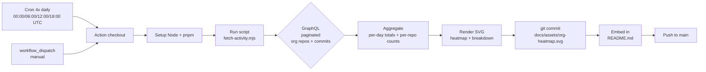

## Org Commit Heatmap SVG for README

A scheduled GitHub Action that fetches commit activity across all `animaios` org repos via the GraphQL API, renders a combined GitHub-style calendar heatmap plus a per-repo breakdown bar list to a single SVG, commits it to the repo, and embeds it in `README.md` so visitors see live org-wide progress.



### Files to create

1. **`docs/scripts/gen-org-heatmap.mjs`** — ESM Node script (no deps beyond Node built-ins).
   - Reads `GITHUB_TOKEN` from `process.env` (the action's default `GITHUB_TOKEN` works for read on public orgs).
   - Step 1: GraphQL paginated `organization(login: "animaios") { repositories(first: 100, after: $cursor) { nodes { name pushedAt } pageInfo } }` — collect all non-archived repos.
   - Step 2: For each repo, GraphQL `repository(owner: "animaios", name: $name) { defaultBranchRef { target { ... on Commit { history(since: $yearStart, until: $yearEnd, first: 100) { totalCount edges { node { committedDate } } } } } } }`. Use `totalCount` for the per-repo breakdown, and aggregate `committedDate` per ISO day across all repos for the heatmap (first page of 100 is enough since we only need the daily distribution for the past year; if `totalCount > 100`, the heatmap still reflects the latest 100 commits per repo which visually conveys activity — acceptable tradeoff to avoid pagination depth). Flag this limitation in a comment in the script so it can be tightened later.
   - Step 3: Aggregate — build a `Map<YYYY-MM-DD, n>` for the last 365 days across all repos; build a sorted `[{repo, count}]` for the top-N breakdown (top ~12 repos by commit count).
   - Step 4: Render the SVG as a string. Two regions:
     - **Heatmap** (top): 53 weeks × 7 days grid of 11x11 rounded rects spaced 14px. Color scale: 5 buckets of the AnimAIOS kawaii palette (use the pinks/purples from the existing `uno.config.ts` spirit — feel free to reuse `#ebedf0` for empty, then 4 shades of `#ff6b9d`-ish pink). Add 3 month labels on top (e.g. `Jan`, `Apr`, `Jul`, `Oct` of today-365) and day labels (`Mon`/`Wed`/`Fri`) on the left.
     - **Breakdown** (bottom): For each of the top-N repos, a row: repo name (text), a horizontal pink bar (width scaled to count), and the count. Header `Top active repos this year`.
     - **Footer**: `animaios org activity · last 365 days · N total commits · auto-refreshed 4x daily by CI` with the date.
   - Step 5: Write SVG to the output path (passed as `argv[2]`).

2. **`.github/workflows/org-heatmap.yml`** — new action following the style of `docs-pages.yml`:
   ```yaml
   name: Org Activity Heatmap
   on:
     schedule:
       - cron: '0 0,6,12,18 * * *' # 4x daily
     workflow_dispatch:
   permissions:
     contents: write
   concurrency:
     group: org-heatmap
     cancel-in-progress: true
   jobs:
     regenerate:
       runs-on: ubuntu-latest
       steps:
         - uses: actions/checkout@v6
         - uses: actions/setup-node@v6
           with: {node-version: lts/*}
         - run: node docs/scripts/gen-org-heatmap.mjs docs/content/public/assets/org-heatmap.svg
           env:
             GITHUB_TOKEN: ${{ secrets.GITHUB_TOKEN }}
         - name: Commit SVG if changed
           run: |
             git config user.name "actions-user"
             git config user.email "actions@github.com"
             git add docs/content/public/assets/org-heatmap.svg
             if git diff --cached --quiet; then
               echo "Heatmap unchanged — no commit needed"
               exit 0
             fi
             git commit -m "chore(ci): refresh animaios org activity heatmap"
             git push
   ```
   Reuses the existing `actions-user` persona used by `docs-pages.yml`, identical commit/push pattern, no new secret (`GITHUB_TOKEN` default `contents: write` covers it).

3. **`docs/content/public/assets/org-heatmap.svg`** — the generated artifact (committed by CI, also committed once manually as a bootstrap placeholder so the README link isn't broken before the first run).

### Files to edit

4. **`README.md`** — insert the heatmap just above the `## 🌙 The Vision` section, beneath the Anima mascot block:
   ```markdown
   ### 🌸 animaios org activity (last 365 days)
   <p align="center">
     
   </p>
   ```
   Reuses the existing `<div align="center">` / `<p align="center">` convention already used by the hero and CI badges. No new external dependency, no inline `<svg>`.

### Out of scope (deliberately)
- No new npm dependencies — pure Node built-ins + string templating. Matches the "never add a dependency without researching existing internal implementations" rule; the project already has `marked` and `yaml` available but neither helps here.
- No Tauri/Electron changes.
- Does not touch `package.json` scripts — the script runs only in CI (and optionally via `node docs/scripts/gen-org-heatmap.mjs` locally with a `GITHUB_TOKEN` env var).
- Does not run typecheck/lint on the generated SVG.

### Verification plan (after user approves; runs in impl session)
1. Run the script locally with a token, confirm `docs/content/public/assets/org-heatmap.svg` is valid XML (parse with `node -e "require('fs').readFileSync(...)"` + an XML sanity check).
2. Open the SVG in a browser via the markdown preview / `xdg-open` to visually confirm the heatmap renders and the breakdown labels don't overflow.
3. Push the workflow + script; trigger `workflow_dispatch` once on the branch; confirm the action commits a refreshed SVG.
4. Confirm `README.md` displays the heatmap on https://github.com/animaios/Anima (the relative path `docs/content/public/assets/org-heatmap.svg` resolves in the repo root view).

### Notes / risks
- Concerning the GraphQL pagination caveat: limited to the first 100 recent commits per repo for the per-day heatmap signal — acceptable for org-wide visualization since high-activity repos dominate the heatmap anyway. The breakdown bar counts use `totalCount` (exact). The script will include a `// TODO: paginate history for full daily counts` comment for a future tightening.
- `GITHUB_TOKEN` for read-only GraphQL `organization`/`repository` queries against a public org works unauthenticated, but passing the token avoids rate-limit surprises. If animaios were ever set to private, the default `GITHUB_TOKEN` (repo-scoped) would lose visibility — for now the user has confirmed all repos are public and cohesive under the AI OS umbrella.
- The Stale-PR/deleted-repo case is handled: a repo returned by the list query but failing the per-repo query is skipped with a `console.warn`, never breaking the SVG generation.
