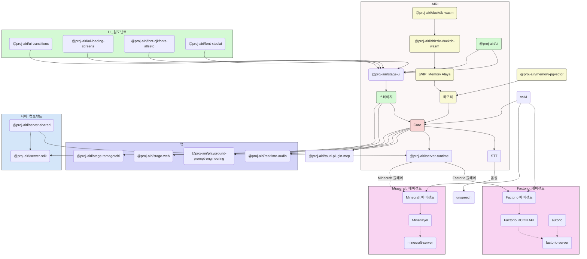

<picture>
  <source
    width="100%"
    srcset="./content/public/banner-dark-1280x640.avif"
    media="(prefers-color-scheme: dark)"
  />
  <source
    width="100%"
    srcset="./content/public/banner-light-1280x640.avif"
    media="(prefers-color-scheme: light), (prefers-color-scheme: no-preference)"
  />
  
</picture>

<h1 align="center">Project AIRI</h1>

<p align="center">Neuro-sama를 재현하여, AI 와이프 / 가상 캐릭터의 영혼 그릇을 우리 세상으로 가져옵니다.</p>

<p align="center">
  [<a href="https://discord.gg/TgQ3Cu2F7A">Discord 서버 참여</a>] [<a href="https://airi.moeru.ai">체험하기</a>] [<a href="https://github.com/moeru-ai/airi/blob/main/README.md">English</a>] [<a href="https://github.com/moeru-ai/airi/blob/main/docs/README.zh-CN.md">简体中文</a>] [<a href="https://github.com/moeru-ai/airi/blob/main/docs/README.ja-JP.md">日本語</a>] [<a href="https://github.com/moeru-ai/airi/blob/main/docs/README.ru-RU.md">Русский</a>] [<a href="https://github.com/moeru-ai/airi/blob/main/docs/README.vi.md">Tiếng Việt</a>] [<a href="https://github.com/moeru-ai/airi/blob/main/docs/README.fr.md">Français</a>] [<a href="https://github.com/moeru-ai/airi/blob/main/docs/README.ko-KR.md">한국어</a>]
</p>

<p align="center">
  <a href="https://deepwiki.com/moeru-ai/airi"></a>
  <a href="https://github.com/moeru-ai/airi/blob/main/LICENSE"></a>
  <a href="https://discord.gg/TgQ3Cu2F7A"></a>
  <a href="https://x.com/proj_airi"></a>
  <a href="https://t.me/+7M_ZKO3zUHFlOThh"></a>
  <a href="./wechat.md"></a>
  <a href="https://qun.qq.com/universal-share/share?ac=1&authKey=9g00d%2BZS7nORzcJugNNddJ7rCghZTIR7fhXabGwch2S%2BG%2BKGIKwlN1N2nIqkh2jg&busi_data=eyJncm91cENvZGUiOiIxMDU4MTU2Njk3IiwidG9rZW4iOiJmcnkra1hWNFIxNytEcG0zcHRUdVJIaldlRDFxN0dzK080QWtvTEdOQjJkNEY2eUFta1g1clNpbkxSMS9FQWFYIiwidWluIjoiMTI2MDkwNzMzNSJ9&data=b1eJrwn3GVOUh7YIxZ7l9vHQo99HPmRxKPpMKlDCmfzx8Y57IXb2EZCMaOC9rVTd2U558qpNjwUYUWlPHxVHvg&svctype=4&tempid=h5_group_info"></a>
</p>

<p align="center">
  <a href="https://www.producthunt.com/products/airi?embed=true&utm_source=badge-featured&utm_medium=badge&utm_source=badge-airi" target="_blank"></a>
  <a href="https://trendshift.io/repositories/14636" target="_blank"></a>
</p>

> [Neuro-sama](https://www.youtube.com/@Neurosama)에서 큰 영감을 받았습니다

> [!WARNING]
> **주의:**
> 본 프로젝트와 관련된 공식 암호화폐나 토큰은 **일절 발행하지 않았습니다**. 관련 정보에 주의하시고 신중하게 판단해 주세요.

> [!NOTE]
>
> Project AIRI에서 탄생한 모든 하위 프로젝트를 위한 전용 조직 [@proj-airi](https://github.com/proj-airi)가 있습니다. 확인해 보세요!
>
> RAG, 메모리 시스템, 임베디드 데이터베이스, 아이콘, Live2D 유틸리티 등 다양한 프로젝트가 있습니다!

> [!TIP]
> [Crowdin](https://crowdin.com/project/proj-airi)에 번역 프로젝트가 있습니다. 번역이 부정확하다고 느끼시면 자유롭게 기여해 주세요.
> <a href="https://crowdin.com/project/proj-airi" target="_blank" rel="nofollow"></a>

사이버 생명체(사이버 와이프, 디지털 펫)나 함께 놀고 대화할 수 있는 디지털 동반자를 꿈꿔 본 적이 있으신가요?

[ChatGPT](https://chatgpt.com)나 유명한 [Claude](https://claude.ai) 같은 최신 대규모 언어 모델의 힘을 빌려, 가상 존재에게 역할극과 대화를 요청하는 것은 이미 누구나 쉽게 할 수 있는 일이 되었습니다. [Character.ai (c.ai)](https://character.ai)나 [JanitorAI](https://janitorai.com/) 같은 플랫폼, 그리고 [SillyTavern](https://github.com/SillyTavern/SillyTavern) 같은 로컬 환경은 채팅 기반이나 비주얼 어드벤처 게임과 같은 경험을 위한 충분한 솔루션이 되고 있습니다.

> 하지만, 게임을 플레이하는 능력은요? 당신이 코딩하는 것을 볼 수 있고, 게임을 하면서 채팅하고, 영상을 보고, 그 외에도 많은 것을 할 수 있는 능력은?

아마 [Neuro-sama](https://www.youtube.com/@Neurosama)를 이미 알고 계실 겁니다. 그녀는 현재 게임을 플레이하고, 채팅하고, 여러분 및 참여자들과 상호작용할 수 있는 최고의 AI VTuber / 동반자입니다. 이런 존재를 "디지털 휴먼"이라고 부르기도 합니다. **안타깝게도 오픈 소스가 아니기 때문에, 라이브 스트리밍이 끝나면 그녀와 상호작용할 수 없습니다**.

그래서 이 프로젝트 AIRI는 여기서 또 다른 가능성을 제시합니다: **언제 어디서나 쉽게, 당신만의 디지털 라이프, 사이버 생명을 가질 수 있도록**.

## 게시한 DevLog 및 최근 업데이트

- [DevLog @ 2026.01.01](https://airi.moeru.ai/docs/en/blog/DevLog-2026.01.01/) — 2026년 1월 1일
- [DevLog @ 2025.10.20](https://airi.moeru.ai/docs/en/blog/DevLog-2025.10.20/) — 2025년 10월 20일
- [DevLog @ 2025.08.05](https://airi.moeru.ai/docs/en/blog/DevLog-2025.08.05/) — 2025년 8월 5일
- [DevLog @ 2025.08.01](https://airi.moeru.ai/docs/en/blog/DevLog-2025.08.01/) — 2025년 8월 1일
- [DevLog @ 2025.07.18](https://airi.moeru.ai/docs/en/blog/DevLog-2025.07.18/) — 2025년 7월 18일
- [DreamLog 0x1](https://airi.moeru.ai/docs/en/blog/dreamlog-0x1/) — 2025년 6월 16일
- ...더 많은 내용은 [문서 사이트](https://airi.moeru.ai/docs/en/)에서

## 이 프로젝트의 특별한 점은?

다른 AI 기반 VTuber 오픈 소스 프로젝트와 달리, アイリ VTuber는 개발 첫날부터 [WebGPU](https://www.w3.org/TR/webgpu/), [WebAudio](https://developer.mozilla.org/en-US/docs/Web/API/Web_Audio_API), [Web Workers](https://developer.mozilla.org/en-US/docs/Web/API/Web_Workers_API/Using_web_workers), [WebAssembly](https://webassembly.org/), [WebSocket](https://developer.mozilla.org/en-US/docs/Web/API/WebSocket) 등 다양한 웹 기술을 지원하도록 설계되었습니다.

> [!TIP]
> 웹 기술을 사용하면 성능이 떨어지지 않을까 걱정되시나요?
>
> 걱정하지 마세요. 브라우저 버전은 브라우저와 웹뷰에서 얼마나 많은 것을 할 수 있는지 보여주기 위한 것이지만, 이에 완전히 의존하지는 않습니다. AIRI의 데스크톱 버전은 기본적으로 [NVIDIA CUDA](https://developer.nvidia.com/cuda-toolkit)와 [Apple Metal](https://developer.apple.com/metal/)을 사용할 수 있으며 (HuggingFace와 [candle](https://github.com/huggingface/candle) 프로젝트 덕분에), 복잡한 의존성 관리 없이 사용 가능합니다. 트레이드오프를 고려하여, 그래픽, 레이아웃, 애니메이션, 그리고 WIP 플러그인 시스템에는 부분적으로 웹 기술을 활용하고 있습니다.

이는 **アイリ VTuber가 최신 브라우저와 기기에서 실행 가능**하며, 모바일 기기에서도 작동한다는 것을 의미합니다 (PWA 지원 완료). 이를 통해 개발자들이 アイリ VTuber의 기능을 한 단계 더 끌어올리면서도, 사용자에게 TCP 연결이나 기타 비웹 기술이 필요한 기능을 활성화할 수 있는 유연성을 제공합니다. 예를 들어 Discord 음성 채널에 연결하거나, 친구들과 Minecraft나 Factorio를 함께 플레이할 수 있습니다.

> [!NOTE]
>
> 저희는 아직 개발 초기 단계에 있으며, アイリ VTuber를 현실로 만들기 위해 재능 있는 개발자분들을 찾고 있습니다.
>
> Vue.js, TypeScript 또는 이 프로젝트에 필요한 개발 도구에 익숙하지 않아도 괜찮습니다. 아티스트, 디자이너로 참여하거나, 첫 번째 라이브 스트리밍을 시작하는 데 도움을 줄 수도 있습니다.
>
> React, Svelte, 심지어 Solid를 주로 사용하시더라도 환영합니다. アイリ VTuber에서 보고 싶은 기능을 추가하거나 실험하고 싶은 기능을 위한 하위 디렉토리를 만들 수 있습니다.
>
> 저희가 찾고 있는 분야 (및 관련 프로젝트):
>
> - Live2D 모델러
> - VRM 모델러
> - VRChat 아바타 디자이너
> - 컴퓨터 비전
> - 강화 학습
> - 음성 인식
> - 음성 합성
> - ONNX Runtime
> - Transformers.js
> - vLLM
> - WebGPU
> - Three.js
> - WebXR (@moeru-ai 조직의 [다른 프로젝트](https://github.com/moeru-ai/chat)도 확인해 보세요)
>
> **관심이 있으시다면, 여기서 자기소개를 해보시는 건 어떨까요? [Would like to join part of us to build AIRI?](https://github.com/moeru-ai/airi/discussions/33)**

## 현재 진행 상황

구현된 기능

- [x] 두뇌
  - [x] [Minecraft](https://www.minecraft.net) 플레이
  - [x] [Factorio](https://www.factorio.com) 플레이 (진행 중, [PoC 및 데모 제공](https://github.com/moeru-ai/airi-factorio))
  - [x] [Telegram](https://telegram.org)에서 채팅
  - [x] [Discord](https://discord.com)에서 채팅
  - [ ] 메모리
    - [x] 순수 브라우저 내 데이터베이스 지원 (DuckDB WASM | `pglite`)
    - [ ] Memory Alaya (진행 중)
  - [ ] 순수 브라우저 내 로컬 (WebGPU) 추론
- [x] 귀
  - [x] 브라우저에서 음성 입력
  - [x] [Discord](https://discord.com)에서 음성 입력
  - [x] 클라이언트 측 음성 인식
  - [x] 클라이언트 측 말하기 감지
- [x] 입
  - [x] [ElevenLabs](https://elevenlabs.io/) 음성 합성
- [x] 몸
  - [x] VRM 지원
    - [x] VRM 모델 제어
  - [x] VRM 모델 애니메이션
    - [x] 자동 눈 깜빡임
    - [x] 자동 시선 추적
    - [x] 대기 상태 시선 이동
  - [x] Live2D 지원
    - [x] Live2D 모델 제어
  - [x] Live2D 모델 애니메이션
    - [x] 자동 눈 깜빡임
    - [x] 자동 시선 추적
    - [x] 대기 상태 시선 이동

## 개발

> 이 프로젝트의 상세한 개발 가이드는 [CONTRIBUTING.md](../.github/CONTRIBUTING.md)를 참조하세요

> [!NOTE]
> 기본적으로 `pnpm dev`는 Stage Web(브라우저 버전)의 개발 서버를 시작합니다. 데스크톱 버전을 개발하고 싶으시다면, [CONTRIBUTING.md](../.github/CONTRIBUTING.md)를 읽고 환경을 올바르게 설정해 주세요.

```shell
pnpm i
pnpm dev
```

### Stage Web (브라우저 버전, [airi.moeru.ai](https://airi.moeru.ai))

```shell
pnpm dev
```

### Stage Tamagotchi (데스크톱 버전)

```shell
pnpm dev:tamagotchi
```

Tamagotchi용 Nix 패키지도 포함되어 있습니다. flakes를 활성화한 후 다음과 같이 실행할 수 있습니다:

```shell
nix run github:moeru-ai/airi
```

### Stage Pocket (모바일 버전)

Capacitor 웹 버전의 개발 서버를 시작합니다:

```shell
pnpm dev:pocket
```

위 명령어 출력에서 IP 주소를 확인하세요:

```shell
  ROLLDOWN-VITE v7.3.0  ready in 1073 ms

  ➜  Local:   https://localhost:5273/
  ➜  Network: https://<ip-will-be-here>:5273/
  ➜  Vue DevTools: Open https://localhost:5273/__devtools__/ as a separate window
  ➜  Vue DevTools: Press Option(⌥)+Shift(⇧)+D in App to toggle the Vue DevTools
  ➜  UnoCSS Inspector: https://localhost:5273/__unocss/
```

Xcode 프로젝트를 엽니다:

```shell
CAPACITOR_DEV_SERVER_URL=https://<your-ip-address>:5273 pnpm open:ios
```

그러면 Xcode가 열리고 "Run" 버튼을 클릭하여 iPhone에서 앱을 실행할 수 있습니다.

무선 모드에서 Pocket의 서버 채널에 연결해야 하는 경우, Tamagotchi를 루트 권한으로 시작해야 합니다:

```shell
sudo pnpm dev:tamagotchi
```

그런 다음 Tamagotchi의 `settings/system/general`에서 보안 웹소켓을 활성화하세요.

### 문서 사이트

```shell
pnpm dev:docs
```

### 배포

`bumpp` 실행 후 `Cargo.toml`의 버전도 업데이트하세요:

```shell
npx bumpp --no-commit --no-tag
```

## LLM API 프로바이더 지원 ([xsai](https://github.com/moeru-ai/xsai) 기반)

- [x] [302.AI (후원)](https://share.302.ai/514k2v)
- [x] [OpenRouter](https://openrouter.ai/)
- [x] [vLLM](https://github.com/vllm-project/vllm)
- [x] [SGLang](https://github.com/sgl-project/sglang)
- [x] [Ollama](https://github.com/ollama/ollama)
- [x] [Google Gemini](https://developers.generativeai.google)
- [x] [OpenAI](https://platform.openai.com/docs/guides/gpt/chat-completions-api)
  - [ ] [Azure OpenAI API](https://learn.microsoft.com/en-us/azure/ai-services/openai/reference) (PR 환영)
- [x] [Anthropic Claude](https://anthropic.com)
  - [ ] [AWS Claude](https://docs.anthropic.com/en/api/claude-on-amazon-bedrock) (PR 환영)
- [x] [DeepSeek](https://www.deepseek.com/)
- [x] [Qwen](https://help.aliyun.com/document_detail/2400395.html)
- [x] [xAI](https://x.ai/)
- [x] [Groq](https://wow.groq.com/)
- [x] [Mistral](https://mistral.ai/)
- [x] [Cloudflare Workers AI](https://developers.cloudflare.com/workers-ai/)
- [x] [Together.ai](https://www.together.ai/)
- [x] [Fireworks.ai](https://www.together.ai/)
- [x] [Novita](https://www.novita.ai/)
- [x] [Zhipu](https://bigmodel.cn)
- [x] [SiliconFlow](https://cloud.siliconflow.cn/i/rKXmRobW)
- [x] [Stepfun](https://platform.stepfun.com/)
- [x] [Baichuan](https://platform.baichuan-ai.com)
- [x] [Minimax](https://api.minimax.chat/)
- [x] [Moonshot AI](https://platform.moonshot.cn/)
- [x] [ModelScope](https://modelscope.cn/docs/model-service/API-Inference/intro)
- [x] [Player2](https://player2.game/)
- [x] [Tencent Cloud](https://cloud.tencent.com/document/product/1729)
- [ ] [Sparks](https://www.xfyun.cn/doc/spark/Web.html) (PR 환영)
- [ ] [Volcano Engine](https://www.volcengine.com/experience/ark?utm_term=202502dsinvite&ac=DSASUQY5&rc=2QXCA1VI) (PR 환영)

## 이 프로젝트에서 탄생한 하위 프로젝트

- [Awesome AI VTuber](https://github.com/proj-airi/awesome-ai-vtuber): AI VTuber 및 관련 프로젝트의 큐레이션 목록
- [`unspeech`](https://github.com/moeru-ai/unspeech): `/audio/transcriptions` 및 `/audio/speech`를 위한 범용 엔드포인트 프록시 서버, LiteLLM과 유사하지만 모든 ASR 및 TTS에 대응
- [`hfup`](https://github.com/moeru-ai/hfup): HuggingFace Spaces로의 배포 및 번들링을 지원하는 도구
- [`xsai-transformers`](https://github.com/moeru-ai/xsai-transformers): [xsAI](https://github.com/moeru-ai/xsai)용 실험적 [Transformers.js](https://github.com/huggingface/transformers.js) 프로바이더
- [WebAI: Realtime Voice Chat](https://github.com/proj-airi/webai-realtime-voice-chat): VAD + STT + LLM + TTS로 ChatGPT 실시간 음성을 처음부터 구현한 완전한 예제
- [`@proj-airi/drizzle-duckdb-wasm`](https://github.com/moeru-ai/airi/tree/main/packages/drizzle-duckdb-wasm/README.md): DuckDB WASM용 Drizzle ORM 드라이버
- [`@proj-airi/duckdb-wasm`](https://github.com/moeru-ai/airi/tree/main/packages/duckdb-wasm/README.md): 사용하기 쉬운 `@duckdb/duckdb-wasm` 래퍼
- [`tauri-plugin-mcp`](https://github.com/moeru-ai/airi/blob/main/crates/tauri-plugin-mcp/README.md): MCP 서버와 상호작용하기 위한 Tauri 플러그인
- [AIRI Factorio](https://github.com/moeru-ai/airi-factorio): AIRI가 Factorio를 플레이할 수 있게 하는 프로젝트
- [Factorio RCON API](https://github.com/nekomeowww/factorio-rcon-api): Factorio 헤드리스 서버 콘솔용 RESTful API 래퍼
- [`autorio`](https://github.com/moeru-ai/airi-factorio/tree/main/packages/autorio): Factorio 자동화 라이브러리
- [`tstl-plugin-reload-factorio-mod`](https://github.com/moeru-ai/airi-factorio/tree/main/packages/tstl-plugin-reload-factorio-mod): 개발 중 Factorio 모드 리로드 지원
- [Velin](https://github.com/luoling8192/velin): Vue SFC와 Markdown으로 관리하기 쉬운 상태 기반 LLM 프롬프트 작성
- [`demodel`](https://github.com/moeru-ai/demodel): 다양한 추론 런타임에서 모델과 데이터셋 다운로드를 간편하게 가속
- [`inventory`](https://github.com/moeru-ai/inventory): 중앙 집중식 모델 카탈로그 및 기본 프로바이더 설정 백엔드 서비스
- [MCP Launcher](https://github.com/moeru-ai/mcp-launcher): 모든 MCP 서버를 쉽게 빌드하고 실행하는 런처, 모델 세계의 Ollama 같은 존재!
- [SAD](https://github.com/moeru-ai/sad): 셀프 호스팅 및 브라우저에서 LLM을 실행하기 위한 문서 및 노트



## 유사 프로젝트

### 오픈 소스

- [kimjammer/Neuro: A recreation of Neuro-Sama originally created in 7 days.](https://github.com/kimjammer/Neuro): 매우 완성도 높은 구현
- [SugarcaneDefender/z-waif](https://github.com/SugarcaneDefender/z-waif): 게임, 자율 에이전트, 프롬프트 엔지니어링에 뛰어남
- [semperai/amica](https://github.com/semperai/amica/): VRM, WebXR에 뛰어남
- [elizaOS/eliza](https://github.com/elizaOS/eliza): 에이전트를 다양한 시스템 및 API에 통합하는 훌륭한 예시
- [ardha27/AI-Waifu-Vtuber](https://github.com/ardha27/AI-Waifu-Vtuber): Twitch API 통합에 뛰어남
- [InsanityLabs/AIVTuber](https://github.com/InsanityLabs/AIVTuber): 훌륭한 UI/UX
- [IRedDragonICY/vixevia](https://github.com/IRedDragonICY/vixevia)
- [t41372/Open-LLM-VTuber](https://github.com/t41372/Open-LLM-VTuber)
- [PeterH0323/Streamer-Sales](https://github.com/PeterH0323/Streamer-Sales)

### 비오픈 소스

- https://clips.twitch.tv/WanderingCaringDeerDxCat-Qt55xtiGDSoNmDDr https://www.youtube.com/watch?v=8Giv5mupJNE
- https://clips.twitch.tv/TriangularAthleticBunnySoonerLater-SXpBk1dFso21VcWD
- https://www.youtube.com/@NOWA_Mirai

## 프로젝트 현황


## 감사의 말

- [Reka UI](https://github.com/unovue/reka-ui): 문서 사이트 디자인에 활용, 새로운 랜딩 페이지도 이를 기반으로 하며, 수많은 UI 컴포넌트 구현에 감사합니다. (shadcn-vue가 Reka UI를 헤드리스로 사용하고 있으니 확인해 보세요!)
- [pixiv/ChatVRM](https://github.com/pixiv/ChatVRM)
- [josephrocca/ChatVRM-js: A JS conversion/adaptation of parts of the ChatVRM (TypeScript) code for standalone use in OpenCharacters and elsewhere](https://github.com/josephrocca/ChatVRM-js)
- UI 및 스타일 디자인은 [Cookard](https://store.steampowered.com/app/2919650/Cookard/), [UNBEATABLE](https://store.steampowered.com/app/2240620/UNBEATABLE/), [Sensei! I like you so much!](https://store.steampowered.com/app/2957700/_/), 그리고 [Ayame by Mercedes Bazan](https://dribbble.com/shots/22157656-Ayame) 및 [Wish by Mercedes Bazan](https://dribbble.com/shots/24501019-Wish)의 작품에서 영감을 받았습니다
- [mallorbc/whisper_mic](https://github.com/mallorbc/whisper_mic)
- [`xsai`](https://github.com/moeru-ai/xsai): LLM 및 모델과 상호작용하기 위한 다양한 패키지를 구현, [Vercel AI SDK](https://sdk.vercel.ai/)와 비슷하지만 훨씬 작습니다

## 스타 히스토리

[](https://www.star-history.com/#moeru-ai/airi&Date)
