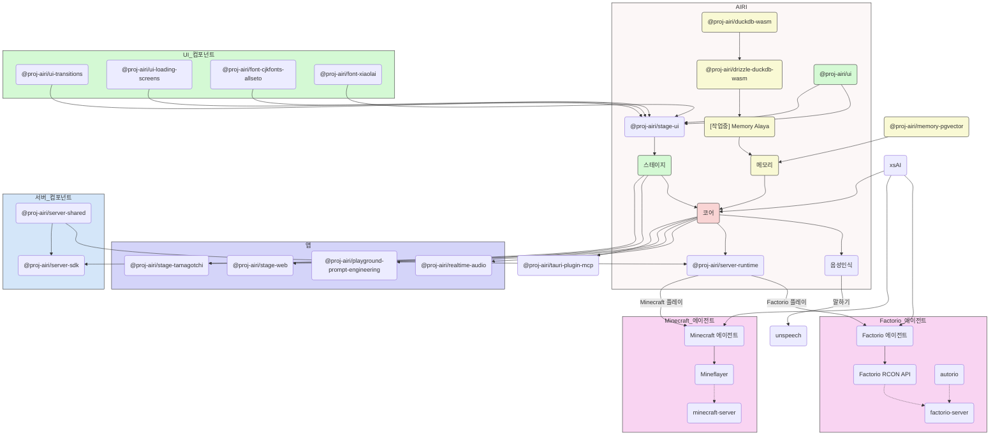

<picture>
  <source
    width="100%"
    srcset="./content/public/banner-dark-1280x640.avif"
    media="(prefers-color-scheme: dark)"
  />
  <source
    width="100%"
    srcset="./content/public/banner-light-1280x640.avif"
    media="(prefers-color-scheme: light), (prefers-color-scheme: no-preference)"
  />
  
</picture>

<h1 align="center">Project AIRI</h1>

<p align="center">Neuro-sama를 재창조하여, AI 와이푸/가상 캐릭터들의 영혼을 담은 컨테이너를 우리의 세계로 불러오는 프로젝트입니다.</p>

<p align="center">
  [<a href="https://discord.gg/TgQ3Cu2F7A">Discord 서버 참여</a>] [<a href="https://airi.moeru.ai">체험해보기</a>] [<a href="../README.md">English</a>] [<a href="./README.zh-CN.md">简体中文</a>] [<a href="./README.ja-JP.md">日本語</a>]
</p>

<p align="center">
  <a href="https://deepwiki.com/moeru-ai/airi"></a>
  <a href="https://github.com/moeru-ai/airi/blob/main/LICENSE"></a>
  <a href="https://discord.gg/TgQ3Cu2F7A"></a>
  <a href="https://x.com/proj_airi"></a>
  <a href="https://t.me/+7M_ZKO3zUHFlOThh"></a>
</p>

<p align="center">
  <a href="https://www.producthunt.com/products/airi?embed=true&utm_source=badge-featured&utm_medium=badge&utm_source=badge-airi" target="_blank"></a>
  <a href="https://trendshift.io/repositories/14636" target="_blank"></a>
</p>

> [Neuro-sama](https://www.youtube.com/@Neurosama)에서 큰 영감을 받았습니다

> [!WARNING]
> **주의:** 본 프로젝트와 연관된 **공식 암호화폐나 토큰은 발행하지 않습니다**. 정보를 확인하고 주의 깊게 진행하시기 바랍니다.

> [!NOTE]
>
> Project AIRI에서 탄생한 모든 서브프로젝트를 위한 전용 조직 [@proj-airi](https://github.com/proj-airi)가 있습니다. 확인해보세요!
>
> RAG, 메모리 시스템, 임베디드 데이터베이스, 아이콘, Live2D 유틸리티 등이 있습니다!

사이버 생명체(사이버 와이푸/허스벤드, 디지털 펫) 또는 당신과 놀고 대화할 수 있는 디지털 동반자를 꿈꿔본 적이 있나요?

[ChatGPT](https://chatgpt.com)와 유명한 [Claude](https://claude.ai) 같은 현대 대규모 언어 모델의 힘으로, 가상 존재가 롤플레잉을 하고 채팅하는 것은 이미 누구나 쉽게 할 수 있게 되었습니다. [Character.ai (일명 c.ai)](https://character.ai)와 [JanitorAI](https://janitorai.com/), 그리고 [SillyTavern](https://github.com/SillyTavern/SillyTavern) 같은 로컬 플레이그라운드는 채팅 기반 또는 비주얼 어드벤처 게임 같은 경험을 위한 충분한 솔루션입니다.

> 하지만 게임을 플레이하는 능력은 어떨까요? 당신이 코딩하는 것을 보고, 게임을 하면서 채팅하고, 동영상을 시청하며, 다른 많은 일들을 할 수 있는 능력은?

아마 [Neuro-sama](https://www.youtube.com/@Neurosama)를 이미 알고 계실 겁니다. 그녀는 현재 게임을 플레이하고, 채팅하며, 당신과 참가자들(VTuber 커뮤니티에서)과 상호작용할 수 있는 최고의 동반자입니다. 일부는 이런 존재를 "디지털 휴먼"이라고도 부릅니다. **안타깝게도, 오픈소스가 아니며, 라이브 스트림에서 오프라인이 되면 그녀와 상호작용할 수 없습니다**.

따라서 이 프로젝트 AIRI는 여기서 또 다른 가능성을 제공합니다: **쉽게, 어디서나, 언제든지 당신만의 디지털 라이프, 사이버 생명을 소유할 수 있게 합니다**.

## 데브로그 및 최근 업데이트

- [DevLog @ 2025.07.18](https://airi.moeru.ai/docs/blog/DevLog-2025.07.18/) - 2025년 7월 18일
- [DreamLog 0x1](https://airi.moeru.ai/docs/blog/dreamlog-0x1/) ([로컬 문서](./content/ko/blog/DreamLog-0x1/index.md)) - 2025년 6월 16일
- [DevLog @ 2025.06.08](https://airi.moeru.ai/docs/blog/DevLog-2025.06.08/) - 2025년 6월 8일
- [DevLog @ 2025.05.16](https://airi.moeru.ai/docs/blog/DevLog-2025.05.16/) - 2025년 5월 16일
- ...더 많은 내용은 [문서 사이트](https://airi.moeru.ai/docs)에서

## 📚 한국어 문서

> 🌐 **웹 문서**: [airi.moeru.ai/docs](https://airi.moeru.ai/docs) | 📖 **로컬 문서**: [docs/content/ko](./content/ko)

### 개발자 가이드
- **개요**: [프로젝트 개요](./content/ko/docs/overview/index.md)
- **시작하기**:
  - [웹 버전 가이드](./content/ko/docs/overview/guide/web/index.md)
  - [데스크톱(Tamagotchi) 가이드](./content/ko/docs/overview/guide/tamagotchi/index.md)
- **고급 기능**:
  - [캐릭터 카드 사용법](./content/ko/docs/overview/guide/character-cards.md)
- **기여하기**: [기여 가이드](./content/ko/docs/overview/contributing/index.md)

### 블로그 및 업데이트
- [DreamLog 0x1](./content/ko/blog/DreamLog-0x1/index.md) - AI VTuber의 꿈과 비전

## 이 프로젝트의 특별한 점은?

다른 AI 기반 VTuber 오픈소스 프로젝트와 달리, アイリ VTuber는 개발 첫날부터 [WebGPU](https://www.w3.org/TR/webgpu/), [WebAudio](https://developer.mozilla.org/en-US/docs/Web/API/Web_Audio_API), [Web Workers](https://developer.mozilla.org/en-US/docs/Web/API/Web_Workers_API/Using_web_workers), [WebAssembly](https://webassembly.org/), [WebSocket](https://developer.mozilla.org/en-US/docs/Web/API/WebSocket) 등과 같은 많은 웹 기술 지원으로 구축되었습니다.

> [!TIP]
> 웹 관련 기술을 사용하기 때문에 성능 저하가 걱정되시나요?
>
> 걱정하지 마세요! 웹 브라우저 버전은 브라우저와 웹뷰 내에서 얼마나 많은 것을 할 수 있는지에 대한 통찰을 제공하기 위한 것이지만, 우리는 이것에만 완전히 의존하지 않습니다. AIRI의 데스크톱 버전은 기본적으로 네이티브 [NVIDIA CUDA](https://developer.nvidia.com/cuda-toolkit)와 [Apple Metal](https://developer.apple.com/metal/)을 사용할 수 있습니다(HuggingFace와 사랑받는 [candle](https://github.com/huggingface/candle) 프로젝트 덕분에). 복잡한 의존성 관리 없이, 트레이드오프를 고려하여 그래픽, 레이아웃, 애니메이션, 그리고 진행 중인 플러그인 시스템을 위한 웹 기술로 부분적으로 구동됩니다.

이는 **アイリ VTuber가 현대 브라우저와 디바이스에서 실행될 수 있고**, 심지어 모바일 디바이스(PWA 지원 완료)에서도 실행될 수 있음을 의미합니다. 이는 우리(개발자들)에게 アイリ VTuber의 능력을 다음 단계로 구축하고 확장할 수 있는 많은 가능성을 가져다 주면서도, 사용자들이 TCP 연결이나 Discord 음성 채널 연결, 또는 친구들과 Minecraft나 Factorio를 플레이하는 것과 같은 다른 비웹 기술이 필요한 기능을 활성화할 수 있는 유연성을 남겨둡니다.

> [!NOTE]
>
> 우리는 アイリ VTuber를 현실로 만들기 위해 함께 해줄 재능 있는 개발자들을 찾고 있는 개발 초기 단계입니다.
>
> Vue.js, TypeScript, 그리고 이 프로젝트에 필요한 개발 도구에 익숙하지 않아도 괜찮습니다. 아티스트, 디자이너로 참여하거나 첫 라이브 스트림을 시작하는 데 도움을 줄 수도 있습니다.
>
> React나 Svelte, 심지어 Solid의 열렬한 팬이어도 환영합니다. 서브디렉토리를 열어 アイリ VTuber에서 보고 싶은 기능이나 실험하고 싶은 기능을 추가할 수 있습니다.
>
> 우리가 찾고 있는 분야 (및 관련 프로젝트):
>
> - Live2D 모델러
> - VRM 모델러
> - VRChat 아바타 디자이너
> - 컴퓨터 비전
> - 강화 학습
> - 음성 인식
> - 음성 합성
> - ONNX Runtime
> - Transformers.js
> - vLLM
> - WebGPU
> - Three.js
> - WebXR (@moeru-ai 조직의 [다른 프로젝트](https://github.com/moeru-ai/chat)도 확인해보세요)
>
> **관심이 있으시다면, 여기서 자기소개를 해보는 것은 어떨까요? [AIRI 구축에 함께 참여하고 싶으신가요?](https://github.com/moeru-ai/airi/discussions/33)**

## 현재 진행 상황


가능한 기능들

- [x] 뇌
  - [x] [Minecraft](https://www.minecraft.net) 플레이
  - [x] [Factorio](https://www.factorio.com) 플레이 (작업 중, [PoC 및 데모 사용 가능](https://github.com/moeru-ai/airi-factorio))
  - [x] [Telegram](https://telegram.org)에서 채팅
  - [x] [Discord](https://discord.com)에서 채팅
  - [ ] 메모리
    - [x] 순수 브라우저 내 데이터베이스 지원 (DuckDB WASM | `pglite`)
    - [ ] 메모리 Alaya (작업 중)
  - [ ] 순수 브라우저 내 로컬 (WebGPU) 추론
- [x] 귀
  - [x] 브라우저에서 오디오 입력
  - [x] [Discord](https://discord.com)에서 오디오 입력
  - [x] 클라이언트 측 음성 인식
  - [x] 클라이언트 측 대화 감지
- [x] 입
  - [x] [ElevenLabs](https://elevenlabs.io/) 음성 합성
- [x] 몸
  - [x] VRM 지원
    - [x] VRM 모델 제어
  - [x] VRM 모델 애니메이션
    - [x] 자동 깜빡임
    - [x] 자동 시선 추적
    - [x] 유휴 시 눈 움직임
  - [x] Live2D 지원
    - [x] Live2D 모델 제어
  - [x] Live2D 모델 애니메이션
    - [x] 자동 깜빡임
    - [x] 자동 시선 추적
    - [x] 유휴 시 눈 움직임

## 개발

> 이 프로젝트 개발에 대한 자세한 지침은 [CONTRIBUTING.md](./.github/CONTRIBUTING.md)를 따르세요

> [!NOTE]
> 기본적으로 `pnpm dev`는 Stage Web(브라우저 버전)의 개발 서버를 시작합니다. 데스크톱 버전 개발을 시도하고 싶다면, [CONTRIBUTING.md](./.github/CONTRIBUTING.md)를 읽고 환경을 올바르게 설정했는지 확인하세요.

```shell
pnpm i
pnpm dev
```

### Stage Web ([airi.moeru.ai](https://airi.moeru.ai)용 브라우저 버전)

```shell
pnpm dev
```

### Stage Tamagotchi (데스크톱 버전)

```shell
pnpm dev:tamagotchi
```

### 문서 사이트

```shell
pnpm dev:docs
```

### 배포

`bumpp` 실행 후 `Cargo.toml`의 버전을 업데이트하세요:

```shell
npx bumpp --no-commit --no-tag
```

## 지원하는 LLM API 제공업체 ([xsai](https://github.com/moeru-ai/xsai)로 구동)

- [x] [OpenRouter](https://openrouter.ai/)
- [x] [vLLM](https://github.com/vllm-project/vllm)
- [x] [SGLang](https://github.com/sgl-project/sglang)
- [x] [Ollama](https://github.com/ollama/ollama)
- [x] [Google Gemini](https://developers.generativeai.google)
- [x] [OpenAI](https://platform.openai.com/docs/guides/gpt/chat-completions-api)
  - [ ] [Azure OpenAI API](https://learn.microsoft.com/en-us/azure/ai-services/openai/reference) (PR 환영)
- [x] [Anthropic Claude](https://anthropic.com)
  - [ ] [AWS Claude](https://docs.anthropic.com/en/api/claude-on-amazon-bedrock) (PR 환영)
- [x] [DeepSeek](https://www.deepseek.com/)
- [x] [Qwen](https://help.aliyun.com/document_detail/2400395.html)
- [x] [xAI](https://x.ai/)
- [x] [Groq](https://wow.groq.com/)
- [x] [Mistral](https://mistral.ai/)
- [x] [Cloudflare Workers AI](https://developers.cloudflare.com/workers-ai/)
- [x] [Together.ai](https://www.together.ai/)
- [x] [Fireworks.ai](https://www.together.ai/)
- [x] [Novita](https://www.novita.ai/)
- [x] [Zhipu](https://bigmodel.cn)
- [x] [SiliconFlow](https://cloud.siliconflow.cn/i/rKXmRobW)
- [x] [Stepfun](https://platform.stepfun.com/)
- [x] [Baichuan](https://platform.baichuan-ai.com)
- [x] [Minimax](https://api.minimax.chat/)
- [x] [Moonshot AI](https://platform.moonshot.cn/)
- [x] [Player2](https://player2.game/)
- [x] [Tencent Cloud](https://cloud.tencent.com/document/product/1729)
- [ ] [Sparks](https://www.xfyun.cn/doc/spark/Web.html) (PR 환영)
- [ ] [Volcano Engine](https://www.volcengine.com/experience/ark?utm_term=202502dsinvite&ac=DSASUQY5&rc=2QXCA1VI) (PR 환영)

## 이 프로젝트에서 탄생한 서브프로젝트들

- [Awesome AI VTuber](https://github.com/proj-airi/awesome-ai-vtuber): AI VTuber 및 관련 프로젝트의 큐레이션 목록
- [`unspeech`](https://github.com/moeru-ai/unspeech): `/audio/transcriptions`과 `/audio/speech`를 위한 범용 엔드포인트 프록시 서버, LiteLLM과 유사하지만 모든 ASR과 TTS를 위한
- [`hfup`](https://github.com/moeru-ai/hfup): HuggingFace Spaces에 배포, 번들링을 도와주는 도구들
- [`xsai-transformers`](https://github.com/moeru-ai/xsai-transformers): [xsAI](https://github.com/moeru-ai/xsai)를 위한 실험적인 [🤗 Transformers.js](https://github.com/huggingface/transformers.js) 프로바이더
- [WebAI: Realtime Voice Chat](https://github.com/proj-airi/webai-realtime-voice-chat): VAD + STT + LLM + TTS로 ChatGPT의 실시간 음성을 처음부터 구현하는 완전한 예제
- [`@proj-airi/drizzle-duckdb-wasm`](https://github.com/moeru-ai/airi/tree/main/packages/drizzle-duckdb-wasm/README.md): DuckDB WASM용 Drizzle ORM 드라이버
- [`@proj-airi/duckdb-wasm`](https://github.com/moeru-ai/airi/tree/main/packages/duckdb-wasm/README.md): `@duckdb/duckdb-wasm`의 사용하기 쉬운 래퍼
- [`tauri-plugin-mcp`](https://github.com/moeru-ai/airi/blob/main/crates/tauri-plugin-mcp/README.md): MCP 서버와 상호작용하기 위한 Tauri 플러그인
- [AIRI Factorio](https://github.com/moeru-ai/airi-factorio): AIRI가 Factorio를 플레이할 수 있게 해주는 프로젝트
- [Factorio RCON API](https://github.com/nekomeowww/factorio-rcon-api): Factorio 헤드리스 서버 콘솔을 위한 RESTful API 래퍼
- [`autorio`](https://github.com/moeru-ai/airi-factorio/tree/main/packages/autorio): Factorio 자동화 라이브러리
- [`tstl-plugin-reload-factorio-mod`](https://github.com/moeru-ai/airi-factorio/tree/main/packages/tstl-plugin-reload-factorio-mod): Factorio 모드 개발 시 리로드 플러그인
- [Velin](https://github.com/luoling8192/velin): Vue SFC와 Markdown을 사용하여 LLM을 위한 관리하기 쉬운 상태 프롬프트 작성
- [`demodel`](https://github.com/moeru-ai/demodel): 다양한 추론 런타임에서 모델과 데이터셋을 쉽게 부스트하는 속도
- [`inventory`](https://github.com/moeru-ai/inventory): 중앙집중식 모델 카탈로그와 기본 프로바이더 설정 백엔드 서비스
- [MCP Launcher](https://github.com/moeru-ai/mcp-launcher): 모든 가능한 MCP 서버를 위한 사용하기 쉬운 MCP 빌더 & 런처, 모델을 위한 Ollama같은!
- [🥺 SAD](https://github.com/moeru-ai/sad): 셀프호스팅 및 브라우저 실행 LLM을 위한 문서와 노트



## 유사한 프로젝트들

### 오픈소스 프로젝트들

- [kimjammer/Neuro: A recreation of Neuro-Sama originally created in 7 days.](https://github.com/kimjammer/Neuro): 매우 잘 완성된 구현
- [SugarcaneDefender/z-waif](https://github.com/SugarcaneDefender/z-waif): 게임, 자율성, 프롬프트 엔지니어링에 뛰어남
- [semperai/amica](https://github.com/semperai/amica/): VRM, WebXR에 뛰어남
- [elizaOS/eliza](https://github.com/elizaOS/eliza): 에이전트를 다양한 시스템과 API에 통합하는 방법에 대한 훌륭한 예제와 소프트웨어 엔지니어링
- [ardha27/AI-Waifu-Vtuber](https://github.com/ardha27/AI-Waifu-Vtuber): Twitch API 통합에 뛰어남
- [InsanityLabs/AIVTuber](https://github.com/InsanityLabs/AIVTuber): 멋진 UI와 UX
- [IRedDragonICY/vixevia](https://github.com/IRedDragonICY/vixevia)
- [t41372/Open-LLM-VTuber](https://github.com/t41372/Open-LLM-VTuber)
- [PeterH0323/Streamer-Sales](https://github.com/PeterH0323/Streamer-Sales)

### 비오픈소스 프로젝트들

- https://clips.twitch.tv/WanderingCaringDeerDxCat-Qt55xtiGDSoNmDDr https://www.youtube.com/watch?v=8Giv5mupJNE
- https://clips.twitch.tv/TriangularAthleticBunnySoonerLater-SXpBk1dFso21VcWD
- https://www.youtube.com/@NOWA_Mirai

## 프로젝트 상태


## 감사의 말

- [Reka UI](https://github.com/unovue/reka-ui): 문서 사이트 디자인, 새로운 랜딩 페이지가 이를 기반으로 하며, 엄청난 양의 UI 컴포넌트 구현. (shadcn-vue는 Reka UI를 headless로 사용하고 있으니 확인해보세요!)
- [pixiv/ChatVRM](https://github.com/pixiv/ChatVRM)
- [josephrocca/ChatVRM-js: A JS conversion/adaptation of parts of the ChatVRM (TypeScript) code for standalone use in OpenCharacters and elsewhere](https://github.com/josephrocca/ChatVRM-js)
- UI와 스타일 디자인은 [Cookard](https://store.steampowered.com/app/2919650/Cookard/), [UNBEATABLE](https://store.steampowered.com/app/2240620/UNBEATABLE/), [Sensei! I like you so much!](https://store.steampowered.com/app/2957700/_/)의 영감을 받았으며, [Ayame by Mercedes Bazan](https://dribbble.com/shots/22157656-Ayame)과 [Wish by Mercedes Bazan](https://dribbble.com/shots/24501019-Wish)의 아트워크에서 영감을 받았습니다
- [mallorbc/whisper_mic](https://github.com/mallorbc/whisper_mic)
- [`xsai`](https://github.com/moeru-ai/xsai): LLM과 모델과 상호작용하는 상당한 양의 패키지들을 구현했습니다. [Vercel AI SDK](https://sdk.vercel.ai/)와 비슷하지만 훨씬 작습니다.

## 스타 히스토리

[](https://www.star-history.com/#moeru-ai/airi&Date)
