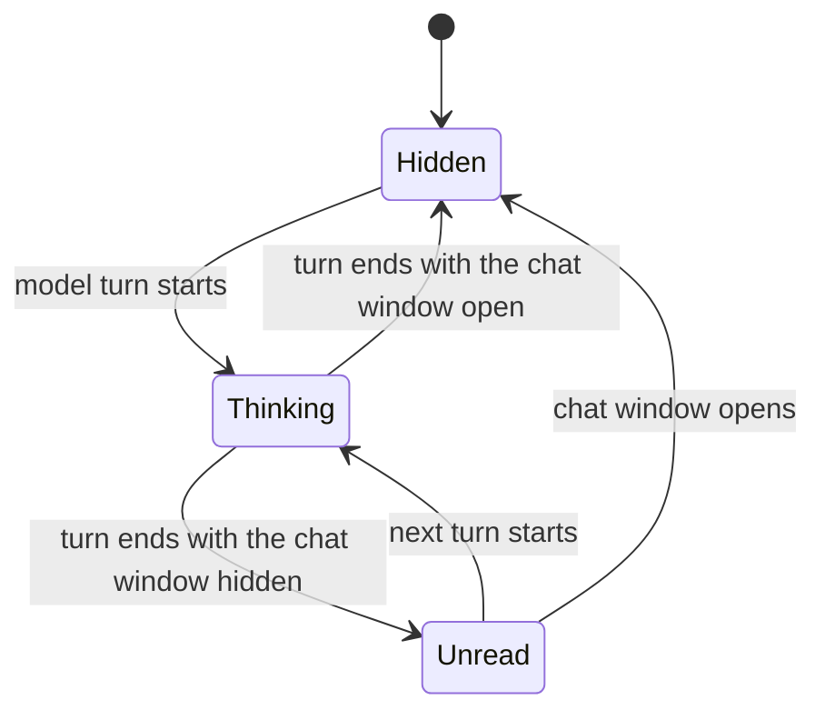

# The presence bubble is drawn inside the model canvas

Status: Proposed

## Context

The desktop main view reports nothing about what AIRI is doing. A model turn
looks the same as an idle window, and messages that arrive while the chat window
is hidden leave no trace on the stage. A user who leaves speech-to-text enabled
can spend provider quota for a long time before anything on screen suggests it.

A first pass drew the bubble as a DOM overlay above the stage canvas. It reads
correctly while the stage runs uncapped, and it desynchronizes as soon as it does
not. `settings/live2d/max-fps` caps the Pixi ticker, so the canvas repaints at the
capped rate while a DOM overlay follows `requestAnimationFrame`. The head and the
bubble then advance on different clocks, and the bubble slides off the head during
motion and window drags.

The stage has three renderers, selected by `stageModelRenderer`: `live2d` on Pixi,
`vrm` on Three, and `tachie` on a static image. There is no shared scene graph
between them.

## Decision

- The bubble is a child of the model's own scene, not a DOM layer over it. The
  head anchor and the bubble are read and written inside the same frame, so a
  frame cap moves both or neither.
- `live2d` and `vrm` each carry their own adapter. `tachie` has no head to follow
  and shows no bubble; it is not a fallback path and reports no error.
- One painter draws the bubble into a 2D canvas, and each adapter uploads that
  canvas as a texture. Appearance, layout and text shaping live in one place, and
  the system font stack keeps CJK digits and future CJK text working without a
  bundled font.
- The bubble is opaque and is not carved out of the alpha hit test. Pixels it
  paints stop the window passing the mouse through, the same as the character.
- The bubble shows one thing at a time, by precedence: thinking, then unread.
  A spoken line will take precedence over both when it lands.
- Unread is a mark and a count, drawn in the same panel the dots use, in the
  accent colour. One shape for both states reads as the character's own bubble
  rather than as a badge stuck to its head. It is not a sentence, and the
  character does not narrate it.

## Anchor resolution

VRM states where the head is: `humanoid.getNormalizedBoneNode('head')` turns and
nods with it. Nothing states how large it is, so the reach is a share of the
model's height, which a humanoid format makes a safe thing to assume. The offset
from the bone to the drawn head follows the bone's own up axis, so a tilted head
stays right.

Live2D states neither. `internalModel.hitAreas` is authored per model and the
models this project ships declare only a body, and drawable ids are written in
the artist's own language, so no name can be matched. The tracker measures the
drawables once and follows the ones it keeps. That selection is a heuristic and
is the weakest part of this design; the authoritative replacement is to perturb
the standard head-angle parameter once and keep whatever moves.

## State model

## Consequences

- The panel and its tail are one outline, traced in a single walk. Drawing them
  as two shapes and relying on the fill to join them leaves a seam that reopens
  at some angles whatever the overlap.
- A translucent, blurred treatment is not available. `backdrop-filter` blurs what
  the DOM composites behind an element, and the canvas has nothing behind it: the
  window is transparent and the desktop is not in the scene. Pixi and Three can
  only blur what the scene already contains. The bubble is therefore drawn as an
  opaque panel.
- The bubble is covered by the resize fix in `Live2DCanvas`, because it is drawn
  in the same frame as the model.
- The bubble needs no `data-ambient-light-opaque` marker. That marker exists for
  overlays outside the canvas; the ambient-light mask reads canvas alpha and
  already counts anything drawn in the scene as AIRI's own pixels.
- Unread requires a read cursor, which this repository does not have. The chat
  window is a separate Electron window and `electronOpenChat` toggles it without
  reporting the result, so the main window cannot currently tell whether the chat
  is visible. That signal has to be added before unread can be correct.
