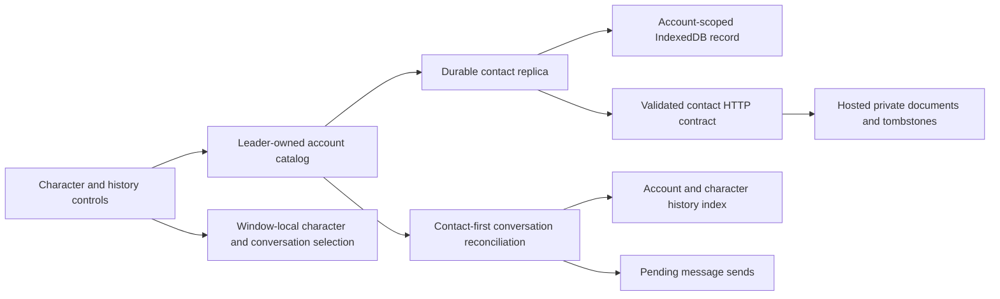
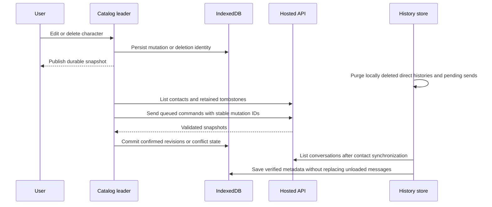

# Account-owned character and conversation synchronization

## Status and scope

This is the client slice after the UI foundation in #2672 and the hosted contract in #2693.
It does not add group reply scheduling or deploy database migrations.
Character names are editable labels. Stable character and contact IDs own direct histories.

## Ownership



```text
packages/stage-ui/src/
  services/contact-replica.ts         durable mutations and revision conflicts
  services/character-document.ts      portable field allowlist
  libs/contact-sync/client.ts        validated authenticated HTTP boundary
  stores/modules/airi-card-catalog.ts leader actions and account activation
  stores/chat/session-store.ts        ownership, assignment, and deletion cleanup
packages/stage-pages/src/pages/settings/airi-card/
  components/character-sync-status.vue conflict choice and retry
  components/DeleteCardDialog.vue      pending state and retryable failure
```

The catalog publishes an account snapshot only after its whole record commits.
Window selection is not part of that snapshot. Account changes hide the previous catalog immediately.
The first signed-in account claims the anonymous catalog. Later accounts use separate catalogs.
Empty model selections continue to inherit global settings.

## Synchronization order



Network failure retains pending commands. Lost responses reuse the mutation ID.
Remote deletion wins over stale edits. Missing list entries do not imply deletion.
Revision conflicts keep both versions until the user selects one.
Disposing an account replica prevents late network results from publishing into another account.

## History migration and assignment

Verified contact ownership determines a restored history's character.
Unknown ownership stays `characterId: null`; it never becomes the default character.
The `@unbound` index bucket is a navigation group, not an inference identity.
Unbound histories are readable but cannot send model requests.

The selector defaults to the current character. Its separate Unassigned view exposes old histories.
Select an unbound direct history, then reopen the selector to assign it to the current character.
The server confirms assignment before local metadata changes. Messages remain intact.
Groups cannot use this assignment control. A delayed assignment cannot replace a newer local selection.

Deleting a character purges its direct histories and queued message sends.
Session generations invalidate late completions. Group histories remain.
Unknown cloud history types wait for verified ownership before deletion.

## Verification

- 56 focused Node tests pass for mapping, session commands, portable documents, and durable replication.
- 86 browser tests pass for real account catalogs, conflict controls, restoration, assignment, and cross-window behavior.
- The separate deletion-dialog browser regression passes.
- Full `pnpm typecheck` passes all 53 tasks after installing locked dependencies and building packages.
- Full `pnpm lint` passes with 648 warnings and no errors.
- Two isolated Playwright contexts used the real Hono contact/chat routes and domain services with an in-memory PGlite database.
- That acceptance run restored contact ownership, persisted offline deletion across reload, rejected stale-device resurrection, removed direct history, and retained a group.
- Authentication was a fixed test identity. WebSocket message transport was excluded. PostgreSQL lock behavior has separate server regression coverage.

No production database or deployment was used. Responsive web screenshots do not establish native mobile or installed Electron acceptance.
