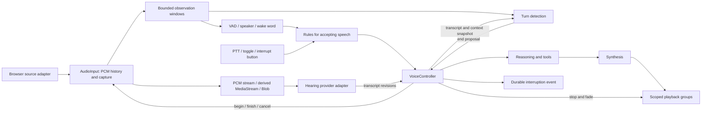

# Audio and voice design

Read **the two-minute overview** first. If you need more detail, open the matching section.

**Status: implemented.** #2769, #2770, and #2772 implement this design in `packages/pipelines-audio`, `packages/audio`, `packages/core-agent`, and `packages/stage-ui`. When this record and the code differ, the code is correct.
The [version 4 plugin contract](../specs/voice-plugin-api.md) covers growing windows, memory lookup, transcript corrections, and scoped lifecycle tasks.

## Two-minute overview

**Decision: share audio capture, keep conversation rules in `VoiceController`, and let UI components call these owners.**

### Three owners

| Owner | Job |
| --- | --- |
| `AudioInput` | Supply audio to recordings and detectors through separate delivery paths |
| `VoiceController` | Accept speech, track replies, and interrupt selected turns |
| Playback | Play, fade, and stop the selected audio |

Hearing receives audio and returns text. It does not own the microphone.
VAD, wake words, and buttons supply signals. They do not create separate recording systems.

### One conversation, from input to interruption

1. **Listen.** One microphone source supplies capture and detector windows. Observation continues during assistant playback.
2. **Accept speech.** A button or speech policy creates a `SpeechInputAttempt`. Permission and playback-fade waits belong to that request.
3. **Build the input.** Accepted audio goes to Hearing. A `SpeechInput` holds text, speaker results, and related context.
4. **Reply.** The agent reads a fixed input copy. A `VoiceResponse` can contain a short acknowledgment followed by the answer.
5. **Interrupt.** An external control calls `VoiceController`. It rejects late results, cancels generation, stops selected playback, and records an agent notification.

Cancellation before recording creates no `SpeechInput`.
PTT and wake-word recording wait for playback silence. Natural speech can use retained audio from its detected start.
The extension guide defines memory lookup and text corrections during step 3, and multiple speech producers during step 4.

### Five boundaries to review

| Boundary | Required behavior |
| --- | --- |
| Media | AudioInput delivers media. Hearing owns transcription |
| Detectors | Each detector reads limited windows. Slow inference cannot stop capture |
| Cancellation | Each owner stops its own work. Unrelated inputs and responses continue |
| Interruption | Playback reports silence. VoiceController owns generation cancellation and agent notification |
| UI | Components show state and issue commands. Runtime modules own queues, permission races, and cancellation |

**First migration:** share the microphone owner and capture implementation across settings recording and the voice-message composer.
Existing encoders, VAD adapters, and TTS chunking remain useful.

**Not yet proven in production:** browser timing, resource cleanup, reliable notification delivery, and the extension APIs under real models.
The detail sections retain the requirements for those checks.

## Choose one detail section

Reading times are estimates for scanning, not complete review.

1. **Names and ownership — 4 minutes.** Object meanings, package placement, and the full connection diagram.
2. **Runtime rules — 6 minutes.** Audio resources, stream backpressure, interruption, and UI state.
3. **Migration and required checks — 5 minutes.** Replacement steps, all 12 review findings, and implementation tests.

For call examples, open the [API guide](../specs/audio-pipeline-api.md).
For the revised plugin API and review findings, open the [plugin contract](../specs/voice-plugin-api.md).

For recognition windows, short replies, memory, and text corrections, open the [input and response guide](2026-09-30-voice-controller-extensions.md).

Names and ownership — object meanings and package boundaries

### Names and lifetimes

One shared audio input supplies recording and speech detectors.
Each accepted voice input has its own text, speaker results, and related information.
The agent reads a fixed copy of the input and produces a response.
The controller can stop that response without stopping microphone observation.

**Input objects**

| Name | Meaning | 中文 |
| --- | --- | --- |
| `AudioInput` | A continuous audio source with a limited buffer | 持续音频输入 |
| `Capture` | One recording and its media output | 一次录音 |
| `SpeechInputAttempt` | A request to accept speech, including permission and fade waits | 一次语音输入请求 |
| `SpeechInput` | One accepted voice input and its text, speaker results, and related information | 一次语音输入 |

**Text and output objects**

| Name | Meaning | 中文 |
| --- | --- | --- |
| `Transcript` | The original text and its accepted corrections | 转录文档 |
| `VoiceResponse` | One agent reply, including its speech output | 一次回复 |
| `SpeechStream` | Text and audio from one source within a response | 回复中的一段语音输出 |
| `VoiceController` | The owner of input requests, response lifetimes, and interruption | 语音交互控制器 |

`AudioInput` can stay open across many `SpeechInput` objects.
A `SpeechInput` can stay open across many audio frames and text updates.
`SpeechInputAttempt` owns the request to accept speech. Cancellation before recording does not create a `SpeechInput`.

The `Speech` prefix identifies conversation input. `AudioInput` can also supply music, noise, or file recordings.
A `VoiceResponse` can contain a short acknowledgment followed by a longer answer.
These objects do not require a separate AudioNode for every step.

A snapshot is a fixed copy of data. A revision is its version number.
An audio window is a short interval of samples that a detector reads.
A turn links an accepted input to its response. A silence receipt reports whether the selected playback stopped.

The [API guide](../specs/audio-pipeline-api.md) covers capture, detection, and interruption.
The [input and response guide](2026-09-30-voice-controller-extensions.md) covers growing audio windows, short replies, memory lookup, and text corrections.
The declarations cover the base API. The input and response additions remain design sketches.
The name update uses `VoiceController` and `SpeechInput` throughout the design and current examples.

### Decision

One shared audio input supplies separate capture and detector handles.
Each handle owns its work and its stop operation.
Native streams carry media. Typed messages carry control requests.
The input module does not select transcription providers or control conversations.
The public [caller guide](../specs/audio-pipeline-api.md) defines operations, ownership, bounds, and failure behavior. The types are in `packages/pipelines-audio/src/index.ts` and `packages/core-agent/src/voice/index.ts`.

This diagram shows ownership and message direction. It does not introduce one class for every box.
VAD and speaker middleware remain functions or model adapters.
The controller decides when to accept speech and when to end a turn.
Audio modules own sample buffers and browser nodes.

#### Package placement

**Audio packages**

| Location | Responsibility | Excluded responsibility |
| --- | --- | --- |
| `packages/pipelines-audio/src/audio-input.ts`, `capture.ts`, `observe.ts` | AudioInput, capture handles, independent reader streams, detector scheduling | Vue, provider selection, chat, device permission |
| `packages/pipelines-audio/src/playback.ts` | Playback groups that stay closed after stop, stop receipts on the driver clock | Agent notifications and VAD decisions |
| `packages/audio` browser entry | Shared context, microphone adapter, worklet transport, native stream output, playback gain envelopes | Session and character routing |
| `packages/audio/src/encoding` | WAV encoding, file decoding, PCM16 encoding, and future codec adapters | Recording policy and Hearing state |

**Conversation and UI**

| Location | Responsibility | Excluded responsibility |
| --- | --- | --- |
| `packages/core-agent/src/voice/` (`controller.ts`, `input/`, `output/`, `plugins/`) | Accept input, track turns, finish transcripts, record interruptions | Browser APIs, sample buffers, UI refs |
| Stage application setup | Device settings, model runtimes, storage, Eventa transport, character snapshots | Duplicate recording state machines |
| Stage composables and components | Subscribe to snapshots, render controls, invoke domain operations | Own providers, retry loops, device generations, or playback queues |

These are the merged locations.
The core-agent package already depends on pipelines-audio. The reverse dependency remains forbidden.
Application setup connects external adapters through injeca.
Internal helpers call each other directly. They do not receive artificial sibling-service dependency objects.
Browser imports stay in browser entry points. Importing the pipeline core has no browser side effects.

#### Why handles instead of a general graph framework

| Alternative | Strength | Cost | Decision |
| --- | --- | --- | --- |
| General graph with one node per policy | Explicit topology | Callers assemble lifecycle, fan-out, errors, and cancellation for every interaction | Reject for the public interface |
| One VoiceSession with mode flags and provider callbacks | Short initial setup | Capture, ASR, UI, and turn policy evolve together | Replace the existing pattern |
| Input, capture, observer, and playback handles | Owners remain local. New detectors do not change capture | Requires precise finish, cancellation, and queue contracts | Select |

Native TransformStreams remain useful inside codec and provider adapters.
They are not an automatic multicast or realtime scheduling solution.
The existing `createPushStream` enqueues without a capacity policy. It cannot serve as the live PCM hub unchanged.
The current `readStream` helper releases a lock without necessarily cancelling the underlying producer.
Capture adapters must own reader cancellation explicitly.

Runtime rules — audio, queues, interruption, and UI

### Browser resources and clocks

The browser source owner opens permission once and shares its pending open operation among authorized consumers.
It begins AudioContext resume within the user gesture, before awaiting permission.
It observes both resume and permission promises immediately, including their failure paths.
Cancellation immediately prevents pending startup from accepting audio. If permission resolves later, the owner releases the late tracks.
Device replacement closes the previous source and allocates a new source ID.
The owner has one private lifecycle: idle, opening, open, or closed.
UI permission text shows that state. It does not control a second state machine.

The default Web Audio capture path has one source node and one capture worklet per physical source.
The worklet copies frames into a fixed transfer pool and sends them through a credit-limited MessagePort.
No detector runs inside the worklet. Each added detector consumes bounded windows from the existing PCM hub.
An adapter can use native track processing when the supported runtime provides the required audio behavior.
Browser compatibility requires measured tests. The design does not assume uniform MediaStreamTrackProcessor support.

**Input nodes**

| Operation | Additional audio nodes |
| --- | --- |
| Add VAD, speaker identification, wake word, or turn detection | Zero |
| Add a PCM or file capture | Zero |
| Add a native MediaStream output | Only its independently gated output graph |

**Output and display nodes**

| Operation | Additional audio nodes |
| --- | --- |
| Start a response playback group | One gain for independent fading |
| Play a decoded clip | One one-shot source, connected to the group gain |
| Add a UI waveform | Reuse PCM analysis unless an existing shared analyzer is sufficient |

Decoded buffers and output infrastructure are reusable. Native buffer source nodes support one start and must be replaced per playback.
Streaming TTS uses one bounded playback worklet per active output route, not one source node per PCM frame.
The adapter selects streaming or decoded playback from the media representation.
Both paths implement the same group silence contract.

Source positions use frame counts and source IDs. They do not use Date.now.
Resampling adapters preserve the mapping to source-frame intervals and declare their output sample rate.
Output automation uses AudioContext.currentTime. Diagnostics can add wall-clock timestamps without redefining media positions.
Discontinuity resets overlap and stateful detector history. It cannot silently join speech across a missing interval.

### Stream and memory boundaries

The source hub retains requested history and separates observer work from capture delivery.
File input can pause decoding for backpressure. A live microphone cannot wait for slow inference.
If the transport loses live samples, the adapter reports a gap or failure. Latest-window observation replaces pending work.
Ordered VAD preserves processing order. The plugin owns its processing speed and workload policy.
The source hub never silently drops audio while reporting a complete recording.

Each asynchronous detector receives copied Float32Arrays, one array per audio channel.
The browser adapter closes AudioData after copying. Consumers do not share a closable native sample object.
The first implementation prefers copies over shared-memory leases and reference counts.
A future measured optimization must preserve resource ownership and stream behavior.

The audio adapter releases its own PCM and encoder resources. Recording storage belongs to the application.
The caller contract imposes no plugin resource quotas. Applications choose optional timeouts.
Plugins own their retained data and external work. Audio adapters own transport backpressure.

Native MediaStream delivery creates a derived, independently gated track.
Passing the physical microphone or only cloning its track cannot implement accepted intervals and pre-roll.
The output adapter sends only accepted samples. On finish, it sends remaining samples and ends its own tracks.
The native sink cannot communicate ASR completion. Its downstream provider adapter owns that completion separately.
Unsupported native delivery fails explicitly. There is no silent switch to unrelated browser speech recognition.

Cross-window control uses central Eventa contracts with owner epoch, request ID, and turn identity.
The host rejects stale epochs and never recreates a missing intent from a late token.
PCM uses a dedicated transferred MessagePort with credits. UI snapshots never replicate PCM through Pinia.
PCM and credit envelopes use shared Eventa contracts, including the worklet and worker adapters.
The MessagePort adapter must preserve transfer lists and bounded credits. This proposal does not claim an existing adapter already provides both.
Its implementation must avoid an extra unbounded queue inside the event transport.
Only the selected audio host creates output nodes. Remote stop waits for its silence receipt.
If the audio host disconnects, the stop result reports failure and cancels input that waits for silence.

### Input policy and interruption

PTT, toggle, wake-word, and VAD evidence converge on the same SpeechInputAttempt operations.
Input rules choose a session, the turns to interrupt, and when recording starts.
After-silence starts recording after playback stops. Speech-onset starts from the detected speech position in saved audio history.
Echo cancellation and speaker checks remain necessary for voice interruption. VAD alone cannot distinguish assistant echo from a person.
The target character settings are frozen for each request, as the accepted routing ADR requires.

An interruption performs these operations in order:

1. Close the selected turns immediately. Reject later tokens, tool results, TTS chunks, and playback requests.
2. Signal cancellation to reasoning, tool waits, and synthesis. Remove queued response work.
3. Ask each selected playback group to fade over 100 ms and stop on the audio clock.
4. Resolve the silence barrier with explicit success or failure for every output group.
5. Save each turn's interruption event and pending notification together in one transaction.

The application can select cleanup timeouts. Failures do not reopen the turn.

Persistence and registered cleanup can run while playback fades. The listed dependencies do not require serial network waits.
The agent notification describes a control event and the estimated playback cutoff.
The saved notification queue retries with the same event ID. The agent receiver ignores duplicate IDs.
This provides one logical notification under retries, not a claim of exactly-once network transport.
The next request includes the interruption state even when the prior generation was already cancelled.

Playback only understands group handles, media, scheduling, and fade requests.
A manual stop button and VAD policy call the same controller interruption operation.
They can choose different target sets. Neither sends agent messages through the playback module.
An interruption cannot undo a tool's completed external side effect.
It cancels supported work and rejects results that arrive after the turn closes.

### States exposed to UI

UI needs the selected hearing mode, input permission state, current attempt phase, and response activity.
The attempt phase has one value: pending, capturing, finalizing, or settled.
The final result reports drafted, committed, cancelled, or failed. A failed result includes error details.
Components do not reconstruct the phase or result from several independent booleans.
Playback progress and pending transcript drafts are separate domain data.
AbortControllers, queue tickets, reader locks, and generation counters stay private to their owners.

Migration and required checks — replacement steps and review coverage

### Migration and deletion plan

Each step migrates complete callers and removes the replaced behavior in the same change.
No permanent compatibility wrapper preserves the duplicate voice runtimes.

**Steps 1–4: capture and transcription**

| Step | Change | Remove or narrow | Required proof |
| --- | --- | --- | --- |
| 1 | Implement AudioInput with fake and browser source adapters | Centralize duplicate microphone start/cancel logic | Late permission cleanup, device replacement, capture isolation |
| 2 | Migrate settings recording and voice-message composer to capture handles | Recording logic inside use-voice-composer and voice-composer.vue | Same file interval, cancel during startup, no implicit send |
| 3 | Convert Hearing to media-in/transcript-out adapters with explicit capabilities | Shared capture ownership, VAD, worklet and microphone logic in hearing.ts | Streaming EOS, file ASR, provider abort, unsupported format |
| 4 | Migrate existing useVoiceInputSession callers to signal policies and controller attempts | Manual/VAD/volume branches and transcription chain bookkeeping | Web, desktop and pocket input behavior preserved |

**Steps 5–7: output, detectors, and submission**

| Step | Change | Remove or narrow | Required proof |
| --- | --- | --- | --- |
| 5 | Add turn-owned output groups and interrupt receipts to existing speech pipeline | Stage.vue TTS lifecycle ownership, global stop broadcast, fallback intent recreation | A stops while B continues, late tokens rejected, fade barrier |
| 6 | Add speaker and turn detectors through observation interfaces | Playback-time input suppression and transcript debounce as turn authority | Requested windows supplied, echo rejected, stale decisions ignored |
| 7 | Move acceptance acknowledgment to message persistence | History scanning and base64 comparison in use-voice-send | Same client message ID returns the same persisted acknowledgment |

`use-voice-send` can remain a UI adapter for attachment submission.
Its sending state follows an explicit acknowledgment: message ID, session ID, and persisted result.
Failure retains the draft. Retry reuses the message ID instead of inferring acceptance from message history.
`use-voice-composer` can project a Capture handle into Vue state.
It must not remain a second microphone, permission, or provider owner.
`voice-composer.vue` renders controls and a preview. It invokes capture and send operations.

The existing VAD model adapter, encoders, text chunker, provider protocols, and playback queue policy remain useful.
Their ownership changes. The migration does not require replacing working algorithms or rewriting every audio utility.
Text debounce remains valid for UI batching. It no longer decides conversational completion.

### Coverage of the review findings

**Findings 1–4: capture and cancellation**

| Finding | Design response |
| --- | --- |
| 1. Capture mixes trigger policies | Ordinary signal policies call the same capture or attempt handles |
| 2. Capture owns ASR | Media delivery ends the input pipeline's responsibility |
| 3. Duplicate device lifecycle | One source owner handles startup, permission, replacement, and close |
| 4. Scattered cancellation | Each handle cancels only its children. Turn cancellation belongs to the controller |

**Findings 5–8: UI, submission, and playback**

| Finding | Design response |
| --- | --- |
| 5. Component orchestration | Runtime ownership moves to pure TypeScript modules |
| 6. Inferred send acceptance | Persistence returns an idempotent acknowledgment |
| 7. Audio capability defaults differ | Provider adapters declare accepted formats explicitly |
| 8. Playback disables VAD | Observation remains active. Input rules handle echo and interruption |

**Findings 9–12: interruption and detectors**

| Finding | Design response |
| --- | --- |
| 9. Incomplete interruption | Reject late results, cancel generation, wait for playback stop, and save the agent event |
| 10. Stop has no fade barrier | Audio-clock stop with a silence receipt |
| 11. No speaker window interface | Independent observers with latest-window scheduling |
| 12. No contextual turn detector | Attempt-owned revision checks over audio, transcript, and context |

### Requirements

The input pipeline delivers audio to a downstream consumer. It does not read a Hearing store or send chat messages.
VAD, Push to Talk, toggle recording, and wake words supply control signals. The capture implementation does not select these policies.
Speaker identification consumes bounded audio windows. Turn detection consumes audio windows, transcript revisions, and a conversation snapshot.
Playback only schedules, plays, fades, and stops audio. A conversation coordinator interrupts reasoning, synthesis, playback, and pending delivery.
The target uses TypeScript without Vue or Pinia. Browser resources enter through explicit adapters.

**Capture and queues**

| Requirement | Evidence required before implementation is complete |
| --- | --- |
| One capture implementation | Manual, VAD, and settings-test paths use the same capture owner |
| Independent signal policies | A custom detector connects without changes to capture internals |
| Minimal audio graph | Node counters stay constant when observers are added |
| Media backpressure | Adapters report delivery gaps and release owned resources after cancellation |

**Delivery and interruption**

| Requirement | Evidence required before implementation is complete |
| --- | --- |
| Stream and file outputs | Live Hearing receives frames before finish. File Hearing receives a complete file |
| Cancellation ownership | Cancelling one capture leaves unrelated observers and playback owners intact |
| Scoped interruption | Late tokens and audio from the interrupted turn cannot resume output |
| Playback fade | Completion means the requested playback is silent, not only that abort was requested |
| Agent notification | The coordinator records the affected turn and interruption reason once |

**Detectors and caller understanding**

| Requirement | Evidence required before implementation is complete |
| --- | --- |
| Speaker identification | A slow detector has a bounded window and cannot stop capture |
| Turn detection | Stale transcript/context revisions cannot commit a newer speech input |
| Caller comprehension | Independent agents can implement scenarios from the public contract alone |

### Required implementation checks

These gates are requirements for the later runtime implementation. This design does not claim they already pass.

**Capture and cancellation**

- Fake source tests cover ordered PCM, gaps, history expiry, source replacement, and simultaneous captures.
- Deferred permission tests release PTT before resolution and check that late tracks are stopped once.
- Slow-consumer checks exercise adapter backpressure, gap reporting, and cancellation cleanup.
- Cancellation tests cover pending capture, finalization, provider requests, model jobs, and late output publication.

**Workers and browser audio**

- A cancellation check rejects late detector results. Model adapters own termination of work that ignores abort.
- Browser audio tests measure node counts before and after adding detectors and closing captures.
- Loopback tests measure fade and gated recording in Chromium, Firefox, WebKit, Electron, and supported mobile webviews.
- Output tests include suspended context, resumed context, blocked UI thread, queued audio, and remote host loss.

**Conversation and persistence**

- Interruption tests run two sessions and check that only named turns stop or receive control events.
- Persistence tests retry sends and interruption delivery after a simulated restart.
- Turn tests revise transcript, context, and speech activity while inference runs. Stale proposals cannot commit input.

After implementation, run affected workspace typechecks and tests, root typecheck, and repository lint.

Evidence and current checks — research and completed work

### Existing constraints

The current worktree contains unrelated edits. The design does not alter those edits.
PR #2546 was inspected at `77a0fcac0a85c912c7d0a4949990c1cd6b469ea7`.
Its added voice composer is a migration source, not a second runtime to preserve.

`packages/pipelines-audio` already owns speech scheduling, playback policy, and transcript buffering.
`packages/audio` already owns encoding and browser audio helpers.
The existing `useVoiceInputSession` combines segmentation and recorded transcription.
The PR's `useVoiceComposer` adds a parallel capture lifecycle.
The desktop page suppresses input while assistant speech plays. That policy prevents voice interruption.
`Stage.vue` owns TTS sessions and connects chat hooks to playback.

The existing character-routing decision remains in force.
Every accepted speech input captures its character session before asynchronous work starts.
PTT and wake-word acceptance use the fade barrier described in [the routing ADR](2026-09-30-route-voice-turns-by-character-session.md).
Physical microphone observation can remain active during that barrier. Accepted recording starts after the barrier.

**Next review action:** read the five boundary rows in the overview. Check which owner has each responsibility.
