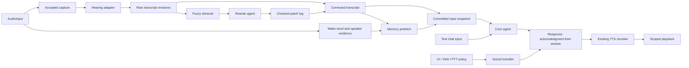
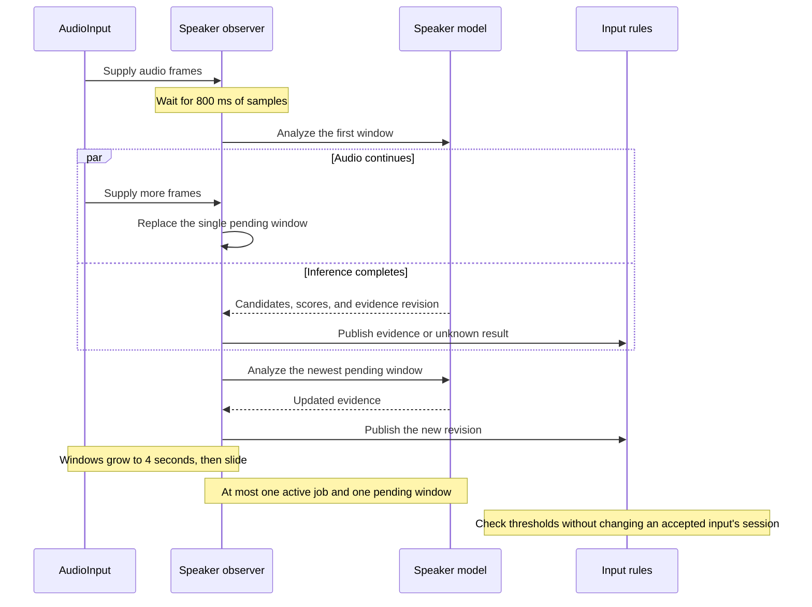
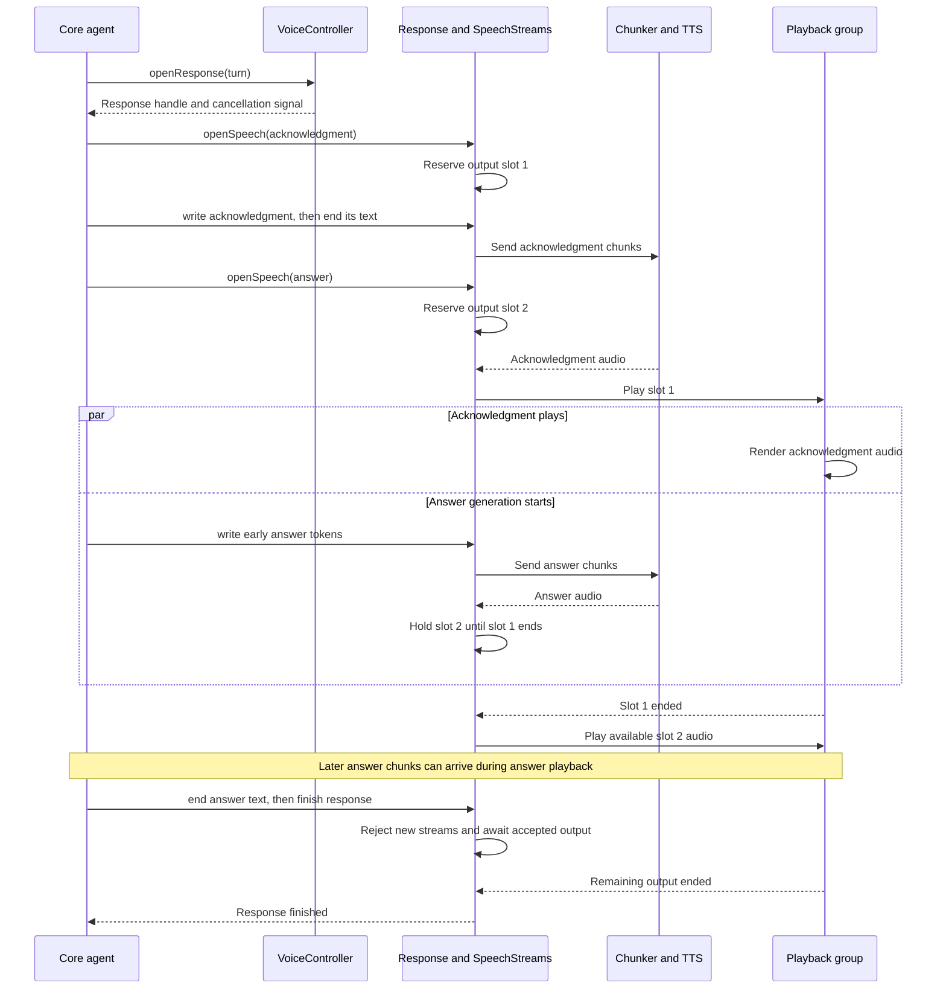
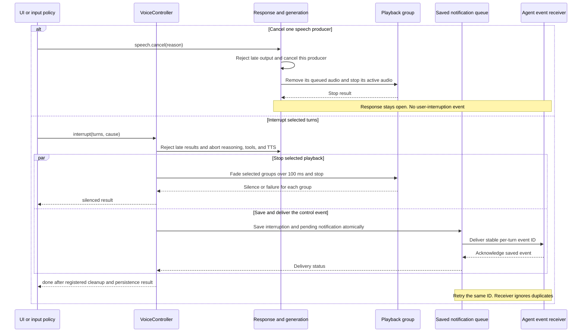
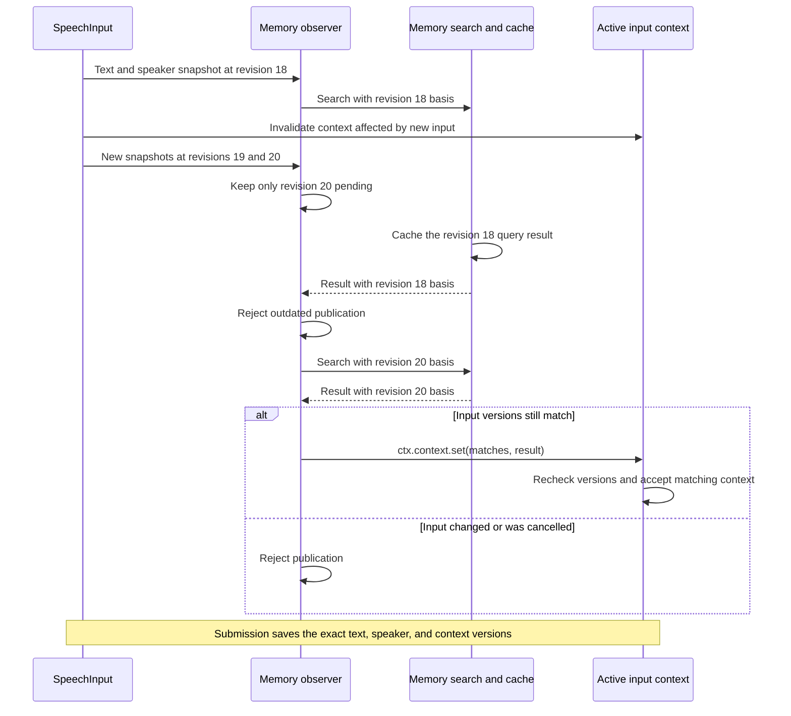
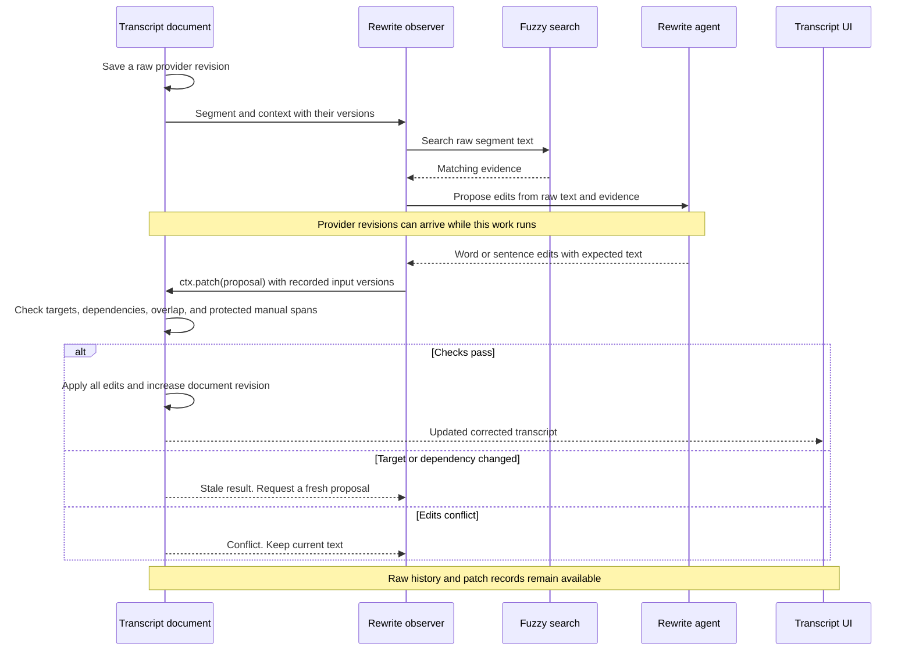
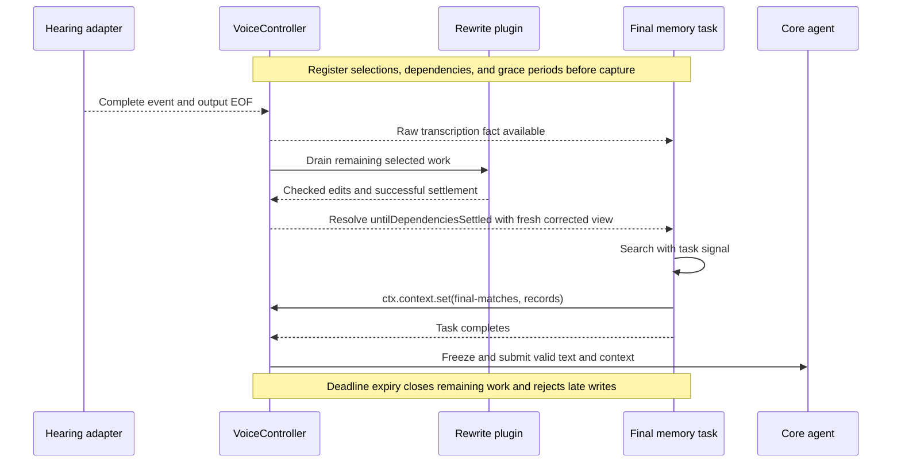

# Voice input and response guide

Read **the four use cases** first, about 1 minute. Then open the section that matches your question.

**Status: proposed version 4, revision 5. Resource quotas removed.** Read the [plugin API](voice-plugin-api.md) for the current contract and [declarations](voice-plugin-api.d.ts).

- The snippets describe proposed interfaces. They are not existing package exports.
- The [version 4 review](../research/voice-v4-review.md) records independent callers, findings, and remaining implementation checks.
- Sequence diagrams describe proposed behavior. Arrow labels name operations, not additional exported methods.

## Four use cases

- **Recognition:** collect enough samples, then update speaker results as more audio arrives. [Read the rules](#collect-enough-audio-for-recognition).
- **Short reply, then answer:** put both speech producers in one response with shared interruption. [Read the rules](#acknowledgment-followed-by-the-main-answer).
- **Memory:** search during transcription and reject results for outdated input. [Read the rules](#load-related-memories-while-speech-arrives).
- **Corrections:** preserve raw text and apply checked word or sentence edits. [Read the rules](#keep-original-text-and-apply-corrections).

Each use case starts with a sequence diagram. API examples and grouped rules follow. A first scan takes about 3–5 minutes per section.

## Read the settings

- **`scheduling: 'ordered'`:** Process every item in order. A full queue reports failure instead of skipping items.
- **`scheduling: 'latest'`:** Keep one active job and only the newest pending item. Check result versions before publication.
- **`transcript: 'raw'`:** Read the current provider text without rewrite changes.
- **`transcript: 'corrected'`:** Read the raw text plus valid accepted corrections. Without corrections, this text equals the raw text.

Corrected text can still change. It does not mean final text or submitted input.

## Names and owners

**Conversation roles**

- `VoiceController` accepts input, tracks responses, and handles interruption.
- `SpeechInput` means one accepted voice input. It contains the transcript, speaker results, and related information.
- The core agent produces the reply. Audio modules handle samples, encoding, and playback.
- A voice session is the continuing conversation. It can contain many inputs and responses.

**State owners**

- **`AudioInput`:** Source position, bounded PCM history, independent observation and capture queues.
- **`SpeechInput`:** Accepted input identity, transcript document, speaker evidence, and derived context.
- **`Response`:** One turn's output lifetime, producer order, and cancellation.
- **`SpeechStream`:** One producer's text chunks, synthesis requests, queued audio, and completion.
- **`VoiceController`:** Input acceptance, turn routing, response tracking, interruption results and notification.

**Starting input or output**

- The controller creates a SpeechInput when it starts accepting speech. Permission and fade waits remain part of the SpeechInputAttempt.
- Application setup connects memory and rewrite integrations to each new SpeechInput once.
- Text chat can register a Response directly. It does not pass through microphone capture or transcription.

<details>
<summary>Ownership map: full input and response flow</summary>



</details>

## Collect enough audio for recognition

**Sequence: collect samples and update recognition**



- The example durations describe the proposed growing-window behavior.
- Stateful wake-word detection uses ordered frame blocks. It does not use this replaceable-window schedule.

**Proposed addition**

- A fixed full-window observer can already wait for enough samples and then slide its window.
- Version 4 adds `minWindowMs` through the plugin audio subscription.

```ts
plugin.observeAudio(
  { minWindowMs: 800, windowMs: 4000, hopMs: 200, scheduling: 'latest' },
  async (ctx) => {
    const result = await speakerModel.analyze(ctx.window, { signal: ctx.signal })
    ctx.publish(result)
  },
)
```

**Window size and evidence**

- These durations illustrate behavior. They are not measured model requirements.
- The first inference receives 800 ms. Later windows grow until they contain four seconds, then slide.
- Silence does not necessarily provide useful speaker evidence. Results also report usable voiced duration and quality.

**Recognition results**

- Publication adds source identity and audio interval. The host validates model evidence and assigns a revision when routing it to an input.
- Scores can rise or fall. A score is not automatically a calibrated probability of correct identification.
- Insufficient evidence produces an explicit unknown result rather than an invented speaker identity.

**Memory and pending work**

- The observer retains the window requested by its plugin. The plugin owns any additional retained samples.
- A four-second observer window does not require every capture to retain four seconds of pre-roll.
- Speaker inference can replace pending windows. One running job and one pending window remain the limit.
- Overlapping windows contain repeated samples. Aggregation must count unique intervals instead of treating overlap as independent observations.

**Stateful detectors**

- Stateful wake-word models consume ordered, non-overlapping frame blocks and keep their model state inside their adapter.
- They reset state on discontinuity, source replacement, or disposal.
- A context model that consumes complete windows can instead use ordered overlapping windows when its adapter defines that behavior.

**Long-term learning ownership**

- Speaker plugins choose whether to retain samples, summaries, or stored profiles.
- Plugins own those allocations and their cleanup. The runtime imposes no plugin storage quota.

**Stable decisions and session ownership**

- Input rules use recent results and separate thresholds for accepting and rejecting a match.
- This prevents small score changes from repeatedly switching the selected speaker.
- One wake-word interval has one detection identity. Subsequent score updates revise that detection rather than opening duplicate input attempts.
- A new speaker estimate does not silently send an accepted speech input to another character session.
- The target session stays fixed after input starts. A separate application operation can correct the speaker label.

## Acknowledgment followed by the main answer

**Sequence: reserve output order before synthesis**



- This timeline shows answer audio ready before the acknowledgment ends. Provider timing can differ.
- Full queues make producers wait. An expired acknowledgment can release its slot before playback starts.

**One response, several speech streams**

- The core agent creates one response scope. Every producer in that response owns a child SpeechStream.
- Opening a stream reserves its playback order synchronously, before text or synthesis completes.

```ts
const response = voice.openResponse(turn)

const acknowledgment = response.openSpeech({ purpose: 'acknowledgment', deadlineMs: 3000 })
const accepted = await acknowledgment.write('我看看。')
if (accepted.status !== 'accepted')
  acknowledgment.cancel('acknowledgment-unavailable')
acknowledgment.end()

const answer = response.openSpeech({ purpose: 'answer' })
await coreAgent.run({
  input: committedInput,
  signal: answer.signal,
  onToken: async (token) => {
    const result = await answer.write(token)
    if (result.status !== 'accepted')
      throw new Error('Speech output closed')
  },
})
answer.end()
await response.finish()
```

**Writing and ending a stream**

- This example assumes successful generation. On failure, the caller cancels the response in its error path.
- `end()` stops accepting text from that source and sends its remaining chunk to TTS. It does not wait for playback.
- `write()` resolves when the stream accepts the text. Before producers send more text, they await this promise.
- Main reasoning and synthesis can therefore run while acknowledgment audio plays.

**Ending a response**

- `response.finish()` prevents new speech streams and waits for accepted output to finish.
- An optional stream deadline cancels that stream and releases its reserved output slot. Without a deadline, the producer ends or cancels it.
- Ending one SpeechStream never ends the response or prevents a later producer from joining an open response.

**Chunking and backpressure**

- The existing `chunkTtsInput` remains responsible for segmentation and early chunks.
- Its boost mode reduces the opening chunk's wait for hard punctuation. It does not schedule multiple producers or own response cancellation.
- SpeechStreams each feed a chunker. Response ordering coordinates their output before playback.
- Playback adapters supply backpressure to synthesis while earlier speech streams play.

**Delayed acknowledgments**

- An acknowledgment can expire before it starts. Once the answer is ready, policy can cancel a delayed acknowledgment.
- The scheduler removes that slot so the main answer can proceed.
- No chunker can eliminate provider startup latency. Optional cached acknowledgment audio still enters the same response scope.

**Playback order and audio nodes**

- Response speech is sequential by default. Synthesis completion order cannot reorder reserved producer slots.
- A per-response gain can fade its single active clip without adding a gain for every token or text chunk.
- Concurrent audio that needs independent fades requires separate gains. That is an explicit playback policy, not a detector cost.

### Cancellation and interruption

**Sequence: stop one producer or interrupt selected turns**



- The notification path shows successful delivery. A timeout can leave delivery queued, or report failure.
- Cancelling the whole response also stops its children. It does not create a user-interruption event.
- Unrelated responses and microphone observation continue. Cancellation cannot undo completed external tool effects.

- **`attempt.cancel(reason)`:** Discard this attempted input. Scope: pending or uncommitted input.
- **`speech.cancel(reason)`:** Withdraw this output while the response remains open. Scope: one producer and its queued or active audio.
- **`response.cancel(reason)`:** Abandon this computation and output for a technical or application reason. Scope: one response and all children.
- **`voice.interrupt({ turns, cause })`:** Record an external interruption, stop delivery, and notify the agent. Scope: selected turns through output.

**Shared effects, different meaning**

- If the target already plays, cancellation can require a fade. It cannot erase audio the person already heard.
- Interruption records that conversational fact and estimated playback progress with stable per-turn event IDs.
- Technical cancellation does not fabricate a user-interrupted event.
- Both operations reject output that arrives after cancellation or interruption. They use different records and notification rules.
- VAD and PTT policy call the same public interruption operation as the UI button.

## Load related memories while speech arrives

**Sequence: keep lookup results tied to input versions**



- Revision numbers illustrate updates. Each job records transcript and speaker versions separately.
- Cancellation aborts the active lookup. Normal updates can let it finish and populate the cache.

**Integration API**

- A plugin installs subscriptions during the synchronous input setup callback. The runtime owns their disposal.
- `voice.use` installs a plugin. No package loader or extra AudioNode is required.
- The observer receives a fixed copy of the current speech input data and its version numbers.

```ts
const memorySubscription = input.subscribe(
  { transcript: 'corrected', speakers: true, scheduling: 'latest' },
  async (ctx) => {
    const records = await memory.search({
      text: ctx.snapshot.transcript.text,
      speakers: ctx.snapshot.speakers,
      signal: ctx.signal,
    })
    ctx.context.set('matches', records)
  },
)
```

**Results and version checks**

- The application supplies memory.search. Published results retain application objects and evidence references. External caches remain application-owned.
- The task context records the selected input and revisions. Search results do not supply their own freshness labels.
- Latest scheduling permits one running job and one replaceable pending snapshot.
- Each context write synchronously checks the task basis and rejects stale publication.

**Active jobs and cancellation**

- An active lookup can finish and warm its query cache while the newest pending snapshot replaces older pending work.
- This prevents continuous transcript updates from repeatedly aborting every lookup before it completes.
- Cancellation of the owning speech input still aborts the active lookup.
- The task callback awaits its work. Its context writes are synchronous and reject writes after task completion.

**Context updates and cached results**

- Updating raw text or accepted speaker evidence invalidates dependent active context before scheduling replacement work.
- Integrations can deduplicate normalized queries and observe stable transcript segments to reduce work on partial text updates.
- The cache can retain old search results. Those results do not remain active context for a different input revision.

**Searching by speaker**

- Speaker evidence includes time intervals, candidates, and model/profile versions, not only a mutable current-speaker string.
- The integration can search over recent matching intervals or a bounded summary of several observations.
- It can warm candidate-specific caches before identity settles. Final context uses the selected identity and applicable session scope.
- Unknown or ambiguous identity remains explicit. Retrieval must not merge distinct candidate histories into one asserted speaker history.

**Submission and lifetime**

- Prefetch runs during transcription. It does not create durable memories or start an agent turn on every partial transcript.
- Submitting input saves the transcript, speaker results, and context used for that model request, including their source and version numbers.
- Retrieval can use a caller-selected timeout. Submission waits only for work with an explicit submission grace period.
- Later retrieval does not mutate a running model's prompt. Explicit tool delivery or a new request uses later results.
- Cancellation of the SpeechInput cancels its observers and speculative work, while independent microphone observation continues.

## Keep original text and apply corrections

**Sequence: retrieve evidence, propose edits, and check versions**



- Fuzzy search supplies evidence. Only a checked proposal changes the corrected transcript.
- An unrelated appended sentence does not invalidate a patch whose target and dependencies remain unchanged.

The transcript is a versioned document with three distinct parts:

- **Raw transcript history:** Immutable provider revisions, including partial and final snapshots.
- **Patch log:** Proposed, accepted, rejected, or stale edits with author and evidence references.
- **Corrected transcript:** Current raw revision plus its valid accepted patches.

**Final text and UI**

- Provider-final does not mean rewrite-final or committed input.
- Raw transcription always remains available for inspection and model input.
- The UI subscribes to the corrected document revision to display current corrected text.

```ts
const rewriteSubscription = input.subscribe(
  {
    transcript: 'raw',
    scope: { kind: 'segment', neighbors: 1 },
    speakers: true,
    scheduling: 'latest',
    waitForSubmissionMs: 1500,
  },
  async (ctx) => {
    const matches = await fuzzy.search(ctx.snapshot.transcript.text, { signal: ctx.signal })
    const proposal = await rewriteAgent.propose({ snapshot: ctx.snapshot, matches, signal: ctx.signal })
    ctx.patch(proposal)
  },
)
```

**Search and pending rewrites**

- Fuzzy search supplies evidence to the rewrite agent. It never edits the transcript directly.
- Segment scope supplies the selected segment and explicit neighboring context, each with its own revision.
- It retains one active rewrite and a pending map with the latest revision per segment.
- Whole-transcript observations instead retain one latest pending snapshot.

**Version ownership and feedback loops**

- The whole asynchronous chain shares one revision basis and one cancellation scope.
- The runtime records which input versions the model received. A model cannot label an old result as a result for newer input.
- Raw-based rewriting avoids a loop where its own corrected-text changes trigger the same rewrite again.
- Memory retrieval can separately consume corrected text, including accepted corrections.
- If rewrite also uses memory results, that memory lookup must use raw text. The rewrite must not trigger its own input lookup.

A proposal contains guarded edits rather than unqualified replacement text:

```ts
const patch = {
  edits: [{
    segmentId: 'segment-2',
    range: { kind: 'tokens', start: 3, end: 5 },
    expectedText: '爱丽',
    replacement: 'AIRI',
  }],
  evidenceIds: ['dictionary-match-42'],
}
```

**Edit ranges and input versions**

- Token ranges include start and exclude end. They refer to the word positions in the stated raw-text revision.
- Word edits cover a token range. Sentence edits cover a wider range or several explicit segment ranges.
- Token IDs and offsets cannot be assumed stable across provider revisions.
- The task context supplies version checks. Plugins cannot replace the recorded basis.
- The runtime also records the versions of each text segment and context item that the rewrite agent read.

**Applying a patch**

- Before application, the document checks target versions, expected text, related input versions, and overlapping edits.
- It applies all edits together or none. Success increases documentRevision. A mismatch returns stale or conflict without changing the document.
- Appending another sentence does not invalidate a correction to an unchanged earlier sentence with unchanged dependencies.
- Changing the targeted segment does invalidate that correction. The default requests a fresh proposal instead of guessing new anchors.
- Segment-oriented observers expose stable IDs and local revisions for unchanged segments.

**Changed dependencies and manual edits**

- Adapters keep IDs only for segments that they can match with certainty. If new word divisions make the match uncertain, affected IDs expire.
- A rewrite that reads the whole document depends on the whole document. It cannot use the narrower checks for one unchanged segment.
- Older automatic patches remain in history. They stop contributing when their target or relevant dependency changes.
- Manual edits retain their draft and conflict state. Automatic edits cannot overwrite protected manual spans.

**Text positions and audio timing**

- Text tokenization does not imply audio alignment. If the provider supplies no alignment, word timestamps remain unknown.
- The document does not fabricate timing from token indexes.
- The document can compare a full rewrite with the original text and produce checked edits before application.

**Submission and later corrections**

- When relevant transcript versions change, the controller rejects old turn-end decisions and removes outdated memory results from active context.
- Commit freezes a document revision for the submitted message and model input.
- A later correction can update a displayed correction history. It cannot silently replace input already consumed by the agent.
- Applying that correction to an active conversation requires an explicit correction event or cancellation and resubmission policy.

## Wait for final text without blocking live subscriptions

- A lifecycle task declares its selection during input setup. Its waits add no later dependencies.
- `untilTranscriptionEnded()` waits for raw provider completion.
- `untilDependenciesSettled()` also waits for upstream plugin work, including selected correction producers.
- A positive `waitForSubmissionMs` selects a final-processing period. There is no framework maximum. Optional work has no implicit extra time.
- Use raw-memory → rewrite → corrected-memory. The runtime rejects feedback cycles through corrected text and context.



The [plugin contract](voice-plugin-api.md) specifies cancellation, dependency failure, late waits, and zero-grace submission.

## Placement and remaining checks

**Package ownership**

- Audio windows, media lifetime, and playback stay in pipelines-audio and browser audio adapters.
- SpeechInput documents and derived context belong beside the pure TypeScript conversation runtime.
- Hearing adapters translate provider revisions. They do not own fuzzy search, memory storage, or rewrite-agent policy.
- Vue components project document and response snapshots without reproducing their revision or cancellation rules.

**Work still required**

- Implement the reviewed declarations, growing windows, scoped tasks, checked edits, and speech producer ownership.
- Verify cancellation and interruption with runtime tests. Declaration checks cannot prove timing or cleanup.
- Required caller exercises include slow speaker convergence, delayed acknowledgment, concurrent producers, stale memory, and overlapping ASR/rewrite/manual edits.
- Browser tests must measure memory and output timing. These sketches make no runtime performance claim.

**Next review action:** read the cancellation and interruption sequence. Check which operation each external control calls.
