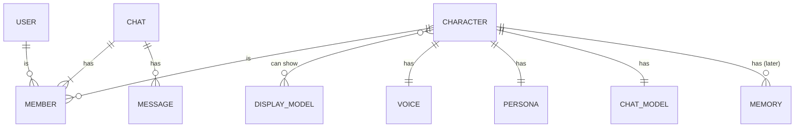

# A character is a member of a chat

Status: proposed

## Context

The product goal is a contact list, where each character is a contact, as in Discord.
A later goal is a group chat with one or more users and many characters.
The client is local-first. A user without an account must get every function in this document.

The code calls the entity a "card". A card holds the persona, the voice, the chat model, and one display model.
A chat session holds one `characterId`. The local index groups sessions by that id.

The current code has these gaps:

- Chat synchronization loses the character. A second device puts every received chat under the `default` character (`session-store.ts`, the `adopt` step).
- A character refers to one display model, `modules.displayModelId`.
- Display model files stay in IndexedDB on one device. Each device mints its own model ids.
- The activation of a card writes its modules into the global runtime stores. Text turns then read the global stores.
- Voice turns read the modules of the character of the session, through `getModules(characterId)`. The two paths differ.

## Decision

### Names

- A **character** is the entity. It is a member of a chat.
- A **character card** is the import and export format of a character.
- This change renames the concept and the text that users see. It does not rename code identifiers.

### Relations

- Today, a chat has one user and one character.
- A group chat uses the same relations with more members.
- A character does not change after its chat exists. A chat of one character has no member conflict.

### Chat members

- Chat synchronization sends and receives the members of each chat. See `server/docs/ai/adr/2026-10-09-chat-list-members.md`.
- One function answers "which characters are members of this session". New code calls this function. Step 2 adds it with its first caller.
- New code does not read `meta.characterId` or the character groups of the local index.
- The local storage shape stays. A later change for group chats replaces the body of that one function.

### Character settings

- One function gives the settings of a character in a session: `(sessionId, characterId)` in, display model, voice, and chat model out.
- Text turns and voice turns both call this function. The `voice` branch in `prepareSend` goes away.
- The activation of a card stops the writes into the global runtime stores. Those stores hold only the global defaults.
- The order of the sources is: character value, then global default. A later change can put a value of the chat member first.

### Display models

- A character holds a set of display model ids and one default id.
- Many characters can refer to one display model.
- The set and the default are one synchronized field, `modules.displayModels`, so the two values change together.
- `resolveAiriExtension` is the boundary that reads a card. It converts `displayModelId` of an imported or stored card into the new field.

### Local-first rules

- The local data is the source. The server is a mirror that carries the data to other devices.
- If a device does not have a display model that a character refers to, the device keeps the reference.
- The device then shows a placeholder and asks the user to import the model. It does not write the default model into the character.
- If a received chat refers to a character that the device does not have, the device keeps the character id.
- A provider that a device did not configure follows the same rule. The device uses the next source and keeps the stored value.

### Repair of old sessions

- Earlier versions put received chats under `default`.
- During a reconcile, a device compares the local character of a session with the character member on the server.
- If the two differ, the device applies the server value and moves the session to that character group.
- The rule is safe because a character does not change after its chat exists.
- The move keeps the stored messages and the time of the session.
- The move does not change the session that a window shows.

## Non-goals

- The UI of a group chat, and the order in which many characters speak.
- Chats with many users. They need permissions and an order that the server decides.
- Synchronization of display model files between devices.
- Character memory. `stores/character/notebook.ts` stays global. New memory data must use a character id as its key.
- A new name for `airi-card` identifiers in code.
- A change to the chat model of a character.

## Steps

| Step | Content | Workspaces |
| --- | --- | --- |
| 1 | Synchronize chat members. Repair old sessions. | `server/apps/api`, `packages/stage-ui` |
| 2 | Add the functions for the members of a session and for character settings. Use them for text turns and voice turns. | `packages/stage-ui` |
| 3 | Stop the writes into the global runtime stores when a card becomes active. | `packages/stage-ui`, settings pages |
| 4 | Give a character a set of display models. | `packages/stage-ui`, `packages/stage-pages` |
| 5 | Build the contact list for the mobile layout. | `packages/stage-ui`, `packages/stage-layouts` |

Steps 1 and 2 do not depend on each other.

## Consequences

- A contact list can group sessions by character on every device of an account.
- Two windows can show different characters, because a turn no longer reads a global selection.
- A character on a second device can show a placeholder until the user imports its display model.
- Step 3 changes what the settings pages edit. A page must tell whether it edits the global default or the character.
