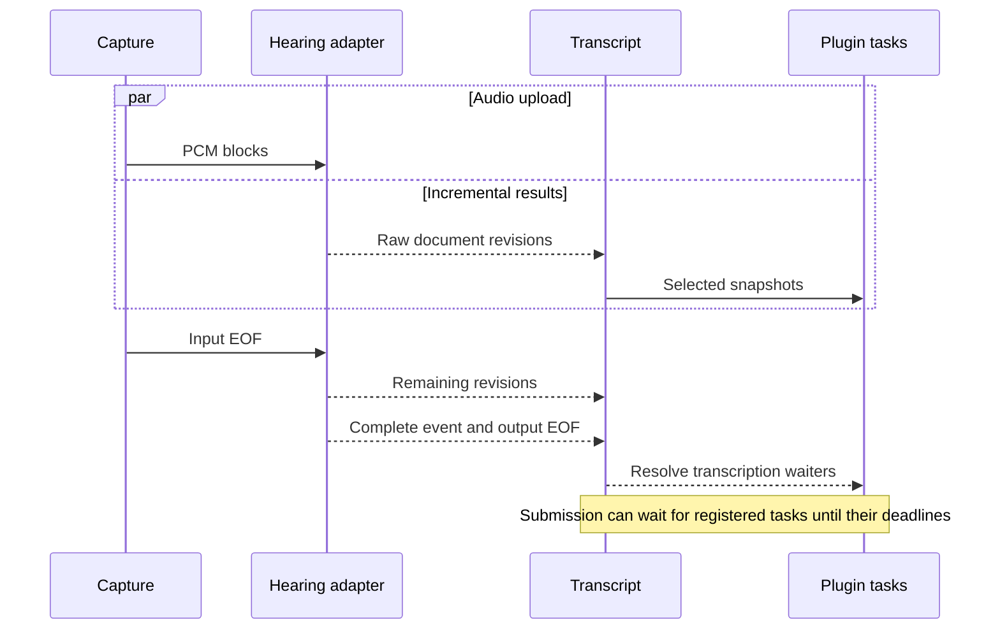

# Voice plugin API

Read **the five operations** first, about 2 minutes. The examples show proposed calls, not installed package exports.

**Status: version 4, revision 5. Resource quotas removed after user review.** This document and [the declarations](voice-plugin-api.d.ts) supersede the earlier plugin sketches.
The [base contract](audio-pipeline-api.md) still defines audio capture and turn interruption.

## Five operations

- **Subscribe:** process raw or corrected transcript snapshots with `ordered` or `latest` scheduling.
- **Wait:** await transcription completion inside a separate lifecycle task.
- **Publish:** write through a task-bound context or propose checked transcript edits.
- **Stop:** cancel one task, one plugin-input scope, or the whole plugin installation.
- **Control:** use explicitly granted input cancellation and turn interruption operations.

The runtime owns scheduling, version checks, cancellation, and registered cleanup.
Plugins own their allocations, external work, and resource cleanup. The plugin API imposes no byte, task-count, or subscription-count quotas.
Plugins supply models, searches, rewrite agents, and business decisions.
A plugin is a module installed through `voice.use`. This proposal adds no discovery server, package loader, or general graph framework.

## Ownership and setup

- AudioInput, Capture, audio windows, and Playback remain audio primitives.
- SpeechInput, Transcript, VoiceResponse, and SpeechStream belong to the conversation runtime.
- The application supplies a configured VoiceController, provider adapters, storage, and model instances.
- Controller construction and production adapter registration remain outside this caller contract. Examples must declare these supplied dependencies.
- A plugin receives limited scopes. It does not receive the mutable controller, microphone owner, or raw transcript writer.

```ts
const handle = voice.use(memoryPlugin, {
  onError: event => diagnostics.report(event),
})

// Later, disable only this plugin.
await handle.dispose()
```

**Installation rules**

- Plugin names are unique per controller. Duplicate names fail before setup runs.
- Setup and input installation callbacks are synchronous. Promise returns are invalid and trigger cleanup of that installation.
- `onSpeechInput` applies only to future accepted inputs. Each callback runs before that input's first transcript update.
- Each installation has private state. Each plugin-input scope has separate private state.
- Returned cleanup functions and `onDispose` registrations run once, in reverse registration order.

**Disposal rules**

- Disposal immediately revokes publication, cancels owned tasks, removes pending work, and unregisters future callbacks.
- Disposal removes that plugin's active context and automatic corrections. It preserves manual edits, raw history, and patch records.
- Removing corrections increases affected corrected revisions and invalidates dependent contributions. Committed messages remain unchanged.
- Input closure also disposes its plugin-input scopes. Plugin disposal leaves unrelated inputs and other plugins active.
- Disposal awaits registered cleanup and reports errors. Plugins must settle their cleanup. The runtime imposes no fixed cleanup deadline.

**Abort limits**

- An ignored abort cannot restore write access. External side effects and arbitrary plugin allocations remain the plugin's responsibility.

## Subscribe with a task-bound context

```ts
const memoryPlugin: VoicePlugin = {
  name: 'memory',
  setup(plugin) {
    plugin.onSpeechInput((input) => {
      input.subscribe(
        { transcript: 'corrected', speakers: true, scheduling: 'latest' },
        async (ctx) => {
          const records = await memory.search({
            text: ctx.snapshot.transcript.text,
            speakers: ctx.snapshot.speakers,
            signal: ctx.signal,
          })
          ctx.context.set('matches', records)
        },
      )
      return undefined
    })
    return undefined
  },
}
```

`memory` and diagnostics are application adapters. Search results retain their application types and remain in process.
The runtime records snapshot dependencies before the callback runs. Search results do not provide their own revision labels.

**Scheduling**

- Every subscription gets the current snapshot once, then relevant changes. Installation before initial text receives an empty revision-zero snapshot.
- `latest` allows one active task and one replaceable pending snapshot. Normal updates do not repeatedly abort the active search.
- Segment selection retains one active task and a pending map keyed by segment ID. It keeps the newest snapshot per segment.
- `ordered` processes selected snapshots in order. Slow callbacks delay that subscription. Plugins choose scheduling suitable for their workload.

**Task lifetime**

- An optional callback timeout starts with each invocation. Omission adds no timeout.
- Settlement, cancellation, failure, or an explicitly configured timeout revokes write access.
- Tasks await their work. Detached callbacks cannot write after the owning callback settles.
- Abort is cooperative. Plugins own operations that ignore it. The runtime does not meter or reserve plugin memory.
- Slow ordered work can accumulate pending snapshots. The runtime clears its pending work on cancellation. Plugin authors own workload policy.

## Context data and transcript edits

**Private state and published context**

- `state` is a plugin-owned Map. It is not model context and does not trigger other subscribers.
- Published keys belong to the plugin and input. Segment tasks also namespace keys by target segment ID.
- A segment writer's `set('matches', value)` changes only that segment's contribution. Document tasks write input-wide contributions.
- `ctx.context.set` synchronously checks dependencies, ownership, and cancellation before replacing its own value.
- Values can include Maps, class instances, functions, and other application objects. The runtime does not serialize or measure them.

**Value ownership**

- Published values remain references. Replace a value through `set` to signal changes. Mutating an object in place does not create a revision.
- Published objects must not change behind a captured snapshot. Plugins own that discipline. Persistence adapters select and serialize commit data explicitly.

**Context invalidation**

- Input changes immediately invalidate dependent active context. Cached business results can remain outside that active context.

**Cross-plugin reads**

- Installation `dependsOn` names already installed plugins. The runtime rejects missing, self, or cyclic dependencies before setup.
- Subscriptions can select upstream context keys. Their snapshots include values and revisions, including the absence of a value.
- Changed or deleted selected context triggers the subscription and invalidates its prior contributions.
- Dependency identity includes the installation generation. Reinstalling the same name cannot revive an old task or context.
- Dependency disposal fails dependent scopes and revokes their writes. Unrelated plugins continue. Reinstallation requires explicit dependent registration.

**Write results**

- `applied` means the synchronous check and write completed together.
- `stale` means selected input versions changed. `closed` means task ownership ended or input submission already froze the message.
- `conflict` means an edit overlaps another accepted edit or a protected manual span.
- `denied` means the host did not grant the operation.
- There is no check-then-write API. Calling code does not manage revision counters or generation tokens.

**Dependencies**

- Document selection binds writes to the selected whole transcript and, if requested, speaker revision.
- Segment selection binds writes to its target and supplied neighbors, plus requested speaker evidence.
- Appending an unrelated segment does not invalidate a task whose selected segments remain unchanged.
- Segment selection tracks neighboring IDs and empty boundary positions. New, removed, or reordered selected neighbors invalidate the task.
- Plugins cannot replace the recorded basis or add hidden context reads. Extra model context must enter through an explicit selected dependency.

**Context dependencies**

- Context selection names upstream plugin keys. Missing keys have a tracked absence revision, so later creation invalidates the old task.

**Selected context keys**

- A context selector with `scope: 'target-segment'` reads the matching upstream segment contribution. It requires a segment subscription.
- Each selected upstream plugin must appear in installation `dependsOn`. A plugin cannot subscribe to its own published keys.

**Corrected neighbors and feedback**

- Segment snapshots keep raw edit targets in `transcript`. Separate `neighbors` entries identify each neighbor's selected view and revision.
- `neighborTranscript: 'corrected'` permits corrected neighbors beside a raw target. Its default matches the target view.
- `correctionPlugins` explicitly selects automatic correction sources. An empty list includes manual corrections only. Omission selects all installed patch-capable plugins.
- Corrected snapshots record the selected correction sources. The UI's full corrected view remains independent of a plugin's narrower selection.
- Every selected automatic correction source is an upstream dependency, including an implicit dependency from the default corrected view.

The runtime checks the expanded graph of corrected-text reads, selected context, and possible patch writes before starting input callbacks.
A corrected-memory → rewrite → corrected-memory cycle is rejected. An acyclic installation list alone is not sufficient.
Both subscribe and task registration are valid only during synchronous input installation. Later calls throw before allocation or callback execution.
Registration is staged until all plugin-input installers finish. A cyclic scope fails without running its task callbacks.
Patch grants conservatively declare possible writes. A plugin cannot read its own automatic corrections, even through another plugin's context.
Later installations apply to future inputs and cannot change the active input graph.

A supported ordering is raw-memory → rewrite → corrected-memory. The first search uses raw text, so the rewrite cannot trigger its own source.
Mixed corrected neighbors can select manual corrections or an earlier patch plugin. Their source list must not include the current rewrite plugin.

```ts
input.subscribe(
  {
    transcript: 'raw',
    scope: { kind: 'segment', neighbors: 1 },
    speakers: true,
    scheduling: 'latest',
  },
  async (ctx) => {
    const matches = await fuzzy.search(ctx.snapshot.transcript.text, { signal: ctx.signal })
    const proposal = await rewriteAgent.propose({
      snapshot: ctx.snapshot,
      matches,
      signal: ctx.signal,
    })
    ctx.patch(proposal)
  },
)
```

**Patch rules**

- Patch permission requires the `transcript-patch` grant. Patch tasks must select raw text.
- Edits name segment IDs, raw token ranges or complete segments, expected text, and replacements.
- The runtime checks every target and dependency. It applies the whole proposal or none, and records its evidence and author.
- Automatic patches preserve raw history and protected manual edits. Changed dependencies deactivate old automatic patches.
- Corrected-text updates do not trigger raw-only rewrite subscriptions. A rewrite's own context publication also does not trigger it.

## Wait for transcription completion

A lifecycle task occupies its own slot. Waiting never occupies a transcript subscription's active slot.

```ts
input.task(
  {
    name: 'final-memory',
    selection: { transcript: 'corrected', speakers: true },
    waitForSubmissionMs: 1500,
  },
  async (task) => {
    const ended = await task.untilDependenciesSettled()
    if (ended.status !== 'finished')
      return

    const ctx = ended.value
    const records = await memory.search({
      text: ctx.snapshot.transcript.text,
      speakers: ctx.snapshot.speakers,
      signal: task.signal,
    })
    ctx.context.set('final-matches', records)
  },
)
```

This final-memory example requires `voice.use(memoryPlugin, { dependsOn: ['transcription-rewrite'] })`.
The rewrite subscription needs a nonzero `waitForSubmissionMs` to request final draining before submission.

**Transcription and dependency waits**

- `untilTranscriptionEnded` waits only for raw provider completion. It does not wait for rewrite or memory.
- `untilDependenciesSettled` waits for transcription and all upstream plugin-input scopes in the expanded dependency graph to finish successfully.
- A final corrected-memory task uses the dependency wait. Otherwise a later rewrite can invalidate its earlier search.
- Both waits return a fresh selected snapshot and task-bound write operations. Neither grants access after task settlement.
- Failed upstream work returns failure. Cancelled or unloaded dependencies do not count as successful completion.

Lifecycle task registration declares its selection before graph validation. Wait methods take no selection and cannot add dependencies later.
Repeated waits observe the same lifecycle facts. Each returned view retains task ownership and dependency checks.
An explicitly configured task timeout remains absolute. Submission grace does not extend it.
Lifecycle waits select whole documents. Segment work uses subscriptions, which provide explicit target IDs.

**Meaning of ended**

- The wait belongs to this input, not the physical microphone or whole conversation.
- It resolves after the provider completion event and output stream closure. Segment `final` flags do not resolve it.
- Repeated or late waits observe retained completion facts. Cancelled or expired caller tasks take precedence over retained success.
- Transcription, task, or scope failure returns `failed`. Input or task cancellation returns `cancelled`. Task timeout returns failure.
- Ended transcription does not mean ended rewrite, final speaker identity, or submitted input. Writes still check selected versions.

**Submission**

- Lifecycle tasks register during synchronous input installation. They cannot add submission blockers after recording starts.
- `waitForSubmissionMs` defaults to zero. The caller chooses the grace period after transcription ends. There is no framework maximum.
- Submission waits for registered blockers to settle or reach their grace deadlines. Their maximum deadline bounds the combined wait.
- Provider completion freezes the input's speaker evidence. Later speaker estimates need an explicit correction operation.
- Plugin-input scopes settle in dependency order. Their subscriptions drain the current and pending snapshots after upstream sources close.

**Settlement and submission**

- `SpeechSubscription.done` reports finished for normal draining or task completion, cancelled for explicit cancellation, and failed for errors.
- Settled scopes reject writes but retain valid contributions until submission. Resource cleanup does not delete those contributions.
- At submission, the runtime freezes text, speaker evidence, and valid context. It closes remaining work and rejects later writes.
- Optional enrichment never changes an already submitted model prompt. Later corrections require an explicit application operation.

With zero grace, completion facts are latched before submission closes remaining tasks. No asynchronous publication receives an implied extra turn.
A pending waiter cancelled by submission returns cancelled. A previously returned view stays readable, but its later writes return closed.

Transcription completion never waits for plugins. This avoids a cycle between an awaited event and a plugin that blocks submission.
An application can instead keep a draft open. Explicit timeouts still apply.

## Audio input and transcription output run together

```ts
const capture = audio.capture({ delivery: 'pcm', signal })
const events = transcriber.transcribe({
  audio: { kind: 'pcm', stream: capture.media },
  signal,
})
```

The runtime immediately consumes events and applies raw updates. Capture continues concurrently.
Raw publication is an adapter operation. Plugins cannot overwrite raw provider text.



**Provider completion**

- `transcribe` returns without waiting for input EOF. The adapter starts upload and result reception concurrently.
- Updates carry increasing document revisions and full raw snapshots. Unchanged segments retain IDs and local revisions.
- A `complete` event must name the last accepted revision. A mismatch fails transcription. Empty recognition requires an empty snapshot before completion.
- Completion requires accepted input EOF, provider finalization, and exactly one completion event followed by output closure.
- Early output EOF, duplicate completion, updates after completion, or transport loss fail transcription. No path silently reports complete input.

**Media and failure ownership**

- A PCM call owns the reader of its supplied stream. Abort cancels that reader and the provider request, then releases owned resources.
- An adapter that needs tracks creates them from the PCM with `toMediaStream`. It owns those tracks and stops them on abort.
- Capture failure aborts transcription. Provider failure ends the corresponding capture and settles its input failure.
- Normal capture finish closes input without aborting the provider. The adapter awaits final output. The caller can cancel or configure an adapter timeout.
- Provider adapters own stream backpressure and report transport failures. The plugin contract imposes no event-count or byte quota.

Abort errors the output stream and settles pending reads. Output reader cancellation cancels the provider request and its PCM reader.
Cleanup is idempotent. Output cancellation never closes capture-owned native tracks.

A provider without incremental output uses the same result stream. It sends one snapshot and completion.
Every provider receives PCM. A file provider encodes the PCM after the stream closes, for example with `encodeWav`.
The application owns raw and patch history retention and persistence. The plugin contract imposes no history byte quota.
Only persistence and transport adapters require a serialization format. In-process context does not require JSON compatibility.

## Audio evidence and control grants

- `observeAudio` supplies windows to one task callback. `ctx.publish` reports its result through the host's `onAudioEvidence` callback.
- Publication adds the plugin identity and exact audio range. It rejects disposed tasks and replaced sources before calling the host synchronously.
- Continued source audio does not alone invalidate an audio result. Host policy checks freshness, echo, speaker confidence, and target session.
- The host can route accepted speaker evidence through `voice.updateSpeakerEvidence(inputId, evidence)`. The runtime assigns its revision and checks source ownership.
- Speaker updates fail after provider completion freezes that input. Physical speaker observation can still continue for later inputs.

**Growing windows**

- `minWindowMs` defaults to `windowMs` and must be positive and no larger than `windowMs`.
- The first window starts after the minimum duration. Further windows grow at each hop until the maximum, then slide.
- Source gaps reset window growth and stateful model adapters. Source replacement cancels the old subscription.
- Stateful VAD and wake-word adapters can use ordered, non-overlapping blocks. Growing latest windows are not required for those models.

**Input controls**

- Flow controls exist only on task contexts. Setup scopes cannot retain installation-wide input or interruption capabilities.
- The `input-control` grant permits `activeInput` and `beginInput`, plus activity, ending, cancellation, and detector installation on returned input views.
- Every operation checks the original task's live ownership. A cancelled task cannot start speech through a still-installed plugin.
- Revoked begin, end, detector installation, and interruption return `denied`. Cancellation returns denied. Activity reports false. Active input reads return undefined.
- An accepted end result contains the input's actual completion promise. Revocation never invents a cancelled outcome for an input that remains active.

A beginInput request with nonempty interruptTurns requires both input-control and interrupt-turns grants.
Missing either grant denies the whole request before capture, turn closure, or notification. Targets are never silently removed.

Successful detector installation creates a plugin-input-owned observer that outlives the current audio task.
Cancelling that observer remains permitted for cleanup. New mutations through its originating input-control view require a live originating task.
Later audio tasks obtain fresh input views through their own controls. No caller generation counters are required.
Disposing the plugin cancels its detectors. It does not automatically cancel a controller-owned input.

Host policy decides whether losing a required detector cancels that input. An input-specific failure includes its input ID.
Direct attachment capture remains the draft path. `beginInput` uses the configured conversation submission policy rather than a per-plugin send flag.

## Cancellation and errors

- A task's `cancel` stops that invocation. A subscription can continue with its next pending item.
- A subscription handle cancels its active and pending work. An input scope cancels this plugin's work for that input.
- A plugin scope cancels its entire installation. `handle.dispose` also waits for cleanup and reports its result.
- Explicit `fail`, callback rejection, and timeout report structured errors. Subscription failures stop that subscription. Lifecycle failures stop that task.
- Scope failure stops that scope and its children. The default isolates the plugin. Host `onError` decides whether to cancel a required input.

Host error callbacks cannot throw back into runtime state transitions. The diagnostic sink receives callback failures.
Input cancellation requires a named input ID. External interruption requires explicit turn references and records an agent event.
Technical cancellation does not fabricate a user-interruption event or undo completed external effects.

## Speech output producers

- `openResponse(turn)` registers turn ownership before output starts. Each `openSpeech` reserves its order synchronously.
- `write` waits for text-queue capacity and returns accepted, closed, or failed. Producers must handle closed or failed results.
- `end` stops text input and flushes the last chunk. `finish` prevents new streams and waits for accepted output.
- Producer cancellation removes only its queued or active output. VoiceResponse cancellation stops its children without an external interruption event.
- `voice.interrupt` closes named turns, cancels generation, fades playback, and records notifications under the base interruption contract.

SpeechStream.signal aborts on cancellation or failure. Its done promise reports finished, cancelled with a reason, or failed with an error.
An explicitly configured creation deadline cancels the producer with reason `deadline`. Cancellation before playback releases its reserved slot.
The version 4 VoiceResponse exposes no raw playback group. All of its speech passes through reserved SpeechStreams.
VoiceResponse.finish reports cancelled after technical response cancellation. Interruption reports interrupted. The first terminal transition determines the result. Calling finish only seals new streams. Cancellation or interruption can still win while output drains.
SpeechStreams have no framework text-size quota or mandatory deadline. Audio adapters own playback backpressure.
Provider completion order never changes reserved playback order.

## Review boundary

- Independent callers must use only this guide and the two declaration files.
- Required scenarios include stale writes, task waiting, cancellation scopes, stream-in/stream-out, and conflicting patches.
- No prototype or declaration check proves memory bounds, browser timing, provider behavior, or model accuracy.
- The review must report missing interfaces instead of inventing caller coordination or undocumented runtime behavior.
