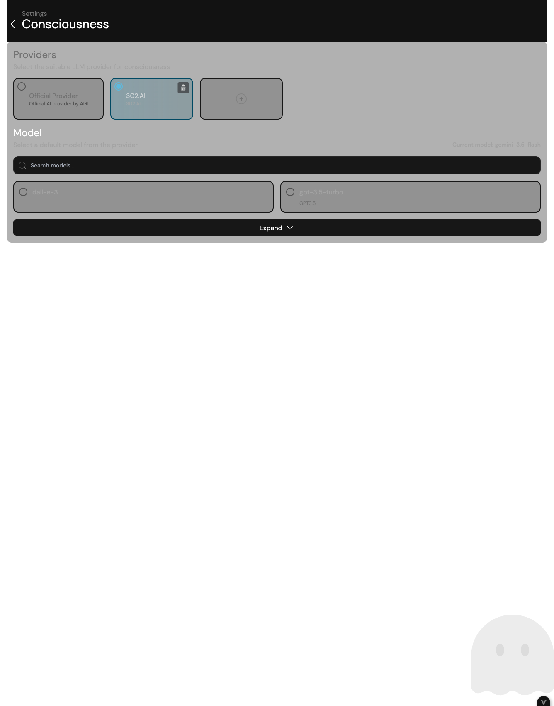
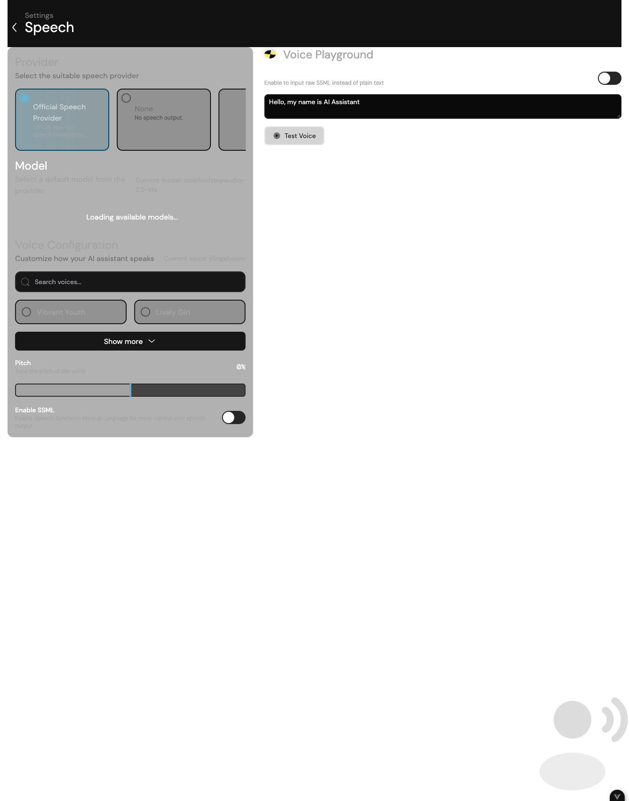
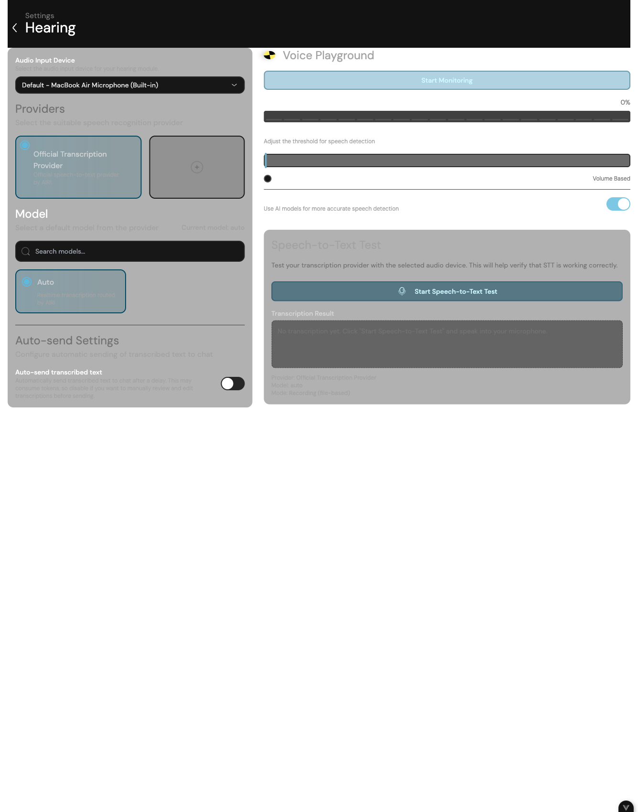
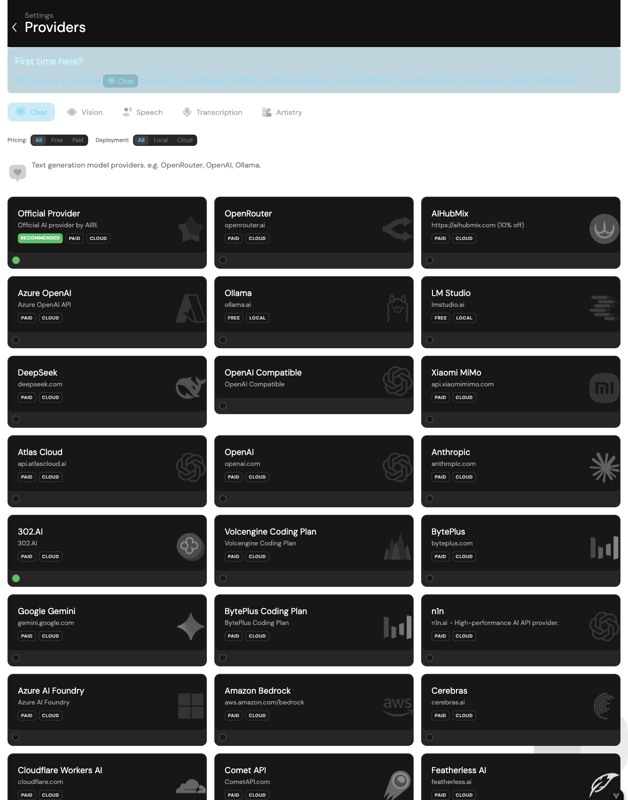
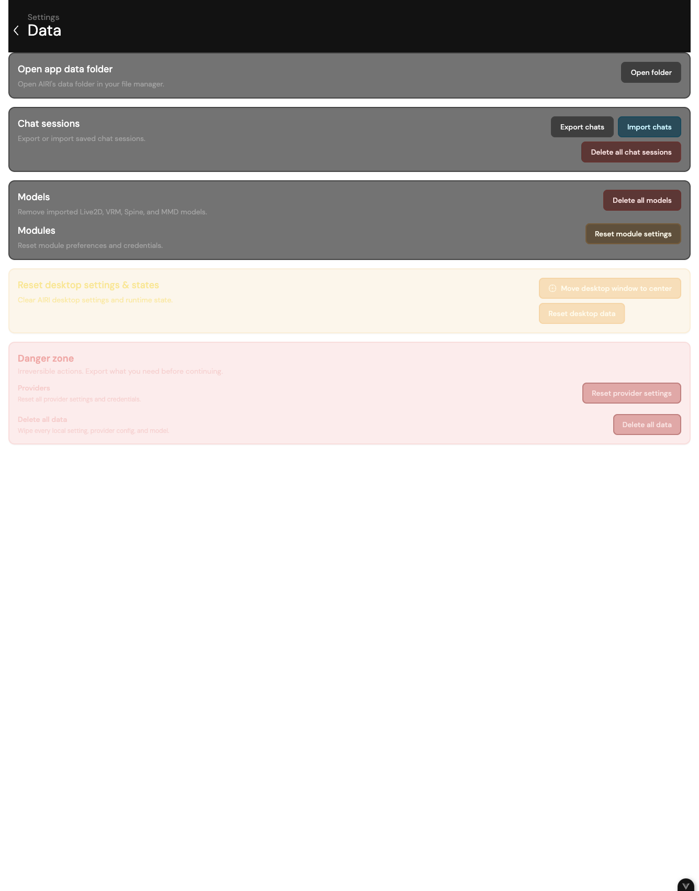
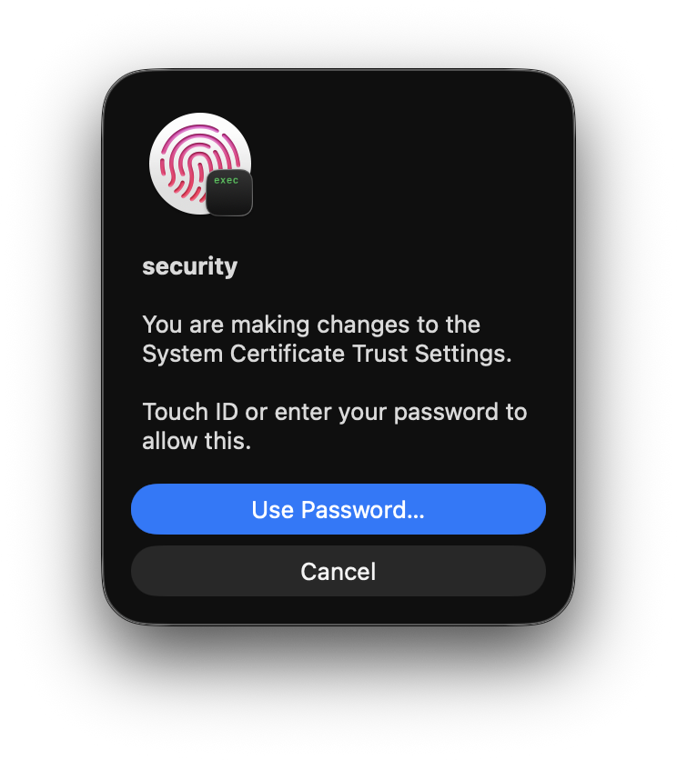

The corresponding version of this article: AIRI-0.11.3

::: warning instructions before reading
- Currently, some technical functions and operations of AIRI will not be explained in detail in this manual.
- The main editor is only responsible for the Chinese version of the manual. Other language versions are currently processed by AI translation + manual simple corrections, which may be inconsistent with the actual displayed content. Please refer to the actual content.
- Most of the contents of this manual are researched and researched by the team members of the manual, including other participants, and may be inconsistent with the facts or have deviations. Please refer to your actual experience for details.
- This manual may not be updated promptly.
- Due to space limitations, this manual only contains some detailed tutorials for the desktop and web versions. (The manual focuses on the features of the desktop version. For most features of the web version, you can refer to the desktop version directly. However, please note that there are differences between the two in some places. The actual situation shall prevail)
- Some parts of the software are in English and no translation is provided. This manual will try to translate some of the content involved. Please refer to the actual translation for the final translation.
- Version updates of AIRI may change some contents. This manual only introduces the features of the latest version before the time of writing. For other versions before and after, this manual may retain the description of some features. If you encounter differences, please solve them by yourself.
- If you have any questions about this manual, please leave a message at @jhicefair or @0x_selenic_dove in the [Project AIRI Official Discord](https://discord.gg/TgQ3Cu2F7A) channel.
- Join the WeChat group: Open the [WeChat group description](https://github.com/moeru-ai/airi/blob/main/docs/wechat.md)，扫描其中的二维码添加微信，并备注 `AIRI`) of the warehouse; the administrator will invite you to join the group. You can also contact @爱吃吃的Columbia in the group, or via WeChat ID `0xColumbina`.
- Join the QQ group: Open the [QQ group invitation link] provided by the warehouse README (https://qun.qq.com/universal-share/share?ac=1&authKey=9g00d%2BZS7nORzcJugNNddJ7rCghZTIR7fhXabGwch2S%2BG%2BKGIKwlN1N2nIqkh2jg&busi_data=eyJncm91cENvZGUiOiIxMDU4MTU2Njk3IiwidG9rZW4iOiJmcnkra1hWNFIxNytEcG0zcHRUdVJIaldlRDFxN0dzK080QWtvTEdOQjJkNEY2eUFta1g1clNpbkxSMS9FQWFYIiwidWluIjoiMTI2MDkwNzMzNSJ9&data=b1eJrwn3GVOUh7YIxZ7l9vHQo99HPmRxKPpMKlDCmfzx8Y57IXb2EZCMaOC9rVTd2U558qpNjwUYUWlPHxVHvg&svctype=4&tempid=h5_group_info)，使用 QQ to confirm joining; if the link is invalid, please refer to the latest link of the warehouse README.
- For other usage issues, you are welcome to communicate with the community in AIRI’s Discord, WeChat group or QQ group.
- Have fun! AHr
:::

## Chapter 1·Installation

Go to [Project AIRI Latest Release](https://github.com/moeru-ai/airi/releases/latest)，在 **Assets** to download the file corresponding to your device, then open the installation package and follow the prompts to complete the installation. `<版本号>` in the table will change with the latest release, please refer to the actual situation.

| Platform | Device | File to download |
| --- | --- | --- |
| Windows | x64 or Windows 11 ARM64 | `AIRI-<版本号>-windows-x64-setup.exe` |
| macOS | Apple Chip (M Series) | `AIRI-<版本号>-darwin-arm64.dmg` |
| macOS | Intel Chip | `AIRI-<版本号>-darwin-x64.dmg` |
| Linux | x64 Debian systems such as Ubuntu | `AIRI-<版本号>-linux-amd64.deb` |
| Linux | x64 RPM systems such as Fedora, openSUSE | `AIRI-<版本号>-linux-x86_64.rpm` |
| Linux | ARM64 Debian systems such as Ubuntu | `AIRI-<版本号>-linux-arm64.deb` |
| Linux | ARM64 RPM systems such as Fedora, openSUSE | `AIRI-<版本号>-linux-aarch64.rpm` |
| Android | Huawei Hongmeng and other Android devices | `AIRI-<版本号>-android.apk` |
| iOS/iPadOS | iPhone, iPad | `AIRI-<version>_(<build-number>)-ios.ipa` |

:::info About Windows Installation Software
The installer provides two installation methods: install for yourself or for everyone.

Choosing to install for yourself does not require administrator rights, but can only be accessed by the current user; choosing to install for everyone requires administrator rights, but all users on this computer can use this software.
:::

::: info About iPhone and iPad installation software
Currently only ipa files are provided, which need to be signed and installed manually. Detailed installation instructions are not provided yet.

The project team will release the TestFlight application test link in the future, please stay tuned!
:::

::: info About Huawei Hongmeng
Currently, the native Hongmeng software is not available. If you use a pure-blood Hongmeng system, please use Zhuoyitong to install the Android version of the software.
:::

## Chapter 2·Initial configuration

Before you start using AIRI, you need to have at least one chat provider and available models. Cloud services usually require creating an API Key or a login account; local services require starting the model service first.

Please follow the steps below to complete the initial configuration:

1. Open AIRI and enter the initial boot settings.
2. Select your language.
3. If you want to use your own AI model, please click "**Configure your own AI service source**". If you want to use the officially provided AI model, please click "**Login**". If you are not sure which provider to use, we recommend starting from [AIRI Official Provider](../../config/providers/consciousness/official.md), [OpenRouter](../../config/providers/consciousness/openrouter.md), [OpenAI Compatible Provider](../../config/providers/consciousness/openai.md) or locally [Ollama](../../config/providers/consciousness/ollama.md) Select one to configure.
4. If you use your own AI model (please refer to the sidebar "Configuration → Service Provider → Chat Service Provider" to learn how to configure):
1. Select the service source you prepared and click "**Next**";
2. Fill in your API Key (change the base URL if necessary), and then click "**Next**";
3. Click "**Next**" again;
4. Select the model you plan to use and click **Save and Continue**.
5. If you use the officially provided AI model: please refer to [AIRI official provider](../../config/providers/consciousness/official.md).

Congratulations, if nothing else, you have completed the preliminary configuration of AIRI!

::: tip Just configure the chat first
Once the chat provider and model are successfully configured, AIRI can reply to messages. Later, you can add capabilities such as speech synthesis (TTS), speech recognition (ASR/STT), visual understanding, and art creation. You can refer to [Voice Input and Output](../../config/audio.md), [Visual Understanding](../../config/vision.md) or [Art Creation](#chapter-4-art) to learn how to configure.
:::

::: warning API Key security
API Keys, AccessKey Secrets, and other service credentials should only be saved on your device. Do not commit them to the repository, post them to an Issue, take screenshots, or send them to others.
:::

## Chapter 3·AIRI Interface Introduction

### > Main window

This section mainly shows the desktop version. You can refer to this section for the web version/mobile version. Other unique features of the web version/mobile version are introduced [here](#chapter-3-main-web).

This window is a window that displays the virtual character image. There are three options:

- "Expand ⌃" - Located in the lower right corner, click to expand more options (see below).
- "Hearing Control &#x1F3A4;︎" - located in the lower right corner, click to speak to AIRI.
:::info Hearing Control Instructions
Clicking it will open the "Listening Input" panel. First enable microphone input and select the microphone; if prompted for permission, allow AIRI to use the microphone. After configuring the speech recognition service, what is said is transcribed and sent to the current chat session. AIRI will pause the recording when speaking to avoid recognizing your own voice again.
:::

- "Move ✥" - Located in the lower right corner, long press the left mouse button and drag to change the position of the main window on the desktop.

Click "Expand ⌃". After expansion, there are nine sub-options, from top to bottom and from left to right:

- "Login" - you can log in to your own AIRI account.
- "Open Settings" - Open AIRI's settings interface.
- "Switch character" - switch character cards.
- "Open Chat" - Open the chat window.
- "Refresh" - Refresh the main window.
- "Move to screen center" - moves the window to the center of the screen.
- "Switch to Dark Mode" - Switch AIRI's interface background to "Light/Dark".
- "Cancel pinned to top" - the AIRI character model will no longer remain pinned to the top.
- "Always show"/"hide on hover" - so that the AIRI main window does not affect the mouse cursor's click on the content under the window, thus not affecting your work.
- "Close" - close AIRI with one click.

### > Other system tray options

First, you need to find the little AIRI icon in the taskbar.

::: tip If you can't find the taskbar/menu bar icon...
On Windows, you may need to click "Show hidden icons (⌃)" on the taskbar to expand it to find the AIRI icon.

On macOS, icons may be hidden behind the notch (especially on MacBook built-in displays). At this point, some existing menu bar icons need to be hidden. You can open System Settings → Menu Bar to show or hide menu icons.
:::

Right-click on the AIRI icon and you will see ten options:

- "Display" - Summons the main window, generally not used.
- "Resize" - adjust the window size of the main window and also center the main window. Contains four sub-options:
- "Recommended (450x600)" - Set to the recommended size of 450x600.
- "Full Height" - Make the height of the main window fill the height of the desktop.
- "Half Height" - Make the height of the main window half the height of the desktop.
- "Full Screen" - makes the main window fill the entire desktop.
- "Align to" - Align the main window to a specific position on the desktop. Contains five sub-options:
- "Centered" - align to the middle of the desktop.
- "Top Left" - Align to the upper left corner of the desktop.
- "Top right" - align to the upper right corner of the desktop.
- "Lower left" - align to the lower left corner of the desktop.
- "Bottom Right" - Align to the lower right corner of the desktop.
- "Settings" - Open the settings interface.
- "About" - Open the About window, you can view the version number, visit the project homepage, update AIRI and select the update channel.
- "Open quick actions" - opens a floating input box. Press Enter after entering a short request to AIRI. The window will hide and the processing results will be displayed as a notification; press Esc to cancel.
- "Open widget" - open the widget window. Widgets provided by maps, weather, art, or extensions will appear here; the window may be empty when the tool or extension is not running.
- "Turn on subtitles" - turn on subtitles. Only when the TTS service is enabled will the text be displayed when AIRI is speaking, and will be hidden by default when the mouse cursor is hovering.
- "Subtitle floating window" - includes two sub-options:
- "Follow window" - This mode is selected by default. At this time, the position of the subtitle window will move with the main window; if unchecked, the position of the subtitles will be independent.
- "Reset position" - reset the subtitle position.
- "Exit" - close AIRI with one click.

### > Setting interface

::: info Scope of this section
This part only introduces what is in the interface. See Chapter 4 for specific functions.
:::

You can open the settings interface in the following two ways:

- Click "Expand" in the main window and select "Open Settings".
- Right-click the AIRI icon in the system tray and select "Settings".

The setting interface includes the following nine contents:

- "AIRI Character Card" - select and configure the character's personality.
- "Body Module" - Configure various functions of AIRI, including consciousness, vocalization, hearing, vision, short-term memory, long-term memory, Discord, X / Twitter, network search, Minecraft, Factorio, MCP server, and synchronized rhythm.
- "Scene" - configure the scene (background) of AIRI.
- "Character Model" - select and set the model of the character.
- "Memory" - the function has not been released yet.
- "Service Source" - configure the source of LLM, TTS, STT, and Artistry services.
- "Data" - translated as "data", manages various data of AIRI.
- "Connection" - Configure your WebSocket server address.
- "System" - includes four sub-options:
- "General" - set the program theme, language and other content.
- "Color Scheme" - set the theme color.
- "Window Shortcut" - Set global shortcut keys for Spotlight.
- "Developer" - advanced tools for development and troubleshooting; no configuration is required for daily use, see [Developer Guide](/zh-Hans/docs/contributing/desktop-developer-tools) for details.

### > Chat window

You can click "Expand" in the main window and then select "Open Chat" to open the chat window.

Here you can chat with AIRI. After speech synthesis is enabled, when AIRI is reading a reply, a "Stop Reading" button will appear in the input area; clicking it will only stop the current speech playback and will not cancel the generated text reply.

Click the "Conversation" button on the left side of the input area, or click the chat window title to open the conversation list. The list shows the preview and synchronization status of each conversation according to the last updated time; you can switch, delete conversations, or create new conversations for the current character. Deletion is usually unrecoverable, so please confirm that the content is no longer needed.

## Chapter 4·Settings

You can open the settings interface in the following two ways:

- Click "Expand" in the main window and select "Open Settings".
- Right-click the AIRI icon in the system tray and select "Settings".

### > AIRI character card

Here you can upload, create or modify default character cards directly.

::: info About import and export
Character cards can be imported or exported as AIRI character card packs. Card packs use Character Card V3 data and optionally come with Live2D, Spine or VRM display models. AIRI will verify the inventory and character card data in the package when importing; packages that are incorrectly formatted or missing required files cannot be imported.
:::

Regarding creating a new character card, it is recommended to configure it in the following order:

1. Fill in the identity section, including name, nickname, description, and creator notes.
2. Fill in the behavior part as needed, including character personality, scene (or understood as surrounding environment, background, situation) and greetings.
3. Adjust the module section as needed to configure specific body modules for the character.
4. Configure the Artistry section as needed to configure the function of generating pictures for the character.
5. Finally check the settings section, including system prompt words, history prompt instructions and versions.
6. After confirming that the content is correct, click "**Create**" to complete the creation of the character card.
7. After the creation is completed, click the circle in the lower right corner of the character card, or click the character card and then click Activate to officially activate the character card.

The most important part of the identity is the name and description:

- The name is the official name of the character. If a nickname is set, the nickname will be used first.
- The description is the specific details about the character. You can play with it freely, or you can refer to the default character card.

::: info Editor’s addition
- If you choose to refer to the default character card to write your own character's settings, the second half of the content about the ACT tag does not need to be added.
- Creator notes are only notes for character cards and will not affect the AIRI response results.
- The behavior part is used to supplement the personality, scenes and greetings; the module part can specify chat, visual, voice and display models for the character; the Artistry part sets the character's image generation preferences; the Settings part contains system prompt words, historical prompt instructions and version information.
:::

::: warning requires manual activation
After creating a character card, it will not be enabled by default and must be manually activated before it can be used. Click the play button below to enable it.
:::

### > Body module

Here you can configure various functions of AIRI, as follows:

#### > Consciousness

Please refer to [Chat Model](../../config/llm.md) for configuration.

#### > Speak up
Please refer to [Voice Input and Output](../../config/audio.md) for configuration. If you do not want AIRI to speak, select None.
::: tip Supplementary instructions for the voicing page
- First select the service provider and model, and then select the timbre provided by the model; the fields displayed by different service providers will be different.
- Pitch (pitch) is only effective for service providers and models that support this parameter.
:::

#### > Hearing
Please refer to [Voice Input and Output](../../config/audio.md) for configuration. If you are not using voice input yet, select None.

::: info Definition: Speech recognition STT

STT is the abbreviation of "Speech-to-Text", also known as Automatic Speech Recognition (ASR).

Its goal is to enable computers to understand human speech and convert it into corresponding text.
:::

:::info when used on macOS
The first time you use AIRI's voice input function on macOS, you need to perform a one-time microphone permission authorization operation. When you see the following prompt, please select Allow, otherwise this function will not work properly.

:::

In addition, you can:

- Enable the Auto-send transcribed text feature for automatic sending.
- Turn off this function to adjust the transcription results.
- Adjust the send delay through Auto-send delay.

:::info automatically sent
When auto-send is enabled, the recognized text will be sent to the chat session after a set delay; when it is turned off, you can check or modify the text before sending it manually.
:::

If you want to test the microphone:

1. Click "**start monitoring**" in the middle part of the interface to start monitoring.
2. If necessary, you can adjust Sensitivity.

If you want to test STT functionality:

1. Click "**start speech-to-text**" at the bottom of the interface to start testing.
2. Then view the recognition results under Transcription Result.

#### > Vision
Please refer to [Visual Understanding](../../config/vision.md) for configuration.

::: warning Before using screen vision, you need to start Vision Capture
When configuring only the vision service provider and model, there is no need to enable this tool.

To have AIRI analyze your screen or window, go to "System → Developer → Vision Capture": grant screen recording permission, select the window or display you want to capture, and click "Start ticker". If you want to provide the recognition results to the AIRI dialog, then turn on "Publish to character".

Vision Capture is the current desktop debugging/development workflow; leaving the page will stop the capture loop. For complete instructions, see [Desktop Developer Tools](/zh-Hans/docs/contributing/desktop-developer-tools#vision-capture).
:::

#### > Artistry (artistic creation)

Here you can configure AIRI's ability to create art.

You can refer to the sidebar "Configuration → Service Provider → Art Creation Service Provider" to learn how to configure and use different AI providers to create works.

::: warning Please use a chat model that supports tool calls
Artistic creation does not directly generate images from the character: AIRI will provide the tool with configured image services to the current **chat model**, and then the model will call the tool to submit the generation task. Therefore, chat models and service providers must support **Tool Calling / Function Calling**.

After selecting the service provider in "Settings → Consciousness", please select the model that the service provider clearly marks as supporting tool calling. Models that only support ordinary text conversations, or are called by the service provider without transparent transmission tools, may only respond with text, refuse to be generated, or may not submit tasks to the selected image service at all.

After configuration, let the character perform a simple image request. Confirm that AIRI has initiated a tool call; if the service provider provides task status, history, or console, you can also confirm that the task has been received. AIRI doesn't display the results until the task is completed and a picture is returned. For the exclusive verification methods of each service provider, please refer to the corresponding page in the sidebar "Configuration → Service Provider → Art Creation Service Provider".
:::

#### > Short-term memory

The function is under development, please stay tuned. If you have ideas for implementing this feature, please submit suggestions via issues or PR.

#### > Long term memory

The function is under development, please stay tuned. If you have ideas for implementing this feature, please submit suggestions via issues or PR.

#### > Discord

Discord integration requires running the bot service from source to allow AIRI to enter the Discord server's messaging and voice channels.

1. Create a Discord application, enable the required Intents, and configure the Bot Token in the [Discord Bot Integration Guide](/en/docs/contributing/services/discord.md).
2. Configure the model and voice service credentials locally.
3. Start the Discord bot service from the root directory of the repository.

::: warning Credential security
Discord Bot Token, Model API Key, and Speech Service Credentials should only be saved in the local configuration file. Do not submit, screenshot, or send these configurations.
:::

#### > X / Twitter

Please read the [X / Twitter Integration Guide](/zh-Hans/docs/integrations/x.md) to create and fill in your X Developer Platform application credentials. Don't expose your API Key, API Secret, or access token.

#### > Web search

Please read the [Web Search Configuration Guide](../../config/web-search.md) to configure the Tavily API Key, and learn about usage, privacy tips, and FAQs.

#### > Minecraft Minecraft

Minecraft integration requires running a local agent service from source. Please follow the [Minecraft Agent Integration Guide](/en/docs/contributing/services/minecraft.md) to configure the trusted server, AIRI, and model services, and then start the agent.

::: warning security reminder
Do not connect Minecraft agents to untrusted public servers. It drives local Minecraft sessions and network connections, and malicious servers can cause unexpected behavior.
:::

::: tip Integration Service Documentation
Instructions for running from source for Discord, Minecraft, Satori, and Telegram are in the sidebar "Integrated Services."
:::

#### > Factorio

Please read the [Factor Integration Guide](/zh-Hans/docs/integrations/factorio.md) and fill in the AIRI with the address, port and in-game username of the trusted server. AIRI does not come with ready-to-deploy Factorio server-side integration.

#### >MCP Integration

MCP (Model Context Protocol) allows AIRI to use external tools through local processes. On the desktop, after opening this page, you can add a server, fill in its commands, parameters and environment variables, run a connection test first, and then click "Apply and Restart" to start or restart the MCP service. You can also open configuration files or use the JSON editor to maintain configurations in batches. Only run MCP servers that you trust: they can execute commands locally and have access to environment variables that you grant.

#### > Synchronized Temperament

Sync Rhythm analyzes the beat from the screen-captured audio and sends the beat signal to the stage effects. Click "Start Screen Capture" and select the screen or window containing audio; use "Stop" to end the capture. The page provides sensitivity, minimum beat interval, and advanced filtering parameters, and displays real-time spectrum and beat visualizations. First time use may require granting system screen recording permission.

### > Scenes

Here, you can configure the scene of the AIRI main interface - you can simply understand it as the background of the AIRI main interface.

There are two presets included here. You can click the **check** in the middle of one of the presets (you need to move the mouse cursor up to display it) to enable the scene.

You can also click "**Upload to Scene Library**" to import your own picture scenes.

If you need to clear the scene, please click "**Clear Default**".

### > Role model

Here you can select and set up your character's model.

AIRI supports Live2D, Spine 2D and VRM 3D models.

If you just want to switch an existing model, we recommend the following steps:

1. Click "**select model**" to open the model selection interface.
2. In the current version, you can see two Live2D models and two VRM 3D models by default.
3. After selecting a model, click "**confirm**" to complete the switch.

If you want to import your own model, you can click "**add**" to choose Live2D, Spine or VRM format.

::: info Godot Stage (Experimental)
"Switch to Godot Stage (Experimental)" will start the independent Godot stage renderer; click "Back to Built-in Stage" again to switch back to the built-in stage. Godot Stage currently only supports VRM models. With the VRM launched and selected, camera X/Y/Z, yaw, pitch, and field of view can be adjusted in Godot View; status or model loading errors will be displayed in this area.
:::

::: warning Please pay attention before importing the model
- Older Live2D models are not supported, please select files including "\*.moc3".
- Before importing the Live2D model, you need to compress the "model folder" into a "\*.zip" file before importing it.
- Spine models also need to be imported as "\*.zip"; VRM uses a single "\*.vrm" file.
:::

#### > If you select a Live2D model

You can continue to adjust in the following order:

1. Expand "Scale and Position" and adjust the size and position of the model in the main window. Where x is the horizontal axis (left and right) position, and y is the vertical axis (up and down) position.
2. Expand "parameters" and continue to set mouse tracking, Idle Animation, frame rate, Auto Blink, Force Auto Blink (fallback timer), Shadow, reset to default parameters, clear model cache (translated as "clear the model cache") and all parameters involved in the model.
3. If you want to set a standby animation, please ensure that the model compressed package contains animation files.
4. If you still need the expression function, you can expand "Expressions" (translated as "expression") to enable the Expression System (translated as "expression system").

When speech synthesis is enabled, AIRI automatically restores Live2D's mouth state after reading.

::: info parameters and expressions
The parameters, standby animations and expressions available to the model are determined by the model file itself. After the Expression System is enabled, only the expressions actually provided by the model will be displayed; if there are no expressions or animation files, the corresponding options will have no effect.
:::

#### > If you select the Spine 2D model

The Spine model provides a separate settings panel. You can adjust scaling, X/Y position, skins, variants, idle animations, animation blend time and playback speed, as well as limit frame rate and adjust render scale. If the model contains available skins, variants, or animations, they will appear in the corresponding drop-down options; missing assets will not be displayed.

#### > If you select a VRM 3D model

You can first expand "Scene", and then set the Model Position (translated as "Model Position"), viewing angle adjustment (degrees), camera distance (screen zoom), model orientation (Y-axis rotation), model gaze direction, etc.

::: info VRM perspective
Position, rotation, camera distance and gaze direction in the built-in stage are saved to the current settings.
:::

### > Memory

The function has not been released yet. If you have ideas for implementing this feature, please submit suggestions via issues or PR.

### > Service source

"Service Origin" is the entry point to AIRI's connection model and voice capabilities. First save the service provider credentials here, and then select the service provider and model on the corresponding function page.

You can choose categories by purpose:

- **CHAT**: Configure LLM for AIRI to reply to messages; this is necessary to start using AIRI.
- **Speech Synthesis (TTS)**: Let AIRI read the reply; then select the model and timbre in "Aircraft Module → Vocalization".
- **Speech Recognition (ASR/STT)**: Convert microphone speech into text; then select the model in "Body Module → Hearing".
- **Art Creation**: Configure the image generation service; then use it in "Body Module → Artistry".

If you skip the initial configuration guide, it is recommended to complete the configuration of the chat service provider first: select the service provider and fill in its API Key or login account; if required by the service provider, fill in advanced fields such as Base URL and region; and then use **Ping API** to verify connectivity. After verification, go to "Body Module → Consciousness" to select the service provider and model, and send a message to confirm that AIRI can reply.

After switching chat service providers, the originally selected chat model will be cleared; please return to "Body Module → Consciousness" to reselect a model for the new service provider.

::: warning Credential security
API Keys, AccessKey Secrets, and other service credentials should only be saved in the current device's settings. Do not commit them to the repository, post them in an Issue, take a screenshot, or send them to others.
:::

::: tip configuration guide
- If you are not sure about the service provider's fields, verification methods, or error reporting meanings, read [Common Configuration Instructions](../../config/common.md).
- To configure the chat model, read [Chat Model](../../config/llm.md); you can learn how to configure different chat providers in "Configuration → Service Provider → Chat Service Provider".
- To configure voice input and output, read [Voice Input and Output](../../config/audio.md); speech synthesis, speech recognition and art creation service providers are also located in the "Service Provider" menu in the sidebar.
- Visual understanding uses the same credentials as the chat service provider and must select a chat model that supports image input; see [Visual Understanding](../../config/vision.md) for details.
:::

::: tip technical advice
The list of service providers is subject to the current version of AIRI. If your service provider is not in the list but supports the OpenAI compatible interface, you can use the **OpenAI compatible API** configuration; the Base URL and model ID must be filled in according to the official documentation of the service provider.
:::

### > Data

Here you can manage various data from AIRI.

::: warning Unrecoverable operation
Related data can be deleted or cleaned in this section and cannot be recovered, so please operate with caution. Before performing deletion and reset operations, it is recommended to confirm the content again.
:::

"Move desktop window to center" is translated as "move the desktop window to the center."

::: tip Web version feature description
Opening the app data folder and resetting desktop settings and status are only available in the desktop version, not in the web/mobile version of the app.
:::

### > Connect

"Connection" is used to configure AIRI's service channel. You can set a WebSocket address and enable TLS if encrypted transmission is required. On the desktop, you can also choose to only access locally, allow LAN access, or fill in an advanced host name (not available yet) and set an access token; the page will provide a QR code to facilitate the connection of other devices. Open LAN access only on trusted networks and keep access tokens securely.

::: tip macOS may require administrator verification
When secure WebSockets are enabled, AIRI adds the local certificate to the macOS login keychain. You may be asked to authorize this action using Touch ID or entering your Mac login password. Verify your fingerprint or Mac login password to continue.

:::

### > System

#### > General

Here you can set the program theme, language, etc.

- The theme options default to light color, click the button behind to switch to dark mode.
- Language options Here you can set the language of the interface; the selection will be retained after restarting AIRI.
- The control island icon size option can change the size of the three buttons in the lower right corner of the main window.
- Finally, you can also set whether to allow the collection of usage data and crash analysis, or read the privacy policy (click "Privacy Policy" to open).

#### > Color scheme

Here you can change the theme colors.

- You can activate the RGB option to make the theme colors change automatically like an RGB light strip.
- You can also drag the black line below or click in the color bar to change the theme color.
- Below it is a preview of the color effect.
- You can also directly select the preset below to change the theme color.

::: tip color presets
Here you should click on any circle, not the box.
:::

#### > Window shortcut
Here you can modify the **Spotlight** global shortcut keys. Spotlight is the floating input box used by Open Quick Actions.

1. Click the current shortcut key.
2. Press the new key combination you want to use; it must contain at least one modifier key: Cmd, Ctrl, Alt, or Super.
3. If the shortcut key is occupied by other applications, AIRI will prompt a conflict; press Esc to cancel recording.
4. Click "Reset" to restore the default shortcut keys.

::: tip Use Spotlight
Pressing the set shortcut key will open the quick operation input box. Press Enter after entering the request to send it to AIRI, or Esc to close.
:::

#### > Developer

This page is used for development, troubleshooting, and verification of experimental functions; ordinary users do not need to operate it. Complete tool descriptions have been moved to [Developer Guide → Developer Tools](/zh-Hans/docs/contributing/desktop-developer-tools).

## > Supplementary features of web version

### > Web moderator interface

Here you can see your character model and you can talk to it directly.

Generally speaking, it is divided into three parts:

- Character model space
- chat box
- other

The following focuses on the chat box and other parts of the interface.

#### > Chat box

The chat box is divided into upper and lower parts:

- The upper part is the area where chat history is displayed and recorded
- The lower part is the input box, where you can talk to the character by typing

There are three buttons below the lower part: (Text content is for reference only)

- Conversations (can manage conversations, different conversations are independent of each other)
-Sending method (you can choose how to confirm sending the message)
- Enable voice input

#### > Other parts

##### > Upper area

Includes three options:

- about
- Character cards
-Account and settings

There are three chunks of content included in the third option:

-Account information
- Files, Flux, Settings
- Sign out

###### > Archives

If you are logged in to AIRI, you can manage your account information here.

You can view and modify the display name, manage passwords and associated login methods (such as GitHub, Google), and log out or delete accounts in dangerous operation areas. The avatar is currently displayed by the account information. Uploading new avatars here is not supported at the moment.

###### > Flux

Flux is the balance unit used by AIRI official services. After logging in, you can view the current balance, usage statistics and transaction records; in regions or versions open for purchase, you can also select a package and enter settlement here. When using official chat, visual or voice services, related requests may consume Flux; the third-party service provider's fees are still billed separately by the service provider.

###### > Settings

Same as desktop settings, see [Chapter 4](#chapter-4-settings) for details

##### > Lower area

Includes four options: (Text content is for reference only)

- Location and size
- Delete chat history
- Switch between light and dark
- background

###### > Position and size

After clicking, you will see the three new options x, y, scale and the vertical bar on the left side of the web interface.

###### > Delete chat history

Click to clear all chat history with one click

::: warning Proceed with caution
Clicking to delete cannot be restored, please operate with caution!
:::

###### > Switch between light and dark

You can switch the interface to "light" or "dark"

###### > Background

You can change the background of the main interface

## > Historical Features & FAQ

### > FAQ

- After upgrading from an earlier version, the model may "disappear" if you have changed its size or position. When encountering this problem, please reset the model's scale and position in the model settings interface.

### > Feature H3-1-1

In the past few versions, an option was also visible in the upper right corner of the main window:

- "Websocket Status" - located in the upper right corner, click to open the connection settings, where you can configure your WebSocket server address

## > Written at the end——To all friends who want to participate in the preparation of manuals

This manual is a document mainly written by unofficial personnel but submitted to the official website. Although members of Mu Jiu Yunxuan's studio are usually responsible for content maintenance, we very much hope that all friends who want to edit this document or have edited this document can leave your name in the author position at the beginning. Whether you make changes in content or format, we welcome everyone to enrich and optimize this manual together, and contribute **your own power** from anyone to the AIRI project and this manual!

In addition, if you, as an unofficial person, have the idea of ​​changing this manual, you do not need to have any additional concerns, you can just change it and submit a Pull request. But again, don’t forget to leave your name!

Thank you all for your support and cooperation!

——Ling Zhen
