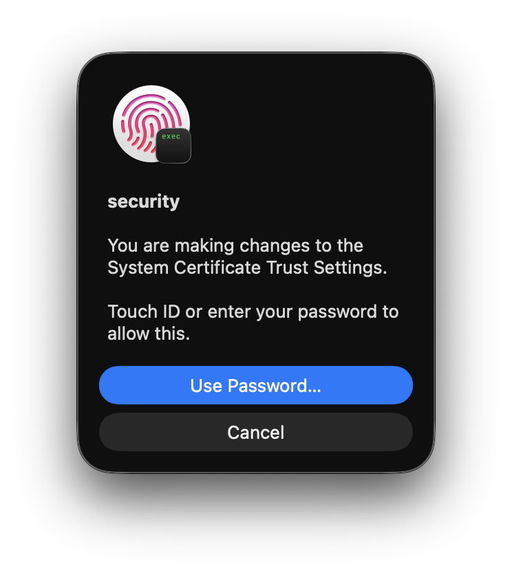

This manual corresponds to AIRI 0.11.3.

::: warning Before you begin
- Some AIRI features and operations are not covered in detail in this manual.
- The Chinese edition is the source version. Other language editions are machine-translated and lightly edited manually, so their wording may differ from the app. Always refer to the app if there are discrepancies.
- This manual is based on research by its contributors and may be incomplete, inaccurate, or out of date.
- The manual focuses on the desktop app and includes selected web tutorials. The two versions differ in some areas, so follow the app when they conflict.
- AIRI updates may change the documented behavior. This manual describes the version current when it was written; refer to the app and current release notes for later versions.
- If you have any questions about this manual, please leave a message at @jhicefair or @0x_selenic_dove in the [Project AIRI Official Discord](https://discord.gg/TgQ3Cu2F7A) channel.
- Join the WeChat group: Open the [WeChat group description](https://github.com/moeru-ai/airi/blob/main/docs/wechat.md), scan the QR code to add the admin's WeChat, and include `AIRI` in the join request; the admin will invite you to join the group.
- Join the QQ group: Open the [QQ group invitation link](https://qun.qq.com/universal-share/share?ac=1&authKey=9g00d%2BZS7nORzcJugNNddJ7rCghZTIR7fhXabGwch2S%2BG%2BKGIKwlN1N2nIqkh2jg&busi_data=eyJncm91cENvZGUiOiIxMDU4MTU2Njk3IiwidG9rZW4iOiJmcnkra1hWNFIxNytEcG0zcHRUdVJIaldlRDFxN0dzK080QWtvTEdOQjJkNEY2eUFta1g1clNpbkxSMS9FQWFYIiwidWluIjoiMTI2MDkwNzMzNSJ9&data=b1eJrwn3GVOUh7YIxZ7l9vHQo99HPmRxKPpMKlDCmfzx8Y57IXb2EZCMaOC9rVTd2U558qpNjwUYUWlPHxVHvg&svctype=4&tempid=h5_group_info), then use QQ to confirm joining; if the link is invalid, refer to the latest link in the repository README.
- For other questions about AIRI, join the community discussion on Discord, WeChat, or QQ.
- Have fun chatting with your AI companion! :)
:::

## Chapter 1: Installation

Go to the [latest Project AIRI release](https://github.com/moeru-ai/airi/releases/latest), expand **Assets**, and download the file for your device. Open the package and follow the installation prompts. Replace `<version>` and `<build-number>` below with the values used by the current release.

| Platform | Device | File to download |
| --- | --- | --- |
| Windows | x64 or Windows 11 ARM64 | `AIRI-<version>-windows-x64-setup.exe` |
| macOS | Apple silicon (M series) | `AIRI-<version>-darwin-arm64.dmg` |
| macOS | Intel | `AIRI-<version>-darwin-x64.dmg` |
| Linux | x64 Debian systems such as Ubuntu | `AIRI-<version>-linux-amd64.deb` |
| Linux | x64 RPM systems such as Fedora, openSUSE | `AIRI-<version>-linux-x86_64.rpm` |
| Linux | ARM64 Debian systems such as Ubuntu | `AIRI-<version>-linux-arm64.deb` |
| Linux | ARM64 RPM systems such as Fedora, openSUSE | `AIRI-<version>-linux-aarch64.rpm` |
| Android | Android devices, including supported HarmonyOS devices | `AIRI-<version>-android.apk` |
| iOS/iPadOS | iPhone, iPad | `AIRI-<version>_(<build-number>)-ios.ipa` |

::: info About Windows installation
The installer can install AIRI for the current user or for everyone. A current-user installation does not require administrator rights. Installing for everyone requires administrator rights and makes AIRI available to every user on the computer.
:::

::: info About iPhone and iPad installation
Only IPA files are currently provided. They must be signed and installed manually; detailed installation instructions are not yet available.

The project team plans to release a TestFlight testing link in the future.
:::

::: info About HarmonyOS
A native HarmonyOS version is not currently available. If you use HarmonyOS NEXT, use Zhuoyitong (卓易通) to install the Android version of AIRI.
:::

## Chapter 2: Initial configuration

Before you start using AIRI, you need at least one chat provider and an available chat model. Cloud services usually require an API key or a login account; local services require starting the model service first.

Complete the initial configuration as follows:

1. Open AIRI and start the onboarding flow.
2. On the welcome screen, optionally click the  **globe button** in the upper-right corner to change the interface language.
3. Select **Setup with your provider** to use your own provider, or **Sign in** to use AIRI's official provider. If you are unsure which provider to use, start with [AIRI Official Provider](../../config/providers/consciousness/official.md), [OpenRouter](../../config/providers/consciousness/openrouter.md), [OpenAI Compatible Provider](../../config/providers/consciousness/openai.md), or a local [Ollama](../../config/providers/consciousness/ollama.md) instance.
4. If you use your own provider:
    1. Select the provider you would like to use and click **Next**.
    2. Enter your API key, change the Base URL if necessary, and click **Next**.
    3. If an analytics notice is shown, review it and click **Next**.
    4. Select the chat model you plan to use and click **Save and Continue**.
5. To use AIRI's official provider, see [AIRI official provider](../../config/providers/consciousness/official.md).

Congratulations! You have completed AIRI's initial configuration.

::: tip Just configure the chat first
Once the chat provider and model are successfully configured, AIRI can reply to messages. Later, you can add capabilities such as speech synthesis (TTS), speech recognition (ASR/STT), visual understanding, and art creation. You can refer to [Voice Input and Output](../../config/audio.md), [Visual Understanding](../../config/vision.md) or [Art Creation](#chapter-4-art) to learn how to configure.
:::

::: warning API Key security
API Keys, AccessKey Secrets, and other service credentials should only be saved on your device. Do not commit them to the repository, post them to an issue, take screenshots, or send them to others.
:::

## Chapter 3: AIRI interface overview

### Main window

This section focuses on the desktop app. It also applies to many parts of the web and mobile apps; their unique features are introduced [here](#chapter-3-main-web).

This window displays the virtual character. Its primary controls are:

- **Expand** - Located in the lower right corner; click it to show more controls.
- **Open hearing Controls** - Opens the voice-input controls.
::: info Hearing control
First enable microphone input and select the microphone; if prompted for permission, allow AIRI to use the microphone. After configuring the transcription service, speech can be transcribed and sent to the current chat session. AIRI pauses input while speaking to reduce feedback.
:::

- **Drag to move window** - Hold the left mouse button and drag to move the main window.

Click **Expand**. The available controls are:

- **Sign in** — sign in to your AIRI account.
- **Open settings** — open AIRI's settings interface.
- **Switch Profile** — switch profiles.
- **Open Chat** — open the chat window.
- **Refresh** — refresh the main window.
- **Move to screen center** — moves the window to the center of the screen.
- "Switch to dark mode"/"Switch to light mode" - switch AIRI's interface theme.
- "Pin on top"/"Unpin from top" - control whether the AIRI window stays above other windows.
- "Auto hide"/"Always show" - control whether the AIRI window gets out of the way when you move the pointer over it.
- **Close** — close AIRI with one click.

### Other system tray options

Find the AIRI icon in the Windows taskbar or macOS menu bar.

::: tip If you can't find the taskbar/menu bar icon...
On Windows, you may need to click "Show hidden icons (⌃)" on the taskbar to expand it to find the AIRI icon.

On macOS, icons may be hidden behind the notch (especially on MacBook built-in displays). At this point, some existing menu bar icons need to be hidden. You can open System Settings → Menu Bar to show or hide menu icons.
:::

Right-click the AIRI icon to open the tray menu. The available entries depend on the current platform and app state:

- **Show** — show the main window.
- **Adjust sizes** — resize and center the main window. It contains four options:
  - **Recommended (450x600)** — Set to the recommended size of 450x600.
  - **Full Height** — Make the height of the main window fill the height of the desktop.
  - **Half Height** — Make the height of the main window half the height of the desktop.
  - **Full Screen** — Make the main window fill the entire desktop.
- **Align to** — align the main window to a specific desktop position. It contains five options:
  - **Center** — Align to the middle of the desktop.
  - **Top Left** — Align to the upper-left corner of the desktop.
  - **Top Right** — Align to the upper-right corner of the desktop.
  - **Bottom Left** — Align to the lower-left corner of the desktop.
  - **Bottom Right** — Align to the lower-right corner of the desktop.
- **Settings...** — open the settings interface.
- **About...** — open the About window to view the version, visit the project homepage, update AIRI, or select the update channel.
- **Open Inlay...** — open a floating input box. Enter a request and press Enter; AIRI hides the box and displays the result as a notification. Press Esc to cancel.
- **Open Widgets...** — open the widget window. Widgets supplied by maps, weather, art, or extensions appear here; the window may be empty when no corresponding tool or extension is running.
- **Open Caption...** / **Close Caption...** — open or close captions. When TTS is enabled, captions display AIRI's spoken text and are hidden by default while the pointer hovers over them.
- **Caption Overlay** — contains two options:
  - **Follow window** — This mode is selected by default. The caption window then moves with the main window; if unchecked, its position is independent.
  - **Reset position** — Reset the caption position.
- **Quit** — Close AIRI.

### Settings

::: info Scope of this section
This part only introduces what is in the interface. See Chapter 4 for specific functions.
:::

You can open the settings interface in the following two ways:

- Click **Expand** in the main window and select **Open settings**.
- Right-click the AIRI icon in the system tray and select **Settings...**.

The settings navigation includes:

- **AIRI Card** - Select and configure the active character.
- **Modules** - Configure AIRI features such as Consciousness, Speech, Hearing, Vision, and integrations.
- **Scenes** - Configure the active character's background.
- **Models** - Select, import, and configure the character display model.
- **Memory** - View memory settings as they become available.
- **Providers** - Configure Chat, Vision, Speech, Transcription, and Artistry providers.
- **Data** - Export, reset, or remove locally stored AIRI data.
- **Connection** - Configure the AIRI WebSocket server and remote access.
- **System** - Contains **General**, **Color Scheme**, **Window Shortcuts**, and **Developer** pages. See [Desktop Developer Tools](/en/docs/contributing/desktop-developer-tools) for the developer-only pages.

### Chat window

You can click **Expand** in the main window and then select **Open Chat** to open the chat window.

Here you can chat with AIRI. After speech synthesis is enabled, **Stop speaking** appears while AIRI is reading a reply; clicking it stops the current speech playback without cancelling the generated text reply.

Click **Conversations** on the left side of the input area, or click the chat-window title, to open the conversation list. The list shows the preview and synchronization status of each conversation according to the last updated time; you can switch, delete conversations, or create new conversations for the current character. Deletion is usually unrecoverable, so confirm that the content is no longer needed.

## Chapter 4: Settings

You can open the settings interface in the following two ways:

- Click **Expand** in the main window and select **Open settings**.
- Right-click the AIRI icon in the system tray and select **Settings...**.

### AIRI Card

Here you can import, create, edit, and activate character cards.

::: info About import and export
Character cards can be imported or exported as AIRI character card packs. Card packs use Character Card V3 data and optionally come with Live2D, Spine or VRM display models. AIRI will verify the inventory and character card data in the package when importing; packages that are incorrectly formatted or missing required files cannot be imported.
:::

To create a character card:

1. Fill in the identity section, including name, nickname, description, and creator notes.
2. Add behavior details such as personality, scenario, and greetings.
3. Configure the character's preferred capabilities under **Modules**.
4. Configure image-generation preferences under **Artistry**, if needed.
5. Review **Settings**, including the system prompt, post-history instructions, and card version.
6. Click **Create**.
7. Activate the new card by clicking the control in its lower-right corner, or open the card and click **Activate**.

The most important part of the identity is the name and description:

- The name is the official name of the character. If a nickname is set, the nickname will be used first.
- The description is the specific details about the character. You can play with it freely, or you can refer to the default character card.

::: info Editor’s addition
- If you choose to refer to the default character card to write your own character's settings, the second half of the content about the ACT tag does not need to be added.
- Creator notes are only notes for character cards and will not affect the AIRI response results.
- Behavior defines personality, scenario, and greetings. Modules can specify chat, Vision, Speech, and display-model preferences. Artistry stores image-generation preferences. Settings contains the system prompt, post-history instructions, and card version.
:::

::: warning requires manual activation
Creating a character card does not activate it automatically. Use the card's activation control before starting a conversation with it.
:::

### Modules

Configure AIRI's active capabilities here.

#### Consciousness

Open **Settings → Modules → Consciousness** to select the active chat provider and model. See [Chat Model](../../config/llm.md) for the complete provider-to-model flow.

#### Speech
Open **Settings → Modules → Speech** to select the active speech provider, model, and voice. See [Voice Input and Output](../../config/audio.md) for configuration. If you do not want AIRI to speak, select **None**.
::: tip Supplementary instructions for the Speech page
- Select the provider and model first, then select a supported voice. Different providers expose different fields.
- Pitch only affects providers and models that support this parameter.
:::

#### Hearing
Open **Settings → Modules → Hearing** to select the transcription provider, model, and audio input. See [Voice Input and Output](../../config/audio.md) for configuration. If you are not using voice input yet, select **None**.

::: info Definition: Speech recognition STT

Speech-to-text (STT), also called automatic speech recognition (ASR), converts spoken audio into text.
:::

::: info When used on macOS
The first time you use voice input on macOS, allow AIRI to access the microphone when prompted.

:::

In addition, you can:

- Enable the Auto-send transcribed text feature for automatic sending.
- Turn off this function to adjust the transcription results.
- Adjust the send delay through Auto-send delay.

::: info Automatic sending
When auto-send is enabled, the recognized text will be sent to the chat session after a set delay; when it is turned off, you can check or modify the text before sending it manually.
:::

If you want to test the microphone:

1. Click **Start Monitoring** in the middle part of the interface.
2. If necessary, you can adjust Sensitivity.

If you want to test STT functionality:

1. Click **Start Speech-to-Text Test** at the bottom of the interface.
2. Then view the recognition results under Transcription Result.

#### Vision
Open **Settings → Modules → Vision** to select the active vision provider and image-capable model and to set **Capture interval**. See [Visual Understanding](../../config/vision.md) for the complete flow.

::: warning Before using screen vision, you need to start Vision Capture
When configuring only the vision service provider and model, there is no need to enable this tool.

To have AIRI analyze your screen or window, open **System → Developer → Vision Capture**, grant screen-recording permission, select a window or display, and click **Start ticker**. To send the results to the current character, enable **Publish to character**.

Vision Capture is the current desktop debugging/development workflow; leaving the page will stop the capture loop. For complete instructions, see [Desktop Developer Tools](/en/docs/contributing/desktop-developer-tools#vision-capture).
:::

#### Artistry (artistic creation)

Here you can configure AIRI's ability to create art.

Open **Settings → Providers → Artistry** to configure an image provider, then enable it under **Settings → Modules → Artistry**.

::: warning Please use a chat model that supports tool calls
Artistic creation does not generate images directly from the character: AIRI makes the configured image tool available to the current **chat model**, which calls the tool to submit the generation task. Therefore, the chat provider and model must support **Tool Calling / Function Calling**.

Under **Settings → Modules → Consciousness**, select a model that the provider explicitly marks as supporting tool calling. Models limited to ordinary text conversations may respond with text without submitting a task to the selected image service.

After configuration, ask the character to generate a simple image. Confirm that AIRI initiates a tool call; if the provider offers task status, history, or a console, you can also confirm that it received the task. AIRI displays the result after the task completes and returns an image. See the corresponding page under **Settings → Providers → Artistry** for provider-specific verification.
:::

#### Short-term memory

The function is under development, please stay tuned. If you have ideas for implementing this feature, please submit suggestions via issues or PR.

#### Long term memory

The function is under development, please stay tuned. If you have ideas for implementing this feature, please submit suggestions via issues or PR.

#### Discord

Discord integration requires running the bot service from source to allow AIRI to enter the Discord server's messaging and voice channels.

1. Create a Discord application and enable the required Intents described in the [Discord Bot Integration Guide](/en/docs/integrations/discord).
2. Start the Discord bot service from the repository.
3. In AIRI, open **Settings → Modules → Discord**, enter **Discord Bot Token**, turn on **Enable Discord Integration**, and click **Save**. The running bot service receives this configuration from AIRI.
4. Configure the remaining bot-service settings described in the integration guide.

::: warning Credential security
Discord Bot Token, Model API Key, and Speech Service Credentials should only be saved in the local configuration file. Do not submit, screenshot, or send these configurations.
:::

#### X / Twitter

Open **Settings → Modules → X / Twitter**, then follow the [X / Twitter Integration Guide](/en/docs/integrations/x) to create and enter your X Developer Platform application credentials. Do not expose your API key, API secret, or access token.

#### Web search

Open **Settings → Modules → Web Search**, then follow the [Web Search Configuration Guide](../../config/web-search.md) to configure the Tavily API Key and learn about usage, privacy tips, and FAQs.

#### Minecraft

Minecraft integration requires running a local agent service from source. Follow the [Minecraft Agent Integration Guide](/en/docs/integrations/minecraft) to configure the trusted server, AIRI, and model services, and then start the agent.

::: warning security reminder
Do not connect Minecraft agents to untrusted public servers. It drives local Minecraft sessions and network connections, and malicious servers can cause unexpected behavior.
:::

::: tip Integration Service Documentation
Instructions for running integration services from source are in the **Integration Services** section of the documentation sidebar.
:::

#### Factorio

Open **Settings → Modules → Factorio**, then follow the [Factorio Integration Guide](/en/docs/integrations/factorio) to enter the trusted server address, port, and in-game username. AIRI does not include a ready-to-deploy Factorio server-side integration.

#### MCP Server

MCP (Model Context Protocol) allows AIRI to use external tools through local processes. On desktop, open **Settings → Modules → MCP Server**, click **Add server**, then fill in **Identifier**, **Command**, **Arguments**, and any optional **Working directory** or **Environment** values. Use **Test** to test the selected server, then click **Save and restart** to write the configuration and restart MCP. **Reveal in file manager** and **Edit JSON** are also available for direct configuration maintenance. Only run MCP servers that you trust: they can execute commands locally and access environment variables that you grant.

#### Beat Sync

Open **Settings → Modules → Beat Sync**. Beat Sync analyzes audio from a selected screen or window and sends beat signals to the stage effects. Click **Start screen capture** and select the source containing audio; use **Stop** to end capture. The page provides sensitivity, minimum beat interval, advanced filtering parameters, and real-time spectrum and beat visualizations. First use may require system screen-recording permission.

### Scenes

Scenes are backgrounds for AIRI's main interface.

The **Scene Gallery** shows the backgrounds currently available to AIRI. Hover over an inactive scene and click its check button to make it the active character background.

Click **Upload to Gallery** to import an image.

To remove the active background, click **Clear Default**.

### Models

Here you can select and set up your character's model.

AIRI supports Live2D, Spine 2D and VRM 3D models.

If you just want to switch an existing model, we recommend the following steps:

1. Click **Select model** to open the **Model Selector**.
2. Click **Pick** on the model you want to use.
3. Click **Confirm** to complete the switch.

To import your own model, open **Model Selector** and use **Import**. The selector currently supports ZIP packages for Live2D and Spine, VRM files, and ZIP packages for MMD models.

::: info Godot Stage (Experimental)
**Switch to Godot Stage (Experimental)** starts the separate Godot stage renderer; click **Back to Built-in Stage** to switch back. Godot Stage currently supports only VRM models. With a VRM model selected, you can adjust camera X/Y/Z, yaw, pitch, and field of view in Godot View. Status and model-loading errors also appear there.
:::

::: warning Please pay attention before importing the model
- Older Live2D models are not supported, please select files including "\*.moc3".
- Before importing the Live2D model, you need to compress the "model folder" into a "\*.zip" file before importing it.
- Spine models also need to be imported as "\*.zip"; VRM uses a single "\*.vrm" file.
:::

#### If you select a Live2D model

You can continue to adjust in the following order:

1. Expand **Scale and Position** to adjust the model's size and position. X controls horizontal position and Y controls vertical position.
2. Expand **Parameters** to configure mouse tracking, idle animation, frame rate, blinking, shadows, model-cache clearing, and model-specific parameters.
3. To use an idle animation, ensure that the imported package includes animation files.
4. Expand **Expressions** and enable **Expression System** to use expressions included with the model.

When speech synthesis is enabled, AIRI automatically restores Live2D's mouth state after reading.

::: info parameters and expressions
The parameters, standby animations and expressions available to the model are determined by the model file itself. After the Expression System is enabled, only the expressions actually provided by the model will be displayed; if there are no expressions or animation files, the corresponding options will have no effect.
:::

#### If you select the Spine 2D model

The Spine model provides a separate settings panel. You can adjust scaling, X/Y position, skins, variants, idle animations, animation blend time and playback speed, as well as limit frame rate and adjust render scale. If the model contains available skins, variants, or animations, they will appear in the corresponding drop-down options; missing assets will not be displayed.

#### If you select a VRM 3D model

Expand **Scene** to adjust model position, viewing angle, camera distance, Y-axis rotation, and gaze direction.

::: info VRM perspective
Position, rotation, camera distance and gaze direction in the built-in stage are saved to the current settings.
:::

### Memory

The function has not been released yet. If you have ideas for implementing this feature, please submit suggestions via issues or PR.

### Providers

**Providers** is where AIRI connects to model, voice, transcription, and image services. Enter provider credentials here, then select the provider and model on the corresponding module page.

You can choose categories by purpose:

- **CHAT**: Configure LLM for AIRI to reply to messages; this is necessary to start using AIRI.
- **Speech Synthesis (TTS)**: Let AIRI read replies; then select the model and voice in **Modules → Speech**.
- **Speech Recognition (ASR/STT)**: Convert microphone speech into text; then select the model in **Modules → Hearing**.
- **Art Creation**: Configure an image-generation service; then use it in **Modules → Artistry**.

If you skip onboarding, configure a chat provider first: enter its API key or account details and any required advanced fields, such as Base URL or region. Wait for automatic validation and use **Ping API** when it is available. Then open **Modules → Consciousness**, select the provider and model, and send a message.

After switching chat providers, the selected chat model is cleared. Return to **Modules → Consciousness** to select a model for the new provider.

::: warning Credential security
API Keys, AccessKey Secrets, and other service credentials should only be saved in the current device's settings. Do not commit them to the repository, post them in an Issue, take a screenshot, or send them to others.
:::

::: tip configuration guide
- If you are unsure about provider fields, validation methods, or errors, read [Common Configuration Instructions](../../config/common.md).
- To configure the chat model, read [Chat Model](../../config/llm.md) and choose a provider under **Settings → Providers → Chat**.
- To configure voice input and output, read [Voice Input and Output](../../config/audio.md). Speech and Transcription providers are under **Settings → Providers** and are enabled from their corresponding module pages.
- Vision providers store their own credentials, even when their fields match the corresponding Chat provider. See [Visual Understanding](../../config/vision.md) for details.
:::

::: tip technical advice
The provider list depends on the installed AIRI version. If an unlisted provider implements an OpenAI-compatible interface, use the corresponding **OpenAI Compatible API** entry and enter the exact Base URL and model ID from that provider's documentation.
:::

### Data

Manage AIRI's locally stored data here.

::: warning Unrecoverable operation
Deletion and reset operations in this section cannot be undone. Confirm the selected data before continuing.
:::

Use **Move desktop window to center** to restore the desktop stage to the center of the current screen.

::: tip Web version feature description
Opening the app data folder and resetting desktop settings and status are only available in the desktop version, not in the web/mobile version of the app.
:::

### Connection

**Connection** configures AIRI's service channel. You can set the **WebSocket Server Address** and enable **Enable Secure WebSocket (WSS)** when encrypted transport is required. On desktop, **Expose On Network** can be set to **This device**, **All**, or **Advanced**; the Advanced option reveals **Bind Hostname**. You can also set an **Auth Token** and use the QR code to connect Stage Pocket. Expose AIRI only on trusted networks and keep the token private.

::: tip macOS may require administrator verification
When secure WebSockets are enabled, AIRI adds the local certificate to the macOS login keychain. You may be asked to authorize this action using Touch ID or entering your Mac login password. Verify your fingerprint or Mac login password to continue.

:::

### System

#### General

Configure AIRI's theme, language, and general behavior here.

- **Theme** switches between light and dark mode.
- **Language** sets the interface language; the selection is retained after restarting AIRI.
- **Controls Island Icon Size** changes the desktop control-island icon size.
- **Enable usage analytics** controls anonymous usage analytics when analytics are available in the current build. The description links to the privacy policy.

#### Color scheme

Configure AIRI's theme colors here.

- You can activate the RGB option to make the theme colors change automatically like an RGB light strip.
- You can also drag the black line below or click in the color bar to change the theme color.
- Below it is a preview of the color effect.
- You can also directly select the preset below to change the theme color.

::: tip color presets
Click a color swatch to apply its preset.
:::

#### Window Shortcuts
Here you can modify the **Spotlight** global shortcut keys. Spotlight is the floating input box used by Open Quick Actions.

1. Click the current shortcut key.
2. Press the new key combination you want to use; it must contain at least one modifier key: Cmd, Ctrl, Alt, or Super.
3. If the shortcut key is occupied by other applications, AIRI will prompt a conflict; press Esc to cancel recording.
4. Click **Reset** to restore the default shortcut.

::: tip Use Spotlight
Pressing the set shortcut key will open the quick operation input box. Press Enter after entering the request to send it to AIRI, or Esc to close.
:::

#### Developer

This page is used to develop, troubleshoot, and verify experimental features; regular users do not need it. Complete tool descriptions are available in [Developer Guide → Developer Tools](/en/docs/contributing/desktop-developer-tools).

## Web-version features

### Web main interface

The web interface contains the character stage, chat area, and account and display controls.

#### Chat box

The upper area displays chat history. The lower area contains the message input and controls for conversations, sending behavior, and voice input.

#### Other parts

##### Upper area

Includes three options:

- about
- Character cards
- Account and settings

There are three chunks of content included in the third option:

- Account information
- Files, Flux, Settings
- Sign out

###### Archives

If you are logged in to AIRI, you can manage your account information here.

You can view and modify the display name, manage passwords and associated login methods (such as GitHub, Google), and log out or delete accounts in dangerous operation areas. The avatar is currently displayed by the account information. Uploading new avatars here is not supported at the moment.

###### Flux

Flux is the balance unit used by AIRI official services. After logging in, you can view the current balance, usage statistics and transaction records; in regions or versions open for purchase, you can also select a package and enter settlement here. When using official chat, visual or voice services, related requests may consume Flux; the third-party service provider's fees are still billed separately by the service provider.

###### Settings

Same as desktop settings, see [Chapter 4](#chapter-4-settings) for details

##### Lower area

Includes four options: (Text content is for reference only)

- Location and size
- Delete chat history
- Switch between light and dark
- background

###### Position and size

After clicking, you will see the three new options x, y, scale and the vertical bar on the left side of the web interface.

###### Delete chat history

Click to clear all chat history with one click

::: warning Proceed with caution
Clicking to delete cannot be restored, please operate with caution!
:::

###### Switch between light and dark

You can switch the interface to "light" or "dark"

###### Background

You can change the background of the main interface

## Troubleshooting and shortcuts

### FAQ

- After upgrading from an earlier version, the model may "disappear" if you have changed its size or position. When encountering this problem, please reset the model's scale and position in the model settings interface.

### Connection status shortcut

On surfaces that display **WebSocket Status** in the upper-right area, click it to open **Connection** and configure the **WebSocket Server Address**.

## Contributing to this manual

This community-maintained manual is published with the official AIRI documentation. Contributions that improve its accuracy, wording, screenshots, or formatting are welcome. Submit a pull request and add yourself to the author list when your contribution is substantial.

Thank you for helping improve AIRI's documentation.

——Ling Zhen
