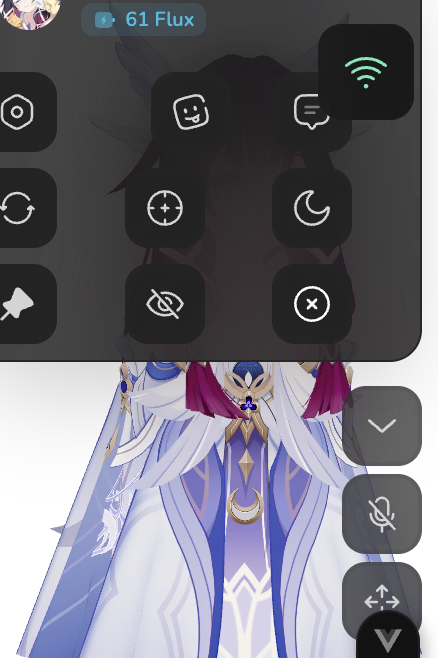
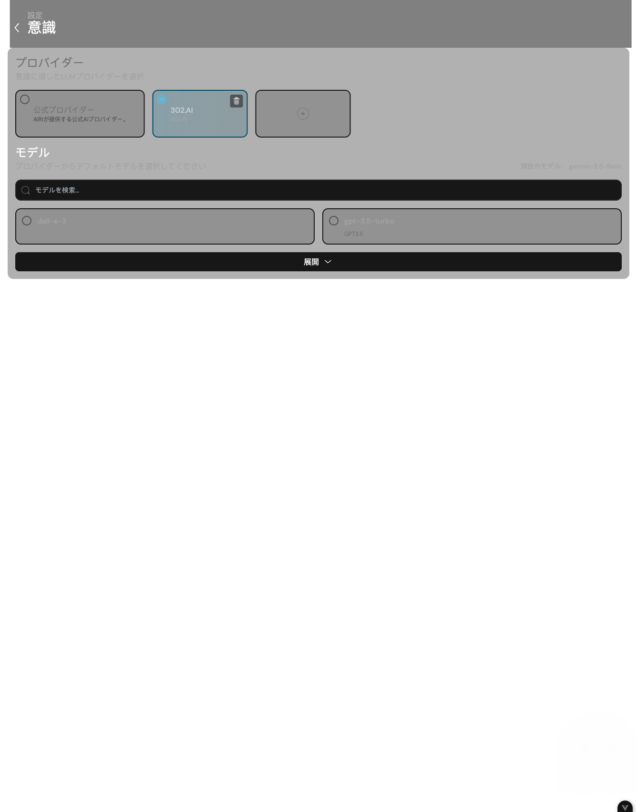
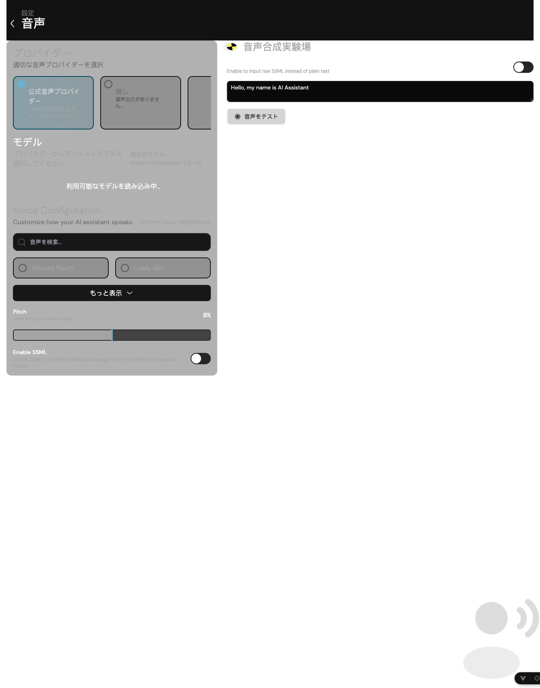
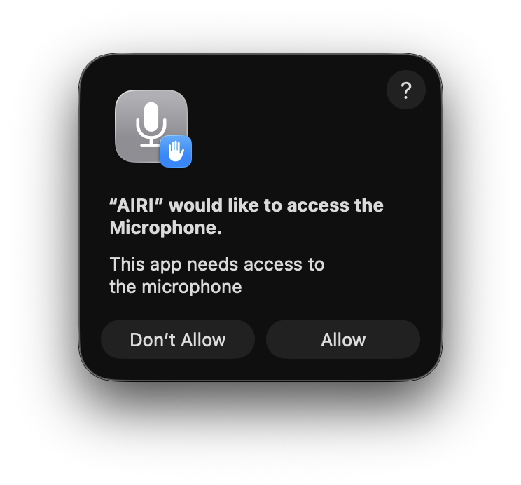
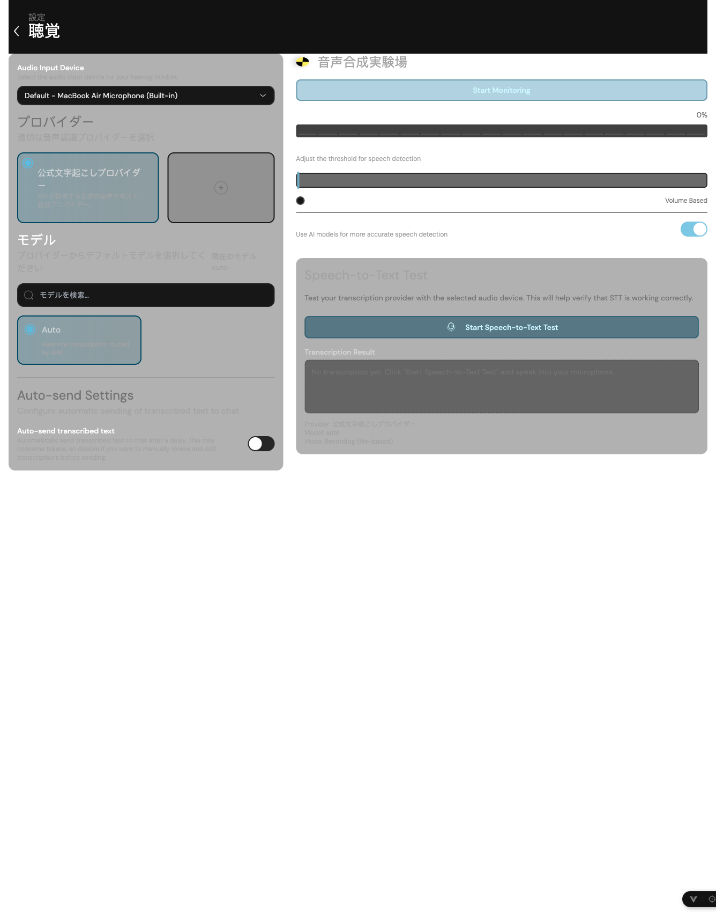
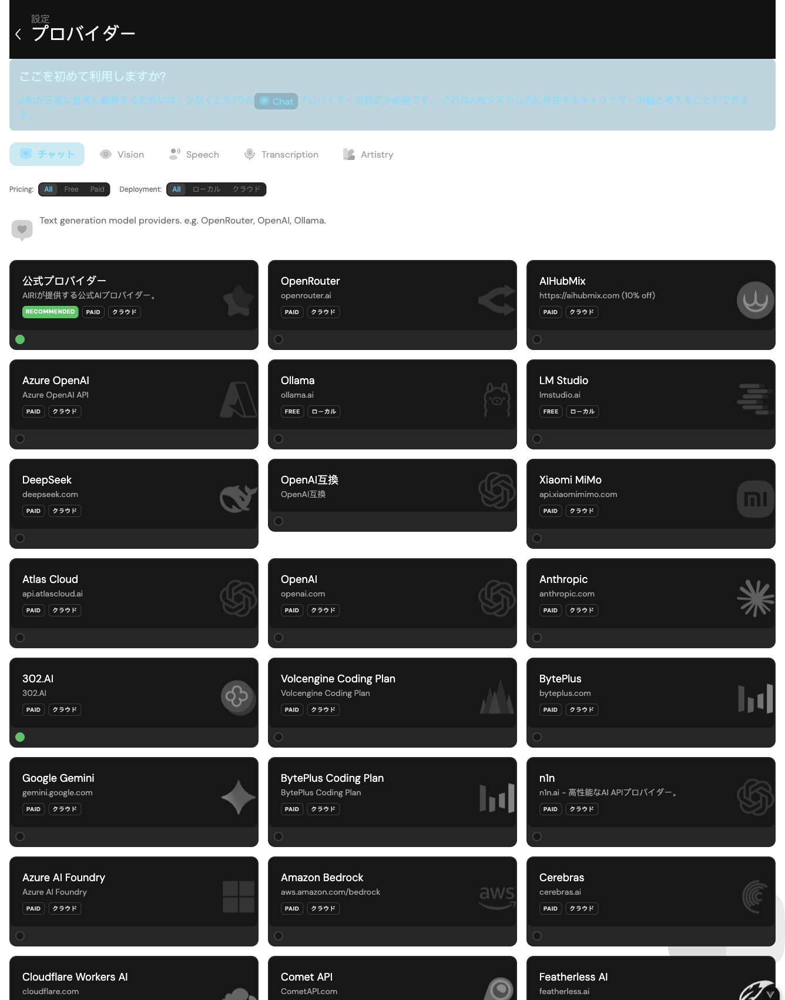
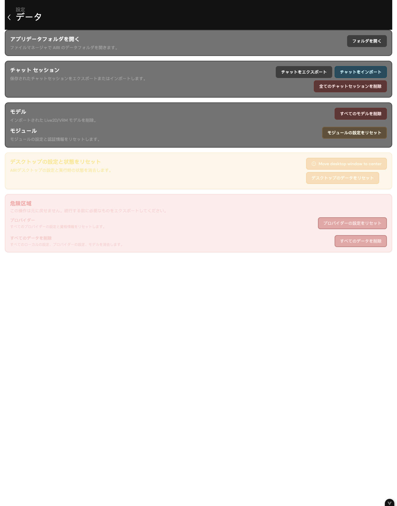
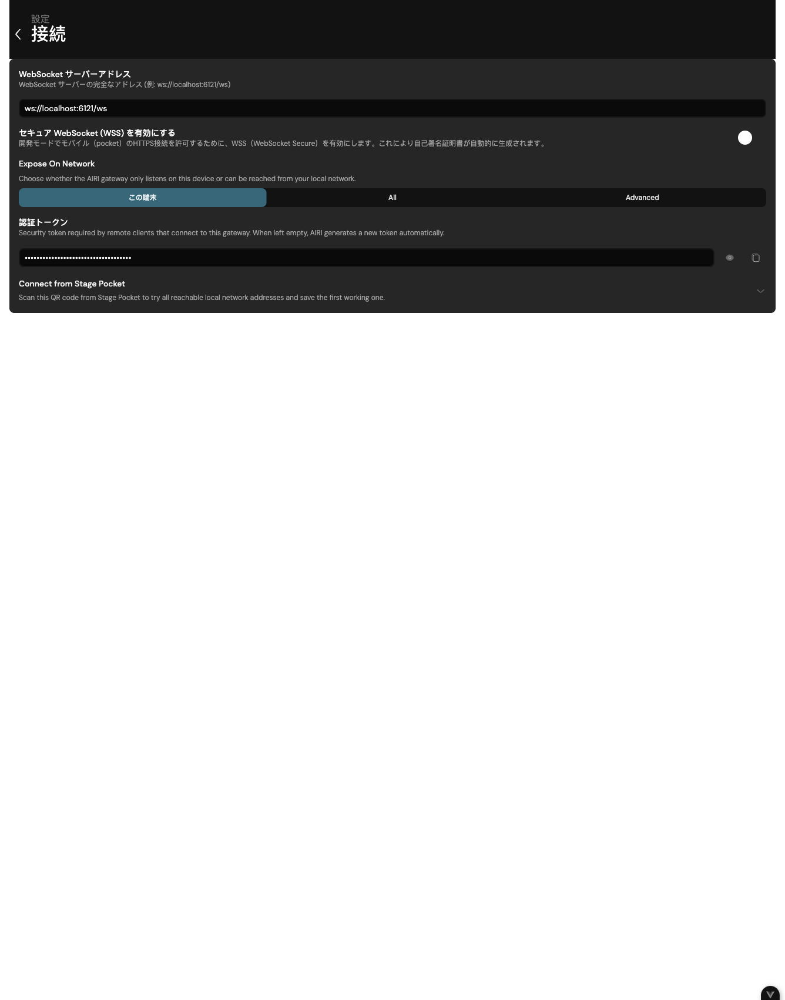

この記事の対応バージョン: AIRI-0.11.3

::: warning お読みになる前に
- このマニュアルは AIRI 0.11.3 を対象としています。新しいリリースでは画面や機能が変わる場合があります。
- デスクトップ版を中心に説明します。Web 版とモバイル版では、一部の機能や画面が異なります。
- 不明点や誤りは [Project AIRI 公式 Discord](https://discord.gg/TgQ3Cu2F7A) で報告してください。
- WeChat コミュニティについては、リポジトリの [WeChat 案内](https://github.com/moeru-ai/airi/blob/main/docs/wechat.md)を参照してください。
- QQ コミュニティの最新招待リンクは、リポジトリの README を参照してください。
:::

## 第 1 章 · インストール

[Project AIRI 最新リリース](https://github.com/moeru-ai/airi/releases/latest)の **Assets** からデバイスに対応するファイルをダウンロードし、インストーラーの案内に従います。表内の `<version>` はリリースごとに変わります。

|プラットフォーム |デバイス |ダウンロードするファイル |
| --- | --- | --- |
| Windows | x64 または Windows 11 ARM64 | `AIRI-<version>-windows-x64-setup.exe` |
| macOS | Apple チップ (M シリーズ) | `AIRI-<version>-darwin-arm64.dmg` |
| macOS | Intel チップ | `AIRI-<version>-darwin-x64.dmg` |
| Linux | Ubuntu などの x64 Debian システム | `AIRI-<version>-linux-amd64.deb` |
| Linux | Fedora、openSUSE などの x64 RPM システム | `AIRI-<version>-linux-x86_64.rpm` |
| Linux | Ubuntu などの ARM64 Debian システム | `AIRI-<version>-linux-arm64.deb` |
| Linux | Fedora、openSUSE などの ARM64 RPM システム | `AIRI-<version>-linux-aarch64.rpm` |
| Android | Huawei HarmonyOS の Android 互換環境およびその他の Android デバイス | `AIRI-<version>-android.apk` |
| iOS/iPadOS | iPhone、iPad | `AIRI-<version>_(<build-number>)-ios.ipa` |

:::info Windows インストール ソフトウェアについて
インストーラーには 2 つのインストール方法が用意されています。自分用にインストールするか、全員にインストールするかです。

自分でインストールすることを選択する場合、管理者権限は必要ありませんが、現在のユーザーのみがアクセスできます。すべてのユーザーにインストールすることを選択するには管理者権限が必要ですが、このコンピュータ上のすべてのユーザーがこのソフトウェアを使用できます。
:::

::: info iPhone および iPad のインストール ソフトウェアについて
現在、ipa ファイルのみが提供されており、手動で署名してインストールする必要があります。詳細なインストール手順はまだ提供されていません。

プロジェクト チームは今後、TestFlight アプリケーションのテスト リンクをリリースする予定です。ご期待ください。
:::

::: info Huawei HarmonyOS について
HarmonyOS ネイティブ版は提供していません。Android アプリとの互換性は、端末と HarmonyOS のバージョンによって異なります。
:::

## 第 2 章・初期設定

AIRI の使用を開始する前に、少なくとも 1 つのチャット プロバイダーと利用可能なモデルが必要です。クラウド サービスでは通常、API キーまたはログイン アカウントを作成する必要があります。ローカル サービスでは、最初にモデル サービスを開始する必要があります。

初期設定を完了するには、次の手順に従ってください。

1. AIRI を開き、初期起動設定を入力します。
2. 言語を選択します。
3. 独自のプロバイダーを使用する場合は**プロバイダーでセットアップ**を、AIRI 公式プロバイダーを使用する場合は**サインイン**を選択します。
4. 独自のプロバイダーを使用する場合:
    1. 準備したプロバイダーを選択し、[**次へ**] をクリックします。
    2. API キーを入力し (必要に応じてベース URL を変更します)、[**次へ**] をクリックします。
    3. もう一度 [**次へ**] をクリックします。
    4. 使用するモデルを選択し、**始めましょう！**を選択します。
5. 公式に提供されている AI モデルを使用する場合: [AIRI 公式プロバイダー](../../config/providers/consciousness/official.md) を参照してください。

おめでとうございます。AIRI の初期設定が完了しました。

::: tip 最初にチャットを設定するだけです
チャット プロバイダーとモデルが正常に設定されると、AIRI はメッセージに返信できるようになります。後で、音声合成 (TTS)、音声認識 (ASR/STT)、視覚的理解、アート作成などの機能を追加できます。設定方法については、[音声入出力](../../config/audio.md)、[視覚的理解](../../config/vision.md)、または[アート作成](#chapter-4-art)を参照してください。
:::

::: warning API キーのセキュリティに関する警告
API キー、AccessKey Secret、およびその他のサービス認証情報は、デバイスにのみ保存する必要があります。これらをリポジトリにコミットしたり、問題に投稿したり、スクリーンショットを撮ったり、他の人に送信したりしないでください。
:::

## 第 3 章 · AIRI インターフェイスの概要

### > メインウィンドウ

このセクションでは主にデスクトップ版について説明します。ウェブ版/モバイル版については、このセクションを参照してください。その他、Web版/モバイル版の独自機能については[こちら](#chapter-3-main-web)でご紹介します。

このウィンドウは、仮想キャラクタ画像を表示するウィンドウである。次の 3 つのオプションがあります。

- 「展開 ⌃」 - 右下隅にあり、クリックしてその他のオプションを展開します (以下を参照)。
- 「聴覚コントロール &#x1F3A4;︎」 - 右下隅にあり、クリックして AIRI に話しかけます。
:::info 聴覚制御の説明
クリックすると「リスニング入力」パネルが開きます。まずマイク入力を有効にし、マイクを選択します。許可を求めるプロンプトが表示されたら、AIRI がマイクを使用できるようにします。音声認識サービスを構成すると、話された内容が文字に起こされ、現在のチャット セッションに送信されます。 AIRI は、自分の声を再度認識しないように、話すときに録音を一時停止します。
:::

- 「移動 ✥」 - 右下隅にあり、マウスの左ボタンを長押ししてドラッグし、デスクトップ上のメイン ウィンドウの位置を変更します。

「展開 ⌃」をクリックすると、次のコントロールが表示されます。

- 「サインイン」 - AIRI アカウントにサインインします。
- 「設定を開く」 - AIRI の設定インターフェースを開きます。
- 「プロファイルを切り替え」 - プロファイルを切り替えます。
- 「チャットを開く」 - チャットウィンドウを開きます。
- 「更新」 - メインウィンドウを更新します。
- 「Move to screen center」 - ウィンドウを画面中央に移動します。
- 「ダークモードに切り替える」/「ライトモードに切り替える」 - AIRI の表示テーマを切り替えます。
- 「ピン留め」/「ピン留めを外す」 - AIRI ウィンドウを他のウィンドウより前面に表示するかどうかを切り替えます。
- 「自動非表示」/「常に表示」 - ポインターを重ねたときに AIRI ウィンドウを自動的に隠すかどうかを切り替えます。
- 「閉じる」 - ワンクリックでAIRIを閉じます。

### > その他のシステム トレイ オプション

まず、タスクバーで小さな AIRI アイコンを見つける必要があります。

::: tip タスクバー/メニューバーのアイコンが見つからない場合...
Windows では、タスクバーの [隠しアイコンの表示 (⌃)] をクリックして展開し、AIRI アイコンを見つける必要がある場合があります。

macOS では、アイコンがノッチの後ろに隠れる場合があります (特に MacBook の内蔵ディスプレイ上)。この時点で、一部の既存のメニュー バー アイコンを非表示にする必要があります。 [システム設定] → [メニュー バー] を開いて、メニュー アイコンを表示または非表示にすることができます。
:::

AIRI アイコンを右クリックすると、10 個のオプションが表示されます。

- 「表示」 - メインウィンドウを呼び出します。通常は使用しません。
- 「サイズ調節」 - メインウィンドウのサイズを調整し、中央に配置します。4 つのサブオプションが含まれます。
  - 「おすすめ (450x600)」 - 推奨サイズの 450x600 に設定します。
  - 「高さ最大」 - メインウィンドウの高さをデスクトップの高さいっぱいにします。
  - 「高さ半分」 - メインウィンドウの高さをデスクトップの高さの半分にします。
  - 「フルスクリーン」 - メインウィンドウをデスクトップ全体に表示します。
- 「揃える」 - メインウィンドウをデスクトップ上の特定の位置に揃えます。5 つのサブオプションが含まれます。
  - 「中央揃え」 - デスクトップの中央に揃えます。
  - 「左上」 - デスクトップの左上隅に揃えます。
  - 「右上」 - デスクトップの右上隅に揃えます。
  - 「左下」 - デスクトップの左下隅に揃えます。
  - 「右下」 - デスクトップの右下隅に揃えます。
- 「設定…」 - 設定インターフェースを開きます。
- 「概要…」 - 概要ウィンドウを開きます。バージョン番号の確認、プロジェクトホームページへのアクセス、AIRI の更新、アップデートチャネルの選択ができます。
- 「インレイを開く…」 - フローティング入力ボックスを開きます。AIRI に短いリクエストを入力して Enter キーを押すと、ウィンドウが非表示になり、処理結果が通知として表示されます。キャンセルするには Esc キーを押します。
- 「ウィジェットを開く…」 - ウィジェットウィンドウを開きます。地図、天気、アート、または拡張機能によって提供されるウィジェットがここに表示されます。ツールまたは拡張機能が実行されていないときは、ウィンドウが空になることがあります。
- 「キャプションを開く…」/「キャプションを閉じる…」 - キャプションを開閉します。TTS サービスが有効な場合、AIRI が話している間はテキストが表示され、マウスカーソルを重ねている間はデフォルトで非表示になります。
- 「キャプションオーバーレイ」 - 2 つのサブオプションが含まれます。
  - 「ウィンドウをフォロー」 - このモードはデフォルトで選択されています。キャプションウィンドウはメインウィンドウとともに移動します。チェックを外すと、位置を個別に設定できます。
  - 「位置リセット」 - キャプションの位置をリセットします。
- 「終了」 - ワンクリックで AIRI を閉じます。

### > 設定インターフェース

::: info このセクションの範囲
この部分では、インターフェイスの内容のみを紹介します。特定の機能については、第 4 章を参照してください。
:::

次の 2 つの方法で設定インターフェイスを開くことができます。

- メインウィンドウで「展開」をクリックし、「設定を開く」を選択します。
- システムトレイのAIRIアイコンを右クリックし、「設定」を選択します。

設定インターフェースには次の 9 つのコンテンツが含まれます。

- 「AIRI キャラクターカード」 - キャラクターの性格を選択して設定します。
- 「モジュール」 - 意識、音声、聴覚、視覚、記憶、メッセージ、ゲーム、連携機能などを設定します。
- 「シーン」 - AIRIのシーン（背景）を設定します。
- 「キャラクターモデル」 - キャラクターのモデルを選択して設定します。
- 「メモリ」 - この機能はまだリリースされていません。
- 「プロバイダー」 - チャット、音声、文字起こし、アート作成のプロバイダーを設定します。
- 「データ」 - AIRI の各種データを管理します。
- 「接続」 - WebSocket サーバーのアドレスを設定します。
- 「システム」 - 4 つのサブオプションが含まれます。
- 「一般」 - プログラムのテーマ、言語、その他のコンテンツを設定します。
- 「配色」 - テーマの色を設定します。
- 「ウィンドウ ショートカット」 - Spotlight のグローバル ショートカット キーを設定します。
- 「開発者」 - 開発およびトラブルシューティングのための高度なツール。日常使用には設定は必要ありません。詳細については、[開発者ガイド](/ja/docs/contributing/desktop-developer-tools) を参照してください。

### > チャットウィンドウ

メイン ウィンドウで [展開] をクリックし、[チャットを開く] を選択してチャット ウィンドウを開くことができます。

ここでAIRIとチャットできます。音声合成が有効になった後、AIRI が返信を読み上げると、入力エリアに「読み上げを停止」ボタンが表示されます。これをクリックすると、現在の音声再生が停止するだけで、生成されたテキスト応答はキャンセルされません。

入力エリアの左側にある「会話」ボタンをクリックするか、チャットウィンドウのタイトルをクリックして会話リストを開きます。リストには、最終更新時刻に応じた各会話のプレビューと同期ステータスが表示されます。現在のキャラクターの会話を切り替えたり、削除したり、新しい会話を作成したりできます。削除すると通常は復元できないため、コンテンツが不要であることを確認してください。

## 第 4 章・設定

次の 2 つの方法で設定インターフェイスを開くことができます。

- メインウィンドウで「展開」をクリックし、「設定を開く」を選択します。
- システムトレイのAIRIアイコンを右クリックし、「設定」を選択します。

### > AIRI キャラクターカード

ここでは、デフォルトのキャラクターカードを直接アップロード、作成、変更できます。

::: info インポートとエクスポートについて
キャラクターカードは、AIRI キャラクターカードパックとしてインポートまたはエクスポートできます。カード パックはキャラクター カード V3 データを使用し、オプションで Live2D、Spine、または VRM ディスプレイ モデルが付属します。 AIRI はインポート時にパッケージ内のインベントリとキャラクター カード データを確認します。パッケージの形式が正しくない場合、または必要なファイルが欠落している場合は、インポートできません。
:::

キャラクターカードの新規作成については、以下の順序で設定することを推奨します。

1. 名前、ニックネーム、説明、作成者メモなどの ID セクションを入力します。
2. キャラクターの性格、シーン（または周囲の環境、背景、状況として理解される）、挨拶などの行動部分を必要に応じて入力します。
3. 必要に応じて「モジュール」セクションを調整し、キャラクターの機能を設定します。
4. 必要に応じて「Artistry」セクションを設定して、キャラクターの画像を生成する機能を設定します。
5. 最後に、システム プロンプト、履歴後の指示、カード バージョンなどの設定を確認します。
6. 内容が正しいことを確認後、「**作成**」をクリックするとキャラクターカードの作成が完了します。
7. 作成が完了したら、キャラクター カードの右下隅にある丸をクリックするか、キャラクター カードをクリックしてから [アクティブ化] をクリックして、キャラクター カードを正式にアクティブ化します。

ID の最も重要な部分は名前と説明です。

- 名前はキャラクターの正式名称です。ニックネームが設定されている場合は、ニックネームが優先されます。
- 説明にはキャラクターの具体的な設定を記述します。自由に作成するか、デフォルトのキャラクターカードを参考にできます。

::: info 編集者追記
- デフォルトのキャラクターカードを参考にする場合、末尾の ACT タグをコピーする必要はありません。
- クリエイターメモはカードの管理用であり、AIRI の回答には影響しません。
- 動作部分では性格、シーン、挨拶を設定します。モジュール部分ではチャット、Vision、Speech、表示モデルを指定できます。Artistry では画像生成の基本設定を指定します。設定部分にはシステム プロンプト、履歴後の指示、バージョン情報が含まれます。
:::

::: warning には手動でのアクティブ化が必要です
キャラクター カードを作成した後、デフォルトでは有効にならないため、使用する前に手動で有効にする必要があります。下の再生ボタンをクリックして有効にします。
:::

### > モジュール

ここでは、次のように AIRI のさまざまな機能を設定できます。

#### > 意識

設定については[チャットモデル](../../config/llm.md)を参照してください。

#### > 音声
設定については[音声入出力](../../config/audio.md)を参照してください。 AIRI に話させたくない場合は、「なし」を選択します。
::: tip 音声ページの補足説明
- 最初にプロバイダーとモデルを選択し、次にモデルが提供する Voice を選択します。プロバイダーによって表示されるフィールドは異なります。
- ピッチ (pitch) は、このパラメーターをサポートするプロバイダーおよびモデルに対してのみ有効です。
:::

#### > 聴覚
設定については[音声入出力](../../config/audio.md)を参照してください。音声入力をまだ使用していない場合は、「なし」を選択します。

::: info 定義: 音声認識 STT

STT は「Speech-to-Text」の略称で、自動音声認識 (ASR) とも呼ばれます。

その目標は、コンピューターが人間の音声を理解し、対応するテキストに変換できるようにすることです。
:::

:::info (macOS で使用する場合)
macOS で初めて AIRI の音声入力機能を使用する場合、ワンタイムのマイク許可認証操作が必要です。次のプロンプトが表示されたら、「許可」を選択してください。そうしないと、この機能は正しく動作しません。

:::

さらに、次のことができます。

- 自動送信するには、文字起こしテキストの自動送信機能を有効にします。
- 文字起こし結果を調整するには、この機能をオフにします。
- 自動送信遅延を通じて送信遅延を調整します。

::: info が自動的に送信されました
自動送信が有効になっている場合、認識されたテキストは設定された遅延後にチャット セッションに送信されます。オフにすると、手動で送信する前にテキストを確認または変更できます。
:::

マイクをテストしたい場合:

1. インターフェース中央の「**監視開始**」をクリックして監視を開始します。
2. 必要に応じて、感度を調整できます。

STT 機能をテストする場合は、次のようにします。

1. インターフェイスの下部にある [**start speech-to-text**] をクリックしてテストを開始します。
2. 次に、[転写結果] で認識結果を表示します。

#### > ビジョン
設定については[視覚的に理解する](../../config/vision.md)を参照してください。

::: warning スクリーンビジョンを使用する前に、ビジョンキャプチャを開始する必要があります
ビジョン プロバイダーとモデルのみを構成する場合、このツールを有効にする必要はありません。

AIRI に画面またはウィンドウを分析させるには、「システム → 開発者 → ビジョン キャプチャ」に移動します。画面録画の許可を与え、キャプチャしたいウィンドウまたはディスプレイを選択し、「ティッカーの開始」をクリックします。認識結果をAIRIダイアログに提供したい場合は「キャラクターに公開」をオンにします。

Vision Capture は、現在のデスクトップ デバッグ/開発ワークフローです。ページを離れるとキャプチャ ループが停止します。完全な手順については、[デスクトップ開発者ツール](/ja/docs/contributing/desktop-developer-tools#vision-capture) を参照してください。
:::

#### > Artistry

ここでは、AIRI のアート作成機能を設定できます。

**設定 → プロバイダー → Artistry** で画像プロバイダーを設定し、**設定 → モジュール → Artistry** で有効にします。

::: warning ツール呼び出しをサポートするチャット モデルを使用してください
芸術作品はキャラクターから画像を直接生成しません。AIRI は、設定された画像サービスを含むツールを現在の **チャット モデル**に提供し、モデルはツールを呼び出して生成タスクを送信します。したがって、チャット モデルとプロバイダーは **ツール呼び出し/関数呼び出し** をサポートする必要があります。

**設定 → モジュール → 意識** で、プロバイダーがツール呼び出し対応と明記しているモデルを選択してください。通常のテキスト会話のみをサポートするモデルでは、選択した画像サービスにタスクが送信されない場合があります。

設定後、チャットでキャラクターに簡単な画像生成を依頼し、AIRI がツール呼び出しを開始することを確認します。プロバイダーにタスク状態、履歴、またはコンソールがある場合は、タスクの受信も確認できます。プロバイダー固有の確認方法は、**設定 → プロバイダー → Artistry** の各ページを参照してください。
:::

#### > 短期記憶

機能は開発中ですので、しばらくお待ちください。この機能を実装するためのアイデアがある場合は、Issue または PR 経由で提案を送信してください。

#### > 長期記憶

機能は開発中ですので、しばらくお待ちください。この機能を実装するためのアイデアがある場合は、Issue または PR 経由で提案を送信してください。

#### > Discord

Discord の統合では、AIRI が Discord サーバーのメッセージング チャネルと音声チャネルに入ることができるように、ソースからボット サービスを実行する必要があります。

1. Discord アプリケーションを作成し、必要なインテントを有効にし、[Discord ボット統合ガイド](/ja/docs/contributing/services/discord.md) でボット トークンを設定します。
2. モデルと音声サービスの資格情報をローカルで構成します。
3. リポジトリのルート ディレクトリから Discord ボット サービスを開始します。

::: warning 資格情報のセキュリティ
Discord ボット トークン、モデル API キー、および音声サービス認証情報は、ローカル構成ファイルにのみ保存する必要があります。これらの構成を送信したり、スクリーンショットを撮ったり、送信したりしないでください。
:::

#### > X / Twitter

[X / Twitter 統合ガイド](/ja/docs/integrations/x.md) を読み、X Developer Platform アプリケーションの認証情報を作成して入力してください。API キー、API シークレット、アクセス トークンを公開しないでください。

#### > ウェブ検索

[Web 検索設定ガイド](../../config/web-search.md) を読んで Tavily API キーを設定し、使用法、プライバシーに関するヒント、FAQ について学んでください。

#### > マインクラフト マインクラフト

Minecraft を統合するには、ソースからローカル エージェント サービスを実行する必要があります。 [Minecraft エージェント統合ガイド](/ja/docs/contributing/services/minecraft.md) に従って、信頼できるサーバー、AIRI、およびモデル サービスを構成し、エージェントを起動してください。

::: warning セキュリティリマインダー
Minecraft エージェントを信頼できないパブリック サーバーに接続しないでください。これはローカルの Minecraft セッションとネットワーク接続を駆動し、悪意のあるサーバーが予期しない動作を引き起こす可能性があります。
:::

::: tip 統合サービスのドキュメント
Discord、Minecraft、Satori、Telegram をソースから実行する手順は、サイドバーの「統合サービス」に記載されています。
:::

#### > ファクトリオ

[Factorio 統合ガイド](/ja/docs/integrations/factorio.md) を読み、信頼できるサーバーのアドレス、ポート、ゲーム内ユーザー名を AIRI に入力してください。AIRI には、すぐに展開できる Factorio サーバー側統合は付属していません。

#### >MCP の統合

MCP (Model Context Protocol) により、AIRI はローカル プロセスを通じて外部ツールを使用できるようになります。このページを開いた後、デスクトップでサーバーを追加し、そのコマンド、パラメーター、および環境変数を入力し、最初に接続テストを実行してから、[適用して再起動] をクリックして MCP サービスを開始または再起動します。構成ファイルを開いたり、JSON エディターを使用して構成をバッチで管理することもできます。信頼できる MCP サーバーのみを実行してください。MCP サーバーはコマンドをローカルで実行でき、ユーザーが許可した環境変数にアクセスできます。

#### > 同期した音律

Sync Rhythm は、画面にキャプチャされたオーディオからビートを分析し、ビート信号をステージ エフェクトに送信します。 「画面キャプチャの開始」をクリックし、音声が含まれる画面またはウィンドウを選択します。キャプチャを終了するには「停止」を使用します。このページには、感度、最小ビート間隔、および高度なフィルタリング パラメーターが提供され、リアルタイムのスペクトルとビートの視覚化が表示されます。初めて使用するときは、システム画面録画の許可を与える必要がある場合があります。

### > シーン

ここでは、AIRI メイン インターフェイスのシーンを設定できます。単純に AIRI メイン インターフェイスの背景として理解できます。

ここには 2 つのプリセットが含まれています。いずれかのプリセットの中央にある **チェック** をクリックすると (表示するにはマウス カーソルを上に移動する必要があります)、シーンを有効にできます。

[**シーン ライブラリにアップロード**] をクリックして、独自のピクチャ シーンをインポートすることもできます。

シーンをクリアする必要がある場合は、「**デフォルトをクリア**」をクリックしてください。

### > キャラクターモデル

ここでキャラクターのモデルを選択して設定できます。

AIRI は Live2D、Spine 2D、VRM 3D モデルをサポートしています。

既存のモデルを切り替えるだけの場合は、次の手順をお勧めします。

1. [**モデルの選択**] をクリックしてモデル選択インターフェイスを開きます。
2. 現在のバージョンでは、デフォルトで 2 つの Live2D モデルと 2 つの VRM 3D モデルが表示されます。
3. モデルを選択したら、「**確認**」をクリックして切り替えを完了します。

独自のモデルをインポートする場合は、「**追加**」をクリックして Live2D、Spine、または VRM 形式を選択できます。

::: info Godot ステージ (実験的)
「Godot Stage (Experimental) に切り替え」は、独立した Godot ステージ レンダラーを開始します。もう一度「内蔵ステージに戻る」をクリックすると、内蔵ステージに戻ります。 Godot Stage は現在 VRM モデルのみをサポートしています。 VRM を起動して選択すると、カメラの X/Y/Z、ヨー、ピッチ、視野を Godot View で調整できます。ステータスまたはモデル読み込みエラーがこの領域に表示されます。
:::

::: warning モデルをインポートする前に注意してください
- 古い Live2D モデルはサポートされていません。「\*.moc3」を含むファイルを選択してください。
- Live2D モデルをインポートする前に、モデルフォルダーを `*.zip` に圧縮します。
- Spine モデルも `*.zip` としてインポートします。VRM は単一の `*.vrm` ファイルを使用します。
:::

#### > Live2D モデルを選択した場合

次の順序で調整を続けることができます。

1. 「スケールと位置」を展開し、メインウィンドウでモデルのサイズと位置を調整します。ここで、x は水平軸 (左右) の位置、y は垂直軸 (上下) の位置です。
2. 「パラメータ」を展開し、マウス トラッキング、アイドル アニメーション、フレーム レート、自動点滅、強制自動点滅 (フォールバック タイマー)、シャドウ、デフォルト パラメータへのリセット、モデル キャッシュのクリア (「モデル キャッシュのクリア」と訳されます)、およびモデルに関係するすべてのパラメータの設定を続けます。
3. 待機アニメーションを設定する場合は、モデル圧縮パッケージにアニメーション ファイルが含まれていることを確認してください。
4. それでも式関数が必要な場合は、「Expressions」（「式」と訳されます）を展開して、Expression System（「式システム」と訳されます）を有効にすることができます。

音声合成が有効になっている場合、AIRI は読み上げ後に Live2D の口の状態を自動的に復元します。

::: info パラメータと式
モデルで使用できるパラメータ、スタンバイ アニメーション、およびエクスプレッションは、モデル ファイル自体によって決まります。式システムを有効にすると、モデルによって実際に提供された式のみが表示されます。エクスプレッションまたはアニメーション ファイルがない場合、対応するオプションは効果がありません。
:::

#### > Spine 2D モデルを選択した場合

Spine モデルには別の設定パネルが用意されています。スケーリング、X/Y 位置、スキン、バリアント、アイドル アニメーション、アニメーション ブレンド時間、再生速度を調整したり、フレーム レートを制限したり、レンダリング スケールを調整したりできます。モデルに利用可能なスキン、バリアント、またはアニメーションが含まれている場合、それらは対応するドロップダウン オプションに表示されます。不足しているアセットは表示されません。

#### > VRM 3D モデルを選択した場合

まず「シーン」を展開し、次にモデルの位置 (「モデルの位置」として変換)、視野角の調整 (度)、カメラの距離 (画面ズーム)、モデルの方向 (Y 軸の回転)、モデルの視線方向などを設定できます。

::: info VRM 視点
内蔵ステージの位置、回転、カメラ距離、視線方向が現在の設定に保存されます。
:::

### > メモリ

機能はまだリリースされていません。この機能を実装するためのアイデアがある場合は、Issue または PR 経由で提案を送信してください。

### > プロバイダー

「プロバイダー」は、AIRI をモデルや音声サービスに接続するための設定ページです。ここで認証情報を保存し、対応するモジュール ページでプロバイダーとモデルを選択します。

目的別にカテゴリを選択できます。

- **チャット**: AIRI がメッセージに返信できるように LLM を設定します。
- **Vision**: 画像入力に対応するモデルの認証情報を設定します。
- **Speech**: AIRI に返信を読み上げさせます。**モジュール → 音声**でモデルと Voice を選択します。
- **Transcription**: マイクの音声をテキストに変換します。**モジュール → 聴覚**でモデルを選択します。
- **Artistry**: 画像生成サービスを設定し、**モジュール → Artistry**で使用します。

初期構成ガイドをスキップする場合は、最初にチャット プロバイダーを設定します。API キーまたはログイン情報を入力し、必要に応じてベース URL やリージョンなどの詳細フィールドも入力します。**[プロバイダー検証]** が表示される場合は接続を確認します。その後、**[モジュール] → [意識]** でプロバイダーとモデルを選択し、メッセージを送信して AIRI が応答することを確認します。

チャット プロバイダーを切り替えると、選択済みのチャット モデルはクリアされます。**[モジュール] → [意識]** に戻り、新しいプロバイダーのモデルを選択してください。

::: warning 資格情報のセキュリティ
API キー、AccessKey Secret、およびその他のサービス資格情報は、現在のデバイスの設定にのみ保存する必要があります。これらをリポジトリにコミットしたり、問題に投稿したり、スクリーンショットを撮ったり、他の人に送信したりしないでください。
:::

::: tip チップ構成ガイド
- プロバイダーのフィールド、検証方法、またはエラー報告の意味がわからない場合は、[共通の設定手順](../../config/common.md) をお読みください。
- チャットモデルについては、[チャットモデルの設定](../../config/llm.md)を参照してください。
- 音声入出力については、[音声入出力の設定](../../config/audio.md)を参照してください。
- Vision のフォームは対応する Chat プロバイダーと同種のフィールドを使用しますが、認証情報は独立して保存されます。Vision ページで改めて入力し、画像入力対応モデルを選択してください。詳細は [Vision の設定](../../config/vision.md)を参照してください。
:::

::: tip の技術的なアドバイス
プロバイダーのリストは、AIRI の現在のバージョンに準拠します。プロバイダーがリストに含まれていないものの、OpenAI 互換インターフェイスをサポートしている場合は、**OpenAI 互換 API** 構成を使用できます。ベース URL とモデル ID は、プロバイダーの公式ドキュメントに従って入力する必要があります。
:::

### > データ

AIRIの各種データを管理することができます。

::: warning 回復不能な操作です
関連データはこのセクションで削除またはクリーンアップできますが、復元することはできませんので、慎重に操作してください。削除やリセットの操作を行う前に、内容を再度ご確認いただくことをお勧めします。
:::

「デスクトップ ウィンドウを中央に移動」は「デスクトップ ウィンドウを中央に移動する」と訳されます。

::: tip Web バージョンの機能説明
アプリのデータ フォルダーを開いたり、デスクトップの設定とステータスをリセットしたりすることは、デスクトップ バージョンでのみ利用可能であり、アプリの Web/モバイル バージョンでは利用できません。
:::

### > 接続する

「接続」は、AIRI のサービス チャネルを設定するために使用されます。暗号化された送信が必要な場合は、WebSocket アドレスを設定し、TLS を有効にすることができます。デスクトップでは、ローカルにのみアクセスするか、LAN アクセスを許可するか、または詳細なホスト名 (まだ利用できません) を入力してアクセス トークンを設定するかを選択することもできます。このページには、他のデバイスの接続を容易にするための QR コードが提供されます。信頼できるネットワーク上でのみ LAN アクセスを開き、アクセス トークンを安全に保管します。

::: tip macOS では管理者の認証が必要な場合があります
セキュア WebSocket が有効になっている場合、AIRI はローカル証明書を macOS ログイン キーチェーンに追加します。 Touch ID を使用するか、Mac のログイン パスワードを入力して、このアクションを承認するよう求められる場合があります。続行するには、指紋または Mac ログイン パスワードを確認してください。

:::

### > システム

#### > 一般

ここではプログラムのテーマや言語などを設定できます。

- テーマ オプションのデフォルトは明るい色です。後ろのボタンをクリックしてダーク モードに切り替えます。
- 言語オプション ここではインターフェースの言語を設定できます。選択内容は、AIRI を再起動した後も保持されます。
- コントロール アイランドのアイコン サイズ オプションでは、メイン ウィンドウの右下隅にある 3 つのボタンのサイズを変更できます。
- 最後に、使用状況データの収集とクラッシュ分析を許可するか、プライバシー ポリシーを読むかを設定することもできます ([プライバシー ポリシー] をクリックして開きます)。

#### > カラースキーム

ここでテーマの色を変更できます。

- RGB オプションを有効にして、RGB ライト ストリップのようにテーマの色を自動的に変更できます。
- 下の黒い線をドラッグするか、カラーバーをクリックしてテーマの色を変更することもできます。
- その下は色効果のプレビューです。
- 以下のプリセットを直接選択してテーマカラーを変更することもできます。

::: tip 先端カラーのプリセット
ここでは、ボックスではなく任意の円をクリックする必要があります。
:::

#### > ウィンドウのショートカット
ここで、**Spotlight** グローバル ショートカット キーを変更できます。 Spotlight は、Open Quick Actions で使用されるフローティング入力ボックスです。

1. 現在のショートカット キーをクリックします。
2. 使用する新しいキーの組み合わせを押します。少なくとも 1 つの修飾キー (Cmd、Ctrl、Alt、または Super) を含める必要があります。
3. ショートカット キーが他のアプリケーションによって占有されている場合、AIRI は競合を促します。録音をキャンセルするには Esc を押します。
4. 「リセット」をクリックしてデフォルトのショートカットキーを復元します。

::: tip スポットライトを使用する
設定したショートカットキーを押すと、クイック操作入力ボックスが開きます。リクエストを入力した後、Enter キーを押して AIRI に送信するか、Esc キーを押して閉じます。
:::

#### > 開発者

このページは、実験的な機能の開発、トラブルシューティング、検証に使用します。一般ユーザーが操作する必要はありません。ツールの詳細は、[開発者ガイド → 開発者ツール](/ja/docs/contributing/desktop-developer-tools) を参照してください。

## > Web版の補足機能

### > Web モデレータ インターフェイス

ここではキャラクターモデルが表示され、キャラクターモデルと直接会話することができます。

一般的に、次の 3 つの部分に分かれています。

- キャラクターモデル空間
- チャットボックス
- 他の

以下では、チャット ボックスとインターフェイスの他の部分に焦点を当てます。

#### > チャット ボックス

チャット ボックスは上部と下部に分かれています。

- 上部はチャット履歴が表示および記録されるエリアです
- 下部は入力ボックスで、文字を入力してキャラクターに話しかけることができます

下部の下に 3 つのボタンがあります: (テキストの内容は参照のみです)

- 会話 (会話を管理できます。異なる会話は互いに独立しています)
- 送信方法 (送信確認方法を選択可能)
- 音声入力を有効にする

#### > その他の部品

##### > 上部エリア

次の 3 つのオプションが含まれます。

- について
- キャラクターカード
- アカウントと設定

3 番目のオプションには 3 つのコンテンツが含まれています。

- アカウント情報
- ファイル、Flux、設定
- サインアウト

###### > アーカイブ

AIRI にログインしている場合は、ここでアカウント情報を管理できます。

表示名の表示と変更、パスワードと関連するログイン方法 (GitHub、Google など) の管理、危険な操作領域のアカウントのログアウトまたは削除が可能です。現在、アカウント情報によりアバターが表示されています。ここでの新しいアバターのアップロードは、現時点ではサポートされていません。

###### > Flux

FluxはAIRI公式サービスで使用されるバランスユニットです。ログインすると、現在の残高、使用統計、取引記録が表示されます。購入可能な地域またはバージョンでは、ここでパッケージを選択して決済を入力することもできます。公式チャット、ビジュアルまたは音声サービスを使用する場合、関連するリクエストによって Flux が消費される場合があります。サードパーティのプロバイダーの料金は、引き続きプロバイダーによって別途請求されます。

###### > 設定

デスクトップ設定と同じ。詳細については、[第 4 章](#chapter-4-settings) を参照してください。

##### > 下部エリア

4 つのオプションが含まれます: (テキストの内容は参照のみを目的としています)

- 位置とサイズ
- チャット履歴を削除する
- 明暗を切り替えます
- 背景

###### > 位置とサイズ

クリックすると、Web インターフェイスの左側に 3 つの新しいオプション x、y、スケールと垂直バーが表示されます。

###### > チャット履歴を削除する

クリックするとすべてのチャット履歴がワンクリックでクリアされます

::: warning 慎重に進んでください
クリックして削除すると元に戻すことはできませんので、慎重に操作してください。
:::

###### > 明暗を切り替える

インターフェースを「ライト」または「ダーク」に切り替えることができます

###### > 背景

メインインターフェースの背景を変更できます

## > 歴史的特徴とよくある質問

### > よくある質問

- 以前のバージョンからアップグレードした後、モデルのサイズや位置を変更すると、モデルが「消える」場合があります。この問題が発生した場合は、モデル設定インターフェイスでモデルのスケールと位置をリセットしてください。

### > 機能 H3-1-1

過去のいくつかのバージョンでは、メイン ウィンドウの右上隅にもオプションが表示されていました。

- [WebSocket ステータス] - 右上隅にあり、クリックして接続設定を開き、WebSocket サーバー アドレスを構成できます。

## > 最後に書きます——マニュアル作成に参加したい友人の皆様へ

このマニュアルは主に非公式の担当者によって作成され、公式 Web サイトに提出された文書です。通常、Mu Jiu Yunxuan のスタジオのメンバーがコンテンツの保守を担当していますが、このドキュメントを編集したい、またはこのドキュメントを編集したすべての友人が最初に作成者の位置にあなたの名前を残していただけることを強く望んでいます。内容や形式を変更する場合でも、このマニュアルを一緒に充実させ、最適化して、**あなた自身の力**で AIRI プロジェクトとこのマニュアルに貢献していただけることを歓迎します。

また、非公式の方がこのマニュアルを変更したいと考えた場合は、特に心配する必要はなく、変更してプルリクエストを送信していただけます。ただし、もう一度、名前を残すことを忘れないでください。

皆様のご支援、ご協力に感謝いたします！

——リン・ジェン
