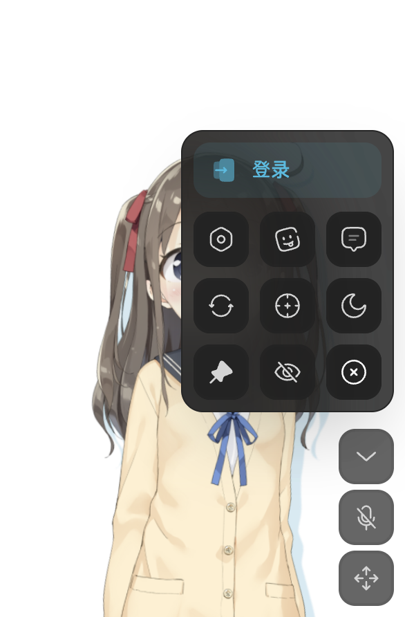
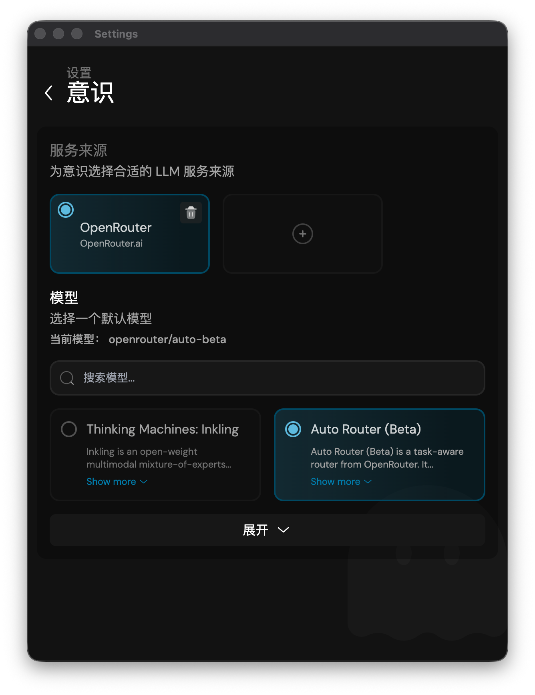
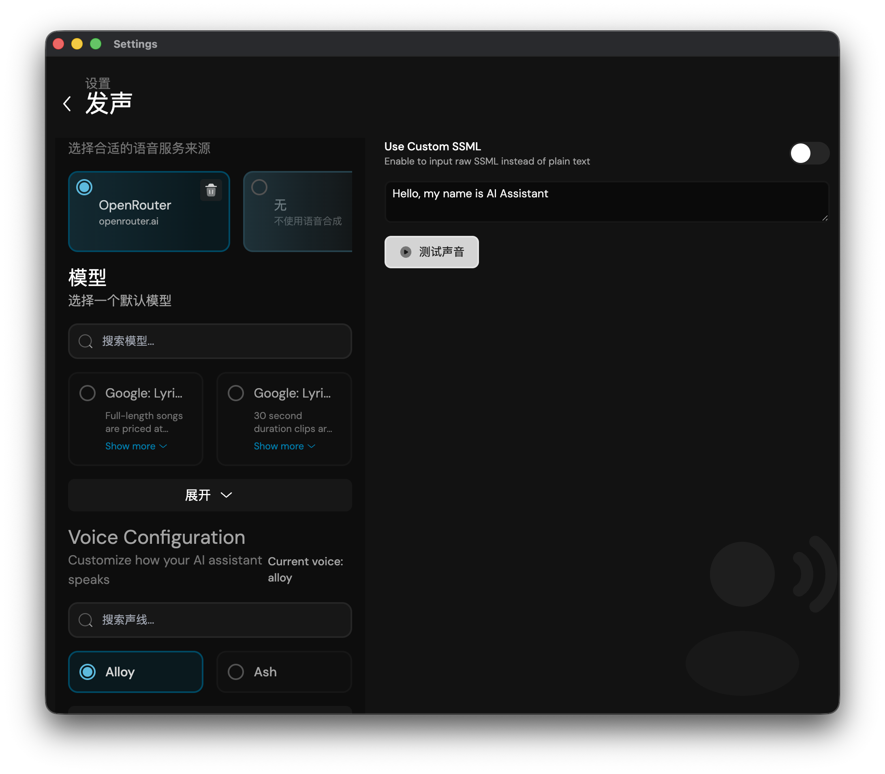
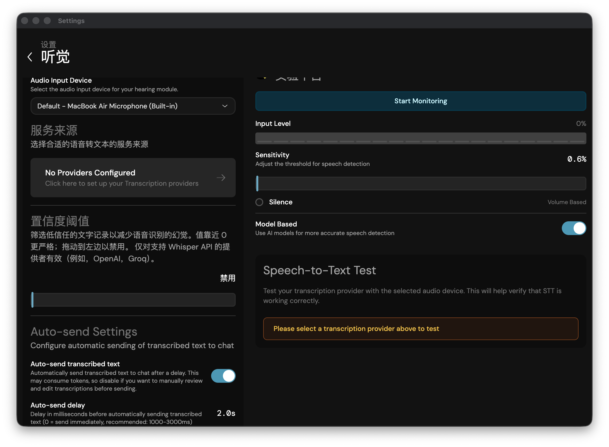
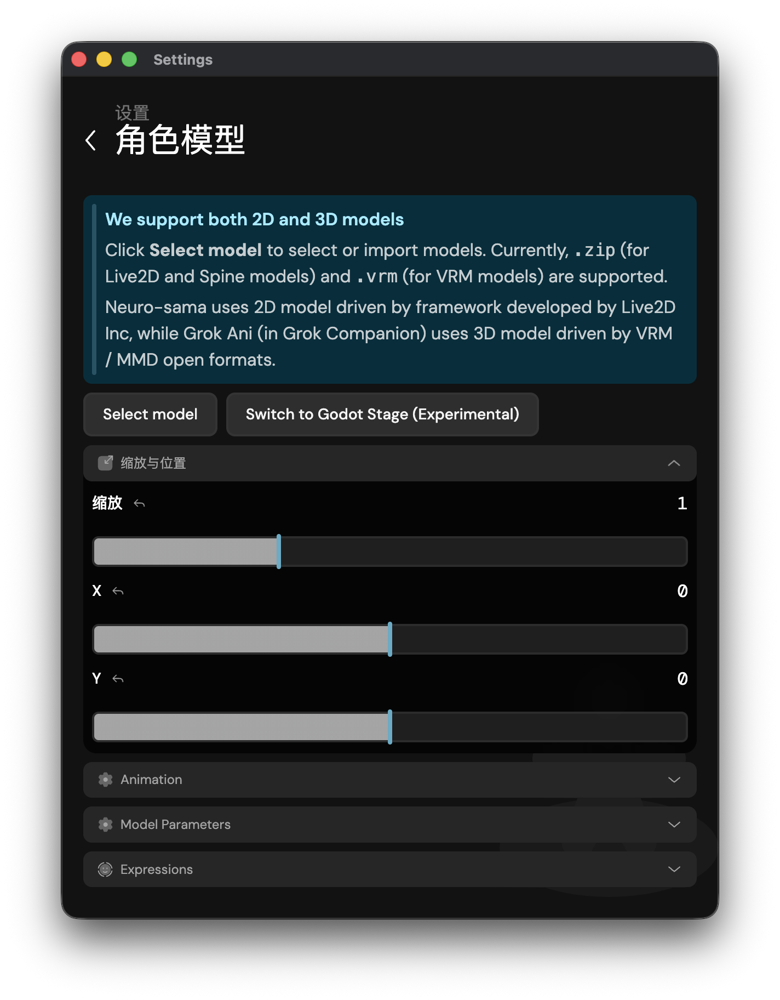
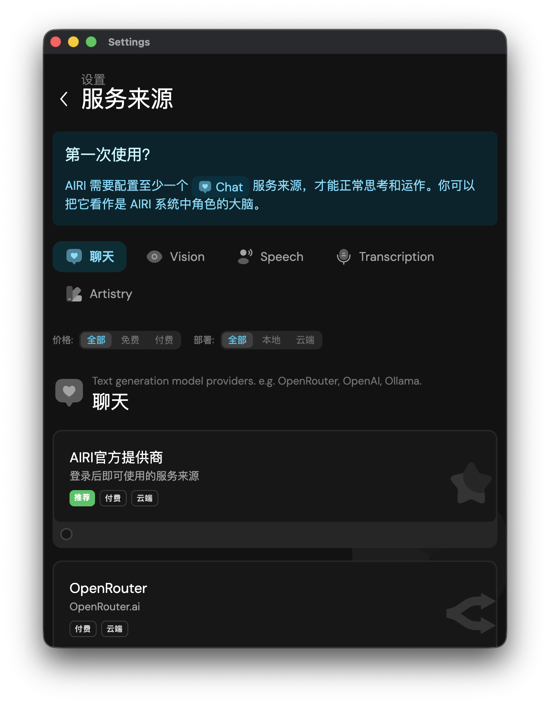
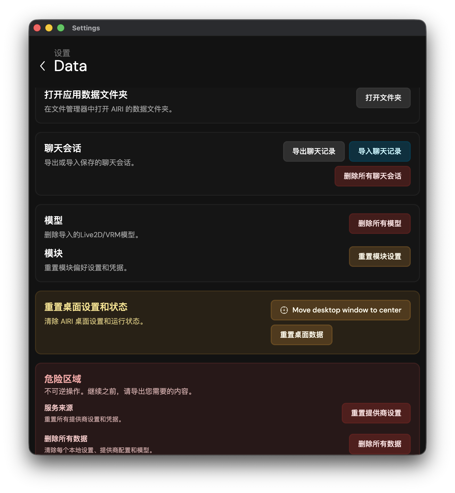
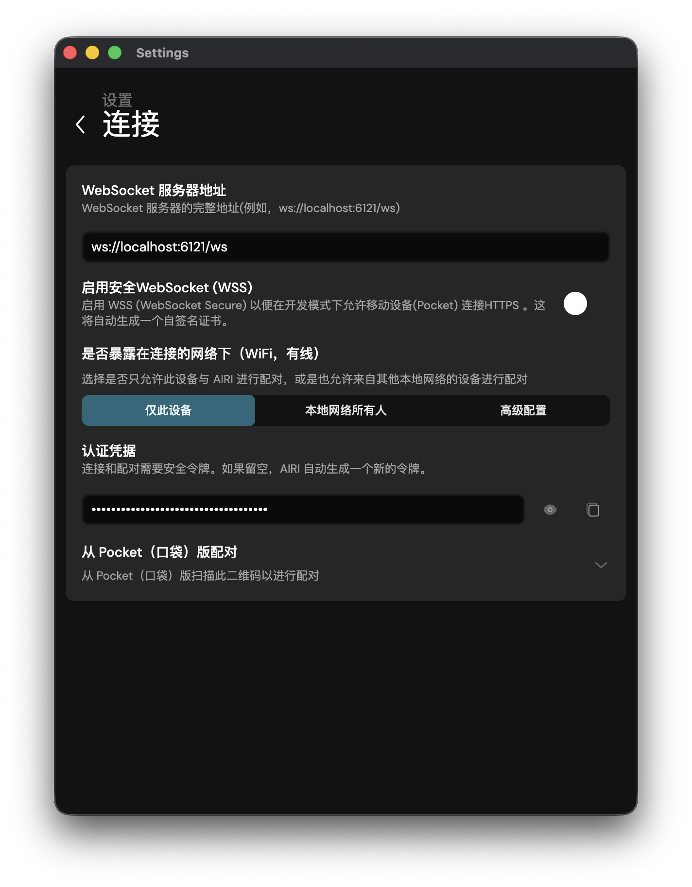

本文对应版本：AIRI-0.11.3

::: warning 阅读前说明
- 目前关于 AIRI 的部分技术性功能和操作在该说明书中不会具体讲解。
- 主要编辑者仅对说明书的中文版本负责，其他语言版本目前采用 AI 翻译 + 人工简单修正的方式处理，可能与实际显示的内容不符，请以实际为准。
- 说明书的大部分内容为说明书的主编团队成员自己包括其他参与者经过探索研究出来的，可能与事实不符或者存在偏差，具体请以自己实际体验到的为准。
- 该说明书可能不会及时更新。
- 因篇幅问题，该说明书暂仅包含桌面端及网页版的部分详细教程。（说明书以桌面端特性为主，网页端大部分特性可以参考直接桌面端，不过请注意两者在部分地方存在差异，具体以实际为准）
- 软件部分位置使用的是英文而且并没有提供翻译，该说明书会尝试翻译涉及到的部分内容，最终译文请以实际为准。
- AIRI 的版本更新可能会改变部分内容，该说明书仅介绍编写时间前最新的一个版本的特性。对于前后其他版本，该说明书可能会保留部分特性的说明，如果遇到不同的地方，请自行解决。
- 如果您对本说明书有疑问，欢迎在 [Project AIRI 官方 Discord](https://discord.gg/TgQ3Cu2F7A) 频道中 @jhicefair 或 @0x_selenic_dove 留言。
- 加入微信群：打开仓库的[微信群说明](https://github.com/moeru-ai/airi/blob/main/docs/wechat.md)，扫描其中的二维码添加微信，并备注 `AIRI`；管理员会邀请您入群。您也可在群中 @爱吃吃的哥伦比娅，或通过微信号 `0xColumbina` 联系。
- 加入 QQ 群：打开仓库 README 提供的 [QQ 群邀请链接](https://qun.qq.com/universal-share/share?ac=1&authKey=9g00d%2BZS7nORzcJugNNddJ7rCghZTIR7fhXabGwch2S%2BG%2BKGIKwlN1N2nIqkh2jg&busi_data=eyJncm91cENvZGUiOiIxMDU4MTU2Njk3IiwidG9rZW4iOiJmcnkra1hWNFIxNytEcG0zcHRUdVJIaldlRDFxN0dzK080QWtvTEdOQjJkNEY2eUFta1g1clNpbkxSMS9FQWFYIiwidWluIjoiMTI2MDkwNzMzNSJ9&data=b1eJrwn3GVOUh7YIxZ7l9vHQo99HPmRxKPpMKlDCmfzx8Y57IXb2EZCMaOC9rVTd2U558qpNjwUYUWlPHxVHvg&svctype=4&tempid=h5_group_info)，使用 QQ 确认加入；若链接失效，请以仓库 README 的最新链接为准。
- 其他使用问题也欢迎在 AIRI 的 Discord、微信群或 QQ 群中与社区交流。
- 祝您玩的开心！AwA
:::

## 第一章·安装

前往 [Project AIRI 最新发行版](https://github.com/moeru-ai/airi/releases/latest)，在 **Assets** 中下载与您的设备对应的文件，然后打开安装包并按提示完成安装。表中的 `<版本号>` 会随最新发行版变化，请以实际为准。

| 平台 | 设备 | 要下载的文件 |
| --- | --- | --- |
| Windows | x64 或 Windows 11 ARM64 | `AIRI-<版本号>-windows-x64-setup.exe` |
| macOS | Apple 芯片（M 系列） | `AIRI-<版本号>-darwin-arm64.dmg` |
| macOS | Intel 芯片 | `AIRI-<版本号>-darwin-x64.dmg` |
| Linux | x64 Debian 系统，例如 Ubuntu | `AIRI-<版本号>-linux-amd64.deb` |
| Linux | x64 RPM 系统，例如 Fedora、openSUSE | `AIRI-<版本号>-linux-x86_64.rpm` |
| Linux | ARM64 Debian 系统，例如 Ubuntu | `AIRI-<版本号>-linux-arm64.deb` |
| Linux | ARM64 RPM 系统，例如 Fedora、openSUSE | `AIRI-<版本号>-linux-aarch64.rpm` |
| Android |  华为鸿蒙和其它安卓设备 | `AIRI-<版本号>-android.apk` |
| iOS/iPadOS |  iPhone、iPad | `AIRI-<版本号>-ios.ipa`|

::: info 关于 Windows 安装软件
安装程序提供两种安装方式：为自己或是所有人安装。

选择为自己安装不需要管理员权限，但仅能当前用户访问；选择为所有人安装需要管理员权限，但此电脑上所有用户都可以使用此软件。
:::

::: info 关于 iPhone、iPad 安装软件
目前仅提供 ipa 文件，需要手动签名并安装。暂不提供详细安装教程。

未来项目组会发布 TestFlight 应用测试链接，请保持关注！
:::

::: info 关于华为鸿蒙
目前暂不提供原生鸿蒙软件，若您使用纯血鸿蒙系统，请使用卓易通安装安卓版软件。
:::

## 第二章·初步配置

开始使用 AIRI 前，您需要至少要准备一个聊天服务商和可用模型。云端服务通常需要创建 API Key 或登录账号；本地服务则需要先启动模型服务。

请按下面的步骤完成初始配置：

1. 打开 AIRI，进入初始化引导设置。
2. 选择您的语言。
3. 如果您想使用自己的 AI 模型，请点击「**配置您自己的 AI 服务来源**」。若想要使用官方提供的 AI 模型，请点击「**登录**」。如果您不确定使用哪个提供商，我们建议从 [AIRI 官方提供商](../../config/providers/consciousness/official.md)、[OpenRouter](../../config/providers/consciousness/openrouter.md)、[OpenAI 兼容提供商](../../config/providers/consciousness/openai.md)或本地的 [Ollama](../../config/providers/consciousness/ollama.md) 选择一个进行配置。
4. 若使用自己的 AI 模型（可参考侧栏“配置 → 服务商→ 聊天服务商”了解如何配置）：
   1. 选中您准备的服务来源，然后点击「**下一步**」；
   2. 填入您的 API Key (必要时可更改 base URL)，然后点击「**下一步**」；
   3. 再点击一次「**下一步**」；
   4. 选择您打算使用的模型，然后点击「**保存并继续**」。
5. 若使用官方提供的 AI 模型：请参考 [AIRI 官方提供商](../../config/providers/consciousness/official.md)。

恭喜您，不出意外的话您已经完成了 AIRI 的初步配置！

::: tip 只需先配置聊天
聊天服务商和模型配置成功后，AIRI 就能回复消息。之后，您可以添加语音合成 (TTS)、语音识别 (ASR/STT)、视觉理解和艺术创作等能力。可参考[语音输入与输出](../../config/audio.md)、[视觉理解](../../config/vision.md)或[艺术创作](#chapter-4-art)了解如何配置。
:::

::: warning API Key 安全
API Key、AccessKey Secret 和其他服务凭据只应保存在您的设备中。不要将它们提交到仓库、发到 Issue、截图或发送给他人。
:::

## 第三章·AIRI 界面介绍

### > 主窗口

本部分主要展示的是桌面端。网页版/移动端可参考此部分，其它网页版/移动端独有功能在[此处](#chapter-3-main-web)介绍。

该窗口是展示虚拟角色形象的窗口，共有三个选项：

- 「展开 ⌃」——位于右下角，点击可展开更多选项（见下文）。
- 「听觉控制 &#x1F3A4;&#xFE0E;」——位于右下角，点击后可以与 AIRI 说话。
    ::: info 听力控制说明
    点击后会打开“听力输入”面板。先启用麦克风输入并选择麦克风；若系统提示权限请求，请允许 AIRI 使用麦克风。配置语音识别服务后，所说内容会被转写并发送到当前聊天会话。AIRI 正在说话时会暂停收音，以避免把自己的语音再次识别进去。
    :::

- 「移动 &#x2725;」——位于右下角，鼠标左键长按并拖动即可改变主窗口在桌面上的位置。

点击「展开 ⌃」，展开后有九个子选项，从上到下、从左到右依次分别为：

- 「登录」——可以登录您自己的AIRI账号。
- 「打开设置」——打开 AIRI 的设置界面。
- 「切换角色」——切换角色卡。
- 「打开聊天」——打开聊天窗口。
- 「刷新」——刷新主窗口。
- 「Move to screen center」——将窗口移到屏幕中央。
- 「切换到暗色模式」——切换 AIRI 的界面背景为「亮 / 暗」。
- 「取消置顶」——使 AIRI 人物模型不再保持置顶显示。
- 「总是显示」/「悬停时隐藏」——使 AIRI 主窗口不影响鼠标光标对窗口下内容的点击，从而不影响您的工作。
- 「关闭」——一键关闭 AIRI。

### > 系统托盘其他选项

首先，您需要找到 AIRI 在任务栏的小图标。

::: tip 如果找不到任务栏/菜单栏图标...
在 Windows 上，可能需要在任务栏点击「显示隐藏的图标（⌃）」展开后才能找到 AIRI 图标。

在 macOS 上，图标可能隐藏在刘海后面了（尤其是 MacBook 内置显示屏）。此时，需要隐藏一些现有菜单栏图标。可以打开系统设置 → 菜单栏显示或隐藏菜单图标。
:::

右键 AIRI 的小图标，您可以看到十个选项：

- 「显示」——召唤主窗口，一般用不上。
- 「调整大小」——调整主窗口的窗口大小，同时也会使主窗口居中。包含四个子选项：
  - 「推荐（450x600）」——设置为推荐大小 450x600。
  - 「全高」——使主窗口的高占满桌面的高。
  - 「半高」——使主窗口的高为桌面的高的一半。
  - 「全屏」——使主窗口填满整个桌面。
- 「对齐到」——使主窗口对齐到桌面的特定位置。包含五个子选项：
  - 「居中」——对齐到桌面正中间。
  - 「左上」——对齐到桌面左上角。
  - 「右上」——对齐到桌面右上角。
  - 「左下」——对齐到桌面左下角。
  - 「右下」——对齐到桌面右下角。
- 「设置」——打开设置界面。
- 「关于」——打开关于窗口，可以查看版本号、访问项目主页、更新 AIRI 并选择更新通道。
- 「打开快速操作」——打开一个浮动输入框。输入给 AIRI 的简短请求后按 Enter，窗口会隐藏，并以通知显示处理结果；按 Esc 取消。
- 「打开小部件」——打开小部件窗口。地图、天气、艺术创作或扩展提供的小部件会在这里显示；未运行相关工具或扩展时，窗口可能为空。
- 「打开字幕」——打开字幕。只有启用 TTS 服务才能在 AIRI 说话时显示出文字，默认鼠标光标悬停时隐藏。
- 「字幕浮窗」——包含两个子选项：
  - 「跟随窗口」——默认选中该模式，此时字幕窗口位置会跟随主窗口一起移动；取消选中则字幕位置独立。
  - 「重置位置」——使字幕位置重置。
- 「退出」——一键关闭 AIRI。

### > 设置界面

::: info 本节范围
该部分仅介绍界面里有什么，具体功能介绍见第四章。
:::

您可以通过以下两种方式打开设置界面：

- 在主窗口点击「展开」，然后选择「打开设置」。
- 右键系统托盘中的 AIRI 小图标，选择「设置」。

设置界面包括以下九大内容：

- 「AIRI 角色卡」——选择和配置角色的人设。
- 「机体模块」——配置 AIRI 的各种功能，包括意识、发声、听觉、视觉、短期记忆、长期记忆、Discord、X / Twitter、网络搜索、我的世界、异星工厂、MCP 服务器、同步音律。
- 「场景」——配置AIRI的场景（背景）。
- 「角色模型」——选择和设置角色的模型。
- 「记忆体」——功能暂未发布。
- 「服务来源」——配置 LLM、TTS、STT、Artistry 服务的来源。
- 「Data」——译为「数据」，管理 AIRI 的各种数据。
- 「连接」——配置您的 WebSocket 服务器地址。
- 「系统」——里面包括四个子选项：
  - 「通用」——设置程序主题、语言等内容。
  - 「配色方案」——设置主题颜色。
  - 「窗口快捷方式」——设置 Spotlight 的全局快捷键。
  - 「开发者」——面向开发和排障的高级工具；日常使用不需要配置，详见[开发者指南](../../../contributing/desktop-developer-tools)。

### > 聊天窗口

您可以在主窗口点击「展开」，然后选择「打开聊天」来打开聊天窗口。

在这里，您可以和 AIRI 聊天。启用语音合成后，AIRI 正在朗读回复时，输入区会出现「停止朗读」按钮；点击它只会停止当前语音播放，不会取消已经生成的文字回复。

点击输入区左侧的「对话」按钮，或点击聊天窗口标题，可打开对话列表。列表按最近更新时间显示每段对话的预览与同步状态；您可以切换、删除对话，或为当前角色新建对话。删除后通常无法恢复，请先确认不再需要其中的内容。

## 第四章·设置

您可以通过以下两种方式打开设置界面：

- 在主窗口点击「展开」，然后选择「打开设置」。
- 右键系统托盘中的 AIRI 小图标，选择「设置」。

### > AIRI 角色卡

在这里，您可以上传、创建或者直接修改默认的角色卡。

::: info 关于导入与导出
角色卡可以导入或导出为 AIRI 角色卡包。卡包使用 Character Card V3 数据，并可选地附带 Live2D、Spine 或 VRM 显示模型。导入时 AIRI 会校验包内的清单和角色卡数据；格式不正确或缺少必需文件的包无法导入。
:::

关于创建新角色卡，建议按下面的顺序配置：

1. 填写身份部分，包括名字、昵称、描述、创建者笔记。
2. 根据需要填写行为部分，包括角色性格、场景（或者理解为周围环境、背景、情境）和问候语。
3. 根据需要调整模块部分，为角色配置特定的机体模块。
4. 根据需要配置Artistry部分，为角色配置生成图片的功能。
5. 最后检查设置部分，包括系统提示词、历史提示指令和版本。
6. 确认内容无误后，点击「**创建**」完成角色卡创建。
7. 创建完成后，点击角色卡右下角的圈，或者点击角色卡后再点击激活，正式启用这个角色卡。

其中身份部分最重要的是名字和描述：

- 名字即角色正式的名称，如果设定了昵称，那么昵称会被优先使用。
- 描述即关于人设具体的细节，您可以自由发挥，也可以参考默认角色卡。

::: info 编辑者补充
- 如果您选择参考默认角色卡编写自己角色的设定，其中后半部分关于 ACT 标签的内容可以不添加。
- 创建者笔记仅为角色卡片备注，不会影响 AIRI 回复结果。
- 行为部分用于补充性格、场景与问候语；模块部分可为该角色指定聊天、视觉、语音和显示模型；Artistry 部分设置该角色的图片生成偏好；设置部分包含系统提示词、历史提示指令和版本信息。
:::

::: warning 需要手动激活
创建角色卡后默认不会启用，必须手动激活才可以使用。点击下方的播放按钮即可启用。
:::

### > 机体模块

在这里可以配置 AIRI 的各种功能，具体如下：

#### > 意识

可参考[聊天模型](../../config/llm.md)进行配置。

#### > 发声
可参考[语音输入与输出](../../config/audio.md)进行配置。如果您不想让 AIRI 发声，请选择「无」。
::: tip 发声页补充说明
- 先选择服务商和模型，再选择该模型提供的音色；不同服务商显示的字段会不同。
- Pitch（音调）仅对支持该参数的服务商和模型生效。
:::

#### > 听觉
可参考[语音输入与输出](../../config/audio.md)进行配置。如果您暂不使用语音输入，请选择「无」。

::: info 名词解释：语音识别 STT

STT 是「语音转文本」（Speech-to-Text）的缩写，也称自动语音识别（ASR）。

它的目标是让计算机听懂人类的语音，并将其转换成对应的文字。
:::

::: info 在 macOS 上使用时
第一次在 macOS 上使用 AIRI 的语音输入功能时，需要进行一次性麦克风权限授权操作。看到如下提示时，请选择允许（Allow），否则该功能将无法正常使用。

:::

除此之外，您还可以：

- 启用 Auto-send transcribed text（即「自动发送转录文本」）功能以实现自动发送。
- 关闭该功能则可以对转录结果进行调整。
- 通过 Auto-send delay（即「自动发送延迟」）调整发送延迟。

::: info 自动发送
启用自动发送后，识别到的文字会在设定的延迟后发送到聊天会话；关闭后可先检查或修改文本，再手动发送。
:::

如果您想测试麦克风：

1. 在界面的中间部分点击「**start monitoring**」开启监听。
2. 如果需要，可以再调整 Sensitivity，即灵敏度。

如果您想测试 STT 功能：

1. 在界面的最下方点击「**start speech-to-text**」开始测试。
2. 然后在 Transcription Result 下查看识别结果。

#### > 视觉
可参考[视觉理解](../../config/vision.md)进行配置。

::: warning 使用屏幕视觉前，需要启动 Vision Capture
仅配置视觉服务商和模型时，无需开启此工具。

如需让 AIRI 分析屏幕或窗口，请前往「系统 → 开发者 → Vision Capture」：授予屏幕录制权限，选择要捕获的窗口或显示器，然后点击「Start ticker」。如需将识别结果提供给 AIRI 对话，再开启「Publish to character」。

Vision Capture 是当前的桌面端调试／开发工作流；离开该页面会停止捕获循环。完整说明见[桌面端开发者工具](../../../contributing/desktop-developer-tools#vision-capture)。
:::

#### > Artistry (艺术创作)

在这里，您可以为 AIRI 配置艺术创作的能力。

可参考侧栏“配置 → 服务商→ 艺术创作服务商”了解如何配置并使用不同 AI 提供商创作作品。

::: warning 请使用支持工具调用的聊天模型
艺术创作不是由角色直接生成图片：AIRI 会向当前的**聊天模型**提供已配置图像服务的工具，再由模型调用该工具提交生成任务。因此，聊天模型和服务商必须支持 **Tool Calling / Function Calling（工具／函数调用）**。

在「设置 → 意识（Consciousness）」中选择服务商后，请选择该服务商明确标注支持工具调用的模型。仅支持普通文本对话，或服务商未透传工具调用的模型，可能只会文字回复、拒绝生成，或完全不会向所选图像服务提交任务。

配置后，先让角色执行一次简单的图片请求。确认 AIRI 已发起工具调用；若服务商提供任务状态、历史记录或控制台，也可在其中确认任务已被接收。任务完成并返回图片后，AIRI 才会显示结果。各服务商的专属验证方式，请参考侧栏「配置 → 服务商 → 艺术创作服务商」中的对应页面。
:::

#### > 短期记忆

功能正在开发中，敬请期待。如您有实现该功能的想法，欢迎通过 issues 或 PR 提出建议。

#### > 长期记忆

功能正在开发中，敬请期待。如您有实现该功能的想法，欢迎通过 issues 或 PR 提出建议。

#### > Discord

Discord 集成需要从源码运行机器人服务，才能让 AIRI 进入 Discord 服务器的消息和语音频道。

1. 在 [Discord 机器人集成指南](../../../integrations/discord.md)中创建 Discord 应用、启用所需 Intent，并配置 Bot Token。
2. 在本地配置模型和语音服务凭据。
3. 从仓库根目录启动 Discord 机器人服务。

::: warning 凭据安全
Discord Bot Token、模型 API Key 和语音服务凭据只应保存在本地配置文件中。不要提交、截图或发送这些配置。
:::

#### > X / Twitter

请阅读 [X / Twitter 集成指南](../../../integrations/x.md)，创建并填写 X Developer Platform 应用凭据。不要公开 API Key、API Secret 或访问令牌。

#### > 网络搜索

请阅读[网络搜索配置指南](../../config/web-search.md)，配置 Tavily API Key，并了解使用方式、隐私提示和常见问题。

#### > 我的世界 Minecraft

Minecraft 集成需要从源码运行本地智能体服务。请按照 [Minecraft 智能体集成指南](../../../integrations/minecraft.md) 配置受信任的服务器、AIRI 和模型服务，然后启动智能体。

::: warning 安全提醒
不要将 Minecraft 智能体连接到不受信任的公共服务器。它会驱动本地 Minecraft 会话和网络连接，恶意服务器可能造成非预期行为。
:::

::: tip 集成服务文档
Discord、Minecraft、Satori 和 Telegram 的从源码运行说明都位于侧栏“集成服务”中。
:::

#### > 异星工厂 Factorio

请阅读[异星工厂集成指南](../../../integrations/factorio.md)，在 AIRI 中填写受信任服务器的地址、端口和游戏内用户名。AIRI 不随附可直接部署的 Factorio 服务端集成。

#### > MCP 集成

MCP（Model Context Protocol）让 AIRI 通过本地进程使用外部工具。在桌面端，打开此页后可以添加服务器，填写其命令、参数和环境变量，先运行连接测试，再点击「应用并重启」启动或重启 MCP 服务。也可以打开配置文件或使用 JSON 编辑器批量维护配置。仅运行您信任的 MCP 服务器：它们可在本机执行命令并访问您授予的环境变量。

#### > 同步音律

同步音律会从屏幕捕获的音频分析节拍，并将节拍信号发送给舞台效果。点击「开始屏幕捕获」后选择包含音频的屏幕或窗口；可用「停止」结束捕获。页面提供灵敏度、最小节拍间隔及高级滤波参数，并显示实时频谱和节拍可视化。首次使用可能需要授予系统屏幕录制权限。

### > 场景（Scenes）

在这里，您可以配置 AIRI 主界面的场景——您可以简单将其理解为AIRI主界面的背景。

这里包含了两个预设，您可以点击其中一个预设中间的**对勾**（需要将鼠标光标移动上去才会显现）来启用场景。

还可以点击「**上传到场景库**」来导入自己的图片场景。

如果您需要清除场景，请点击「**清除默认**」。

### > 角色模型

在这里您可以选择和设置角色的模型。

AIRI 支持 Live2D、Spine 2D 和 VRM 3D 模型。

如果您只是想切换现有模型，建议按下面的步骤操作：

1. 点击「**select model**」打开模型选择界面。
2. 在当前版本中，默认可以看到两个 Live2D 模型和两个 VRM 3D 模型。
3. 选中一个模型后，点击「**confirm**」完成切换。

如果您想导入自己的模型，可以点击「**add**」选择 Live2D、Spine 或 VRM 格式。

::: info Godot Stage（实验性）
「Switch to Godot Stage (Experimental)」会启动独立的 Godot 舞台渲染器；再次点击「Back to Built-in Stage」可切回内置舞台。Godot Stage 目前只支持 VRM 模型。启动并选定 VRM 后，可以在 Godot View 中调整相机 X/Y/Z、偏航、俯仰和视野角；状态或模型加载错误会显示在该区域。
:::

::: warning 导入模型前请注意
- 旧版 Live2D 模型不被支持，请选择包括「\*.moc3」的文件。
- 导入 Live2D 模型前，您需要先将「模型文件夹」压缩为「\*.zip」文件才可以导入。
- Spine 模型也需要以「\*.zip」导入；VRM 使用单个「\*.vrm」文件。
:::

#### > 如果您选择的是 Live2D 模型

您可以继续按下面的顺序调整：

1. 展开「缩放与位置」，调整模型在主窗口中的大小和位置。其中 x 为横轴（左右）位置，y 为纵轴（上下）位置。
2. 展开「parameters」（译为「参数」），继续设置鼠标追踪、Idle Animation（即「待机动画」）、帧率、Auto Blink（即「自动眨眼」）、Force Auto Blink (fallback timer)（即「强制自动闪烁（备用计时器）」）、Shadow（即「影子」）、reset to default parameters（译为「重置为默认参数」）、clear model cache（译为「清除模型缓存」）以及模型涉及的所有参数。
3. 如果想要设置待机动画，请确保模型压缩包中包含动画文件。
4. 如果还需要表情功能，可以再展开「Expressions」（译为「表达」）启用 Expression System（译为「表达系统」）。

启用语音合成时，AIRI 会在朗读结束后自动恢复 Live2D 的嘴部状态。

::: info 参数与表情
模型可用的参数、待机动画和表情由模型文件本身决定。启用 Expression System 后，只会显示该模型实际提供的表情；若没有表情或动画文件，对应选项不会产生效果。
:::

#### > 如果您选择的是 Spine 2D 模型

Spine 模型提供独立的设置面板。您可以调整缩放、X/Y 位置、皮肤、变体、待机动画、动画混合时间和播放速度，也可以限制帧率与调整渲染比例。若模型包含可用的皮肤、变体或动画，它们会出现在对应下拉选项中；缺少的资源不会显示。

#### > 如果您选择的是 VRM 3D 模型

您可以先展开「场景」，然后设置 Model Position（译为「模型位置」）、视角调整（度）、相机距离（画面缩放）、模型朝向（Y 轴旋转）、模型注视方向等内容。

::: info VRM 视角
内置舞台中的位置、旋转、相机距离与注视方向会保存到当前设置。
:::

### > 记忆体

功能暂未发布。如您有实现该功能的想法，欢迎通过 issues 或 PR 提出建议。

### > 服务来源

“服务来源”是 AIRI 连接模型和语音能力的入口。先在这里保存服务商凭据，再到对应功能页面选择服务商及模型。

您可以按用途选择分类：

- **聊天**：配置让 AIRI 回复消息的 LLM；这是开始使用 AIRI 的必要配置。
- **语音合成（TTS）**：让 AIRI 朗读回复；随后在“机体模块 → 发声”中选择模型和音色。
- **语音识别（ASR/STT）**：把麦克风语音转换为文字；随后在“机体模块 → 听觉”中选择模型。
- **艺术创作**：配置图片生成服务；随后在“机体模块 → Artistry”中使用。

如果您跳过了初始化配置引导，建议先完成聊天服务商的配置：选择服务商，填写其 API Key 或登录账号；如服务商要求，再填写 Base URL、区域等高级字段；然后使用 **Ping API** 验证连通性。验证后，进入“机体模块 → 意识”选择服务商和模型，并发送一条消息确认 AIRI 能回复。

切换聊天服务商后，原先选择的聊天模型会被清空；请回到“机体模块 → 意识”，为新服务商重新选择模型。

::: warning 凭据安全
API Key、AccessKey Secret 和其他服务凭据只应保存在当前设备的设置中。不要把它们提交到仓库、贴到 Issue、截图或发送给他人。
:::

::: tip 配置指南
- 不确定服务商的字段、验证方式或报错含义时，阅读[通用配置说明](../../config/common.md)。
- 配置聊天模型，阅读[聊天模型](../../config/llm.md)；可在“配置 → 服务商 → 聊天服务商”中了解如何配置不同的聊天提供商。
- 配置语音输入输出，阅读[语音输入与输出](../../config/audio.md)；语音合成、语音识别和艺术创作服务商也分别位于侧栏“服务商”菜单中。
- 视觉理解使用与聊天服务商相同的凭据，并须选择支持图像输入的聊天模型；详情见[视觉理解](../../config/vision.md)。
:::

::: tip 技术性建议
服务商列表以 AIRI 当前版本为准。若您的服务商不在列表里但支持 OpenAI 兼容接口，可使用 **OpenAI 兼容 API** 配置；Base URL 和模型 ID 必须按照该服务商的官方文档填写。
:::

### > 数据（Data）

在这里，您可以管理 AIRI 的各种数据。

::: warning 不可恢复操作
该部分可以删除或清理相关数据，而且无法恢复，请谨慎操作。在执行删除和重置操作前，建议先再确认一遍内容。
:::

"Move desktop window to center" 译为“将桌面窗口移到中心”。

::: tip 网页版特性说明
打开应用数据文件夹和重置桌面设置和状态仅在桌面版可用，网页/移动版 App 不可用。
:::

### > 连接

“连接”用于配置 AIRI 的服务通道。您可以设置 WebSocket 地址，并在需要加密传输时启用 TLS。桌面端还可选择仅本机访问、允许局域网访问或填写高级主机名（暂不可用），并设置访问令牌；页面会提供二维码，方便其他设备连接。仅在受信任的网络中开放局域网访问，并妥善保管访问令牌。

::: tip macOS 可能需要管理员验证
启用安全 WebSocket 时，AIRI 会将本地证书加入 macOS 登录钥匙串。系统可能要求使用 Touch ID 或输入 Mac 登录密码授权此操作。验证指纹或 Mac 登录密码以继续。

:::

### > 系统

#### > 通用

在这里，您可以设置程序主题、语言等内容。

- 主题选项默认亮色，点击后面的按钮可以切换到暗色模式。
- 语言选项这里可以设置界面的语言；选择会在重启 AIRI 后保留。
- 控制岛图标大小选项可以更改主窗口右下角三个按键的大小。
- 最后，您还可以设置是否允许收集使用数据及崩溃分析，或者阅读隐私政策（点击「隐私政策」打开）。

#### > 配色方案

在这里，您可以更改主题颜色。

- 您可以启动 RGB 选项来使主题颜色像 RGB 灯带那样自动变化。
- 您也可以拖动下方的黑线或者在彩色条中点击来更改主题颜色。
- 在其下方是颜色效果预览。
- 您也可以直接选择下方的预设来改变主题颜色。

::: tip 颜色预设
这里应该点击任意一个圆，而不是点击方框。
:::

#### > 窗口快捷方式
在这里可以修改 **Spotlight** 全局快捷键。Spotlight 是“打开快速操作”所使用的浮动输入框。

1. 点击当前快捷键。
2. 按下想使用的新组合键；必须包含 Cmd、Ctrl、Alt 或 Super 中至少一个修饰键。
3. 若快捷键已被其他应用占用，AIRI 会提示冲突；按 Esc 取消录制。
4. 点击「重置」可恢复默认快捷键。

::: tip 使用 Spotlight
按下已设置的快捷键会打开快速操作输入框。输入请求后按 Enter 即可发送给 AIRI，按 Esc 关闭。
:::

#### > 开发者

此页面用于开发、排障和验证实验功能；普通用户不需要操作。完整的工具说明已移至[开发者指南 → 开发者工具](../../../contributing/desktop-developer-tools)。

## > 网页版特性补充

### > 网页版主界面

在这里，您可以看到您的角色模型，您还可以直接与之对话。

大体上，这里分为三个部分：

- 角色模型空间
- 聊天框
- 其他

下面重点介绍聊天框和其他部分的界面。

#### > 聊天框

聊天框分为上下两部分：

- 上半部分是显示和记录聊天记录的区域
- 下半部分是输入框，在这里，您可以通过打字的方式与角色对话

在下半部分的下方有三个按钮：（文本内容仅供参考）

- 对话（可以管理对话，不同对话之间相互独立）
- 发送方式（可以选择通过什么方式确认发送消息）
- 开启语音输入

#### > 其他部分

##### > 上方区域

包括三个选项：

- 关于
- 角色卡
- 账号及设置

在第三个选项中包含三大块内容：

- 账号信息
- 档案、Flux、设置
- 登出

###### > 档案

如果您登陆了AIRI，在这里您可以管理您的账号信息。

可以查看并修改显示名称，管理密码和已关联的登录方式（例如 GitHub、Google），也可以在危险操作区注销或删除账号。头像当前由账号资料显示，暂不支持在这里上传新头像。

###### > Flux

Flux 是 AIRI 官方服务使用的余额单位。登录后可查看当前余额、使用统计和流水记录；在开放购买的地区或版本中，还可在此选择套餐并进入结算。使用官方聊天、视觉或语音服务时，相关请求可能消耗 Flux；第三方服务商的费用仍由该服务商单独结算。

###### > 设置

同桌面端设置，详见[第四章](#chapter-4-settings)

##### > 下方区域

包括四个选项：（文本内容仅供参考）

- 位置及大小
- 删除聊天记录
- 切换亮暗
- 背景

###### > 位置及大小

点击后，您会在选项左边看见新出现的三个选项 x、y、scale 以及网页界面左边竖着的条，其中 x 即模型x轴位置，y 即模型y轴位置，scale即模型缩放（大小），您可以通过**点击并拖动**网页界面左边竖着的条来调整这三个参数。

###### > 删除聊天记录

点击即可一键清除全部聊天记录

::: warning 谨慎操作
点击删除无法恢复，请谨慎操作！
:::

###### > 切换亮暗

可以切换界面“亮色”或者“暗色”

###### > 背景

可以更改主界面的背景

## > 历史特性 & 常见问题

### > 常见问题

- 从早期版本升级后，如果您曾经改动过模型的大小和位置，模型可能会“消失”。遇到该问题时，请在模型设置界面重置模型的缩放和位置。

### > 特性H3-1-1

在过去的其中几个版本中，主窗口右上角还可以看到一个选项：

- 「websocket 状态」——位于右上角，点击可打开连接设置，在这里您可以配置您的 WebSocket 服务器地址

## > 写在最后——致·所有想参与说明书编写工作的朋友

该说明书作为一个主要由非官方人员编写但被提交到官方网站的文档，虽然通常由沐玖芸萱工作室成员负责内容维护，但是我们非常希望所有想编辑该文档或者已经编辑过该文档的朋友能在开头的作者位置留下您的名字，无论您做出的是内容上的改动还是格式上的改动，我们欢迎大家来一同丰富和优化该说明书，为AIRI项目、为该说明书贡献一份来自任何人的**自己的力量**！

另外，如果作为非官方人员的您有改动该说明书的想法，您不需要有任何额外的顾虑，直接改动并提交Pull requests即可。不过再次提醒不要忘记留下您的名字哦！

感谢大家的支持与配合！

—— 凌柃
