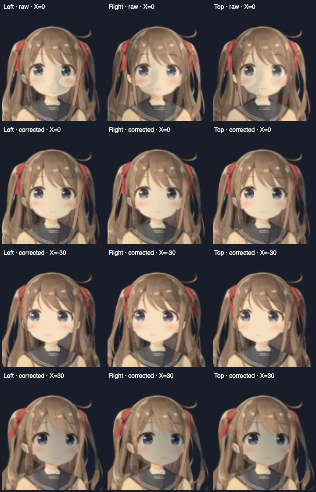

# Hiyori Pro lighting attachment

This is an agent-reviewed lighting attachment for AIRI's bundled Hiyori Pro archive. It does not change the archive.

The first row uses raw Marigold normals. The second uses the reviewed face and nose. The last two rows use the corrected surface at the rig's head-X endpoints. Columns use left, right, and overhead screen light. Values label rig parameters, not measured physical angles.

## Reviewed assignments

The atlas contact sheets are the evidence for the assignments in `profile.json`:

- Index 91, `ArtMesh51`, is the full skin-colored face. Its neutral geometry supplies the center and radii.
- Index 90, `ArtMesh50`, is the existing painted hair shadow. It retains its original blend operation.
- Indices 41–92 and 99 contain facial paint, mouth, eye, lid, blush, and face layers. They share a curved face surface.
- Index 41, `ArtMesh43`, is the distinct painted nose. A small bump follows this drawable's deformation. Nose strength is 0.22.
- Index 38, `ArtMesh56`, is brown front hair. A warm-color heuristic incorrectly selected it as skin. It is deliberately excluded, along with the other hair, ears, neck, and clothing.
- `ParamAngleX` spans -30 to 30. The surface uses the current material's face-yaw amount over this range.

The capture has 134 drawables and uses a 512×640 neutral image. `raw-normal.png` is the unchanged local Marigold result. `normal.png` changes only pixels owned by reviewed face layers. The runtime also shares the surface across those layers to avoid proxy seams on animation or transparency.

## Reuse

Use the `author-live2d-lighting` repo skill. Resolve the image filenames in `profile.json` to Blobs, validate against the fingerprinted rig, and install with `saveNormalAttachment`. The other files preserve the capture and review evidence. A different rig requires new layer inspection and assignments.

The face is a broad analytic curve with a localized nose, not reconstructed facial anatomy. The reference map still lacks surfaces hidden in the neutral pose. Hair and clothing retain their AI normals and the current proxy fallback. This example improves facial continuity; it is not a claim of complete 3D reconstruction or arbitrary-pose accuracy.

## Verification

The review rendered all 12 cases through the real Cubism shader with zero GL errors. The corrected binding also loaded in the live Tamagotchi window for `preset-live2d-1`; the ambient devtool reported its saved attachment. Iru was restored as the active character afterward.

The scoped normal persistence, face correction, nose attachment, surface material, and exposure suites passed 36 tests. Scoped TypeScript lint passed. The skill validator and contact-sheet helper ran successfully. Typecheck was omitted at the user's request.
