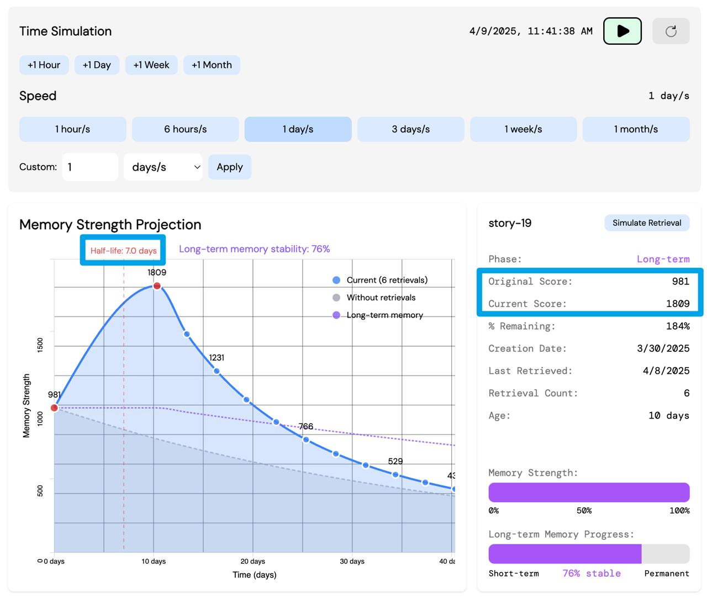
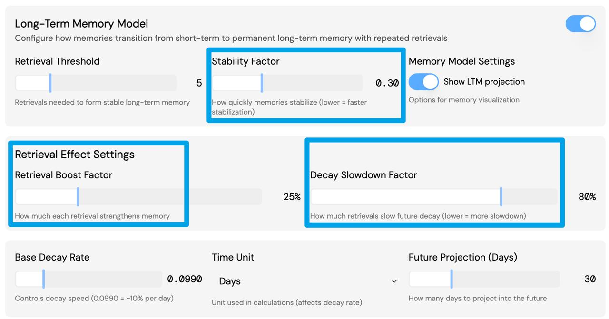
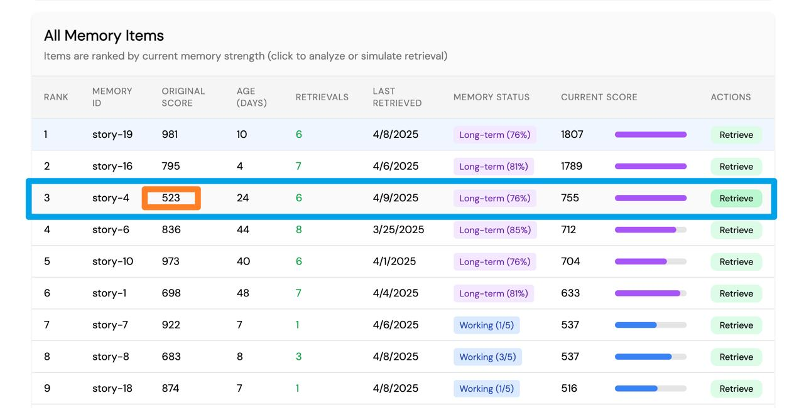
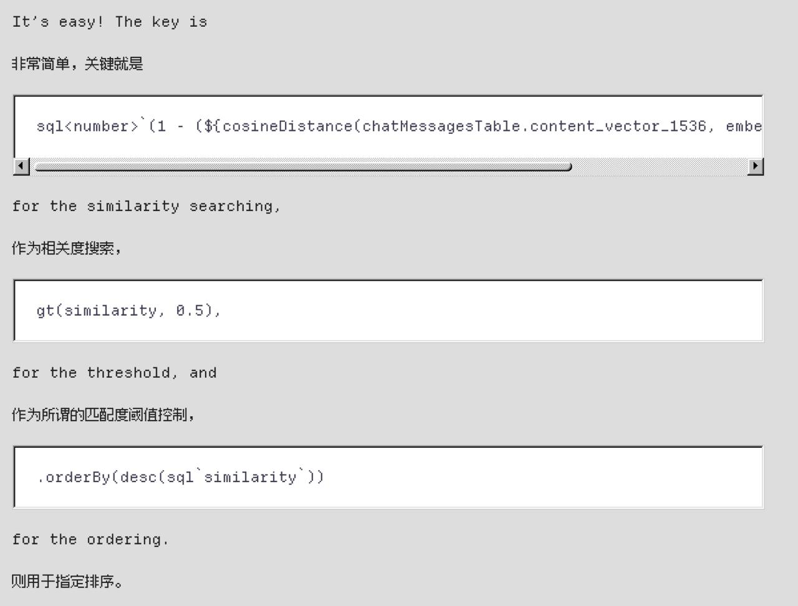
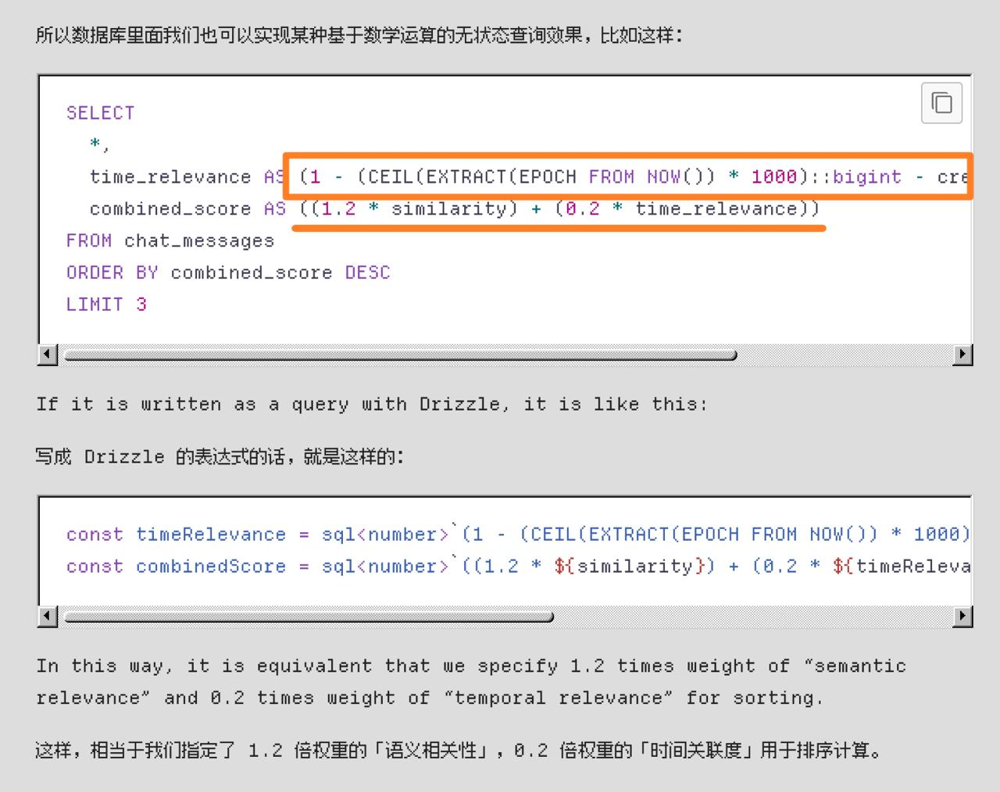
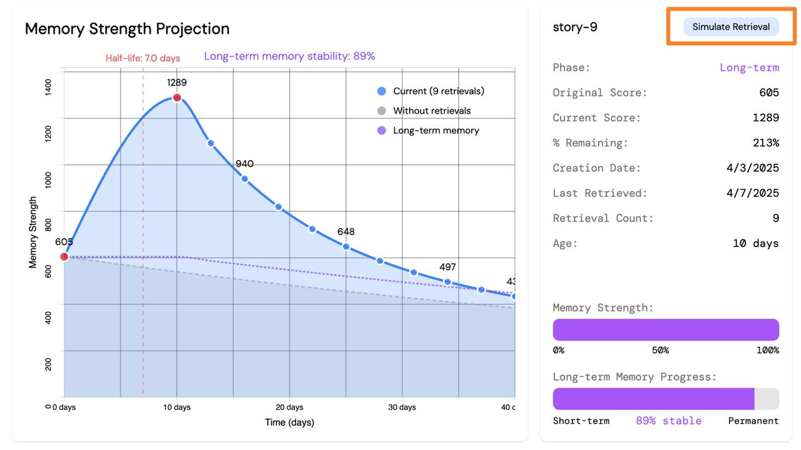
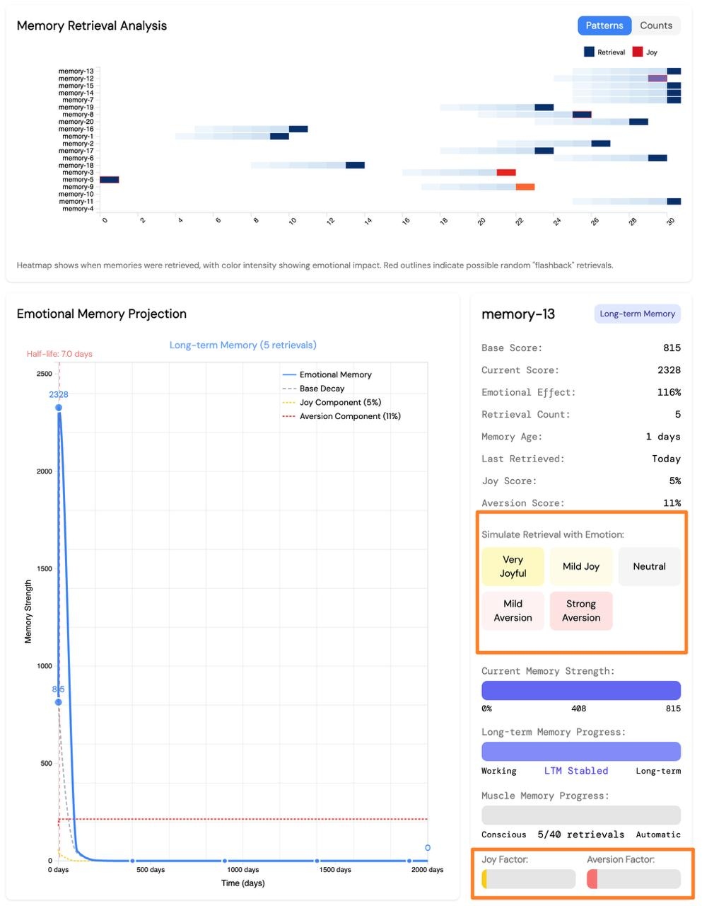
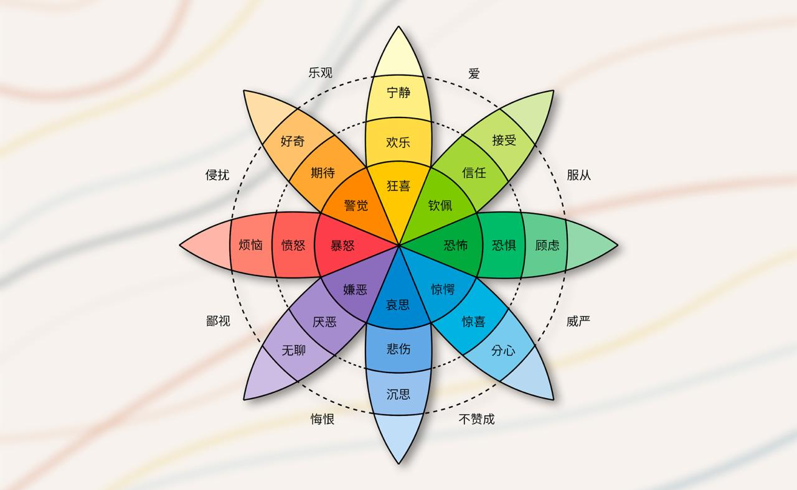

## 引子

[上次](../devlog-20250406#memory-system-记忆系统)我们聊到了 Airi 的记忆系统，这次我们再深入聊聊，如何实现一个这么复杂的记忆系统，以及对未来的展望。

## 先从 搜索引擎 开始

搜索引擎对于检索性能要求比较高，为此，系统开放了两阶段排序过程：

- **基础排序（粗排）**
- **业务排序（精排）**

基础排序即是海选，从检索结果中快速找到质量高的文档，取出 TOP N 个结果再按照精排进行精细算分，最终返回最优的结果给用户。

**由此可见，基础排序对性能影响比较大，业务排序对最终排序效果影响比较大。**

因此，基础排序要求尽量简单有效，只提取业务排序中的关键因子即可。其中，基础排序与业务排序目前均通过排序表达式的方式进行配置。

### OpenSearch / 问天引擎 DSL [^1]

这里以 Neko 曾经大量使用过的 阿里云 OpenSearch 为例来介绍一下吧，搜索引擎会有一些内置的用于重新排序的函数：

#### `static_bm25`

静态文本相关性，传统 NLP，用于衡量 query 与文档的匹配度。
类似 RAG 的 _相似度分数_
取值 0～1

#### `exact_match_boost`

获取查询中用户指定的查询词权重最大值，也叫做 score boost 函数。
如果输入的 关键字 在分词前，命中了文档中（比如标题，正文这两个字段）里面的「内容」。
比如 搜索 「如何制作 Neurosama」，那 Neurosama 这几个字出现的文档和页面的分数应该要比 Neuro + sama 分开出现的分数高才对。

#### `timeliness`, `timeliness_ms`

时效分，越新越相关。

### 数据是如何存储的？

搜索引擎无论是阿里云的 OpenSearch，还是 Grafana 自带的 Loki 那种的搜索引擎，或者 Grafana 时代之前更早的 ElasticSearch 引擎（某视频网站就是通过 ElasticSearch 二次开发得来的）都是需要在这些搜索引擎里**单独的数据结构中重新处理**了之后才能用的。

重新处理是如何实现的呢？这就需要用到 DTS 了。

#### DTS [^2]

让我们再补充介绍一下 **DTS** 这个概念。

Data Transformation Services，是用于业务数据库和 Search Engine Instance 之间 **通信和数据同步** 的系统。

实现原理：用 MySQL 和 Postgres 原生的 watch 和 subscribe event 的能力监听表修改，然后把数据同步到搜索引擎里，在这个过程中，数据会被序列化成期望的格式，发生数据结构的转化（ETL，extract，transform，load，提取，转换，加载）。

那搜索引擎粗排搜索的时候，是不是某种意义上就像是在一个 数据库 的 _视图_ 里找东西呢？是一个虚拟表一样的存在？可以这么理解，只不过说 view 视图一般用到的底层数据结构和 db 一样，都是 B+ 树，而搜索引擎可以有其他很多特化的数据结构，比如图，或者特化的 index kv db。

### 分词？

对于传统搜索引擎，一个中文文档输入，会经历这么一个过程：

- 分句（大段拆句子）
- 分词（句子拆字词，名词、动词 etc）
- 拼音化
- 可以根据当前的字典覆盖配置映射覆盖一下先前的结果
- 做一下基本的向量化和特征提取
- 写入到存储层

英文的话也要分词，只不过分词就很简单了，空格就是分词。

### 如何优化性能？

- 计算密集型
- 多个内部任务调度器去慢慢地索引数据
- 传统 NLP 里面有的汉明距离和余弦距离可以先简单算一下，预存一下
- 热词可以缓存一下分词结果和排序结果
- 数据湖仓？在 AWS 上常用，一般是拿来做聚合查询的，可以查询好几个数据库或者好几个数据源的，效率很慢，基本上就是数据分析和 BI 的时候才用

### 什么是召回？

召回（retrieval），就是说，keyword 输入进去之后能不能 retrieve 期望的 document 回来。

和搜索的区别？搜索是「用户发出的操作」，而召回是「机器为了响应搜索做的事情」。

### 什么是重排？

reranking 的意义在于，如果我们只是根据 embedding 模型给出的向量去进行 ANN（Approximate Nearest Neighbor） 和 KNN（K-Nearest Neighbor） 向量距离排序的话，事实上是会有失偏颇的。

因为先前在 OpenSearch 的时候介绍的 exact_match_boost 和 timeness 函数就不存在了。

如果你希望给召回的文档添加基于其他字段和其他步骤的排序结果进行排序的话，怎么办？

RAG 现在会流行一个新的流程，就是 reranking model，相当于是**用一个单独的专家模型去自动化重新根据已经召回的第一轮的数据重新排序一波**。

但是 reranking 依然无法解决记忆层的很多问题：遗忘曲线、记忆强化、随机想起记忆和情绪干扰的重排分数，这些都不是 reranking model 能做的事情。

如果想要给 AIRI 做好记忆层，就需要做好 reranking 的机制，把 RAG 基本能力和过往的 搜索引擎 的重排经验揉在一起。

## 记忆层实验平台

[Project AIRI Memory Driver @duckdb/duckdb-wasm Playground](https://drizzle-orm-duckdb-wasm.netlify.app/#/memory-decay)

左边这个高亮的 half life 就是记忆的半衰期。

默认情况下时间流逝速度是 1s 1 天，所以 7s 后，记忆的分数就会减半。

什么是记忆分数？记忆分数基本上是由这个控制的：

得出的分数就是 current score

什么是 original 呢，就是初始化的时候的分数。

例子：原始分数为 523，它的当前分数实际上是在慢慢变少的：

在继续介绍之前，解释一下，这个遗忘曲线的 SQL 是无状态的。

什么叫无状态？无状态的意思就是说，不会需要实时去数据库里面跑任务更新分数，而是直接根据「现在的时间」求出一个遗忘函数，把分数应用到遗忘函数里面即可。

那，current score 掉下去了怎么办呢？为了解决这个问题，我们需要有办法能 **强化记忆**。

## 类比人类的记忆系统

根据间隔重复提到的遗忘曲线和心理学中提到的基本的记忆系统工作的方式 [^3]

我们知道，人类的记忆可以分成好几种：

- 工作记忆
- 短期记忆
- 长期记忆
- 肌肉记忆

工作记忆是最不需要记得东西。

短期记忆在根据遗忘曲线慢慢衰退强度，也就是分数，这个时候，我们需要一个短期记忆的模拟函数来模拟这个过程。

长期记忆很重要，长期记忆的半衰期很长，是由短期记忆进化而来的。

最后就是肌肉记忆，与其说肌肉记忆是一种记忆，不如说是已经形成了一种条件反射。

## Airi 该如何设计呢？

那事实上我们可以瞥见 AIRI 的实现原则：

- 工作记忆就像是 messages 数组
- 短期记忆就像是，不那么容易召回，越新越好召回的 RAG 记忆条目
- 长期记忆就像是，容易召回，但是会变得模糊，过去召回次数越多越好召回的 RAG 条目
- 肌肉记忆，像是一种固定搭配吧，出现了 A 就会出现 ActionA 和 MemoryA 一样的感觉，这个时候更像是一种精确匹配的机制

但是，这样设计就对了吗？

很明显，我们这个实际上只引入了两个维度，一个是时间相关度（temporal relevance），一个是召回次数（retrieval count），如果你开始想要追求更复杂的系统的时候就会受限了。

### 小回顾

我们可以再来回顾一下 DevLog 中提到的排序表达式，应该会能帮助理解。

余弦距离就是「相关度」，是最基本的粗排：

现在需要时间参与进去，那我们多加一个字段拿来存储时间距离就好了，然后再弄一个单独的字段存合并分数 `(1.2 * similarity) + (0.2 * time_relevance)` ，其中 语义相关度 占 1.2 倍权重（倍率因子，不要求小于 1），时间距离相关度占 0.2 倍权重。

这样我们就很巧妙地把无状态的多字段相关度排序 SQL 实现出来了，还让它可以调节参数（1.2 和 0.2）。

在记忆详情卡上，可以点击 simulate retrieval，这可以主动触发一次记忆召回。

现在的 demo 里面是直接给原本的表里的 retrieval count（召回次数）字段用 UPDATE 语句写了 +1 来实现的。

这里面有一个隐式的坑是，这样也只是单维度的计算，相当于召回了就是强化了。

但现实世界里不是这样的，记忆会难过，会开心，难过的会带来负反馈，开心的会带来正反馈。

所以这就是我还没做完的部分。

## 情绪？

https://drizzle-orm-duckdb-wasm.netlify.app/#/memory-simulator

这个新的 simulator 里面就有情绪相关的模拟：

### 情绪和记忆相关吗？

想吃棒棒糖但是不给，这是一个很直接的问题，得不到肯定不开心啊。

然后你就会发现，实际上情绪和记忆相关。

如果对「某段过去的记忆开心，并且希望再次体验它」，但是由于「暂时没办法实现这个记忆里面的场景」，所以觉得「得不到就难过」。

可以在记忆数据库中存储「欢欣」和「厌恶」的分数：

### PTSD？

PTSD 通常会涉及到两个词「trigger」和「闪回」，很明显 PTSD 相关的记忆应该是被压抑过的，厌恶分数和创伤分数应该很高。

但是实际上 PTSD 相关的记忆会突然冒出来，从仿生和数据模拟的角度来说，我们可以用随机数实现这个效果。

可以参考一下 https://yutsuki.moe/2019/09/a0d0fa1b/ 里面的情绪模型。

## 还有很多事情要做……

比如，ReLU 的情绪当前是什么？ReLU 对谁有什么不好的回忆？

回忆是开心和难过的两极分化的条目一起出现的吗？

欲望呢？会需要做一个愿望系统？

做一个做梦 agent 或者潜意识 agent，类似 _背景任务_，挨个对发生过的记忆进行处理和索引，并且根据最近的经历修改过往记忆的各种分数。

但是我们不需要非要有「做梦」的过程，只是一个「background task」。

从 re-index 的角度来说，做梦 agent 和 潜意识 agent 就像是 重建索引 一样。

到这里就会发现，像 [Mem0](https://docs.mem0.ai/overview) 或者 [Zep Memory](https://help.getzep.com/memory) 这样的库在角色扮演和情感 AI 上完全发挥不了一点作用 :(

前路漫漫，我们还需要继续努力才行。

## 参考资料

[^1]: https://help.aliyun.com/zh/open-search/industry-algorithm-edition/rough-sort-functions

[^2]: https://help.aliyun.com/zh/open-search/industry-algorithm-edition/configure-dts-real-time-synchronization

[^3]: https://zh.wikipedia.org/wiki/%E9%81%97%E5%BF%98%E6%9B%B2%E7%BA%BF
