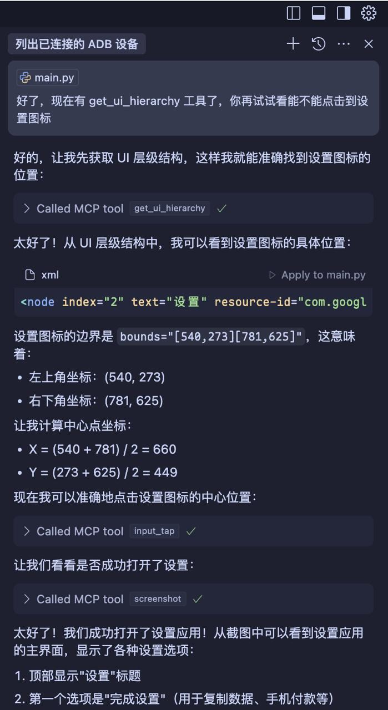

## Day time 日常

大家好，我是 [@LemonNeko](https://github.com/LemonNekoGH)，这次有我来参与撰写 DevLog 和大家分享开发的故事。

在两个月前，我们将 Airi 的网页端移植到了 Electron 上 [#7](https://github.com/moeru-ai/airi/pull/7)（现在已经被我们使用 Tauri 重构 🤣 [#90](https://github.com/moeru-ai/airi/pull/90)），它可以作为桌宠出现在我们的屏幕上，于此同时，我出现了允许 Airi 使用手机的想法，但是迟迟没有动手。

在上个周末（2025.04.20），我花了点时间，做了一个能与 ADB 交互的 MCP 服务器 Demo [airi-android](https://github.com/LemonNekoGH/airi-android)，给 Airi 提供了最基础的与手机交互的能力（事实上大部分 LLM 都可以通过它与手机交互），这是演示视频：

<video controls muted>
  <source src="../../static/blog/DevLog-2025.04.22/cursor-open-settings.mp4">
</video>

我也把它打包成了 Docker 镜像，提交到了 [MCP 服务器列表](https://mcp.so/server/airi-android/lemonnekogh)，有兴趣的可以试试。

实际上我一开始的思路是写一写 Tool Calling 的代码，改一改提示词，告诉 LLM 我们可以使用这些工具来与手机交互，就结束了。~~但是最近 MCP 实在太火了，我有点 FOMO，所以选择了 MCP 来实现它。~~

要想编写 MCP 服务器，就不得不先了解 MCP 是什么（虽然我从来不是好好学理论再去实践的人，我选择直接上手，然后让 Cursor 来尝试使用它）。MCP（Model Context Protocol）模型上下文协议，是一个尝试去标准化应用如何给 LLM 提供上下文的协议，它提出了一些核心概念：

1. Resources 资源：服务器可以将数据和内容作为上下文提供给 LLM。
2. Prompts 提示词：创建可服用的提示词模板和工作流。
3. Tools 工具：允许 LLM 通过你的服务器来完成一些动作。

啊，资源，这个我知道的啊，在 Ruby on Rails 里，用户就是一种资源，那 ADB 设备是不是也是资源，让 LLM 查看连接的设备列表，是不是就可以写成：

```python
from mcp.server.fastmcp import FastMCP
from ppadb.client import Client

mcp = FastMCP("airi-android")
adb_client = Client()

@mcp.resource("adb://devices")
def get_devices():
    return adb_client.devices()
```

错了，当我让 Cursor 来获取设备列表的时候，它并不知道怎么操作，它说它想主动去看有哪些设备连接了，所以它是工具，嗯，看来我没有理解透彻。

我还没有想好具体应该怎么让 LLM 操作手机，想和大家讨论，但是 Cursor 是这样操作的：

1. 使用截屏功能来大体了解手机屏幕上的内容。
2. 使用 UI 自动化工具来获取想要操作的元素的精确位置。
3. 点击或者滑动它。
4. 重复以上步骤。

目前看来运行良好，但是我有一些小小的问题：

1. 屏幕中是一个游戏，游戏使用图形 API 直接在屏幕上画了内容，而不是使用 UI 组件，所以 UI 自动化工具无法获取到元素的位置，也就无法操作它。
2. 一个 LLM 响应的内容是有上限的，如果操作比较复杂，可能要分个步骤来完成，我们可以像 [airi-factorio](https://github.com/moeru-ai/airi-factorio) 那样，在步骤完成之后自动告诉它，触发下一个步骤吗？
3. 如果有一些应用有酷炫的动画，在操作完成之后立刻截屏，可能看不到效果，我们会不会需要在操作完成之后，等待一段时间再截屏，或者直接使用录屏功能？
4. 直接让 AI 操作手机的安全性如何，会有哪些风险？

一些感想。

这是我第一次和 AI 写代码的时候感受到像人类一起写代码一样，不知道是不是因为我的目的就是让 AI 来使用我的工具，所以它变成了我的客户，我需要不停地根据它给的反馈来调整我的代码，它也变成了我的同事，我需要和它一起思考，一起解决问题。看这个截屏，是不是确实很像？



在开发过程中还学了一些小技巧，比如我们可以使用命令行来启动 Android 模拟器，这样就不用打开 Android Studio 了，内存压力也小了很多。

```bash
emulator -avd Pixel_6_Pro_API_34
```

下一步，我打算给 Airi 桌宠接上 MCP 服务器，看看它会想做什么，也许它会点开 Telegram 和我们聊天，就像现在的 ReLU 那样，只不过不是用 Telegram 的 API。

感谢你看完这篇可能有点啰嗦而且干货不多的 DevLog，我们下次再见！
