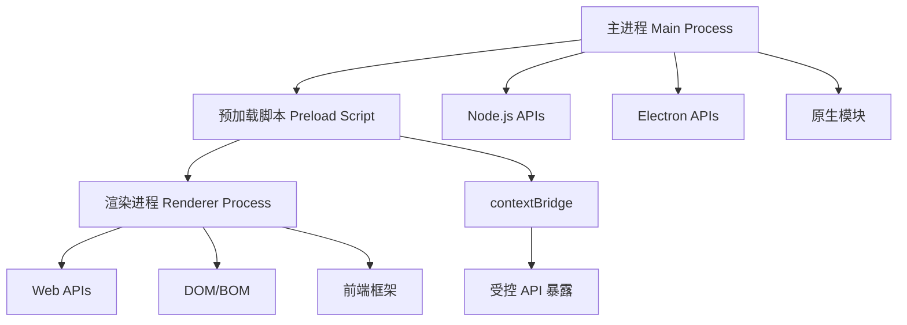

# Electron 应用开发流程与最佳实践

基于 stage-tamagotchi 项目实战经验总结

---

## 一、Electron 应用架构基础

### 1.1 三进程模型

Electron 应用由三个核心部分组成：



#### 主进程（Main Process）

**运行环境**：Node.js
**职责**：
- 应用生命周期管理
- 创建和管理窗口
- 原生功能集成（菜单、托盘、对话框等）
- 进程间通信（IPC）协调
- 系统资源访问

**入口文件**：`src/main/index.ts`

**典型代码结构**：
```typescript
import { app, BrowserWindow } from 'electron'

app.whenReady().then(() => {
  // 创建窗口
  const mainWindow = new BrowserWindow({
    width: 800,
    height: 600,
    webPreferences: {
      preload: join(__dirname, '../preload/index.js'),
      contextIsolation: true,
      nodeIntegration: false,
    },
  })

  // 加载页面
  mainWindow.loadURL('http://localhost:5173')
})

app.on('window-all-closed', () => {
  if (process.platform !== 'darwin') 
app.quit()
})
```

#### 预加载脚本（Preload Script）

**运行环境**：隔离的 Node.js 环境
**职责**：
- 安全地暴露主进程能力给渲染进程
- 使用 `contextBridge` 创建受控 API
- 不直接暴露 Node.js 或 Electron API

**入口文件**：`src/preload/index.ts`

**典型代码**：
```typescript
import { contextBridge, ipcRenderer } from 'electron'

// 安全暴露 API
contextBridge.exposeInMainWorld('electron', {
  // 仅暴露特定方法
  sendMessage: (channel: string, data: any) => {
    const validChannels = ['toMain', 'message']
    if (validChannels.includes(channel)) {
      ipcRenderer.send(channel, data)
    }
  },
  onMessage: (channel: string, callback: Function) => {
    const validChannels = ['fromMain']
    if (validChannels.includes(channel)) {
      ipcRenderer.on(channel, (event, ...args) => callback(...args))
    }
  },
})
```

#### 渲染进程（Renderer Process）

**运行环境**：Chromium 浏览器
**职责**：
- UI 渲染
- 用户交互处理
- 前端逻辑实现
- 通过预加载脚本与主进程通信

**入口文件**：`src/renderer/main.ts` + `index.html`

**典型代码**：
```typescript
// 渲染进程中使用主进程暴露的 API
window.electron.sendMessage('toMain', { type: 'greeting' })

window.electron.onMessage('fromMain', (data) => {
  console.log('收到主进程消息:', data)
})
```

### 1.2 进程间通信（IPC）

Electron 提供两种 IPC 模式：

#### 单向通信（Send）

```typescript
// 渲染进程 → 主进程
ipcRenderer.send('channel-name', data)

// 主进程监听
ipcMain.on('channel-name', (event, data) => {
  console.log(data)
})
```

#### 双向通信（Invoke/Handle）

```typescript
// 渲染进程发起请求
const result = await ipcRenderer.invoke('get-user-data', userId)

// 主进程处理请求
ipcMain.handle('get-user-data', async (event, userId) => {
  const data = await fetchUserData(userId)
  return data
})
```

#### 主进程 → 渲染进程

```typescript
// 主进程发送
mainWindow.webContents.send('message-from-main', data)

// 渲染进程接收
ipcRenderer.on('message-from-main', (event, data) => {
  console.log(data)
})
```

---

## 二、开发环境搭建

### 2.1 项目初始化

#### 方式一：使用官方模板

```bash
npm create @quick-start/electron
# 或
yarn create @quick-start/electron
# 或
pnpm create @quick-start/electron
```

#### 方式二：使用 electron-vite

```bash
npm create @electron-vite/latest
```

推荐选择：
- **框架**：Vue 3 / React / Svelte
- **TypeScript**：是
- **构建工具**：Vite

#### 方式三：手动配置

```bash
mkdir my-electron-app && cd my-electron-app
pnpm init
pnpm add -D electron electron-builder vite
pnpm add -D typescript @types/node
```

### 2.2 项目结构规范

推荐的目录结构：

```
my-electron-app/
├── src/
│   ├── main/                 # 主进程代码
│   │   ├── index.ts
│   │   ├── windows/          # 窗口管理
│   │   ├── services/         # 业务服务
│   │   └── utils/            # 工具函数
│   ├── preload/              # 预加载脚本
│   │   └── index.ts
│   └── renderer/             # 渲染进程代码
│       ├── index.html
│       ├── main.ts
│       ├── components/
│       └── pages/
├── resources/                # 应用资源
│   ├── icon.png
│   └── tray-icon.png
├── build/                    # 构建资源
│   └── entitlements.mac.plist
├── electron.vite.config.ts   # Vite 配置
├── electron-builder.yml      # 打包配置
├── package.json
└── tsconfig.json
```

### 2.3 配置文件

#### package.json

```json
{
  "name": "my-electron-app",
  "version": "1.0.0",
  "main": "./out/main/index.js",
  "scripts": {
    "dev": "electron-vite dev",
    "build": "electron-vite build",
    "preview": "electron-vite preview",
    "typecheck": "tsc --noEmit",
    "pack": "electron-builder --dir",
    "dist": "electron-builder"
  },
  "dependencies": {
    "@electron-toolkit/preload": "^3.0.0",
    "@electron-toolkit/utils": "^4.0.0"
  },
  "devDependencies": {
    "electron": "^38.0.0",
    "electron-builder": "^26.0.0",
    "electron-vite": "^4.0.0",
    "typescript": "^5.9.0",
    "vite": "^7.0.0"
  }
}
```

#### electron.vite.config.ts

```typescript
import { resolve } from 'path'

import { defineConfig, externalizeDepsPlugin } from 'electron-vite'

export default defineConfig({
  main: {
    plugins: [externalizeDepsPlugin()],
  },
  preload: {
    plugins: [externalizeDepsPlugin()],
  },
  renderer: {
    resolve: {
      alias: {
        '@': resolve('src/renderer'),
      },
    },
  },
})
```

#### tsconfig.json

```json
{
  "compilerOptions": {
    "target": "ES2020",
    "module": "ESNext",
    "lib": ["ES2020", "DOM"],
    "moduleResolution": "bundler",
    "strict": true,
    "esModuleInterop": true,
    "skipLibCheck": true,
    "resolveJsonModule": true,
    "isolatedModules": true,
    "paths": {
      "@/*": ["./src/renderer/*"]
    }
  },
  "include": ["src/**/*"],
  "exclude": ["node_modules", "dist", "out"]
}
```

---

## 三、核心功能开发

### 3.1 窗口管理

#### 创建基础窗口

```typescript
import { join } from 'path'

import { BrowserWindow } from 'electron'

function createMainWindow(): BrowserWindow {
  const window = new BrowserWindow({
    width: 1200,
    height: 800,
    show: false, // 等待 ready-to-show 再显示
    webPreferences: {
      preload: join(__dirname, '../preload/index.js'),
      contextIsolation: true,
      nodeIntegration: false,
      sandbox: true, // 启用沙箱以提高安全性
    },
  })

  // 优化显示体验
  window.once('ready-to-show', () => {
    window.show()
  })

  // 开发环境加载本地服务器
  if (process.env.NODE_ENV === 'development') {
    window.loadURL('http://localhost:5173')
    window.webContents.openDevTools()
  }
 else {
    // 生产环境加载打包文件
    window.loadFile(join(__dirname, '../renderer/index.html'))
  }

  return window
}
```

#### 无边框透明窗口

```typescript
const window = new BrowserWindow({
  width: 400,
  height: 600,
  frame: false, // 无边框
  transparent: true, // 透明背景
  hasShadow: false, // 无阴影
  resizable: false, // 禁止调整大小
  webPreferences: {
    preload: join(__dirname, '../preload/index.js'),
  },
})
```

**配合 CSS 实现拖拽**：
```css
/* 渲染进程 CSS */
.title-bar {
  -webkit-app-region: drag;  /* 可拖拽区域 */
  height: 32px;
}

.title-bar button {
  -webkit-app-region: no-drag;  /* 按钮不可拖拽 */
}
```

#### 窗口状态管理

**保存和恢复窗口位置**：
```typescript
import { readFileSync, writeFileSync, existsSync } from 'fs'
import { join } from 'path'

import { app } from 'electron'

interface WindowState {
  x?: number
  y?: number
  width: number
  height: number
  isMaximized?: boolean
}

function saveWindowState(window: BrowserWindow) {
  const bounds = window.getBounds()
  const state: WindowState = {
    x: bounds.x,
    y: bounds.y,
    width: bounds.width,
    height: bounds.height,
    isMaximized: window.isMaximized(),
  }

  const statePath = join(app.getPath('userData'), 'window-state.json')
  writeFileSync(statePath, JSON.stringify(state))
}

function loadWindowState(): WindowState | null {
  const statePath = join(app.getPath('userData'), 'window-state.json')
  if (existsSync(statePath)) {
    return JSON.parse(readFileSync(statePath, 'utf-8'))
  }
  return null
}

// 使用示例
const savedState = loadWindowState()
const window = new BrowserWindow({
  width: savedState?.width ?? 1200,
  height: savedState?.height ?? 800,
  x: savedState?.x,
  y: savedState?.y,
})

// 监听窗口变化
window.on('resize', () => saveWindowState(window))
window.on('move', () => saveWindowState(window))

// 恢复最大化状态
if (savedState?.isMaximized) {
  window.maximize()
}
```

### 3.2 安全的 IPC 通信

#### 使用类型安全的事件库（推荐）

基于 stage-tamagotchi 项目经验，使用 `@unbird/eventa`：

**定义事件**：
```typescript
// src/shared/events.ts
import { defineEventa, defineInvokeEventa } from '@unbird/eventa'

export interface UserData {
  id: string
  name: string
}

// 单向事件
export const userLoggedIn = defineEventa<UserData>('user:logged-in')

// 双向请求
export const getUserData = defineInvokeEventa<
  { userId: string }, // 请求参数
  UserData // 返回类型
>('user:get-data')
```

**主进程处理**：
```typescript
// src/main/handlers/user.ts
import { defineInvokeHandler } from '@unbird/eventa'
import { createContext } from '@unbird/eventa/adapters/electron/main'
import { ipcMain } from 'electron'

import { getUserData } from '../../shared/events'

export function setupUserHandlers(window: BrowserWindow) {
  const { context } = createContext(ipcMain, window)

  const cleanup = defineInvokeHandler(
    context,
    getUserData,
    async ({ userId }) => {
      // 类型安全！参数自动推断为 { userId: string }
      const user = await fetchUserFromDatabase(userId)
      return user // 返回类型必须匹配 UserData
    }
  )

  window.on('closed', cleanup) // 清理监听器
}
```

**渲染进程调用**：
```typescript
// src/renderer/composables/useUser.ts
import { invoke } from '@unbird/eventa'
import { createContext } from '@unbird/eventa/adapters/electron/renderer'

import { getUserData } from '../../shared/events'

const { context } = createContext()

export async function fetchUser(userId: string) {
  // 类型安全！自动推断参数和返回值
  const userData = await invoke(context, getUserData, { userId })
  return userData // 类型为 UserData
}
```

#### 传统 IPC 方式（加强安全）

**白名单模式**：
```typescript
// src/preload/index.ts
import { contextBridge, ipcRenderer } from 'electron'

const ALLOWED_SEND_CHANNELS = ['user:login', 'app:quit']
const ALLOWED_INVOKE_CHANNELS = ['user:getData', 'file:read']

contextBridge.exposeInMainWorld('electron', {
  send: (channel: string, ...args: any[]) => {
    if (ALLOWED_SEND_CHANNELS.includes(channel)) {
      ipcRenderer.send(channel, ...args)
    }
 else {
      throw new Error(`Channel "${channel}" is not allowed`)
    }
  },
  invoke: async (channel: string, ...args: any[]) => {
    if (ALLOWED_INVOKE_CHANNELS.includes(channel)) {
      return await ipcRenderer.invoke(channel, ...args)
    }
 else {
      throw new Error(`Channel "${channel}" is not allowed`)
    }
  },
})
```

### 3.3 菜单与托盘

#### 应用菜单

```typescript
import { app, Menu, MenuItem } from 'electron'

function createApplicationMenu() {
  const template: MenuItem[] = [
    {
      label: app.name,
      submenu: [
        { role: 'about' },
        { type: 'separator' },
        { role: 'services' },
        { type: 'separator' },
        { role: 'hide' },
        { role: 'hideOthers' },
        { role: 'unhide' },
        { type: 'separator' },
        { role: 'quit' },
      ],
    },
    {
      label: 'Edit',
      submenu: [
        { role: 'undo' },
        { role: 'redo' },
        { type: 'separator' },
        { role: 'cut' },
        { role: 'copy' },
        { role: 'paste' },
      ],
    },
    {
      label: 'View',
      submenu: [
        { role: 'reload' },
        { role: 'toggleDevTools' },
        { type: 'separator' },
        { role: 'resetZoom' },
        { role: 'zoomIn' },
        { role: 'zoomOut' },
      ],
    },
  ]

  const menu = Menu.buildFromTemplate(template as any)
  Menu.setApplicationMenu(menu)
}
```

#### 系统托盘

```typescript
import { join } from 'path'

import { Tray, Menu, nativeImage } from 'electron'

let tray: Tray | null = null

function createTray(window: BrowserWindow) {
  const iconPath = join(__dirname, '../../resources/tray-icon.png')
  const icon = nativeImage.createFromPath(iconPath).resize({ width: 16 })

  tray = new Tray(icon)
  tray.setToolTip('My Electron App')

  const contextMenu = Menu.buildFromTemplate([
    {
      label: 'Show App',
      click: () => {
        window.show()
        window.focus()
      },
    },
    { type: 'separator' },
    {
      label: 'Quit',
      click: () => {
        app.quit()
      },
    },
  ])

  tray.setContextMenu(contextMenu)

  // macOS 特殊处理：点击托盘图标显示窗口
  tray.on('click', () => {
    if (process.platform === 'darwin') {
      window.show()
    }
  })
}

// 清理托盘
app.on('before-quit', () => {
  tray?.destroy()
  tray = null
})
```

### 3.4 原生对话框

#### 文件选择对话框

```typescript
import { dialog } from 'electron'

// 打开文件
async function selectFile() {
  const result = await dialog.showOpenDialog({
    title: '选择文件',
    filters: [
      { name: 'Images', extensions: ['jpg', 'png', 'gif'] },
      { name: 'All Files', extensions: ['*'] },
    ],
    properties: ['openFile', 'multiSelections'],
  })

  if (!result.canceled) {
    return result.filePaths
  }
  return []
}

// 保存文件
async function saveFile() {
  const result = await dialog.showSaveDialog({
    title: '保存文件',
    defaultPath: 'untitled.txt',
    filters: [
      { name: 'Text Files', extensions: ['txt'] },
    ],
  })

  if (!result.canceled && result.filePath) {
    return result.filePath
  }
  return null
}
```

#### 消息对话框

```typescript
// 确认对话框
async function confirmDelete() {
  const result = await dialog.showMessageBox({
    type: 'question',
    buttons: ['Cancel', 'Delete'],
    defaultId: 0,
    title: 'Confirm',
    message: 'Are you sure you want to delete this file?',
    detail: 'This action cannot be undone.',
  })

  return result.response === 1 // 1 表示点击了 "Delete"
}

// 错误提示
function showError(message: string) {
  dialog.showErrorBox('Error', message)
}
```

### 3.5 本地存储

#### 使用 electron-store

```bash
pnpm add electron-store
```

```typescript
import Store from 'electron-store'

interface StoreSchema {
  user: {
    name: string
    email: string
  }
  settings: {
    theme: 'light' | 'dark'
    fontSize: number
  }
}

const store = new Store<StoreSchema>({
  defaults: {
    user: {
      name: '',
      email: '',
    },
    settings: {
      theme: 'light',
      fontSize: 14,
    },
  },
})

// 读写数据
store.set('user.name', 'Alice')
const userName = store.get('user.name')

// 监听变化
store.onDidChange('settings.theme', (newValue, oldValue) => {
  console.log(`Theme changed from ${oldValue} to ${newValue}`)
})
```

#### 手动实现持久化

参考 stage-tamagotchi 项目的实现：

```typescript
import { readFileSync, writeFileSync, existsSync } from 'fs'
import { join } from 'path'

import { app } from 'electron'
import { throttle } from 'es-toolkit'

export function createConfig<T>(
  namespace: string,
  filename: string,
  options?: { default?: T }
) {
  const configPath = join(app.getPath('userData'), `${namespace}-${filename}`)

  let data: T | undefined

  function setup() {
    if (existsSync(configPath)) {
      const content = readFileSync(configPath, 'utf-8')
      data = JSON.parse(content)
    }
 else {
      data = options?.default
    }
  }

  const save = throttle(() => {
    writeFileSync(configPath, JSON.stringify(data, null, 2))
  }, 250)

  function update(newData: T) {
    data = newData
    save()
  }

  function get(): T | undefined {
    return data
  }

  return { setup, get, update }
}

// 使用示例
interface AppConfig {
  windowBounds: { x: number, y: number, width: number, height: number }
}

const { setup, get, update } = createConfig<AppConfig>('app', 'config.json', {
  default: {
    windowBounds: { x: 0, y: 0, width: 1200, height: 800 },
  },
})

setup()
const config = get()
```

---

## 四、构建与打包

### 4.1 electron-builder 配置

#### 基础配置（electron-builder.yml）

```yaml
appId: com.example.myapp
productName: MyApp

directories:
  output: dist
  buildResources: build

files:
  - out/**
  - package.json

asar: true
asarUnpack:
  - resources/**

# Windows 配置
win:
  target:
    - nsis
    - portable
  icon: build/icon.ico

nsis:
  oneClick: false
  allowToChangeInstallationDirectory: true
  createDesktopShortcut: always

# macOS 配置
mac:
  target:
    - dmg
    - zip
  icon: build/icon.icns
  category: public.app-category.productivity
  hardenedRuntime: true
  gatekeeperAssess: false
  entitlements: build/entitlements.mac.plist

dmg:
  contents:
    - x: 130
      y: 220
    - x: 410
      y: 220
      type: link
      path: /Applications

# Linux 配置
linux:
  target:
    - AppImage
    - deb
  icon: build/icons/
  category: Utility

appImage:
  license: LICENSE
```

#### macOS 签名配置

**entitlements.mac.plist**：
```xml
<?xml version="1.0" encoding="UTF-8"?>
<!DOCTYPE plist PUBLIC "-//Apple//DTD PLIST 1.0//EN" "http://www.apple.com/DTDs/PropertyList-1.0.dtd">
<plist version="1.0">
<dict>
  <key>com.apple.security.cs.allow-jit</key>
  <true/>
  <key>com.apple.security.cs.allow-unsigned-executable-memory</key>
  <true/>
  <key>com.apple.security.cs.debugger</key>
  <true/>
</dict>
</plist>
```

### 4.2 打包命令

```bash
# 仅打包（不生成安装包）
pnpm build:unpack

# 打包当前平台
pnpm dist

# 跨平台打包（需要特殊配置）
pnpm dist:win
pnpm dist:mac
pnpm dist:linux
```

### 4.3 自动更新

#### 安装依赖

```bash
pnpm add electron-updater
```

#### 主进程代码

```typescript
import { app } from 'electron'
import { autoUpdater } from 'electron-updater'

autoUpdater.autoDownload = false
autoUpdater.autoInstallOnAppQuit = true

// 检查更新
function checkForUpdates() {
  autoUpdater.checkForUpdates()
}

// 监听更新事件
autoUpdater.on('update-available', (info) => {
  // 通知渲染进程有新版本
  mainWindow.webContents.send('update-available', info)
})

autoUpdater.on('download-progress', (progressObj) => {
  mainWindow.webContents.send('download-progress', progressObj.percent)
})

autoUpdater.on('update-downloaded', () => {
  mainWindow.webContents.send('update-downloaded')
})

// IPC 处理
ipcMain.handle('download-update', async () => {
  await autoUpdater.downloadUpdate()
})

ipcMain.handle('install-update', () => {
  autoUpdater.quitAndInstall()
})

// 应用启动后检查更新
app.whenReady().then(() => {
  setTimeout(checkForUpdates, 3000)
})
```

#### 渲染进程代码

```typescript
// 监听更新通知
window.electron.onUpdateAvailable((info: any) => {
  showNotification('New version available!', info.version)
})

window.electron.onDownloadProgress((percent: number) => {
  updateProgressBar(percent)
})

window.electron.onUpdateDownloaded(() => {
  showInstallButton()
})

// 触发下载
async function downloadUpdate() {
  await window.electron.invoke('download-update')
}

// 触发安装
async function installUpdate() {
  await window.electron.invoke('install-update')
}
```

#### 发布配置

在 `electron-builder.yml` 中配置发布源：

```yaml
publish:
  - provider: github
    owner: your-username
    repo: your-repo
    releaseType: release
```

或使用自定义服务器：

```yaml
publish:
  - provider: generic
    url: https://your-domain.com/updates
```

---

## 五、性能优化

### 5.1 启动优化

#### 延迟加载模块

```typescript
// ❌ 不好的做法
import { app, BrowserWindow } from 'electron'
import heavyModule from './heavy-module'

// ✅ 好的做法
import { app, BrowserWindow } from 'electron'

app.whenReady().then(() => {
  const window = createWindow()
  heavyModule.init(window)
})

app.whenReady().then(async () => {
  const window = createWindow()

  // 窗口显示后再加载重模块
  window.once('ready-to-show', async () => {
    window.show()
    const heavyModule = await import('./heavy-module')
    heavyModule.init(window)
  })
})
```

#### V8 快照优化

```typescript
// 使用 --no-lazy 标志提前编译
app.commandLine.appendSwitch('js-flags', '--no-lazy')
```

### 5.2 渲染进程优化

#### 代码分割

```typescript
// vite.config.ts
export default {
  build: {
    rollupOptions: {
      output: {
        manualChunks: {
          vendor: ['vue', 'vue-router', 'pinia'],
          ui: ['@/components/ui'],
        },
      },
    },
  },
}
```

#### 资源懒加载

```typescript
// 路由懒加载
const routes = [
  {
    path: '/',
    component: () => import('./pages/Home.vue'),
  },
  {
    path: '/settings',
    component: () => import('./pages/Settings.vue'),
  },
]
```

### 5.3 内存优化

#### 限制 V8 内存

```typescript
app.commandLine.appendSwitch('js-flags', '--max-old-space-size=4096')
```

#### 监控内存使用

```typescript
import { app } from 'electron'

setInterval(() => {
  const memoryUsage = process.memoryUsage()
  console.log('Memory Usage:', {
    rss: `${Math.round(memoryUsage.rss / 1024 / 1024)} MB`,
    heapTotal: `${Math.round(memoryUsage.heapTotal / 1024 / 1024)} MB`,
    heapUsed: `${Math.round(memoryUsage.heapUsed / 1024 / 1024)} MB`,
  })
}, 10000)
```

---

## 六、调试技巧

### 6.1 主进程调试

#### 使用 VSCode 调试

**.vscode/launch.json**：
```json
{
  "version": "0.2.0",
  "configurations": [
    {
      "name": "Debug Main Process",
      "type": "node",
      "request": "launch",
      "cwd": "${workspaceFolder}",
      "runtimeExecutable": "${workspaceFolder}/node_modules/.bin/electron-vite",
      "runtimeArgs": ["dev", "--sourcemap"],
      "skipFiles": ["<node_internals>/**"]
    }
  ]
}
```

#### 日志系统

```typescript
import { createLogger } from '@guiiai/logg'

const log = createLogger('main')

log.info('Application started')
log.error('Something went wrong', error)
log.debug('Debug info', { userId: 123 })
```

### 6.2 渲染进程调试

```typescript
// 开发环境自动打开 DevTools
if (process.env.NODE_ENV === 'development') {
  window.webContents.openDevTools({ mode: 'detach' })
}

// 快捷键打开 DevTools
window.webContents.on('before-input-event', (event, input) => {
  if (input.key === 'F12') {
    window.webContents.toggleDevTools()
  }
})
```

### 6.3 性能分析

```typescript
// 记录启动时间
const startTime = Date.now()

app.whenReady().then(() => {
  const readyTime = Date.now() - startTime
  console.log(`App ready in ${readyTime}ms`)

  const window = createWindow()
  window.once('ready-to-show', () => {
    const showTime = Date.now() - startTime
    console.log(`Window shown in ${showTime}ms`)
  })
})
```

---

## 七、最佳实践总结

### 7.1 安全性

1. **始终启用上下文隔离**
   ```typescript
   webPreferences: {
     contextIsolation: true,
     nodeIntegration: false,
   }
   ```

2. **使用 contextBridge 暴露 API**
3. **验证 IPC 通道和参数**
4. **外部链接用系统浏览器打开**
5. **启用沙箱模式**（如果可能）

### 7.2 性能

1. **延迟加载非关键模块**
2. **优化窗口显示（ready-to-show）**
3. **代码分割和懒加载**
4. **限制 V8 内存**
5. **使用 Web Workers 处理计算密集任务**

### 7.3 用户体验

1. **保存和恢复窗口状态**
2. **提供系统托盘支持**
3. **实现自动更新**
4. **优雅处理应用退出**
5. **提供快捷键支持**

### 7.4 开发效率

1. **使用 TypeScript**
2. **使用类型安全的 IPC 库（如 eventa）**
3. **模块化窗口管理**
4. **使用依赖注入管理复杂依赖**
5. **配置完善的调试环境**

---

## 八、常见问题解决

### Q1: 打包后白屏

**原因**：路径错误或资源未包含

**解决**：
1. 检查 `base` 配置（应为 `'./'`）
2. 确认 `asarUnpack` 包含必要资源
3. 使用 `__dirname` 而非相对路径

### Q2: IPC 通信失败

**原因**：上下文隔离未正确配置

**解决**：
1. 确保 `contextIsolation: true`
2. 使用 `contextBridge` 暴露 API
3. 检查通道名称是否一致

### Q3: 窗口闪烁

**原因**：窗口在准备好前显示

**解决**：
```typescript
const window = new BrowserWindow({ show: false })
window.once('ready-to-show', () => window.show())
```

### Q4: 跨平台兼容性问题

**解决**：
1. 使用 `process.platform` 判断平台
2. 使用 `path.join()` 而非手动拼接路径
3. 测试所有目标平台

### Q5: 内存泄漏

**原因**：事件监听器未清理

**解决**：
```typescript
window.on('closed', () => {
  // 清理监听器
  cleanup()
})
```

---

## 九、学习资源

### 官方文档
- [Electron 官方文档](https://www.electronjs.org/docs/latest)
- [electron-vite 文档](https://electron-vite.org/)
- [electron-builder 文档](https://www.electron.build/)

### 推荐工具
- [@electron-toolkit/utils](https://github.com/alex8088/electron-toolkit)
- [@unbird/eventa](https://github.com/unjs/eventa)
- [electron-store](https://github.com/sindresorhus/electron-store)
- [electron-updater](https://github.com/electron-userland/electron-builder)

### 社区资源
- [Awesome Electron](https://github.com/sindresorhus/awesome-electron)
- [Electron 中文文档](https://www.electronjs.org/zh/docs/latest)

---

**总结**：Electron 开发的核心是理解三进程模型、掌握安全的 IPC 通信、合理组织项目结构，并注重性能优化和用户体验。通过学习 stage-tamagotchi 等优秀项目，可以快速掌握最佳实践并应用到实际开发中。
