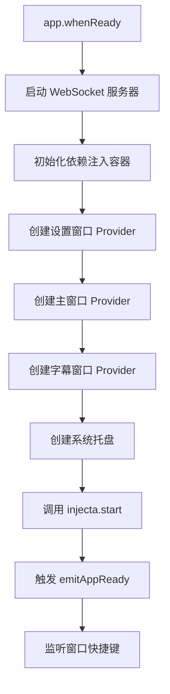

# stage-tamagotchi 项目技术分析

## 项目概述

stage-tamagotchi 是 Project AIRI 的桌面端应用，基于 Electron 框架构建。这是一个 AI 虚拟角色（VTuber）桌面应用，支持 Live2D/VRM 模型渲染、语音交互、实时字幕等功能。

**应用 ID**: `ai.moeru.airi`
**产品名称**: AIRI
**版本**: 0.7.2-beta.3

---

## 一、项目结构

### 1.1 整体架构

项目采用标准的 Electron 三进程架构：

```
stage-tamagotchi/
├── src/
│   ├── main/              # 主进程（Node.js 环境）
│   ├── preload/           # 预加载脚本（隔离桥接层）
│   ├── renderer/          # 渲染进程（Web 环境）
│   └── shared/            # 跨进程共享代码
├── scripts/               # 构建脚本
├── resources/             # 应用资源（图标等）
├── electron.vite.config.ts  # Electron + Vite 构建配置
├── electron-builder.yml   # 应用打包配置
└── package.json           # 依赖与脚本定义
```

### 1.2 主进程结构（Main Process）

```
src/main/
├── index.ts               # 主进程入口
├── app/
│   └── debugger.ts        # 调试器设置
├── libs/
│   ├── bootkit/
│   │   └── lifecycle.ts   # 应用生命周期管理
│   ├── electron/
│   │   ├── location.ts    # 路径解析工具
│   │   └── window-manager/ # 窗口管理抽象
│   └── event-loop/        # 事件循环工具
├── services/
│   └── electron/          # Electron 相关服务
├── windows/
│   ├── main/              # 主窗口
│   ├── settings/          # 设置窗口
│   ├── caption/           # 字幕窗口
│   ├── inlay/             # 嵌入式窗口
│   └── shared/            # 窗口共享逻辑
```

**核心职责**：
- 应用生命周期管理（启动、退出、托盘）
- 多窗口管理（主窗口、设置、字幕叠加层等）
- 原生功能集成（系统托盘、全局快捷键）
- WebSocket 服务启动（`@proj-airi/server-runtime`）
- 依赖注入容器管理（使用 `@proj-airi/injecta`）

### 1.3 预加载脚本（Preload）

```
src/preload/
├── index.ts               # 预加载入口
└── shared.ts              # 通用暴露逻辑
```

**核心职责**：
- 使用 `contextBridge` 安全暴露 Electron API
- 为渲染进程提供受控的 Node.js 能力
- 暴露平台信息（`window.platform`）

### 1.4 渲染进程结构（Renderer Process）

```
src/renderer/
├── main.ts                # 渲染进程入口
├── App.vue                # 根组件
├── index.html             # HTML 模板
├── pages/                 # 页面组件（基于文件路由）
│   ├── index.vue          # 主页
│   ├── chat.vue           # 聊天页
│   ├── settings/          # 设置页面
│   ├── devtools/          # 开发者工具页面
│   └── inlay/             # 嵌入式页面
├── layouts/               # 布局组件
│   ├── default.vue
│   ├── stage.vue
│   └── settings.vue
├── components/            # UI 组件
│   ├── Widgets/           # 功能组件（控制岛、资源状态等）
│   └── Window/            # 窗口相关组件（标题栏等）
├── composables/           # 组合式函数
│   ├── electron-vueuse/   # Electron + VueUse 集成
│   └── vueuse/            # VueUse 扩展
├── stores/                # Pinia 状态管理
├── styles/                # 全局样式
└── modules/               # 功能模块（i18n 等）
```

**核心职责**：
- Vue 3 应用渲染
- UI 组件与交互逻辑
- 状态管理（Pinia）
- 路由管理（Vue Router）
- 与主进程通信（IPC）

### 1.5 共享代码（Shared）

```
src/shared/
├── eventa.ts              # 跨进程事件定义
└── electron/              # Electron 类型定义
```

**核心职责**：
- 定义主进程和渲染进程共用的事件协议
- 共享类型定义

---

## 二、核心技术栈

### 2.1 构建工具链

| 技术 | 版本 | 用途 |
|------|------|------|
| **Electron** | ^38.2.2 | 跨平台桌面应用框架 |
| **electron-vite** | ^4.0.1 | Electron 专用 Vite 构建工具 |
| **electron-builder** | 26.0.20 | 应用打包与分发 |
| **Vite** | catalog:rolldown-vite | 快速构建工具（使用 Rolldown） |
| **TypeScript** | ~5.9.3 | 类型安全 |

### 2.2 前端框架

| 技术 | 版本 | 用途 |
|------|------|------|
| **Vue 3** | ^3.5.22 | 渐进式前端框架 |
| **vue-router** | ^4.5.1 | 路由管理 |
| **Pinia** | ^3.0.3 | 状态管理 |
| **@tresjs/core** | ^5.1.0 | Vue 3D 渲染（基于 Three.js） |
| **unplugin-vue-router** | ^0.15.0 | 基于文件的路由系统 |
| **vite-plugin-vue-layouts** | ^0.11.0 | 布局系统 |

### 2.3 样式系统

| 技术 | 用途 |
|------|------|
| **UnoCSS** | 原子化 CSS 引擎 |
| **@unocss/reset** | CSS 重置 |
| **unocss-preset-scrollbar** | 滚动条样式预设 |

### 2.4 UI 与动画

| 技术 | 版本 | 用途 |
|------|------|------|
| **@vueuse/core** | ^13.9.0 | Vue 组合式工具集 |
| **@vueuse/motion** | ^3.0.3 | 动画库 |
| **@formkit/auto-animate** | ^0.9.0 | 自动动画 |
| **animejs** | ^4.2.2 | JavaScript 动画库 |
| **popmotion** | ^11.0.5 | 物理动画引擎 |
| **reka-ui** | ^2.5.1 | 无样式 UI 组件库 |
| **vaul-vue** | ^0.4.1 | 抽屉组件 |

### 2.5 AI 与音频处理

| 技术 | 用途 |
|------|------|
| **@huggingface/transformers** | Transformers.js（浏览器端 ML） |
| **@xsai/*** | AI 生成与 LLM 集成 |
| **onnxruntime-web** | WASM 推理引擎 |
| **@ricky0123/vad-web** | 语音活动检测（VAD） |
| **mediabunny** | 音频处理 |
| **unspeech** | 语音合成 |

### 2.6 数据处理

| 技术 | 用途 |
|------|------|
| **drizzle-orm** | TypeScript ORM |
| **drizzle-kit** | 数据库迁移工具 |
| **@proj-airi/drizzle-duckdb-wasm** | DuckDB WASM 集成 |
| **localforage** | 本地存储抽象层 |

### 2.7 工具库

| 技术 | 用途 |
|------|------|
| **es-toolkit** | 现代 JavaScript 工具库 |
| **defu** | 对象合并工具 |
| **destr** | 安全 JSON 解析 |
| **ofetch** | Fetch API 封装 |
| **date-fns** | 日期处理 |
| **valibot** / **zod** | 数据验证 |

### 2.8 跨进程通信

| 技术 | 用途 |
|------|------|
| **@unbird/eventa** | 类型安全的事件总线（支持 Electron IPC） |
| **@proj-airi/injecta** | 依赖注入容器 |

### 2.9 Electron 插件

| 插件 | 用途 |
|------|------|
| **@electron-toolkit/utils** | Electron 工具集 |
| **@electron-toolkit/preload** | 预加载脚本工具 |
| **electron-click-drag-plugin** | 窗口拖拽插件 |

### 2.10 构建优化插件

| 插件 | 用途 |
|------|------|
| **unplugin-vue-macros** | Vue 宏扩展 |
| **@intlify/unplugin-vue-i18n** | 国际化集成 |
| **unplugin-yaml** | YAML 文件支持 |
| **unplugin-info** | 构建信息注入 |
| **@proj-airi/unplugin-fetch** | 资源下载插件 |
| **@proj-airi/unplugin-live2d-sdk** | Live2D SDK 下载 |

---

## 三、Electron 开发流程

### 3.1 应用启动流程



**关键步骤解析**：

1. **WebSocket 服务启动**（`setupProjectAIRIServerRuntime`）
   - 使用 `listhen` 启动 `@proj-airi/server-runtime`
   - 监听 `ws://localhost:6121`
   - 提供 AI 服务的后端通信

2. **依赖注入容器初始化**（`injecta`）
   ```typescript
   const settingsWindow = injecta.provide('windows:settings', {
     build: () => setupSettingsWindowReusableFunc(),
   })

   const mainWindow = injecta.provide('windows:main', {
     dependsOn: { settingsWindow },
     build: async ({ dependsOn }) => setupMainWindow(dependsOn),
   })
   ```
   - 声明式管理窗口依赖关系
   - 延迟初始化，按需创建窗口

3. **窗口创建**
   - 主窗口：透明、无边框、始终置顶
   - 设置窗口：可复用（单例模式）
   - 字幕窗口：跟随主窗口或独立悬浮

4. **系统托盘**（macOS/Windows）
   - 提供快捷菜单
   - 控制窗口显示/隐藏
   - 管理字幕窗口跟随行为

### 3.2 窗口管理机制

#### 主窗口特性

```typescript
const window = new BrowserWindow({
  title: 'AIRI',
  width: 450,
  height: 600,
  type: 'panel', // macOS 特殊窗口类型
  ...transparentWindowConfig(), // 透明背景配置
})

// 始终置顶，甚至在全屏应用之上
window.setAlwaysOnTop(true, 'screen-saver', 1)
window.setFullScreenable(false)
window.setVisibleOnAllWorkspaces(true)
```

**关键特性**：
- **透明窗口**：支持不规则形状
- **始终置顶**：即使其他应用全屏也不遮挡
- **所有工作区可见**：跨桌面空间显示
- **无边框**：macOS 隐藏标题栏按钮

#### 窗口位置持久化

```typescript
function handleNewBounds(newBounds: Rectangle) {
  const config = getConfig()
  config.windows.push({
    title: 'AIRI',
    tag: 'main',
    x: newBounds.x,
    y: newBounds.y,
    width: newBounds.width,
    height: newBounds.height,
  })
  updateConfig(config) // 节流写入磁盘
}

window.on('resize', () => handleNewBounds(window.getBounds()))
window.on('move', () => handleNewBounds(window.getBounds()))
```

**机制**：
- 监听 `resize` 和 `move` 事件
- 节流写入到 `app.getPath('userData')`
- 下次启动时恢复窗口位置

### 3.3 跨进程通信（IPC）

#### 使用 Eventa 进行类型安全通信

**定义事件**（`src/shared/eventa.ts`）：
```typescript
export const electronStartDraggingWindow = defineInvokeEventa(
  'eventa:invoke:electron:start-dragging-window'
)
```

**主进程处理**（`src/main/windows/main/index.ts`）：
```typescript
import { defineInvokeHandler } from '@unbird/eventa'
import { createContext } from '@unbird/eventa/adapters/electron/main'

const { context } = createContext(ipcMain, window)
const cleanUp = defineInvokeHandler(
  context,
  electronStartDraggingWindow,
  handleStartDraggingWindow
)
```

**渲染进程调用**（通过 Composable）：
```typescript
import { createContext } from '@unbird/eventa/adapters/electron/renderer'

const { context } = createContext()
await invoke(context, electronStartDraggingWindow)
```

**优势**：
- 编译时类型检查
- 自动推断参数和返回值
- 统一的事件命名空间

### 3.4 预加载脚本安全机制

```typescript
// src/preload/shared.ts
export function expose<CustomApi>(customApi: CustomApi) {
  if (contextIsolated) {
    contextBridge.exposeInMainWorld('electron', electronAPI)
    contextBridge.exposeInMainWorld('platform', platform)
    contextBridge.exposeInMainWorld('api', customApi)
  }
}
```

**安全性保障**：
- 启用上下文隔离（`contextIsolation: true`）
- 仅通过 `contextBridge` 暴露必要 API
- 渲染进程无法直接访问 Node.js 模块

### 3.5 构建与打包流程

#### 开发环境

```bash
pnpm dev  # 启动 electron-vite 开发服务器
```

**特性**：
- 主进程热重载
- 渲染进程 HMR（Hot Module Replacement）
- 自动打开 DevTools（开发模式）

#### 构建流程

```bash
pnpm build  # TypeScript 类型检查 + electron-vite build
```

**输出结构**：
```
out/
├── main/
│   └── index.js       # 主进程打包产物
├── preload/
│   └── index.mjs      # 预加载脚本产物
└── renderer/
    └── index.html     # 渲染进程打包产物
```

#### 应用打包（electron-builder）

**配置文件**：`electron-builder.yml`

**核心配置**：
```yaml
appId: ai.moeru.airi
productName: AIRI

directories:
  output: dist
  buildResources: build

asar: true
asarUnpack:
  - resources/**
  - out/renderer/** # 渲染进程资源不打包到 asar
```

**平台特定配置**：

| 平台 | 格式 | 输出文件名 |
|------|------|-----------|
| Windows | NSIS | `AIRI-0.7.2-windows-x64-setup.exe` |
| macOS | DMG | `AIRI-0.7.2-darwin-arm64.dmg` |
| Linux | deb/rpm/AppImage | `AIRI-0.7.2-linux-x64.deb` |

**打包命令**：
```bash
pnpm build:win    # Windows
pnpm build:mac    # macOS
pnpm build:linux  # Linux
```

### 3.6 生命周期管理

**自定义生命周期钩子**（`src/main/libs/bootkit/lifecycle.ts`）：

```typescript
// 注册钩子
onAppReady(() => console.log('App ready!'))
onAppBeforeQuit(async () => await cleanup())

// 触发钩子
emitAppReady() // 在 app.whenReady() 后触发
emitAppBeforeQuit() // 在 app.on('before-quit') 时触发
```

**原生生命周期映射**：

| 自定义钩子 | Electron 事件 | 用途 |
|-----------|--------------|------|
| `onAppReady` | `app.whenReady()` | 初始化窗口、服务 |
| `onAppBeforeQuit` | `app.on('before-quit')` | 清理资源、关闭服务器 |
| `onAppWindowAllClosed` | `app.on('window-all-closed')` | macOS 不退出应用 |

---

## 四、关键技术实现

### 4.1 无边框窗口拖拽

**问题**：透明无边框窗口无法通过原生标题栏拖动

**解决方案**：

1. **CSS 定义拖拽区域**（渲染进程）：
   ```css
   .drag-region {
     -webkit-app-region: drag;
   }
   .no-drag {
     -webkit-app-region: no-drag;
   }
   ```

2. **Linux 特殊处理**（使用 `electron-click-drag-plugin`）：
   ```typescript
   import clickDragPlugin from 'electron-click-drag-plugin'

   function handleStartDraggingWindow() {
     const windowId = window.getNativeWindowHandle()
     clickDragPlugin.startDrag(windowId)
   }
   ```

### 4.2 窗口置顶与全屏兼容

```typescript
// macOS 特殊配置：在全屏应用之上显示
window.setAlwaysOnTop(true, 'screen-saver', 1)
window.setFullScreenable(false)
window.setVisibleOnAllWorkspaces(true)

// 窗口类型设置为 panel（macOS）
type: 'panel'
```

**参考**：
- [Electron Issue #10078](https://github.com/electron/electron/issues/10078#issuecomment-3410164802)
- [StackOverflow 解决方案](https://stackoverflow.com/questions/39835282)

### 4.3 Linux 下 WebGPU 支持

**问题**：Linux 下 `navigator.gpu.requestAdapter()` 失败

**解决方案**：
```typescript
if (isLinux) {
  app.commandLine.appendSwitch('enable-features', 'SharedArrayBuffer')
  app.commandLine.appendSwitch('enable-unsafe-webgpu')
  app.commandLine.appendSwitch('enable-features', 'Vulkan')
}
```

**参考**：
- [Electron Issue #41763](https://github.com/electron/electron/issues/41763#issuecomment-2051725363)

### 4.4 渲染进程路由系统

使用 `unplugin-vue-router` 实现文件路由：

**配置**（`electron.vite.config.ts`）：
```typescript
VueRouter({
  routesFolder: [
    resolve(import.meta.dirname, 'src/renderer/pages'),
    resolve(import.meta.dirname, '../../packages/stage-pages/src/pages'),
  ],
})
```

**路由生成**：
```
pages/
├── index.vue          → /
├── chat.vue           → /chat
├── settings/
│   └── index.vue      → /settings
└── devtools/
    └── index.vue      → /devtools
```

**布局系统**（`vite-plugin-vue-layouts`）：
```vue
<!-- pages/settings/index.vue -->
<route lang="yaml">
meta:
  layout: settings
</route>
```

### 4.5 主进程服务器集成

**启动本地 WebSocket 服务**：
```typescript
import { app as serverApp } from '@proj-airi/server-runtime'
import { listen } from 'listhen'

const serverInstance = await listen(serverApp, {
  port: 6121,
  hostname: 'localhost',
  ws: true, // 启用 WebSocket
})

// 应用退出时关闭服务器
onAppBeforeQuit(async () => {
  await serverInstance.close()
})
```

**用途**：
- 提供 AI 推理服务
- WebSocket 通信（LLM 流式输出）
- 跨窗口数据共享

---

## 五、开发最佳实践

### 5.1 项目启动

```bash
# 克隆项目
git clone <repository-url>
cd airi_learning/apps/stage-tamagotchi

# 安装依赖（使用 pnpm）
pnpm install

# 启动开发服务器
pnpm dev

# 类型检查
pnpm typecheck
```

### 5.2 开发工具

| 工具 | 用途 |
|------|------|
| **ESLint** | 代码规范检查 |
| **TypeScript** | 静态类型检查 |
| **Vue DevTools** | Vue 组件调试 |
| **vite-plugin-inspect** | Vite 插件调试 |
| **Electron DevTools** | 主进程/渲染进程调试 |

### 5.3 调试技巧

**主进程调试**：
```typescript
// src/main/app/debugger.ts
if (process.env.MAIN_APP_DEBUG) {
  window.webContents.openDevTools({ mode: 'detach' })
}
```

**渲染进程调试**：
- 按 `F12` 打开 DevTools
- 使用 Vue DevTools 浏览器扩展

**跨进程调试**：
```typescript
// 主进程日志
import { useLogg } from '@guiiai/logg'

const log = useLogg('main')
log.info('Message from main process')

// 渲染进程通过 IPC 调用
await invoke(context, someEvent, payload)
```

### 5.4 性能优化

**Vite 优化**：
```typescript
optimizeDeps: {
  exclude: [
    '@proj-airi/stage-ui/*',     // 内部包不预构建
    'src/renderer/public/assets/*',  // 静态资源
  ],
}

server: {
  warmup: {
    clientFiles: ['packages/stage-ui/src/*.vue'],  // 预热常用组件
  },
}
```

**渲染进程优化**：
- 使用 `asar` 打包，`asarUnpack` 排除大文件
- Live2D/VRM 模型按需下载（使用 `@proj-airi/unplugin-fetch`）
- WebAssembly 模块独立加载

### 5.5 安全注意事项

1. **启用上下文隔离**：
   ```typescript
   webPreferences: {
     contextIsolation: true,
     nodeIntegration: false,
     sandbox: false,  // 仅在必要时禁用
   }
   ```

2. **限制 Electron API 暴露**：
   ```typescript
   // 仅暴露必要的 API
   contextBridge.exposeInMainWorld('electron', {
     ipcRenderer: {
       invoke: ipcRenderer.invoke,
       on: ipcRenderer.on,
     },
   })
   ```

3. **外部链接处理**：
   ```typescript
   window.webContents.setWindowOpenHandler((details) => {
     shell.openExternal(details.url) // 使用系统浏览器打开
     return { action: 'deny' }
   })
   ```

---

## 六、常见问题与解决方案

### Q1: 窗口无法拖动（Linux）

**原因**：`-webkit-app-region: drag` 在 Linux 下不工作

**解决**：使用 `electron-click-drag-plugin`
```typescript
import clickDragPlugin from 'electron-click-drag-plugin'

clickDragPlugin.startDrag(window.getNativeWindowHandle())
```

### Q2: WebGPU 在 Linux 不可用

**解决**：添加命令行参数
```typescript
app.commandLine.appendSwitch('enable-unsafe-webgpu')
app.commandLine.appendSwitch('enable-features', 'Vulkan')
```

### Q3: 打包后资源加载失败

**原因**：路径错误（`file://` vs `app://`）

**解决**：
```typescript
// 开发环境
define['import.meta.env.URL_MODE'] = '\'server\''
// 生产环境
define['import.meta.env.URL_MODE'] = '\'file\''
```

### Q4: 字体文件未包含在打包中

**解决**：在 `electron-builder.yml` 中添加：
```yaml
asarUnpack:
  - resources/**
  - out/renderer/assets/**
```

### Q5: macOS 全屏应用遮挡窗口

**解决**：使用特殊窗口配置
```typescript
window.setAlwaysOnTop(true, 'screen-saver', 1)
type: 'panel'
```

---

## 七、总结

### 核心技术亮点

1. **Electron + Vue 3 + Vite**：现代化技术栈，开发体验流畅
2. **依赖注入容器**：声明式管理复杂依赖关系
3. **类型安全 IPC**：基于 Eventa 的编译时检查
4. **模块化窗口管理**：支持多窗口、叠加层、透明窗口
5. **跨平台兼容性**：针对 macOS/Windows/Linux 的特殊处理
6. **AI 能力集成**：WebGPU 推理、语音处理、实时字幕

### 适用场景

- AI 虚拟角色应用
- 桌面端直播工具
- 需要透明窗口的桌面宠物
- 需要本地 AI 推理的应用

### 扩展方向

1. **自定义 Tauri 插件**（项目已包含多个 Rust 插件）
2. **多语言支持**（已集成 vue-i18n）
3. **自动更新**（electron-builder 支持）
4. **Flatpak 打包**（已包含 `.flatpak.yml` 配置）
