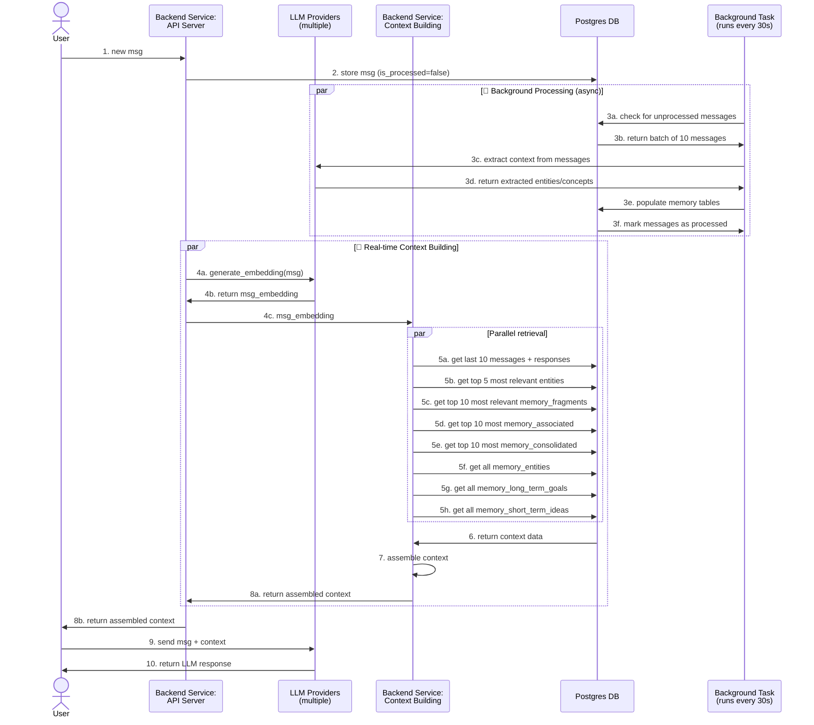

# Memory Service Overview

## Current Stage Architecture

The AIRI Memory Service is a system designed to provide persistent, contextual memory for AI interactions. It combines vector similarity search, structured knowledge representation, and multi-dimensional context building to create rich, personalized AI experiences.

> Note current memory design is still in early stage

## System Flow Overview

## Core Components

### 1. Context Builder (`ContextBuilder`)

The `ContextBuilder` class is the heart of the memory system, responsible for assembling comprehensive context from multiple data sources. It implements a multi-dimensional Retrieval-Augmented Generation (RAG) approach.

#### Key Features:
- **Multi-source aggregation**: Combines working memory, semantic memory, structured knowledge, and goal context
- **Vector similarity search**: Uses embeddings to find semantically relevant memories
- **Parallel processing**: Efficiently queries multiple database tables simultaneously
- **Natural language formatting**: Converts structured data into human-readable context (better for LLM final context ingestion)

#### Context Building Process:

1. **Query Embedding Generation**: Converts user query into vector embeddings
2. **Parallel Data Retrieval**: Fetches relevant data from multiple sources
3. **Context Assembly**: Combines and formats all retrieved information
4. **Natural Language Output**: Presents context in conversational format

### 2. Database Schema

The system uses PostgreSQL with pgvector extension for vector operations. Key tables include:

#### Core Memory Tables:
- **`memory_fragments`**: Primary memory storage with vector embeddings
- **`memory_episodes`**: Groups related memories chronologically
- **`memory_consolidated_memories`**: High-level summaries for quick retrieval
- **`memory_associations`**: Links between related memories

#### Structured Knowledge:
- **`memory_entities`**: People, places, concepts, organizations
- **`memory_entity_relations`**: Relationships between entities and memories
- **`memory_tags`**: Flexible categorization system
- **`memory_tag_relations`**: Many-to-many tag relationships

#### Goal-Oriented Memory:
- **`memory_long_term_goals`**: Long-term objectives and priorities
- **`memory_short_term_ideas`**: Short-term thoughts and ideas

#### Operational Tables:
- **`chat_messages`**: Raw conversation messages
- **`chat_completions_history`**: AI responses with context
- **`memory_settings`**: Configuration for LLM and embedding providers

### 3. Embedding & LLM Providers

The system supports multiple providers for flexibility and redundancy:

#### Embedding Providers:
- **OpenAI**: text-embedding-3-small/large
- **Google AI (Gemini)**: Native embedding support
- **Multiple dimensions**: 768, 1024, 1536 for different use cases

#### LLM Providers:
- **OpenAI**: GPT models for memory processing
- **Google AI**: Gemini models
- **Anthropic**: Claude models
- **Fallback system**: Automatic provider switching on failures

## Context Building Implementation

### Working Memory Context

Please refer to `/service/memory-service/src/services/context-builder.ts`

## Key Features

### 1. Multi-Dimensional Retrieval
- **Vector Similarity**: Semantic search across memory fragments
- **Episodic Context**: Chronological grouping of related memories
- **Tag-Based Search**: Flexible categorization and filtering
- **Goal Integration**: Personal objectives and priorities

### 2. Memory Lifecycle Management

#### Background Processing Pipeline
- **Message Ingestion**: Raw messages stored in `chat_messages` table with `is_processed = false`
- **Background Task**: Runs every 30 seconds to process unprocessed messages in batches
- **Batch Processing**: Processes batch of messages by estimating tokens to prevent token limits
- **LLM Analysis**: Extracts entities, concepts, relationships, and memory fragments
- **Memory Population**: Populates `memory_fragments`, `memory_entities`, `memory_tags`, `memory_long_term_goals`, `memory_short_term_ideas`
- **Status Update**: Marks messages as `is_processed = true` upon completion

#### Memory Types
- **Working Memory**: Immediate context (seconds to minutes)
- **Short-Term Memory**: Recent interactions (hours to days)
- **Long-Term Memory**: Important information (months to years)
- **Consolidated Memory**: High-level summaries and insights

### 3. Performance Optimizations
- **Parallel Processing**: Concurrent database queries
- **Vector Indexing**: HNSW indexes for fast similarity search
- **Batch Processing**: Efficient bulk operations
- **Caching**: Redis integration for frequently accessed data

### 4. Scalability Features
- **Provider Fallback**: Automatic switching between LLM providers
- **Configurable Limits**: Adjustable context sizes and retrieval counts
- **Soft Deletes**: Graceful memory management
- **Access Tracking**: Usage patterns for optimization

## API Endpoints

### Core Operations
- `POST /api/messages` - Ingest new chat messages
- `POST /api/completions` - Store AI responses
- `GET /api/context` - Retrieve assembled context (via ContextBuilder)
- `GET /api/health` - Service health check

### Monitoring & Management
- `GET /api/queue/status` - Redis queue status
- `GET /api/settings` - Current configuration
- `POST /api/settings` - Update system settings

## Configuration

The system is highly configurable through the `memory_settings` table:

### LLM Configuration
- **Provider**: OpenAI, Google AI, Anthropic
- **Model**: Specific model selection
- **Temperature**: Creativity vs consistency balance
- **Max Tokens**: Response length limits

### Embedding Configuration
- **Provider**: Matching LLM provider or separate
- **Model**: Embedding model selection
- **Dimensions**: Vector size (768, 1024, 1536)

### Context Building Options
- **Message Limits**: Number of recent messages to include
- **Memory Limits**: Maximum relevant memories per type
- **Similarity Thresholds**: Minimum relevance scores

## Improvements planned

- **Architecture Optimization Opportunities**:

    **Current Flow**: Frontend → Context Building → Return Context → Frontend → LLM API → Response

    **Optimized Flow**: Frontend → Context Building + LLM Call → Response
- **Advanced Entity Extraction**: More sophisticated NLP for entity recognition (instead of fetching all of them)
- **Memory Consolidation**: periodic & automated memory summarization and cleanup
- **Personalization**: User-specific memory preferences and patterns
- **Multi-modal Support**: Images, audio, and video memory integration
