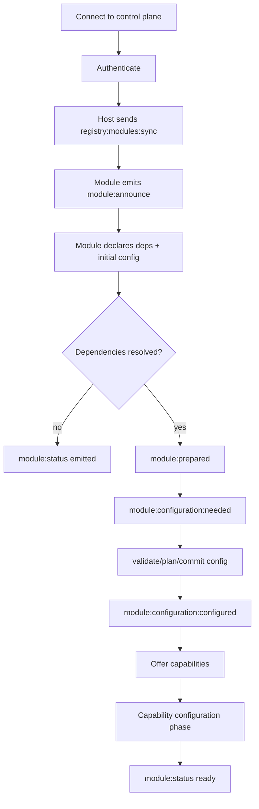

# AIRI Plugin Platform

- [Summary](#summary)
- [Background](#background)
- [Goals](#goals)
- [Non-goals](#non-goals)
- [Proposal](#proposal)
- [Design Details](#design-Details)
- [Control And Data Planes](#control-and-data-planes)
- [Plugin Host And Viewers](#plugin-host-and-viewers)
- [Plugin Lifecycle Overview](#plugin-lifecycle-overview)
- [Bridges And Remote Plugins](#bridges-and-remote-plugins)
- [Transport Abstraction](#transport-abstraction)
- [Capability Model](#capability-model)
- [Deployment Modes](#deployment-modes)
- [Manifest And Entrypoints](#manifest-and-entrypoints)
- [Verify & Test](#verify--test)
- [Criteria](#criteria)
- [Test & QA](#test--qa)
- [Progress](#progress)
- [Status](#status)
- [Next Steps](#next-steps)
- [Reviews](#reviews)
- [Q&A](#qa)
- [Related Documentations](#related-documentations)

## Summary

AIRI is a multi-node system where plugins, bridges, and viewers communicate over Eventa transports. A Plugin Host loads plugins, provides a single API surface, and routes control and data across devices. The platform separates the control plane from the data plane, supports local and remote plugins, and enables multi-device orchestration without changing plugin APIs.

## Background

AIRI needs to run across desktop, web, and mobile while keeping one clean API surface. Plugins must be able to register UI, declare capabilities, and exchange data with device-specific bridges. To keep the system scalable, high-rate streams must be separated from lifecycle and configuration traffic.

Runtime dependency orchestration is intentionally split into a dedicated design document to keep this architecture document focused on platform shape and planes.

## Goals

- Provide a single plugin API surface across runtimes.
- Separate lifecycle and configuration traffic from high-rate streams.
- Support local plugins and remote plugins with the same protocol.
- Allow multiple viewers and bridges to coordinate through a shared control plane.
- Keep deployment flexible: embedded, external, or remote Plugin Host.

## Non-goals

- Defining the full plugin lifecycle state machine in this document.
- Specifying detailed UI layouts or viewer implementations.
- Implementing a new transport beyond Eventa adapters.

## Proposal

- Use Eventa for all control and data traffic.
- Use a dedicated control plane for configuration, permissions, UI, and routing.
- Use a data plane for high-volume streams like audio, vision, and telemetry.
- Run plugins inside a Plugin Host that loads plugin entrypoints and exposes the SDK.
- Treat bridges as device-specific integrations that only provide data and actions.

## Design Details

The platform design focuses on consistent APIs, transport-agnostic integration, and multi-device orchestration.

### Control And Data Planes

Control plane purpose: lifecycle, configuration, routing policy, permissions, and UI contributions.

Typical control messages:

- control:hello
- control:announce
- control:plugin:register
- control:plugin:config:get
- control:plugin:config:set
- control:capability:grant
- control:capability:revoke
- control:ui:register

Data plane purpose: real-time and high-throughput streams.

Typical data messages:

- data:context:update
- data:vision:frame
- data:audio:stream
- data:transcript
- data:character:output

Both planes use Eventa messages. Transport options:

- Two WebSocket endpoints
- One multiplexed connection with namespaces

### Plugin Host And Viewers

The Plugin Host is a Node process that:

- Loads plugin entrypoints.
- Exposes the AIRI SDK.
- Registers UI contributions.
- Negotiates capabilities.
- Connects to control and data planes.

Viewers render UI and character output. Examples:

- Electron Stage with Configurator features.
- Web Configurator client.
- Pocket Stage client.

### Plugin Lifecycle Overview

The lifecycle below mirrors the detailed lifecycle comment in
`packages/plugin-sdk/src/plugin-host/core.ts` and focuses on the module
announcement, configuration, and capability phases.



Detailed capability dependency orchestration, waiting phases, and readiness gates are defined in `capability-orchestration.md`.

### Bridges And Remote Plugins

Bridges connect external devices and services to AIRI. They do not own UI; they only provide data and actions. Examples:

- VS Code extension for editor context and commands.
- Browser extension for page context.
- Minecraft service for game events and commands.

Remote plugins are services in any language that connect over Eventa and register capabilities. They are preferred for server integrations and non-JS/TS stacks.

### Transport Abstraction

All SDK calls are transport-agnostic. The host controls whether communication is local IPC or remote RPC without changing plugin APIs.

### Capability Model

Each node announces capabilities on registration. The control plane grants or denies permissions and routes requests based on policy.

Example capabilities:

- context.read
- context.write
- ui.panel
- ui.widget
- vision.capture
- vision.stream
- device.mobile.sensors

### Deployment Modes

The Plugin Host can run in three modes:

1. Embedded in Electron main for install-and-go.
2. External Node process for hot reload and isolation.
3. Remote server for cross-device continuity.

### Manifest And Entrypoints

Plugins declare metadata in a manifest file and provide runtime entrypoints.

Example:

```json
{
  "id": "airi.vscode",
  "name": "AIRI VS Code",
  "version": "1.0.0",
  "capabilities": ["context.read", "ui.panel", "commands"],
  "entrypoints": {
    "node": "./dist/node/index.js"
  }
}
```

## Verify & Test

### Criteria

- Plugins can be loaded by the host and register UI and capabilities.
- Bridges can connect and be discovered by the control plane.
- Data plane streams stay isolated from control plane traffic.
- The same plugin API surface works across desktop, web, and mobile.

### Test & QA

- Integration test: host + viewer + bridge with control plane routing.
- Integration test: data plane streaming with a high-rate source.
- Compatibility test: same plugin entrypoints across multiple runtimes.

## Progress

### Status

Active design.

### Next Steps

- Align runtime docs with updated plugin context and transport strategy.
- Integrate capability registry and readiness-gate lifecycle transitions from `capability-orchestration.md`.
- Expand remote plugin examples by language.

## Reviews

### Q&A

- Q: Why split control and data planes?
  A: Lifecycle traffic and high-rate streams have different reliability and QoS needs.

- Q: Do bridges render UI?
  A: No. UI is contributed to viewers through the control plane.

- Q: Can remote plugins be written without JS or npm?
  A: Yes. They only need to speak the Eventa protocol over WebSocket.

### Related Documentations

- [Multi-Transport Plugin Contexts](./multi-transport.md)
- [Capability-Oriented Module Orchestration](./capability-orchestration.md)
