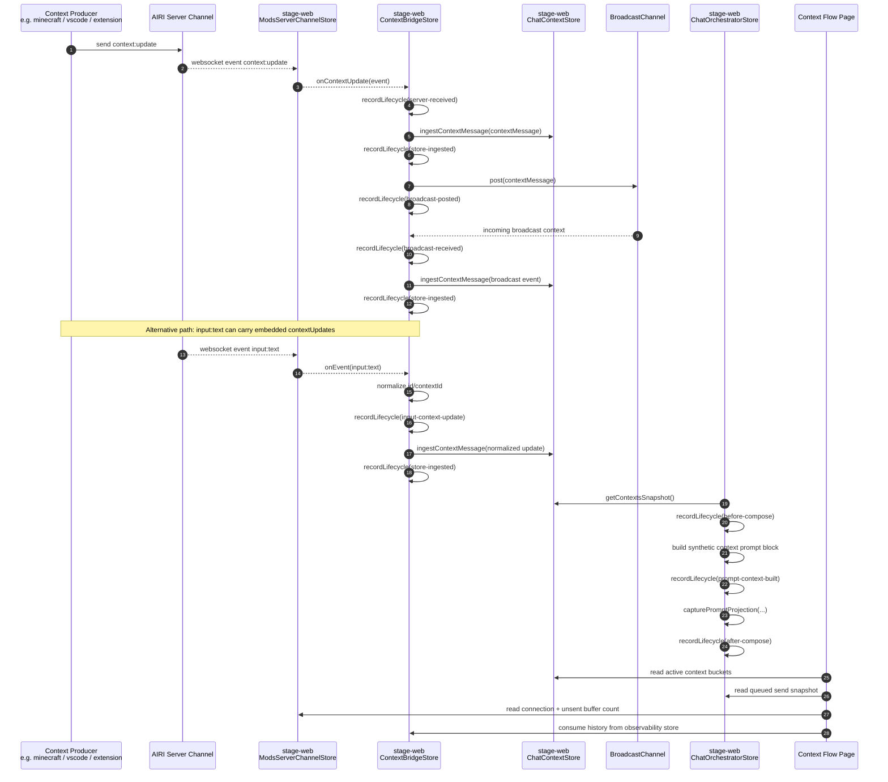

# Context Flow Observability

This document explains what the `Context Flow` devtools page is observing in
`stage-web`, and what it is not observing.

The most important distinction is:

- `Context Flow` shows the lifecycle as observed by the web client.
- It does not show an authoritative server-side state machine.

In other words, when the UI says `server-received`, it means:

- the `stage-web` client received a `context:update` event from the server
  channel, and
- the client recorded that observation into the local observability store.

It does **not** mean the AIRI server emitted a dedicated lifecycle event called
`server-received`.

## What The Page Answers

`Context Flow` is meant to answer four debugging questions:

1. Which `context:update` events has this client observed?
2. Which contexts are currently retained in `chat-context`?
3. Which retained contexts will be injected into the next chat prompt?
4. How did a context move through server delivery, local ingestion, broadcast,
   and prompt composition?

## Lifecycle Model

The current lifecycle tracked by the page is:

- `server-received`
- `input-context-update`
- `broadcast-posted`
- `broadcast-received`
- `store-ingested`
- `before-compose`
- `prompt-context-built`
- `after-compose`

These phases are recorded by
[`useContextObservabilityStore`](../../../../../stage-ui/src/stores/devtools/context-observability.ts).

## End-To-End Flow



## Where Each Phase Comes From

### `server-received`

Recorded in
[`useContextBridgeStore`](../../../../../stage-ui/src/stores/mods/api/context-bridge.ts)
when `serverChannelStore.onContextUpdate(...)` fires.

Meaning:

- the browser client has already received a `context:update` from the websocket
  connection
- the event has not yet been reduced into `chat-context`

### `input-context-update`

Recorded in the same store when an `input:text` event contains
`data.contextUpdates`.

Meaning:

- the update did not arrive as a standalone `context:update`
- it arrived embedded in an input event and was normalized locally before
  ingestion

### `store-ingested`

Recorded after `chatContext.ingestContextMessage(...)` runs.

Meaning:

- the local `chat-context` state changed
- the mutation is either `replace` or `append`
- the bucket key is based on event source identity

### `broadcast-posted`

Recorded right after the bridge posts the normalized context to the
`BroadcastChannel`.

Meaning:

- this tab/window re-published the context for sibling tabs/windows
- this is still client-side behavior, not server acknowledgement

### `broadcast-received`

Recorded when a tab/window receives a context via `BroadcastChannel`.

Meaning:

- another local runtime delivered the context to this page
- the page is observing cross-tab propagation, not another server emission

### `before-compose`

Recorded in
[`useChatOrchestratorStore`](../../../../../stage-ui/src/stores/chat.ts)
right before the chat message is composed for model submission.

Meaning:

- the prompt composition flow is about to read retained contexts
- this snapshot is the best representation of "what would be injected now"

### `prompt-context-built`

Recorded when the synthetic prompt block is constructed from the current
`chat-context` snapshot.

Meaning:

- retained contexts were converted into the extra user message inserted after
  the system message
- this is the exact point where retained context becomes prompt text

### `after-compose`

Recorded after the final composed message list is assembled.

Meaning:

- the prompt that will be streamed to the provider is now known
- `lastPromptProjection` stores that snapshot for the devtools page

## Prompt Injection Shape

The prompt block injected into chat is currently built by
[`formatContextPromptText`](../../../../../stage-ui/src/stores/chat/context-prompt.ts).

The shape is:

```text
These are the contextual information retrieved or on-demand updated from other modules, you may use them as context for chat, or reference of the next action, tool call, etc.:
Module <sourceKey>: <JSON of retained messages>
Module <sourceKey>: <JSON of retained messages>
```

That means the `Next Prompt Projection` panel is not showing a hypothetical
format. It is showing the same prompt block builder used by the chat
orchestrator.

## Data Sources Behind Each Panel

### Active Context State

Reads from `chatContextStore.getContextBucketsSnapshot()`.

This answers:

- what is retained right now
- how many entries are in each source bucket
- which context was retained most recently

### Next Prompt Projection

Reads from two sources:

- current retained state:
  `formatContextPromptText(chatContextStore.getContextsSnapshot())`
- last actual compose snapshot:
  `contextObservabilityStore.lastPromptProjection`

This distinction is important because retained state can change between sends.

### Context Lifecycle

Reads from `contextObservabilityStore.history`.

This is a client-side trace of context movement, not a protocol-level history
from the AIRI server.

### Runtime Coordination

Reads from:

- `serverChannelStore.connected`
- `serverChannelStore.pendingSendCount`
- `chatStore.pendingQueuedSendCount`
- `chatStore.getPendingQueuedSendSnapshot()`
- `contextObservabilityStore.lastBroadcastPostedAt`
- `contextObservabilityStore.lastBroadcastReceivedAt`

This panel exists mainly to reduce confusion in multi-tab `stage-web`
debugging.

## Current Limits

### This is not server truth

The page does not know:

- whether the server persisted a context
- whether another peer processed it
- whether a producer retried it upstream

It only knows what this browser runtime observed.

### No transport ACK model

`context:update` is still effectively best-effort from the client perspective.

The page can show:

- websocket unsent buffer count before connection/auth completes
- retained context after ingestion

It cannot show:

- a true in-flight ACK state
- server-confirmed delivery state

### Retained state can outlive producer freshness

`chat-context` currently retains contexts until they are replaced, appended over,
or globally reset. There is no generic TTL-based pruning layer yet.

This is why the page shows both current retained state and the last actual
compose snapshot. Those can drift.

### Local synthetic contexts are still just contexts

Some contexts are locally synthesized before compose, such as datetime and the
Minecraft integration summary. They join the same retained context model used by
remote `context:update` data.

That is useful for prompt debugging, but it also means:

- not every retained context necessarily came from a server event
- source bucket quality depends on the metadata attached to the context

## Practical Debugging Recipe

If you want to debug Minecraft-to-AIRI prompt injection in `stage-web`:

1. Open `Context Flow`.
2. Watch `Context Lifecycle` for `server-received` or `input-context-update`.
3. Confirm the update appears in `Active Context State`.
4. Inspect `Next Prompt Projection` to see whether it would be injected now.
5. Trigger a chat turn.
6. Compare `If Send Starts Now` with `Last Compose Snapshot`.

That sequence tells you:

- whether `stage-web` received the context
- whether it was retained
- whether it reached the prompt builder
- what exact text was injected into the model input
