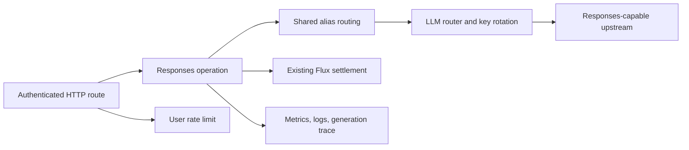
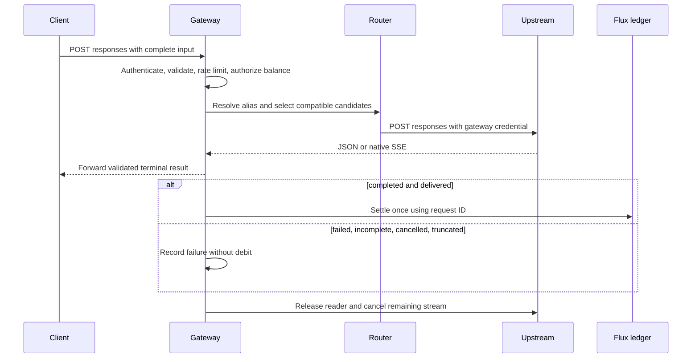

# Hosted Responses gateway

Status: accepted

## Decision and scope

The user confirmed this implementation scope and the existing `@xsai/shared-stream` parser.

Issue #2479 defines an authenticated, stateless Responses create endpoint.
This PR implements its server boundary on top of the existing gateway and Flux policy.
The client sends complete input Items. The gateway forces `store: false`.
It rejects conversation references, file IDs, background execution, and hosted tools with separate charges.
Function tools run on the client and return their output on the next request.

Each upstream explicitly opts into Responses through `protocols: ['responses']`.
An omitted list supports Chat Completions only. This preserves the current configured service contract.
Aliases keep their primary, weighted, and fallback order. Protocol filtering precedes candidate selection.
Unsupported candidates never receive a request. The last attempted HTTP error remains available to the caller.

Each request owns one billing ID. Completed results use input/output token usage and the existing Flux pricing policy.
Missing usage follows the existing flat-rate policy. Failed, incomplete, cancelled, and truncated streams incur no debit.
A streaming result becomes billable only after a validated terminal event reaches the downstream writer.
JSON results settle after body validation and before the HTTP response returns.
Cancellation before that point wins. A duplicate terminal event cannot charge again.
The gateway stops reading after the terminal event and releases upstream resources.
Metrics, request logs, and generation traces record terminal failures as well as successful requests.

No production configuration, deployment, database migration, or default client protocol change belongs to this PR.
The official provider switch and live Flux acceptance remain release tasks under #2479.
No new rate, billing reservation, realtime session, or search service is introduced.

## Module dependencies



## Affected files

```text
server/
  apps/api/
    README.md
    package.json
    src/routes/openai/v1/
      index.ts, gateway.ts, model-routing.ts, route.test.ts
      middlewares/traffic-control.ts
      operations/chat-completions/index.ts
      operations/responses.ts
    src/services/
      adapters/config-kv/definitions.ts
      domain/llm-router/{router.ts,types.ts,tests/router.test.ts}
      domain/llm-tracing/index.ts
  docs/ai/adr/2026-09-15-hosted-responses.md
```

## Request lifecycle



## Verification

Exercise the mounted route with authentication, malformed input, stateful references, hosted tools, and insufficient Flux.
Cover JSON/SSE completion, usage, upstream errors, split UTF-8 frames, cancellation, duplicate terminal events, and stream EOF.
Verify grouped and ungrouped routing, incompatible candidates, key failover, and preservation of terminal upstream errors.
Run focused gateway, router, schema, and billing tests. CI checks the complete repository.

## References

- [Server scope, Issue #2479](https://github.com/moeru-ai/airi/issues/2479)
- [OpenAI Responses streaming events](https://platform.openai.com/docs/api-reference/responses-streaming)
- [Merged client adapter, PR #2477](https://github.com/moeru-ai/airi/pull/2477)
