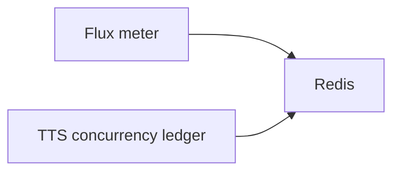
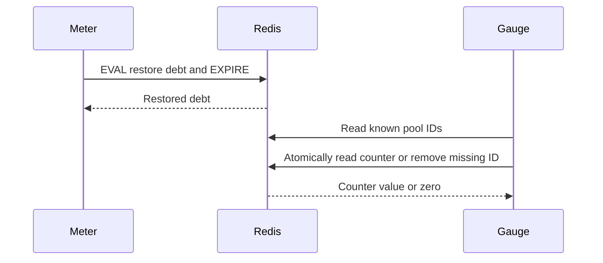

# Cache expiry follow-up

Status: accepted

## Decision

Keep the existing 60-second Flux balance cache policy. Do not add revision keys.
Restore meter debt and its TTL in one Redis Lua operation, including partial debit recovery.
Expire the TTS pool discovery index after inactivity. During snapshots, atomically remove entries whose counters no longer exist.
Keep the existing `config:` key namespace. This PR does not change ConfigKV keys.

## Scope and limits

This change does not serialize balance snapshots or change ledger semantics.
A snapshot emits zero once when it removes an expired pool, allowing metrics to clear old values.
An acquire renews the discovery index for at least the acquiring counter's lifetime.

## Validation

Reproduce persistent restored debt and retained pool IDs before the fix. Run meter, concurrency, ConfigKV, and balance tests, plus API type checking and lint.

## Dependencies and sequence





Affected files:

```text
server/apps/api/src/
  services/domain/billing/flux-meter.ts
  services/domain/llm-router/concurrency-ledger.ts
  utils/redis-keys.ts
```
