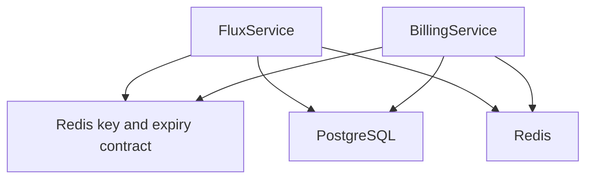
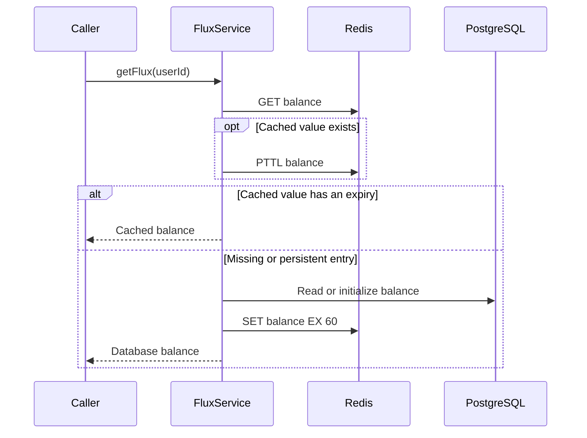

# Flux balance cache expiry

Status: accepted

## Decision

Every write to `user:{userId}:flux` uses `SET EX 60`.
The value and expiry change atomically. Cache hits do not renew the expiry.
Readers accept only entries with an expiry. Persistent entries reload from PostgreSQL and receive the same TTL.
PostgreSQL remains the balance and ledger authority.

Sixty seconds limits stale balance exposure after failed invalidation or reordered cache writes while retaining a short read cache.
Each cache hit requires one extra Redis TTL command.
A concurrent write can still replace a newer balance. Expiry bounds each cached snapshot's lifetime but does not serialize database and cache writes.

## Scope

Balance initialization, database cache fills, debit, credit, and payment cache synchronization share the TTL.
Admin overrides and account deletion retain their existing cache invalidation.
Untouched persistent keys remain until a balance read or mutation replaces them. No production key scan runs in this change.

## Non-goals

No ledger changes, debt-meter expiry changes, distributed locking, or production data operations.

## Module dependencies



## Affected files

```text
server/apps/api/src/
  utils/redis-keys.ts
  services/domain/
    flux.ts
    flux.test.ts
    billing/
      billing-service.ts
      tests/billing-service.test.ts
```

## Read sequence



## Verification

Use the existing PGlite and Redis test boundary.
Verify expiring initialization, database reload, debit, credit, and payment synchronization.
Advance the test clock to verify that cache hits do not renew expiry and expired balances reload without another initial grant.
Verify that a persistent cached balance reloads from PostgreSQL.
