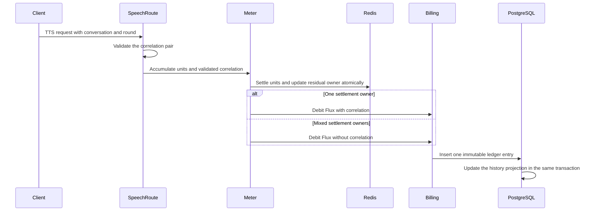
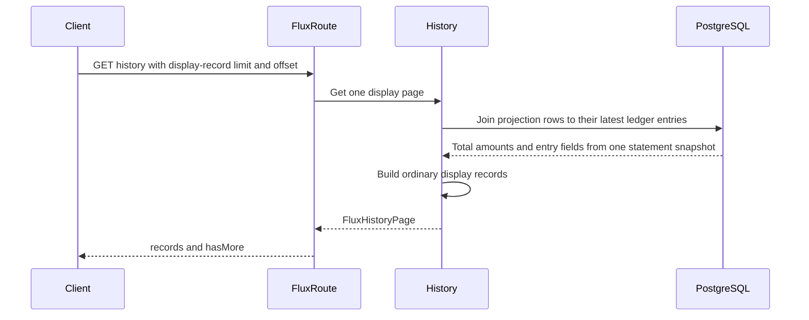

# TTS Flux history read model

Status: accepted

## Decision

PostgreSQL keeps each `flux_transaction` as an immutable financial ledger entry.
PostgreSQL maintains `flux_history_row` as a bounded-read projection when a
ledger entry is inserted. The client renders the returned rows and does not
own grouping policy.

A TTS group uses both `conversationId` and `roundId`.
The client snapshots the pair when a speech intent opens, so delayed REST
segments cannot move to another conversation after a session switch.
Valibot validates these values at each HTTP, WebSocket, and Redis boundary.
Each value contains 1 to 128 characters after trimming.
An entry without both values stays as one transaction row.

The existing `/api/v1/flux/history` route returns `{ records, hasMore }`.
Each TTS round appears as one ordinary debit record with its total amount.
The client does not receive group types, counts, or child entries.
There is no second history endpoint.

The history query paginates projection rows, not raw ledger entries.
One query joins each projection row to its latest ledger entry.
The amount and entry fields therefore use one statement snapshot.
The latest entry supplies the ID, time, type, description, and metadata.
The response keeps exactly these five fields plus the amount.
User IDs, balance snapshots, request IDs, and projection keys stay on the server.

The ledger stores an optional `historyGroupKey` only after Valibot validates
the correlation pair. A database trigger uses that key to update the
projection in the same transaction. Entries without the key receive one
projection row per transaction. The projection index orders one user's rows
by latest activity, so a page read does not regroup the user's full ledger.

## Meter ownership

The TTS meter continues to accumulate sub-Flux units across requests.
A companion Redis key stores the owner of the residual units.
The owner state is `none`, one validated correlation pair, or `mixed`.

If all settled units have one owner, the ledger entry receives that owner.
If settled units have multiple owners, the ledger entry receives no correlation pair.
This mixed entry stays separate in history.
After a failed debit, the restore script atomically merges the saved owner
with the current Redis owner. Concurrent requests therefore produce `mixed`
instead of having their newer ownership overwritten by a stale snapshot.

This policy does not change the billing rate, integer settlement, or residual debt TTL.
It prevents a threshold-crossing request from claiming units from an earlier chat round.

## Scope

- Validate TTS billing correlation for REST and WebSocket requests.
- Snapshot and send the conversation and round through both client transports.
- Preserve residual debt ownership in Redis.
- Return combined TTS amounts through the existing `/api/v1/flux/history` response.
- Maintain an indexed history projection without changing the immutable ledger.
- Read only one representative ledger entry per display record.
- Render ordinary records in the shared Flux settings page without client grouping.

## Non-goals

- Do not rewrite or merge ledger entries.
- Do not infer ownership for old entries.
- Do not change Flux prices or rounding.
- Do not report ledger-entry count as the TTS request count.
- Do not migrate existing Redis debt or ledger metadata.
- Do not infer group keys for existing ledger rows during projection backfill.

## Module dependencies

```mermaid
graph TD
  Stage[Stage TTS client] --> SpeechREST[REST speech route]
  Stage --> SpeechWS[WebSocket speech route]
  SpeechREST --> Correlation[TTS correlation contract]
  SpeechWS --> Correlation
  SpeechREST --> Meter[Flux meter]
  SpeechWS --> Meter
  Meter --> Redis[(Redis debt and owner)]
  Meter --> Billing[Billing service]
  Billing --> Ledger[(flux_transaction)]
  Ledger --> Projection[(flux_history_row)]
  Projection --> History[Flux history service]
  Ledger --> History
  History --> FluxRoute[/api/v1/flux/history]
  FluxRoute --> StagePages[Flux settings page]
  SharedContract[Flux history contract] --> History
  SharedContract --> StagePages
```

## Affected files

```text
packages/
  core-agent/src/
    runtime/
      chat-orchestrator-runtime.test.ts
      chat-orchestrator-runtime.ts
    types/chat.ts
  pipelines-audio/src/
    speech-pipeline.test.ts
    speech-pipeline.ts
    types.ts
  server-shared/
    README.md
    src/types/flux.ts
    src/types/index.ts
  stage-pages/
    package.json
    src/pages/settings/flux.vue
  stage-ui/src/
    components/scenes/Stage.vue
    libs/providers/providers/official/
      index.test.ts
      index.ts
      shared.ts
    libs/speech/
      streaming-pipeline.ts
      streaming-pipeline.test.ts
      tts-session.ts
      tts-session.test.ts
    services/speech/
      bus.ts
      pipeline-runtime.test.ts
      pipeline-runtime.ts
    stores/
      mods/api/context-bridge.contract.browser.test.ts
      modules/speech.ts
server/
  apps/api/
    drizzle/
      0024_tts_history_projection.sql
      meta/
        0024_snapshot.json
        _journal.json
    package.json
    src/
      app.ts
      routes/
        audio-speech-ws/
          route.test.ts
          session.ts
        flux/
          index.ts
          route.test.ts
        openai/v1/route.test.ts
      services/domain/
        billing/
          billing-service.ts
          flux-meter.ts
          tests/
            billing-service.test.ts
            flux-meter.test.ts
            tts-correlation.test.ts
          tts-correlation.ts
        flux-transaction.test.ts
        flux-transaction.ts
        openai-speech/index.ts
      schemas/flux-transaction.ts
      utils/redis-keys.ts
  docs/ai/adr/2026-09-17-tts-flux-history-read-model.md
packages/i18n/src/locales/{en,zh-Hans}/settings.yaml
pnpm-lock.yaml
```

## Billing sequence



## History sequence



## Verification

Use PGlite tests with the production trigger for display-record pagination,
conversation and user isolation, invalid correlation preservation, and full round totals.
Assert that large rounds return one record without changing the ledger.
Verify the migration creates and backfills the projection plus its ordering
and group-entry indexes.
Use Redis tests for same-owner, mixed-owner, concurrent rollback, and residual-owner recovery.
Use route tests for the shared response contract.
Use speech tests for REST and WebSocket correlation.
Run the affected Vitest files, full typecheck, and full lint.
