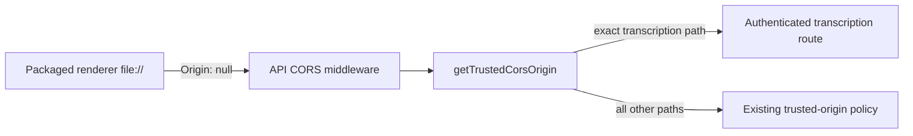
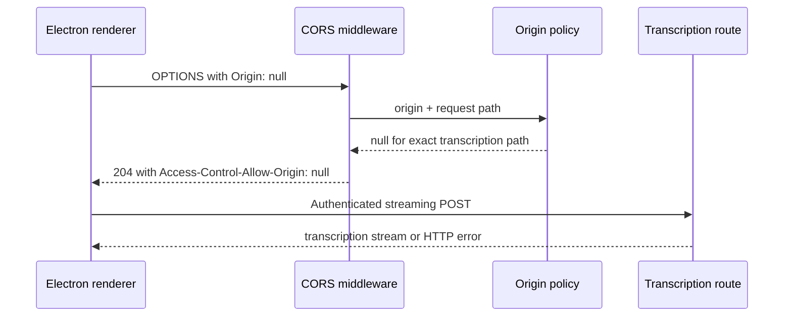

# Electron transcription CORS

Status: proposed

## Decision and scope

The packaged Electron renderer loads from `file://` and sends the opaque
`Origin: null` value. The API CORS middleware reflects that value only for the
authenticated realtime transcription route, `/api/v1/audio/transcriptions/stream`.
All other routes continue to use the existing trusted-origin allowlist.

This is a focused compatibility fix for desktop official transcription. It
does not trust `null` for redirect URL resolution and does not add a wildcard
origin policy.

## Module dependencies



## Affected files

```text
server/
  apps/api/src/app.ts
  apps/api/src/utils/origin.ts
  apps/api/src/utils/tests/origin.test.ts
  docs/ai/adr/2026-09-18-electron-transcription-cors.md
```

## Request lifecycle



## Non-goals

- Do not accept `null` for chat, billing, auth, or redirect origin handling.
- Do not replace the route with an Electron main-process proxy in this change.
- Do not use `*` with credentialed requests.

## Verification

The origin unit tests verify the exact path restriction and exercise Hono's
actual preflight middleware. The transcription route's existing Bearer-token
authentication remains the authorization boundary. Full API typecheck and
repository CI remain upstream checks when optional workspace dependencies are
available.
